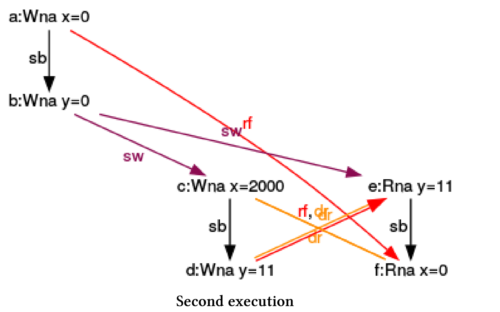
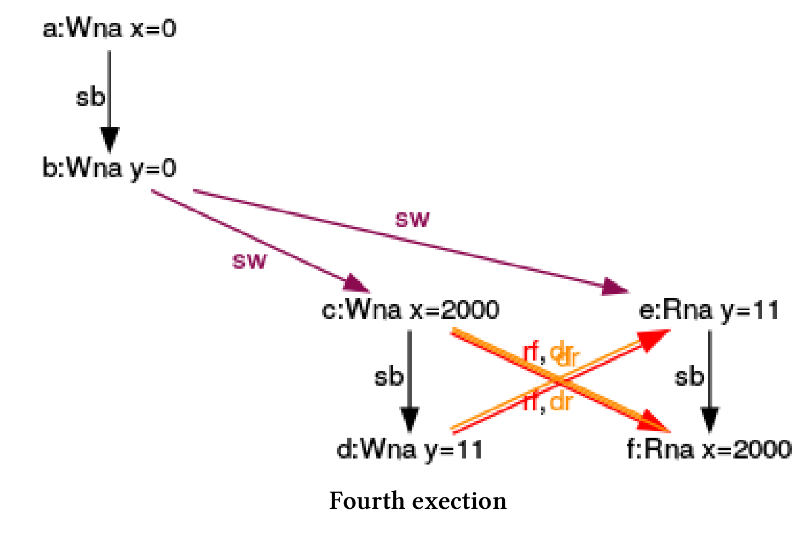
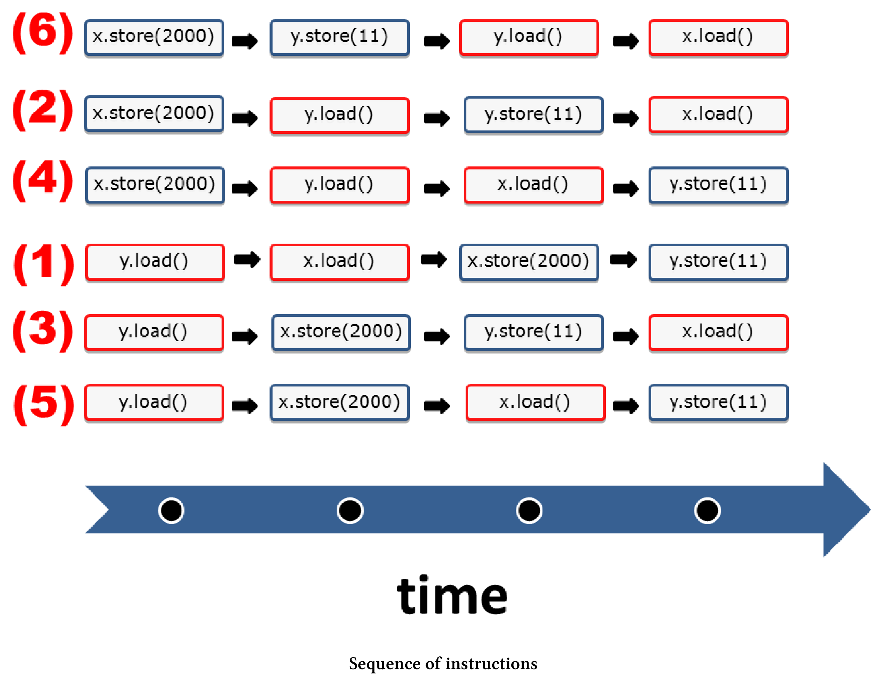
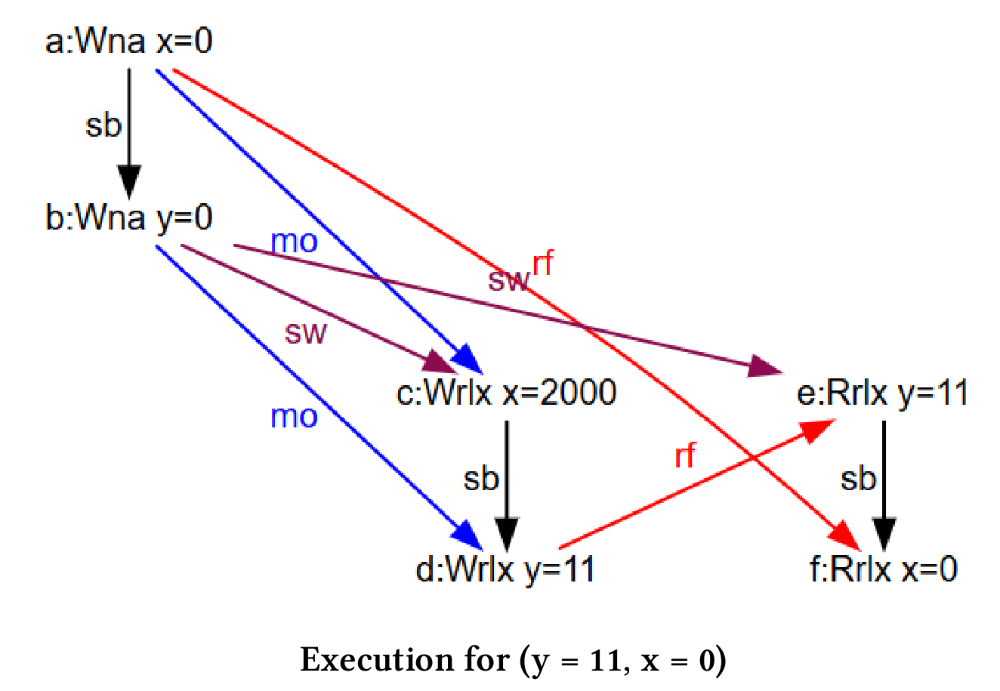

# 使用CppMem進行優化

我們從一個簡單的程序開始，然後對其不斷地進行改進。這裡，使用CppMem驗證的每個步驟。[CppMem](http://svr-pes20-cppmem.cl.cam.ac.uk/cppmem)是一個交互式工具，用於研究小代碼段中C++內存模型的行為。

首先，來寫個簡單的程序：

```c++
// ongoingOptimisation.cpp

#include <iostream>
#include <thread>

int x = 0;
int y = 0;

void writing() {
  x = 2000;
  y = 11;
}

void reading() {
  std::cout << "y: " << y << " ";
  std::cout << "x: " << x << std::endl;
}

int main() {
  std::thread thread1(writing);
  std::thread thread2(reading);
  thread1.join();
  thread2.join();
}
```

程序很簡單，由兩個線程`thread1`和`thread2`構成。`thread1`寫入x和y，`thread2`以相反的順序讀取值y和x。這看起來很簡單，但這個簡單的程序，卻會給了我們三個不同的結果:


對程序優化之前，需要確定兩個問題：

1. 程序的定義都明確嗎？是否存在數據競爭？
2. x和y可能是哪些值?

第一個問題往往很難回答。首先，考慮第一個問題的答案；其次，使用CppMem驗證推理。當我想到了第一個問題的答案，就可以很容易地確定第二個問題的答案。我在一個表中給出了x和y的可能值。

但是，還沒有解釋持續優化是什麼意思。其實很簡單，通過弱化C++的內存序來不斷優化程序。以下是優化步驟：

* 非原子變量
* 鎖
* 使用順序一致語義的原子變量
* 使用獲取-釋放語義的原子變量
* 使用自由語義的原子變量
* Volatile變量

開始持續優化之旅之前，應該先對CppMem有一個基本的瞭解。在CppMem章節中，會提供了一個簡單的介紹。

## CppMem: 非原子變量

使用`run`按鈕可以立即顯示數據競爭。更準確地說，上面的程序有兩個數據競爭，因為變量`x`和`y`的訪問都不受保護。因此，該程序具有未定義行為。在C++術語中，這意味著程序在玩火，你的電腦甚至會著火(笑)。

因此，我們不能得到x和y的準確值。

> **關於int型的變量**
>
> 只要int變量是自然對齊的，那麼大多數主流架構對int變量的訪問都是原子性的。自然對齊意味著在32位或64位體系結構中，32位int變量必須有一個能被4整除的地址。這是因為，C++11中可以調整數據類型的對齊方式。
>
> 必須強調的是，我並不是建議你像使用原子int那樣使用int型變量。我只是想指出，在這種情況下，編譯器比C++11標準提供了更多保證。如果過於依賴於編譯器，那麼程序就很可能不符合C++標準，因此可能會在其他硬件平臺上運行出錯。

這就是我的推理內容。現在，我們應該看看CppMem關於程序未定義行為的報告。

CppMem允許我將程序剪裁到最小。

```c++
int main() {
  int x = 0;
  int y = 0;
  { { { {
        x = 2000;
        y = 11;
        }
    |||{
        y;
        x;
       }
  } } }
}
```

可以使用大括號(第4行和第12行)和管道符號(第8行)在CppMem中定義一個線程。因為我對變量x和y的輸出不感興趣，所以只在第9行和第10行讀取它們。

這是CppMem的理論部分，下面就來實踐一下。

**分析**

執行程序時，CppMem會在(1)處提示，線程交錯有四種可能性，其中有一種有競爭的。只有在第一次執行時，結果是一致的。現在，我可以使用CppMem在四個執行(2)之間進行切換，並分析示意圖(3)。


通過分析圖表，可以最大程度地利用CppMem。

**第一次執行**


節點表示程序的表達式，箭頭表示表達式之間的關係。從圖中的註釋中我可以得出什麼結論呢?

*  a:Wna x = 0：第一個表達式(a)，向非原子變量x中寫入0。
* sb (前序，sequenced-before)：第一個表達式(a)執行的順序在第二個表達式(b)之前就能確定。表達式(c)和(d)、(e)和(f)之間也存在這種關係。
* rf (讀取，read from)：(e)從(b)中讀取y的值，(f)從(a)中讀取x的值。
* sw (同步，synchronizes-with)：因為表達式(f)在一個單獨的線程中執行，所以(a)與(f)同步。線程創建之前發生的所有事情都是可見的，而線程的創建可以看作是一個同步點。由於對稱性，(b)和(e)之間也存在同樣的關係。
* dr (數據競爭，data race)：變量x和y的讀寫之間有數據競爭，所以程序有未定義行為。

> **為什麼順序一致的執行?**
>
> 因為x和y在主線程中初始化(a)和(b)，所以執行順序一致。(c)和(d)中的x和y在內存模型上不是順序一致的。

接下來的三次執行，都不是順序一致的。

**第二次執行**



(e)從(d)中讀取“不一致”的y值，並且(d)的寫入與(e)的讀取同時發生。

**第三次執行**


與前一個執行對稱，(f)同時從(c)中讀取x。

**第四次執行**



現在，就開始亂套了。(e)和(f)同時從表達式(d)和(c)中讀出x和y。

**簡單的總結一下**

雖然我只是使用了CppMem的默認配置，但是獲得了很多有價值的信息。特別是CppMem的圖形化顯示：

*  x和y的所有可能的組合：(0,0)、(11,0)、(0,2000)和(11,2000)。
* 該程序至少有一個數據競爭，因此會觸發未定義行為。
*  四種可能的執行方式中，只有一種是順序一致的。

> **使用volatile**
>
> 從內存模型的角度來看，對x和y使用限定符volatile與x和y的非同步訪問沒有區別。
>
> CppMem: 使用volatile的不同步訪問
>
> ```c++
>int main() {
> volatile int x = 0;
> volatile int y = 0;
>   { { { 
>     {
>       x = 2000;
>       y = 11;
>     }
>   ||| 
>     {
>       y;
>       x;
>     }
>   } } }
> }
>  ```
> 
> CppMem生成與前一個示例相同的圖。原因很簡單，C++中volatile不具備多線程語義功能。

這個例子中，x和y的訪問沒有同步，因此會出現數據競爭，產生未定義行為。最直接的同步方式，當然是使用鎖。

## CppMem: 鎖

兩個線程`thread1`和`thread2`都使用了相同的互斥鎖，且包裝在`std::lock_guard`中。

```c++
// ongoingOptimisationLock.cpp

#include <iostream>
#include <mutex>
#include <thread>

int x = 0;
int y = 0;

std::mutex mut;

void writing() {
  std::lock_guard<std::mutex> guard(mut);
  x = 2000;
  y = 11;
}

void reading() {
  std::lock_guard<std::mutex> guard(mut);
  std::cout << "y: " << y << " ";
  std::cout << "x: " << x << std::endl;
}

int main() {
  std::thread thread1(writing);
  std::thread thread2(reading);
  thread1.join();
  thread2.join();
}
```

程序沒啥問題，根據(thread1與thread2)執行順序，要麼是讀後寫，要麼是先寫後讀。下面展示了x和y值的幾種可能：

|  y   |  x   | 有可能嗎？ |
| :--: | :--: | :--------: |
|  0   |  0   |     有     |
|  11  |  0   |            |
|  0   | 2000 |            |
|  11  | 2000 |     有     |

> **CppMem中使用`std::lock_guard`**
>
> 我沒找到在CppMem中使用`std::lock_guard`的方法。如果你知道如何實現它，請告訴我一下 ：）

鎖的易用性比較好，但同步性價比太低。接下來使用原子變量，並嘗試一種更輕量級的策略。

## CppMem: 順序一致語義的原子變量

如果沒有指定的內存序，則使用順序一致。順序一致保證每個線程按照源代碼順序執行，並且所有線程都遵循相同的全局序。

這裡有個使用原子的優化版本。

```c++
// ongoingOptimisationSequentialConsistency.cpp

#include <atomic>
#include <iostream>
#include <thread>

std::atomic<int> x{ 0 };
std::atomic<int> y{ 0 };

void writing(){
  x.store(2000);
  y.store(11);
}

void reading() {
  std::cout << y.load() << " ";
  std::cout << x.load() << std::endl;
}

int main() {
  std::thread thread1(writing);
  std::thread thread2(reading);
  thread1.join();
  thread2.join();
}
```

我們來分析一下這段代碼。因為x和y是原子變量，所以沒有數據競爭。因此，只剩下一個問題需要回答。x和y可能的值是什麼？這個問題也不難，由於順序一致，所有線程都必須遵循相同的全局序。

實際執行的情況：

* `x.store(2000);`先行於` y.store(11);`
* `std::cout << y.load() << " ";`先行於`std::cout << x.load() << std::endl;`

因此，如果`y.load()`的值為11，則`x.load()`的值肯定不能為0，因為`x.store(2000)`在`y.store(11)`之前已經執行了。

x和y的其他所有值都是有可能，下面是導致x和y有三組不同值的原因：

1. `thread1`先行完成於`thread2 `
2. `thread2`先行完成於`thread1`
3. `thread1` 執行`x.store(2000)`先行於`thread2`執行完成

那麼x和y的所有可能性：

|  y   |  x   | 有可能嗎？ |
| :--: | :--: | :--------: |
|  0   |  0   |     有     |
|  11  |  0   |            |
|  0   | 2000 |     有     |
|  11  | 2000 |     有     |

接下來使用CppMem驗證一下我的猜想。

**CppMem**

```c++
int main() {
  atomic_int x = 0; 
  atomic_int y = 0;
  {{{ {
        x.store(2000);
        y.store(11);
      }
  |||{
        y.load();
        x.load();
      }
  }}};
  return 0; }
```

首先介紹一些語法知識，CppMem為`std::atomic<int>`專門定義有`atomic_int`類型。

執行程序時，我被候選執行程序的數量(384個)嚇了一跳。


有384個可能的執行候選，只有6個是順序一致的，沒有候選有數據競爭。不過，我只對6個順序一致的候選感興趣。

我使用選項(2)獲得六個帶註解的示意圖。

我們已經知道，因為順序一致，除了`y = 11`和`x = 0`外，其他可能值都是可能的。現在我很好奇，哪些線程交錯會產生不同的x和y呢?

**(y = 0, x = 0)**


**(y = 0, x = 2000)**


**(y = 11, x = 2000)**


分析還沒結束，我感興趣的是：指令序列與這六個圖如何對應?

**指令序列**

我給每個指令序列分配了相應的圖示。



讓我們從簡單的例子開始分析：

* (1)：x和y的值為0，因為`y.load()`和`x.load()`在操作`x.store(2000)`和`y.store(11)`之前完成。
* (6): 所有的加載操作都發生在存儲操作之後，所以y的值是11，x的值是2000。
* (2), (3), (4), (5): 這幾個是更有趣的例子，y的值是0，x的值是2000。圖中的黃色箭頭(sc)是我推理的關鍵，它們代表指令序列。讓我們看看(2)是怎麼執行的：
  * (2)中黃色箭頭(sc)的順序是：`寫入x = 2000` ⇒ `讀取 y = 0 `⇒ `寫入 y = 11` ⇒ `讀取 x = 2000`。該序列對應於第二次線程交錯(2)時的指令序列。

接下來，讓我們打破順序一致的束縛，使用獲取-釋放語義。

## CppMem：獲取-釋放語義的原子變量

與線程之間進行同步的順序一致不同，獲取-釋放語義的同步，發生在同一原子變量的(原子)操作之間。基於這個前提，獲取-釋放語義更輕，也更快。

展示一段使用獲取-釋放語義的代碼。

```c++
// ongoingOptimisationAcquireRelease.cpp

#include <atomic>
#include <iostream>
#include <thread>

std::atomic<int>x{ 0 };
std::atomic<int> y{ 0 };

void writing() {
  x.store(2000, std::memory_order_relaxed);
  y.store(11, std::memory_order_release);
}

void reading() {
  std::cout << y.load(std::memory_order_acquire) << " ";
  std::cout << x.load(std::memory_order_relaxed) << std::endl;
}

int main() {
  std::thread thread1(writing);
  std::thread thread2(reading);
  thread1.join();
  thread2.join();
}
```

所有的操作都是原子的，所以程序沒啥問題。再多看幾眼，你會發現更多東西，`y`上的原子操作附加了`std::memory_order_release`(第12行)和`std::memory_order_acquire`標記(第16行)。與之相反，`x`上的原子操作是用`std::memory_order_relax`標記(第11行和第17行)，所以`x`沒有同步和順序約束。`x`和`y`可能值，只能由`y`給出答案了。

* `y.store(11,std::memory_order_release)`同步於`y.load(std::memory_order_acquire)`
* `x.store(2000,std::memory_order_relaxed)`先見於`y.store(11, std::memory_order_release)`
* `y.load(std::memory_order_acquire)`先見於`x.load(std::memory_order_relaxed)`

進行更詳細的描述：關鍵點在於，第12行`y`的存儲與第16行`y`的加載是同步的。因為操作發生在相同的原子變量上，所以使用的是獲取-釋放語義。`y`在第12行中使用`std::memory_order_release`，第16行中使用`std::memory_order_acquire`，因此`x.store(2000, std:: memory_order_relax)`不能在`y.store (std::memory_order_release)`之後執行，而`x.load()`也不能在`y.load()`之前執行。

獲取-釋放語義的推理比之前的順序一致的推理複雜許多，但是`x`和`y`的可能值是相同的。只有`y == 11`和`x == 0`的組合是不可能的。

有三種可能的線程交錯，它們會產生不同`x`和`y`：

* `thread1`先於 `thread2`執行
* `thread2`先於` thread1`執行
* `thread1`執行` x.store(2000)`先於`thread2`執行

以下是x和y的所有可能值：

|  y   |  x   | 有可能嗎？ |
| :--: | :--: | :--------: |
|  0   |  0   |     有     |
|  11  |  0   |            |
|  0   | 2000 |     有     |
|  11  | 2000 |     有     |

繼續使用CppMem驗證猜想。

**CppMem**

```c++
int main() {
  atomic_int x = 0; 
  atomic_int y = 0;
  {{{ {
        x.store(2000,memory_order_relaxed);
        y.store(11,memory_order_release);
      }
  |||{
        y.load(memory_order_acquire);
        x.load(memory_order_relaxed);
      }
  }}};
}
```

我們已經知道，除了(y = 11, x = 0)之外，其他結果都有可能。

**可能的執行順序**

這裡只引用執行一致的三個圖。從圖中可以看出，`y`的存儲-釋放操作與`y的`加載- 獲取操作之間，有獲取-釋放語義存在。在主線程或單獨的線程中讀取`y`(rf)是沒有區別的。圖中顯示了同步關係，是用一個帶sw註釋的箭頭進行表示的。

**(y = 0, x = 0)**


**(y = 0, x = 2000)**


**(y = 11, x = 2000)**


`x`不一定是原子的?! 好吧，這是我第一個錯誤的假設，來看下原因。

## CppMem：原子變量和非原子變量混用

獲取-釋放語義中，典型的誤解是假定獲取操作正在等待釋放操作。基於這個錯誤的假設，你可能認為`x`不必是一個原子變量，從而可以進一步優化程序。

```c++
// ongoingOptimisationAcquireReleaseBroken.cpp

#include <atomic>
#include <iostream>
#include <thread>

int x = 0;
std::atomic<int> y{ 0 };

void writing() {
  x = 2000;
  y.store(11, std::memory_order_release);
}

void reading() {
  std::cout << y.load(std::memory_order_acquire) << " ";
  std::cout << x << std::endl;
}

int main() {
  std::thread thread1(writing);
  std::thread thread2(reading);
  thread1.join();
  thread2.join();
}
```

該程序在`x`上有一個數據競爭，因此存在未定義行為。獲取-釋放語義能夠保證`y.store(11, std::memory_order_release)`(第12行)在`y.load(std::memory_order_acquire)`(第16行)之前執行，即`x = 2000`在第17行讀取x之前執行。如果沒有，讀取`x`的同時，對`x`進行寫入。所以會併發訪問一個共享變量，並且其中一個操作是寫操作。從程序定義上來說，這就是一場數據爭霸。

使用CppMem更清楚地展示我的觀點。

**CppMem**

```c++
int main() {
  int x = 0;
  atomic_int y = 0; 
  {{{ {
         x = 2000;
         y.store(11, memory_order_release);
      }
  ||| {
         y.load(memory_order_acquire);
         x;
      }
  }}}
}
```

當一個線程正在寫`x = 2000`，而另一個線程正在讀x時，就會發生數據競爭。我們在相應的黃色箭頭上得到一個dr(數據競爭)。


接下來，就是優化過程中的最後一步了——自由語序。

## CppMem: 自由語序的原子變量

寬鬆的語義對原子操作沒有同步和排序約束，僅保證操作的原子性。

```c++
// ongoingOptimisationRelaxedSemantic.cpp

#include <atomic>
#include <iostream>
#include <thread>

std::atomic<int> x{ 0 };
std::atomic<int> y{ 0 };

void writing() {
  x.store(2000, std::memory_order_relaxed);
  y.store(11, std::memory_order_relaxed);
}

void reading() {
  std::cout << y.load(std::memory_order_relaxed) << " ";
  std::cout << x.load(std::memory_order_relaxed) << std::endl;
}

int main() {
  std::thread thread1(writing);
  std::thread thread2(reading);
  thread1.join();
  thread2.join();
}
```

對於自由語義，之前的基本問題很容易回答。還記得問題是什麼嗎

1. 程序是否有定義良好的行為?
2. `x`和`y`有哪些可能?

一方面，`x`和`y`的所有操作都是原子的，所以程序是定義良好的。另一方面，對線程可能的交錯沒有限制。結果可能是`thread2`以不同的順序看到`thread1`上的操作。這是在我們在優化過程中，`thread2`第一次可以顯示`x == 0`和`y == 11`，因此所有x和y的組合都有可能。

|  y   |  x   | 有可能嗎？ |
| :--: | :--: | :--------: |
|  0   |  0   |     有     |
|  11  |  0   |     有     |
|  0   | 2000 |     有     |
|  11  | 2000 |     有     |

我想知道`x = 0`和`y = 11`時，CppMem的示意圖是怎樣的?

**CppMem**

```c++
int main() {
  atomic_int x = 0;
  atomic_int y = 0; 
  {{{ {
         x.store(2000, memory_order_relaxed);
         y.store(11, memory_order_release);
      }
  ||| {
         y.load(memory_order_acquire);
         x.load(memory_order_relaxed);
      }
  }}}
}
```

這就是CppMem的程序段，現在來看看產生的關係圖表。



儘管`x`(第5行)的寫入順序排在`y`(第6行)的寫入順序之前，但仍然會發生`x`讀取值0(第10行)，`y`讀取值11(第9行)的情況。