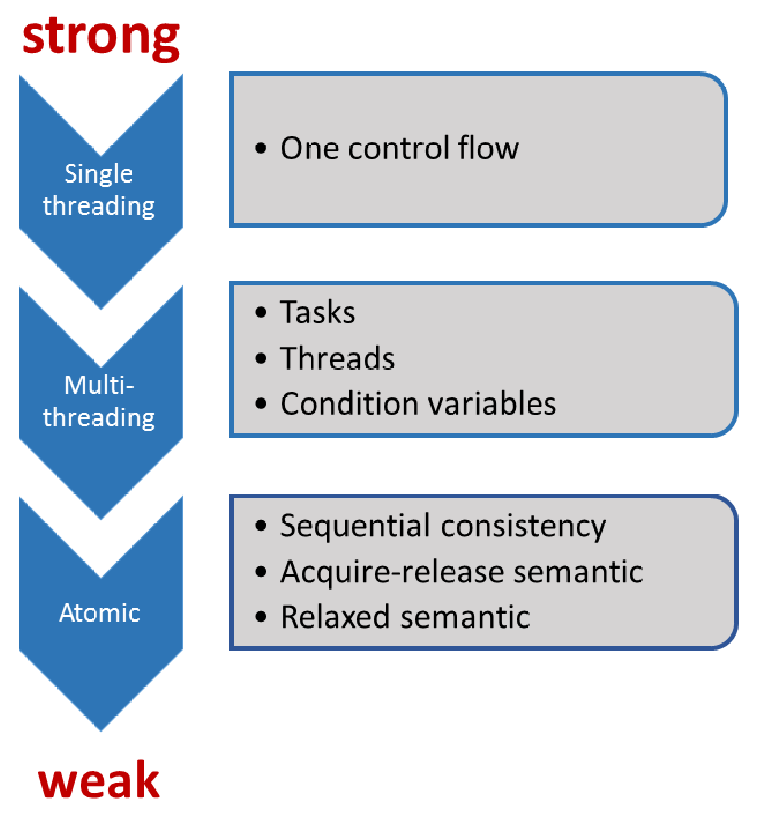

# 編程協議

協議約定的雙方為：開發者和系統。系統由生成機器碼的編譯器、執行機器碼的處理器和存儲程序狀態的緩存組成。每個部分可以進行優化，例如：編譯器可以使用寄存器或修改循環，處理器可以亂序執行或分支預測，緩存指令可以預取或緩衝。生成的(在好的情況下)可執行文件，可以針對硬件平臺進行了優化。確切地說，這裡不只有一個協議，而是一組(細粒度的)協議。換句話說：遵循越弱的規則，程序的優化潛力越大。

有一個經驗法則是：協議越強，優化的空間越少。當程序開發者使用弱協議或弱內存模型時，相應就會有許多優化選擇。結果是，這個項目只能由少數專家來維護，而你我可能都不屬於專家的範疇。

粗略地說，C++11中有三個協議級別。

C++11之前，C++不包括多線程或原子。系統只遵循控制流，因此優化的潛力非常有限。該系統的關鍵是，保證程序開發者所觀察到的程序行為，與源代碼中指令的順序一致。當然，這就意味著沒有內存模型，只有序列點。序列點是程序中的點，在這些點上的所有指令的效果是可見的，函數執行的開始或結束都是序列點。當使用兩個參數調用一個函數時，C++並不保證先計算哪個參數，因此其行為是未指定的，原因很簡單——逗號操作符不是序列點。

C++11中，這些都發生了變化。C++11是C++第一個支持多線程的標準。C++內存模型深受[Java內存模型]( https://en.wikipedia.org/wiki/Java_memory_model)的影響，不過C++內存模型做了很多改進。為了得到定義良好的程序，程序開發者在處理共享變量時必須遵守規則。如果存在數據競爭，則程序的行為是未定義的。如前所述，如果線程共享可變數據，必須注意數據競爭。

在使用原子操作的時候，經常會討論無鎖編程。我在本節中談到了弱規則和強規則，其中原子操作的順序一致語義被稱為**強內存模型**，原子操作的自由語義被稱為**弱內存模型**。

## 基礎

C++內存模型需要保證以下操作：

* 原子操作：不受中斷地執行。
* 部分排序操作：操作序列的順序不能重排。
* 可見操作：保證共享變量上的操作對其他線程可見。

協議基礎是針對原子操作的，其特點是原子的、不可分割的，並且在執行上會創建同步和約束順序。當然，同步和約束順序也適用於非原子的操作。一方面，原子類型上的操作總是原子的；另一方面，可以根據需要定製同步和約束順序。

## 挑戰

內存模型越弱，就能把越多的注意力轉放到其他事情上，比如：

* 優化潛力。
* 控制流數量。
* 瞭解更多底層的知識。
* 程序行為與我們的預期是否一致。
* 更加微觀的優化。

我們應該是處理多線程的專家。如果想要處理原子(順序一致)操作，我們應該打開通向下一個專業級別的大門。想要知道使用獲得-釋放語義或自由語義時會發生什麼，就得向下一個境界邁進了。

我們從無鎖編程開始，深入研究C++內存模型。當完成了基礎知識的瞭解後，就要開始真正接觸內存模型了。我們的起點是順序一致語義，接著是獲得-釋放語義，而自由語義則作為旅程的終章。

現在，開啟我們的原子操作之旅吧！