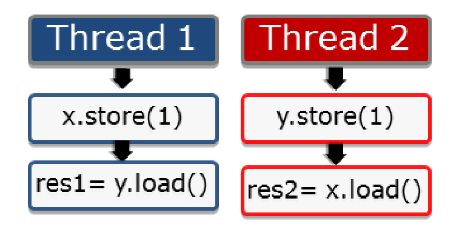
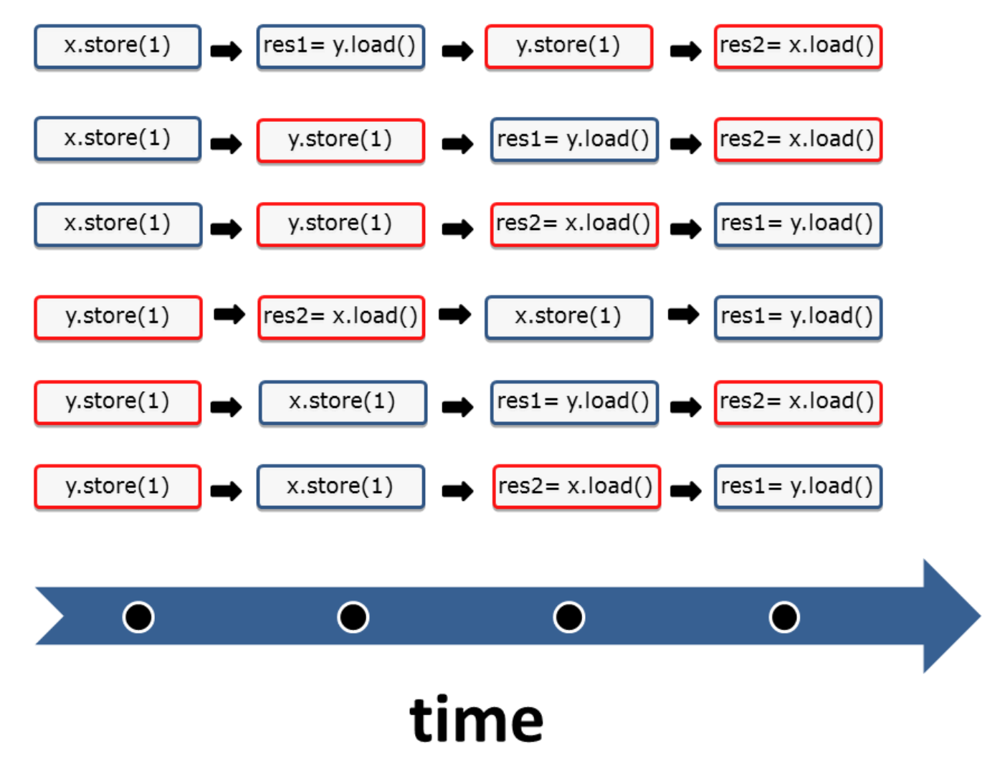
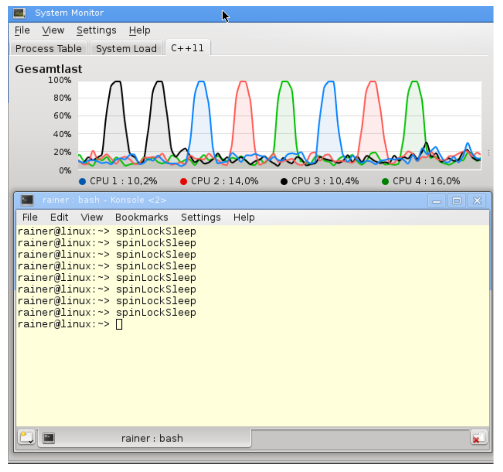
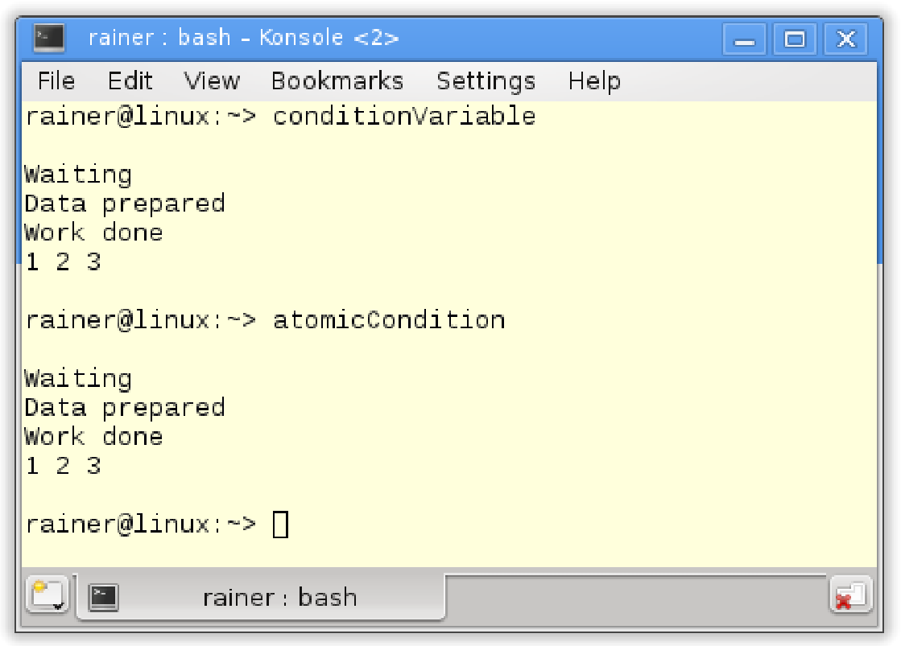

# 原子操作

原子操作是C++內存模型的基礎。默認情況下，原子操作基於強內存模型的支持，所以理解強內存模型很有意義。

##強/弱內存模型

您可能已經從編程協議的章節中瞭解到：順序一致語義是強內存模型，自由語義是弱內存模型。

###強內存模型

2004年，Java 5.0有了內存模型。2011年，C++添加了內存模型。在此之前，Java有個錯誤的內存模型，而C++則沒有內存模型，而多線程編程已經有40~50年的歷史了。在1979年時，[Leslie Lamport](https://en.wikipedia.org/wiki/Leslie_Lamport) 就定義了順序一致的概念。

順序一致有兩個特點:

* 指令按源碼順序執行。
*  線程上的所有操作都遵循一個全局順序。

深入研究這兩個特點之前，我想強調一下，這些聲明只適用於原子操作，但影響並不僅對原子操作而言。

下面圖形顯示了兩個線程。每個線程分別將值存儲到變量`x`或`y`中，獲取另一個變量`y`或`x`，並存儲在變量`res1`或`res2`中。



通常，原子操作是順序一致的。問題是：這些語句以什麼順序執行?

順序一致的第一個特點：指令按照源碼中的順序執行。任何存儲操作都無法在獲取操作之前進行。

順序一致的第二個特點：所有線程的指令必須遵循全局順序。上圖中的情況，線程2看到線程1的操作的順序與線程1執行它們的順序相同。線程2按照線程1的源碼順序查看線程1的所有操作，從線程1的角度來看也是如此。可以將這個特性，想象成一個所有線程都必須遵循的全局時鐘(全局時鐘就是全局順序)。時鐘每發出一次滴答聲，就會發生一個原子操作，但永遠不知道執行的是哪個。

解謎還沒有結束。我們仍然需要觀察，兩個線程交錯運行的方式。兩個線程有以下六種交替運行的方式。



很簡單，對吧？這就是順序一致語義，也稱為**強內存模型**。

### 弱內存模型

我們再參考一下開發者和系統之間的協議。

這個特殊的例子中，開發者使用了原子操作(開發者遵循協議)。系統保證了程序的行為，從而不會存在數據競爭。另外，系統可以在每個組合中執行四個操作。如果開發者使用自由語義，協議的基礎部分就會發生巨大的變化。一方面，開發者可能很難理解兩個線程之間的交錯；另一方面，系統有更大的優化空間。

使用自由語義(也稱為弱內存模型)，可使這四種操作有更多的組合。有種很難理解的行為是，線程1可以以不同的順序查看線程2的操作，這樣全局順序就不存在了。從線程1的角度來看，操作`res2= x.load()`可能在`y.store(1)`之前執行。甚至是，線程1或線程2沒有按照源代碼中的順序執行。例如，線程2可以先執行`res2= x.load()`，再執行`y.store(1)`。

“序列一致語義”和“自由語義”之間還有存在其他內存模型，其中最重要的是“獲取-釋放語義“。“獲取-釋放語義”中，開發人員需要遵守比“順序一致語義”弱的規則。這樣，系統有了更多優化空間。因為線程在特定同步點上進行同步，所以“獲取-釋放語義“是理解多線程編程中，同步和部分排序的關鍵。沒有同步點，就不可能有(定義良好的)線程、任務或條件變量。

上一節中，介紹了原子操作的默認行為——順序一致(為每個原子操作指定內存順序)。如果沒有指定內存順序，則應用保持順序一致，這意味著`std::memory_order_seq_cst`將默認應用於每個原子操作。

下面兩端段代碼是等價的：

```c++
x.store(1);
res = x.load();
```

```c++
x.store(1, std::memory_order_seq_cst);
res = x.load(std::memory_order_seq_cst);
```

簡單起見，本書使用第一種形式。現在，來深入瞭解C++內存模型原子性，先從`std::atomic_flag`開始吧。

## 原子標誌

`std::atomic_flag`是原子布爾類型，可以對其狀態進行設置和清除。為了簡化說明，我將`clear`狀態稱為`false`，將`set`狀態稱為`true`。`clear`方法可將其狀態設置為`false`。`test_and_set`方法，可以將狀態設置回`true`，並返回先前的值。這裡，沒有方法獲取當前值。使用`std::atomic_flag`時，必須使用常量`ATOMIC_FLAG_INIT`將`std::atomic_flag`初始化為`false`。

> **ATOMIC_FLAG_INIT**
>
> `std::atomic_flag`需要初始化時，可以是這樣：`std::atomic_flag flag = ATOMIC_FLAG_INIT`。
>
> 不過，不能這樣進行初始化：`std::atomic_flag flag(ATOMIC_FLAG_INIT) `。

`std::atomic_flag`有兩個特點：

* 無鎖原子類型。程序是系統級別進程的話，執行的非阻塞算法就是無鎖的。
* 更高級別的線程構建塊。

除了`std::atomic_flag`之外，C++標準中的原子內部都會使用互斥鎖。這些原子類型有一個`is_lock_free`成員函數，可用來檢查原子內部是否使用了互斥鎖。時下主流的微處理器架構上，都能得到“使用了互斥鎖”的結果。如果想要無鎖編程，那麼就要使用該成員函數進行檢查，確定是否使用了鎖。

> **`std::is_always_lock_free`**
>
> 可以使用`obj.is_lock_free()`，在運行時檢查原子類型的實例`obj`是否無鎖。在C++17中，可以通過`constexpr`(常量)[`atomic<type>::is_always_lock_free`](https://zh.cppreference.com/w/cpp/atomic/atomic/is_always_lock_free)，在編譯時對每個原子類型進行檢查，支持該操作的所有硬件實現都無鎖時，才返回true。

`std::atomic_flag`的接口非常強大，能夠構建自旋鎖。自旋鎖可以像使用互斥鎖一樣保護臨界區。

> **自旋鎖**
>
> 自旋鎖與互斥鎖不同，它並不獲取鎖。而是，通過頻繁地請求鎖來獲取臨界區的訪問權。不過，這會導致上下文頻繁切換(從用戶空間到內核空間)，雖然充分使用了CPU，但也浪費了非常多的時鐘週期。線程短時間阻塞時，自旋鎖非常有效。通常，會將自旋鎖和互斥鎖組合著使用。首先，在有限的時間內使用自旋鎖；如果不成功，則將線程置於等待(休眠)狀態。
>
> 自旋鎖不應該在單處理器系統上使用。否則，自旋鎖就不僅浪費了資源，而且還會減慢程序處理的速度(最好的情況)，或出現死鎖(最壞的情況)。

下面的代碼，使用`std::atomic_flag`實現了自旋鎖。

```c++
// spinLock.cpp

#include <atomic>
#include <thread>

class Spinlock{
  std::atomic_flag flag = ATOMIC_FLAG_INIT;
public:
  
  void lock(){
    while(flag.test_and_set());
  }
  
  void unlock(){
    flag.clear();
  }
  
};

Spinlock spin;

void workOnResource(){
  spin.lock();
  // shared resource
  spin.unlock();
}


int main(){
  
  std::thread t(workOnResource);
  std::thread t2(workOnResource);
  
  t.join();
  t2.join();
  
}
```

線程`t`和`t2`(第31行和第32行)在爭奪臨界區的訪問權。這裡的自旋鎖是如何工作的呢？自旋鎖也有鎖定和解鎖的階段。

當線程`t`執行函數`workOnResource`時，可能會發生以下情況：

1.  線程`t`獲取鎖，若第11行的標誌初始值為false，則鎖調用成功。這種情況下，線程`t`的原子操作將其設置為true。所以，當`t`線程獲取鎖後，true將會讓while陷入死循環，使得線程`t2`陷入了激烈的競爭當中。線程`t2`不能將標誌設置為false，因此`t2`必須等待，直到線程`t1`執行`unlock`(解鎖)並將標誌設置為false(第14 - 16行)時，才能獲取鎖。
2.  線程`t`沒有得到鎖時，情況1中的`t2`一樣，需要等待。

我們將注意力放在`std::atomic_flag`的`test_and_set`成員函數上。`test_and_set`函數包含兩個操作：讀和寫。原子操作就是對這兩種操作進行限制。如果沒有限制，線程將對共享資源同時進行讀和寫(第24行)，根據定義，這就屬於“數據競爭”，程序還會有未定義行為發生。

將自旋鎖的主動等待和互斥鎖的被動等待做一下比較。

### 自旋鎖 vs. 互斥鎖

如果函數`workOnResource`在第24行停頓2秒，那CPU負載會發生怎樣的變化?

```c++
// spinLockSleep.cpp

#include <atomic>
#include <thread>

class Spinlock{
  std::atomic_flag flag = ATOMIC_FLAG_INIT;
public:
  
  void lock(){
    while(flag.test_and_set());
  }
  
  void unlock(){
    flag.clear();
  }
  
};

Spinlock spin;

void workOnResource(){
  spin.lock();
  std::this_thread::sleep_for(std::chrono::milliseconds(2000));
  spin.unlock();
}

int main(){
  
  std::thread t(workOnResource);
  std::thread t2(workOnResource);
  
  t.join();
  t2.join();
  
}
```

如下圖所示，四個核中每次有一個是跑滿了的。



我的PC上有一個核的負載達到100%，每次不同的核芯執行”忙等待“。

我現在用互斥鎖來替換自旋鎖。讓我們看下會發生什麼。

```c++
// mutex.cpp

#include <mutex>
#include <thread>

std::mutex mut;

void workOnResource(){
  mut.lock();
  std::this_thread::sleep_for(std::chrono::milliseconds(5000));
  mut.unlock();
}

int main(){
  
  std::thread t(workOnResource);
  std::thread t2(workOnResource);
  
  t.join();
  t2.join();
  
}
```

雖然執行了好幾次，但是並沒有觀察到任何一個核上有顯著的負載。

這樣就能看出二者的區別了吧。


接下來，瞭解下`std::atomic`模板。

##  `std::atomic`模板

`std::atomic`有各種變體。

直接使用模板類：`std::atomic<bool>`和`std::atomic<user-defined type>`。

部分特化可用於指針類：`std::atomic<T*>`。

完全特化只能用於整型：`std::atomic<integral type>`。

布爾原子類型和用戶定義原子類型具有相同的接口，原子指針擴展了布爾原子類型，以及整數原子類型的接口。因其擴展了原子指針的接口，所以同樣適用於整數原子類型。

不過，不保證`std::atomic`的各種變體都是無鎖的。

先從最簡單的`std::atomic<bool>`開始吧。

### `std::atomic<bool>`

`std::atomic<bool>`的功能比`std::atomic_flag`強大很多。並且，可以顯式地將其設置為true或false。

> **原子類型不可為volatile**
>
> C#和Java中的`volatile`與C++中的`volatile`不同，這也是`volatile`和`std::atomic`之間的區別。
>
> * `volatile`：表示不允許對特定的對象進行讀寫優化。
>* `std::atomic`：用來定義線程安全的原子變量。
> 
> `volatile`在Java和C#中，與`std::atomic`在C++中的含義相同。另外，在C++多線程語義中，沒有`volatile`。
>
> `volatile`多應用於嵌入式編程中，表示可以(獨立於常規程序流)進行更改的對象，例如：表示外部設備的對象(內存映射I/O)。由於這些對象可以更改，並且會直接寫入主存中，因此不會在緩存中進行優化存儲。

這對於同步兩個線程已經足夠了，可以用`std::atomic<bool>`實現條件變量。

因此，先使用條件變量。

```c++
// conditionVariable.cpp

#include <condition_variable>
#include <iostream>
#include <thread>
#include <vector>

std::vector<int> mySharedWork;
std::mutex mutex_;
std::condition_variable condVar;

bool dataReady{false};

void waitingForWork(){
  std::cout << "Waiting " << std::endl;
  std::unique_lock<std::mutex> lck(mutex_);
  condVar.wait(lck, []{return dataReady;});
  mySharedWork[1] = 2;
  std::cout << "Work done " << std::endl;
}

void setDataReady(){
  mySharedWork = {1, 0, 3};
  {
    std::lock_guard<std::mutex> lck(mutex_);
    dataReady = true;
  }
  std::cout << "Data prepared" << std::endl;
  condVar.notify_one();
}

int main(){
  std:cout << std::endl;
  
  std::thread t1(waitingForWork);
  std::thread t2(setDataReady);
  
  t1.join();
  t2.join();
  
  for (auto v : mySharedWork){
    std::cout << v << " ";
  }
  
  std::cout << "\n\n";
}
```

簡單說一下這段代碼。線程`t1`在(第17行)等待線程`t2`的通知。兩個線程使用相同的條件變量`condVar`，並在同一個互斥鎖上進行同步。工作流如下所示：

* 線程t1
  * 獲取鎖`lck`時，等待數據準備好的通知 `condVar.wait(lck, []{ return dataReady; })` 。
  * 得到通知後，執行`mySharedWork[1] = 2`。

* 線程t2
  * 準備數據`mySharedWork = {1, 0, 3}`
  * 將非原子布爾類型的`dataReady`置為true。
  * 通過`condVar.notify_one`發佈通知。

線程`t2`將`dataReady`設置為true，線程`t1`使用Lambda表達式對`dataReady`進行檢查。不過，條件變量可能會出現兩種不好的情況:

1. 偽喚醒：接受者在沒有收到通知時被喚醒。
2. 未喚醒：接收方在未處於等待狀態時獲得通知。

使用`std::atomic<bool> `進行實現：

```c++
// atomicCondition.cpp

#include <atomic>
#include <chrono>
#include <iostream>
#include <thread>
#include <vector>

std::vector<int> mySharedWork;
std::atomic<bool> dataReady(false);

void waitingForWork(){
  std::cout << "Waiting " << std::endl;
  while(!dataReady.load()){
    std::this_thread::sleep_for(std::chrono::milliseconds(5)); 
  }
  mySharedWork[1] = 2;
  std::cout << "Work done " << std::endl;
}

void setDataReady(){
  mySharedWork = {1,0,3};
  dataReady = true;
  std::cout << "Data prepared" << std::endl;
}

int main(){
  
  std::cout << std::endl;
  
  std::thread t1(waitingForWork);
  std::thread t2(setDataReady);
  
  t1.join();
  t2.join();
  
  for (auto v : mySharedWork){
    std::cout << v << " "; 
  }
  
  std::cout << "\n\n";
}
```

如何保證第17行在第14行之後執行？或者說，線程`t1`在線程`t2`執行`mySharedWork ={1,0,3}`(第22行)後，執行`mySharedWork[1] = 2`(第17行)。

* 第22行先於第23行執行。
* 第14行先於第17行執行。
* 第14、23行與第14行同步
* 因為同步建立了先行關係，並且先行關係可以傳遞，所以`mySharedWork = {1,0,3}`先於`mySharedWork[1] = 2`執行。

很容易理解，對吧？簡單起見，忽略同步創建的線程間先行關係，以及線程間已建立的先行關係。如果對這裡的細節感興趣，可以參考這裡：[內存序(memory_order)](http://en.cppreference.com/w/cpp/atomic/memory_order)。

兩段程序產生了相同的結果。



> **推拉原理**
>
> 條件變量的同步與`std::atomic<bool>`之間有一個關鍵性的區別。條件變量會讓線程等待通知(`condVar.notify()`)。檢查`std::atomic<bool>`的線程，只是為了確定發送方是否完成了其工作(`dataRead = true`)。
>
> 條件變量通知等待線程對應為"推原則(push principle)"，而原子布爾值的重複輪詢對應為"拉原則(pull principle)"。

`std::atomic<bool>`和`std::atomic`的其他全/偏特化都支持的原子操作：`compare_exchange_strong`和`compare_exchange_strong`。

> **compare_exchange_strong和compare_exchange_weak** 
>
> compare_exchange_strong的聲明為`bool compare_exchange_strong(T& expected, T& desired)`。此操作為比較和交換，因此也稱為比較-交換(compare and swap，CAS)操作。這種操作在許多編程語言中都有用到，並且是非阻塞算法的基礎。當然，C++中的行為可能會與其他語言不同。`atomicValue.compare_exchange_strong(expected, desired)`具有以下行為。
>
> *  如果`atomicValue`的值與期望值(expected)的比較返回true，則將`atomicValue`設置為所需值(desired)。
>* 如果比較返回false，則將expected值設置為`atomicValue`的值。
> 
> compare_exchange_strong稱為**strong**的原因顯而易見。當然，還有一個compare_exchange_weak，**weak**版本可能會偽失敗。這意味著，雖然`*atomicValue == expected`成立，但`atomicValue`沒有被設置成`desired`，函數返回`false`，因此必須在循環中進行檢查：`while (!atomicValue.compare_exchange_weak(expected, desired))`。弱形式的存在原因是，因為一些處理器(硬件)不支持原子比較交換指令。循環調用時，也應該首選弱形式。在某些平臺上，弱形式運行得更快。
>
> CAS操作對於[ABA問題](https://lumian2015.github.io/lockFreeProgramming/aba-problem.html)，解決方式是開放的。先描述一下這個問題：讀取一個值兩次，每次都返回相同的值A；因此得出結論，在這兩者之間沒有變化。但是，兩次讀取過程中數值可能已經更改為B了。

弱版本允許偽失敗，也就是說，即使它們是相等的，結果也和`*this !=expected`一樣。當比較-交換操作處於循環中時，弱版本可能在某些平臺上具有更好的性能。

除了布爾值之外，還有指針、整型和用戶定義類型的原子操作。

所有`std::atomic`的變種類型都支持CAS操作。

### 用戶定義類型的原子操作`std::atomic<user-defined type>`

因為`std::atomic`是模板類，所以可以使用自定義的原子類型。

使用自定義類型用於原子類型`std::atomic<user-defined type>`時，有很多限制。原子類型`std::atomic<user-defined type`>與`std::atomic<bool>`具有相同的接口。

以下是自定義類型成為原子類型的限制：

* 自定義類型對所有基類和有非靜態成員的複製賦值操作必須非常簡單。這意味著不能定義複製賦值操作符，但是可以使用[default](http://en.cppreference.com/w/cpp/keyword/default)讓編譯器來完成這個操作符的定義。
* 自定義的類型不能有虛方法或虛基類
* 自定義的類型必須可按位比較，這樣才能使用C函數[memcpy](http://en.cppreference.com/w/cpp/string/byte/memcpy)或[memcmp]( http://en.cppreference.com/w/cpp/string/byte/memcmp)。

主流平臺都可以對`std::atomic<user-defined type>`進行原子操作，前提是用戶定義類型的大小不大於`int`。

> **編譯時檢查類型屬性**
>
> 可以使用以下函數在編譯時，檢查自定義類型的類型屬性：`std::is_trivially_copy_constructible`, `std:: is_polymorphic`和`std::is_trivial`。這些函數都是類型特徵庫([type-traits library]( http://en.cppreference.com/w/cpp/header/type_traits))的一部分。

**`std::atomic<T*>`**

`std::atomic<T*>`是`std::atomic`類模板的偏特化類型。原子指針`std::atomic<T*>`支持與`std::atomic<bool>` 或` std::atomic<user-defined type> `相同的成員函數。它的行為就像一個普通的指針`T*`。`std::atomic<T*> `支持指針運算和前後遞增或前後遞減操作。

看個簡單的例子。

```c++
int intArray[5];
std::atomic<int*> p(intArray);
p++;
assert(p.load() == &intArray[1]);
p+=1;
assert(p.load() == &intArray[2]);
--p;
assert(p.load() == &intArray[1]);
```

在C++11中，有原子整型。

**`std::atomic<integral type>`**

對於每個整數類型，都有相應的全特化`std::atomic<integral type>`版本。

對於哪些整型存做了全特化？讓我們來看一下:

* 字符類型: char , char16_t , char32_t 和 wchar_t
* 標準有符號整型: signed char , short , int , long 和 long long
*  標準無符號整型: unsigned char , unsigned short , unsigned int , unsigned long 和 unsigned long long
*  還有很多整型，都定義在[`<cstdint>`](http://en.cppreference.com/w/cpp/header/cstdint)中
  * int8_t , int16_t , int32_t 和 int64_t (8, 16, 32 和 64位的有符號整型)
  * uint8_t , uint16_t , uint32_t 和 uint64_t (8, 16, 32 和 64位的無符號整型)
  * int_fast8_t , int_fast16_t , int_fast32_t 和 int_fast64_t (8, 16, 32 和 64位的高速有符號整型)
  * uint_fast8_t , uint_fast16_t , uint_fast32_t 和 uint_fast64_t (8, 16, 32 和 64 位的高速無符號整型)
  * int_least8_t , int_least16_t , int_least32_t 和 int_least64_t (8, 16, 32 和 64 位的最小有符號整型)
  * uint_least8_t , uint_least16_t , uint_least32_t 和 uint_least64_t (8, 16, 32 和 64 位的最小無符號整型)
  * intmax_t 和 uintmax_t (最大有符號整數和無符號整數)
  * intptr_t 和 uintptr_t (用於存放有符號整數和無符號整數指針)

`std::atomic<integral type>`支持複合賦值運算符`+=`、`-=`、`&=`、`|=`和`^=`，以及相應操作的方法：`fetch_add`、`fetch_sub`、`fetch_and`、`fetch_or`和`fetch_xor`。複合賦值運算符返回新值，而fetch操作返回舊值。此外，複合賦值運算符還支持前增量和後增量，以及前減量和後減量(++x, x++，--x和x--)。

更深入的研究前需要了解一些前提：原子操作沒有原子乘法、原子除法，也沒有移位操作。這不是重要的限制，因為這些操作很少需要，並且很容易實現。下面就是是實現原子`fetch_mult`的例子。

```c++
// fetch_mult.cpp

#include <atomic>
#include <iostream>

template <typename T>
T fetch_mult(std::atomic<T>& shared, T mult){
  T oldValue = shared.load();
  while(!shared.compare_exchange_strong(oldValue, oldValue * mult));
  return oldValue;
}

int main(){
  std::atomic<int> myInt{5};
  std::cout << myInt << std::endl;
  fetch_mult(myInt, 5);
  std::cout << myInt << std::endl;
}
```

值得一提的是，第9行的乘法只在`oldValue == shared`成立時才會發生。因為在第8行中有兩條讀取`oldValue`的指令，我將乘法放在`while`循環中，以確保乘法能順利執行。


> **fetch_mult無鎖**
>
> `fetch_mult`(第6行)將`std::atomic`變量與`mult`相乘。關鍵在讀取舊值`T oldValue = shared Load`(第8行)和比較第9行中的新值之間，有一個窗口時間。因此，其他線程總是可以介入並更改`oldValue`。如果線程間有糟糕的交錯，就會發現每個線程可能都有自己的結果。
>
> 該算法是無鎖的，但不是無等待的。

### 類型別名

對於所有`std::atomic<bool>`和`std::atomic<integral type>`(如果integral類型可用)，C++標準提供類型別名。

`std::atomic<bool>`和`std::atomic<integral type>`的類型別名如下：

|           類型別名           |              具體定義              |
| :--------------------------: | :--------------------------------: |
|      `std::atomic_bool`      |        `std::atomic<bool>`         |
|      `std::atomic_char`      |        `std::atomic<char>`         |
|     `std::atomic_schar`      |     `std::atomic<signed char>`     |
|     `std::atomic_uchar`      |    `std::atomic<unsigned char>`    |
|     `std::atomic_short`      |        `std::atomic<short>`        |
|     `std::atomic_ushort`     |   `std::atomic<unsigned short>`    |
|      `std::atomic_int`       |         `std::atomic<int>`         |
|      `std::atomic_uint`      |    `std::atomic<unsigned int>`     |
|      `std::atomic_long`      |        `std::atomic<long>`         |
|     `std::atomic_ulong`      |    `std::atomic<unsigned long>`    |
|     `std::atomic_llong`      |      `std::atomic<long long>`      |
|     `std::atomic_ullong`     | `std::atomic<unsigned long long>`  |
|    `std::atomic_char16_t`    |      `std::atomic<char16_t>`       |
|    `std::atomic_char32_t`    |      `std::atomic<char32_t>`       |
|    `std::atomic_wchar_t`     |       `std::atomic<wchar_t>`       |
|     `std::atomic_int8_t`     |     `std::atomic<std::int8_t>`     |
|    `std::atomic_uint8_t`     |    `std::atomic<std::uint8_t>`     |
|    `std::atomic_int16_t`     |    `std::atomic<std::int16_t`>     |
|    `std::atomic_uint16_t`    |    `std::atomic<std::uint16_t`>    |
|    `std::atomic_int32_t`     |    `std::atomic<std::int32_t>`     |
|    `std::atomic_uint32_t`    |    `std::atomic<std::uint32_t>`    |
|    `std::atomic_int64_t`     |    `std::atomic<std::int64_t>`     |
|    `std::atomic_uint64_t`    |    `std::atomic<std::uint64_t>`    |
|  `std::atomic_int_least8_t`  |  `std::atomic<std::int_least8_t>`  |
| `std::atomic_uint_least8_t`  | `std::atomic<std::uint_least8_t>`  |
| `std::atomic_int_least16_t`  | `std::atomic<std::int_least16_t>`  |
| `std::atomic_uint_least16_t` | `std::atomic<std::uint_least16_t>` |
| `std::atomic_int_least32_t`  | `std::atomic<std::int_least32_t>`  |
| `std::atomic_uint_least32_t` | `std::atomic<std::uint_least32_t>` |
| `std::atomic_int_least64_t`  | `std::atomic<std::int_least64_t>`  |
| `std::atomic_uint_least64_t` | `std::atomic<std::uint_least64_t>` |
|  `std::atomic_int_fast8_t`   |  `std::atomic<std::int_fast8_t>`   |
|  `std::atomic_uint_fast8_t`  |  `std::atomic<std::uint_fast8_t>`  |
|  `std::atomic_int_fast16_t`  |  `std::atomic<std::int_fast16_t>`  |
| `std::atomic_uint_fast16_t`  | `std::atomic<std::uint_fast16_t>`  |
|  `std::atomic_int_fast32_t`  |  `std::atomic<std::int_fast32_t>`  |
| `std::atomic_uint_fast32_t`  | `std::atomic<std::uint_fast32_t>`  |
|  `std::atomic_int_fast64_t`  |  `std::atomic<std::int_fast64_t>`  |
| `std::atomic_uint_fast64_t`  | `std::atomic<std::uint_fast64_t>`  |
|    `std::atomic_intptr_t`    |    `std::atomic<std::intptr_t>`    |
|   `std::atomic_uintptr_t`    |   `std::atomic<std::uintptr_t>`    |
|     `std::atomic_size_t`     |     `std::atomic<std::size_t>`     |
|   `std::atomic_ptrdiff_t`    |   `std::atomic<std::ptrdiff_t>`    |
|    `std::atomic_intmax_t`    |    `std::atomic<std::intmax_t>`    |
|   `std::atomic_uintmax_t`    |   `std::atomic<std::uintmax_t>`    |

### 所有原子操作

這是關於所有原子操作的列表。

|        成員函數         |                  描述                  |
| :---------------------: | :------------------------------------: |
|      test_and_set       | (原子性地)將標記設置為true，並返回舊值 |
|          clear          |      (原子性地)將標記設置為false       |
|      is_lock_free       |            檢查原子是否無鎖            |
|          load           |       (原子性地)返回原子變量的值       |
|          store          | (原子性地)將原子變量的值替換為非原子值 |
|        exchange         |    (原子性地)用新值替換值，返回舊值    |
| compare_exchange_strong |         (原子性地)比較並交換值         |
|  compare_exchange_weak  |         (原子性地)比較並交換值         |
|     fetch_add , +=      |             (原子性地)加法             |
|     fetch_sub , -=      |             (原子性地)減法             |
|     fetch_or , \|=      |            (原子性地)邏輯或            |
|     fetch_and , &=      |            (原子性地)邏輯與            |
|     fetch_xor , ^=      |           (原子性地)邏輯異或           |
|         ++ , --         |          (原子性地)自加和自減          |

原子類型沒有複製構造函數或複製賦值操作符，但支持從內置類型進行賦值和隱式轉換。複合賦值運算符返回新值，fetch操作返回舊值。複合賦值運算符返回值，而不是所賦值對象的引用。

隱式轉換為基礎類型

```c++
std::atomic<long long> atomOb(2011);
atomObj = 2014;
long long nonAtomObj = atomObj;
```

每個方法都支持內存序參數。默認的內存序是`std::memory_order_seq_cst`，也可以使用`std::memory_order_relaxed`, `std::memory_order_consume`, `std::memory_order_acquire`, `std::memory_order_release`或`std::memory_order_acq_rel`。`compare_exchange_strong`和 `compare_exchange_weak`可以傳入兩個內存序，一個是在比較成功的情況下所使用的內存序，另一個是在比較失敗的情況下使用的。

如果只顯式地提供一個內存序，那麼成功和失敗的情況都會使用該內存序。

當然，並不是所有操作對所有原子類型都可用。下表顯示了所有原子類型支持的原子操作。

|         函數名          | atomic_flag | `atomic<bool>` | `atomic<user>` | `atomic<T*>` | `atomic<integral>` |
| :---------------------: | :---------: | :------------: | :------------: | :----------: | :----------------: |
|      test_and_set       |     yes     |                |                |              |                    |
|          clear          |     yes     |                |                |              |                    |
|      is_lock_free       |             |      yes       |      yes       |     yes      |        yes         |
|          load           |             |      yes       |      yes       |     yes      |        yes         |
|          store          |             |      yes       |      yes       |     yes      |        yes         |
|        exchange         |             |      yes       |      yes       |     yes      |        yes         |
| compare_exchange_strong |             |      yes       |      yes       |     yes      |        yes         |
|  compare_exchange_weak  |             |                |                |              |                    |
|      fetch_add, +=      |             |                |                |     yes      |        yes         |
|      fetch_sub, -=      |             |                |                |              |                    |
|      fetch_or, \|=      |             |                |                |              |        yes         |
|      fetch_and, &=      |             |                |                |              |                    |
|      fetch_xor, ^=      |             |                |                |              |                    |
|         ++, --          |             |                |                |     yes      |        yes         |

### 原子函數

為了與C語言兼容，這些函數使用的是指針而不是引用。所以，`std::atomic_flag`和類模板`std::atomic`的功能也可以與原子函數一起使用。

`std::atomic_flag`的原子函數有：`std::atomic_flag_clear()`、`std::atomic_flag_clear_explicit`、`std::atomic_flag_test_and_set()`和`std::atomic_flag_test_set_explicit()`。所有函數的第一個參數都是指向`std::atomic_flag`的指針。另外，以`_explicit`為後綴的函數需要傳入內存序。

對於每個`std::atomic`類型，都有相應的原子函數。原子函數遵循一個簡單的命名約定：只在前面添加前綴`atomic_`。例如，`std::atomic`上的方法調用`at.store()`變成`std::atomic_store()`， `std::atomic_store_explicit()`。

可以在[atomic]( http://en.cppreference.com/w/cpp/atomic)瞭解所有的重載。

`std::shared_ptr`算是個例外，其原子函數只能在原子類型上使用。

### std::shared_ptr

`std::shared_ptr `是唯一可以使用原子操作的非原子數據類型。說明一下這樣設計的動機。

C++委員會了解到，智能指針需要在多線程中提供最小原子性保證的必要性，所以做出了這樣的設計。先來解釋“最小原子性保證”，也就是`std::shared_ptr`的控制塊是線程安全的，這意味著增加和減少引用計數器的是原子操作，也就能保證資源只被銷燬一次了。

`std::shared_ptr`的聲明由[Boost](http://www.boost.org/doc/libs/1_57_0/libs/smart_ptr/shared_ptr.htm#ThreadSafety)提供：

1. `shared_ptr`實例可以被多個線程同時“讀”(僅`const`方式訪問)。
2. 不同的`shared_ptr`實例可以被多個線程同時“寫”(通過操作符`=`或`reset`等操作訪問)(即使這些實例是副本，但在底層共享引用計數)。

為了使這兩個表述更清楚，舉一個簡單的例子。當在一個線程中複製`std::shared_ptr`時，一切正常。

```c++
std::shared_ptr<int> ptr = std::make_shared<int>(2011);

for (auto i = 0; i < 10; i++){
  std::thread([ptr]{
    std::shared_ptr<int> localPtr(ptr);
    localPtr = std::make_shared<int>(2014);
  }).detach();
}
```

先看第5行，通過對`std::shared_ptr localPtr`使用複製構造，只使用控制塊，這是線程安全的。第6行更有趣一些，為`localPtr`設置了一個新的`std::shared_ptr`。從多線程的角度來看，這不是問題：Lambda函數(第4行)通過複製綁定`ptr`。因此，對`localPtr`的修改在副本上進行。

如果通過引用獲得`std::shared_ptr`，情況會發生鉅變。

```c++
std::shared_ptr<int> ptr = std::make_shared<int>(2011);

for (auto i = 0; i < 10; i++){
  std::thread([&ptr]{
    ptr = std::make_shared<int>(2014);
  }).detach();
}
```

Lambda函數通過引用，綁定了第4行中的`std::shared_ptr ptr`。這意味著，賦值(第5行)可能觸發底層的併發讀寫，所以該段程序具有未定義行為(數據競爭)。

誠然，最後一個例子並不容易實現，但在多線程環境下使用`std::shared_ptr`也需要特別注意。同樣需要注意的是，`std::shared_ptr`是C++中唯一存在原子操作的非原子數據類型。

### std::shared_ptr的原子操作

`std::shared_ptr`的原子操作`load`、`store`、`compare_and_exchange`有專用的方法，甚至可以指定內存序。下面是`std::shared_ptr`的原子函數。

`std::shared_ptr`的原子函數列表

----

`std::atomic_is_lock_free(std::shared_ptr)`
`std::atomic_load(std::shared_ptr)`
`std::atomic_load_explicit(std::shared_ptr)`
`std::atomic_store(std::shared_ptr)`
`std::atomic_store_explicit(std::shared_ptr)`
`std::atomic_exchange(std::shared_ptr)`
`std::atomic_exchange_explicit(std::shared_ptr)`
`std::atomic_compare_exchange_weak(std::shared_ptr)`
`std::atomic_compare_exchange_strong(std::shared_ptr)`
`std::atomic_compare_exchange_weak_explicit(std::shared_ptr)`
`std::atomic_compare_exchange_strong_explicit(std::shared_ptr)`

----

更多詳情信息，請訪問[cppreference.com]( http://en.cppreference.com/w/cpp/memory/shared_ptr)。現在，可以非常容易以線程安全的方式，修改引用綁定的共享指針了。

`std::shared_ptr`數據競爭的解決實現

```c++
std::shared_ptr<int> ptr = std::make_shared<int>(2011);

for (auto i = 0; i < 10; i++){
  std::thread([&ptr]{
    auto localPtr = std::make_shared<int>(2014);
    std::atomic_store(&ptr, localPtr);
  }).detach();
}
```

`auto localPtr = std::make_shared<int>(2014)`對`std::shared_ptr ptr`的更新是線程安全的。這樣就完了嗎？不！最後，我們需要了解下原子智能指針。

> **原子智能指針(Atomic Smart Pointers)**
>
> 原子智能指針的故事還沒有結束。C++20中，我們很有可能看到兩個新的智能指針:`std::atomic<std::shared_ptr>`和`std::atomic<std::weak_ptr>`。想要了解的讀者可以翻到本書的原子智能指針章節，瞭解更多的細節。

原子變量及其原子操作是內存模型的基礎件，它們為原子和非原子建立同步和順序約束。下面，讓我們更深入地瞭解同步和順序約束。


