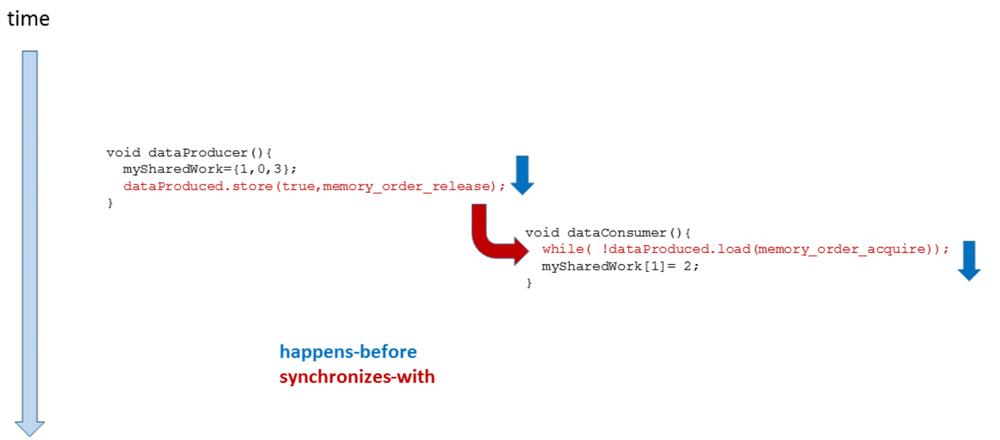
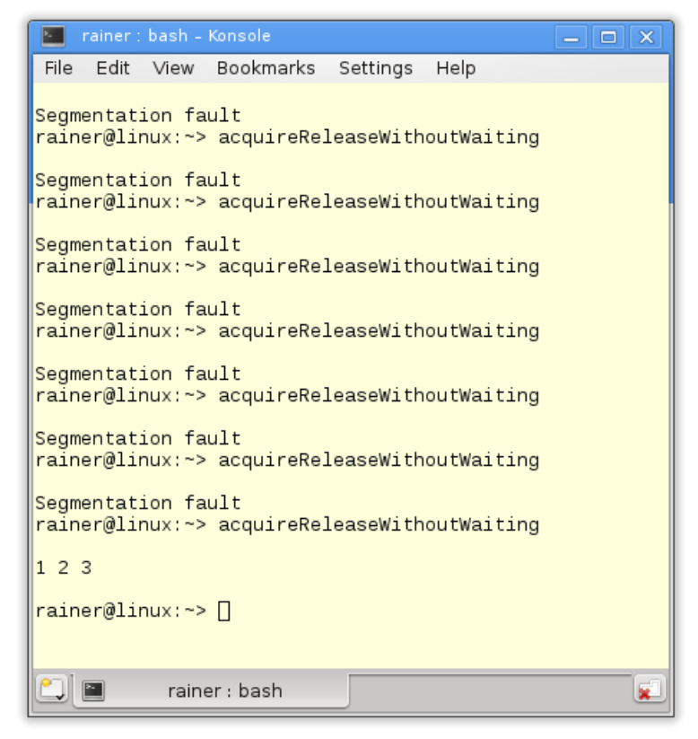

#同步和順序

雖然不能配置原子數據，但可以調整原子操作的同步和順序。這在C#或Java的內存模型中是不可能的。

C++中有六種不同的內存模型，那這些內存模型分別是什麼呢?

## C++的六種內存序

我們已經知道C++有六種不同的內存序。原子操作默認的內存序是`std::memory_order_seq_cst`，這表示順序一致。此外，也可以顯式地指定其他五個中的一個。那麼剩餘幾個是什麼呢?

C++中定義的內存序

```c++
enum memory_order{
  memory_order_relaxed,
  memory_order_consume,
  memory_order_acquire,
  memory_order_release,
  memory_order_acq_rel,
  memory_order_seq_cst
}
```

對這六種內存序進行分類，需要回答兩個問題:

1. 不同的原子操作應該使用哪種內存模型?
2. 6個內存序定義了哪些同步和順序?

接下來的內容就是回答這兩個問題。

## 原子操作的種類

這裡有三種不同類型的原子操作：

* 讀(read)操作: `memory_order_acquire`和`memory_order_consume`
* 寫(write)操作: `memory_order_release`
* 讀改寫(read-modify-write)操作: `memory_order_acq_rel`和`memory_order_seq_cst`

`memory_order_relaxed`無同步和操作順序，所以它不適用於這種分類方式。

下表根據原子操作的讀寫特性對它們進行排序。

|        操作名稱         | read | write | read-modify-write |
| :---------------------: | :--: | :---: | :---------------: |
|      test_and_set       |      |       |        yes        |
|          clear          |      |  yes  |                   |
|      is_lock_free       | yes  |       |                   |
|          load           | yes  |       |                   |
|          store          |      |  yes  |                   |
|        exchange         |      |       |        yes        |
| compare_exchange_strong |      |       |        yes        |
|  compare_exchange_weak  |      |       |                   |
|      fetch_add, +=      |      |       |        yes        |
|      fetch_sub, -=      |      |       |                   |
|      fetch_or, \|=      |      |       |        yes        |
|      fetch_and, &=      |      |       |                   |
|      fetch_xor, ^=      |      |       |                   |
|         ++, --          |      |       |        yes        |

“讀改寫”操作還需要提供最新的值，不同線程上的`atomVar.fetch_sub(1)`操作序列一個接一個地無縫銜接或進行重複的計數。

如果將原子操作`atomVar.load()`與“寫”或“讀改寫”操作一起使用，那麼“寫”的部分將不起作用。結果就是：`atomVar.load(std::memory_order_acq_rel)`等價於`atomVar.load(std::memory_order_acquire)`，`atomVar.load(std::memory_order_release)`等價於`atomVar.load(std::memory_order_relax)`。

## 同步與順序的不同

大致說來，C++中有三種不同類型的同步和順序:

* 順序一致: `memory_order_seq_cst`
* 獲取-釋放(Acquire-release)：`memory_order_consume` , `memory_order_acquire` ,` memory_order_release`和`memory_order_acq_rel`
* 自由序(Relaxed): `memory_order_relaxed`

順序一致在線程之間建立全局順序。獲取-釋放語義為不同線程之間，對同一原子變量進行讀寫操作時建立順序。自由語序只保證了原子變量的修改順序，修改順序是指對一個特定原子變量的所有修改都以某種特定的順序發生。因此，由特定線程讀取原子對象時，不會看到“更舊”的值。

不同的內存模型，及其對原子和非原子操作的影響，也使得C++內存模型好玩但又有挑戰性。下面我們來討論順序一致、獲得-釋放語義和自由語義的同步和順序。

### 順序一致

讓我們深入地研究一下順序一致，其關鍵是所有線程上的所有操作都遵從一個通用時鐘。這個全球時鐘讓我們可以很直觀的想象它的存在。

順序一致的直觀性是有代價的，缺點是系統必須對線程進行同步。

下面的程序在順序一致性的幫助下，同步生產者和消費者線程。

```c++
// producerConsumer.cpp

#include <atomic>
#include <iostream>
#include <string>
#include <thread>

std::string work;
std::atomic<bool> ready(false);

void consumer(){
  while(!ready.load()){}
  std::cout << work << std::endl;
}

void producer(){
  work = "done";
  ready = true;
}

int main(){
  std::thread prod(producer);
  std::thread con(consumer);
  prod.join();
  con.join();
}
```

這個程序的輸出：


由於順序一致，程序執行結果是確定的，所以總是輸出“done”。

下圖描述了操作的順序。消費者線程在`while`循環中等待，等待原子變量`ready`被生產者線程設置為`true`。當這種情況發生時，消費者線程將繼續其工作。


理解程序總是返回“done”並不難，只需要使用順序一致的兩個特點：一方面，兩個線程以源碼順序執行指令；另一方面，每個線程以相同的順序查看另一個線程的操作。也就是，兩個線程遵循相同的時鐘。`while(!ready.load()){}`循環中，這種同步也可以保持下去——用於同步生產者線程和消費者線程。

通過使用內存序，可以更正式地解釋這個過程。以下是正式版本:

1. `work= "done"`在序列中，位於`ready = true`之前
   ⇒ `work= "done"`先行與`ready = true`
2. `while(!ready.load()){}`序列位於`std::cout << work << std::endl`之前
   ⇒ `while(!ready.load()){}`先行與`std::cout<< work << std::endl`
3. `ready= true`與`while(!ready.load()){}`同步
   ⇒ `ready= true`(線程間)先行於`while (!ready.load()){}`
   ⇒ `ready= true`先行於`while (!ready.load()){}`

最終的結論：因為先行關係是可以傳遞的，所以`work = "done"`先行於`ready= true`，且先行於`while(!ready.load()){}`，更先行於`std::cout<< work << std::endl`。

順序一致中，一個線程可以看到另一個線程的操作，因此也可以看到所有其他線程的操作。如果使用原子操作的獲取-釋放語義，那麼順序一致就不成立了。這是與C#和Java不同的地方，也是容易產生疑惑的地方。

### 獲取-釋放語義

獲取-釋放語義中，線程間不存在全局同步：只有同一原子變量上的原子操作才進行同步。比如：一個線程上的寫操作與另一個線程上的讀操作，只有作用於同一個原子變量時才進行同步。

獲取-釋放語義的基本思想：釋放操作與獲取操作在同一原子上同步，並建立一個順序。這意味著，在釋放操作之後不能進行所有的讀寫操作，在獲取操作之前不能進行所有的讀寫操作。

什麼是獲取/釋放操作？使用`load`或`test_and_set`讀取原子變量是一個獲取操作。還有，鎖或互斥鎖的釋放與獲取是同步的，線程的構造與調用間是同步的，線程的完成與匯入調用間的操作是同步的，任務可調用的完成與等待或獲取future的調用操作是同步的。所以，獲取和釋放操作是成對的。

下面這張圖有助於對獲取-釋放語義的理解：


> **內存模型——更深入地理解多線程**
>
> 這應該是瞭解內存模型的主要原因。特別是，獲取-釋放語義可以更好地理解高級同步原語，比如互斥鎖。同樣的原理也適用於線程的啟動和匯入。這兩種操作都是獲取-釋放操作。接下來是`wait`和`notify_one`對條件變量的調用；`wait`是獲取操作，`notify_one`是釋放操作。那`notify_all`呢？當然，也是一個釋放操作。

現在，再看`std::atomic_flag`小節中的自旋鎖。因為同步是使用`atomic_flag flag`完成的，所以可以使用獲取-釋放語義，進行更高效的實現。

```c++
// spinlockAcquireRelease.cpp

#include <atomic>
#include <thread>

class Spinlock{
  std::atomic_flag flag;
public:
  Spinlock():flag(ATOMIC_FLAG_INIT){}
  
  void lock(){
    while(flag.test_and_set(std::memory_order_acquire));
  }
  
  void unlock(){
    flag.clear(std::memory_order_release);
  }
};

Spinlock spin;

void workOnResource(){
	spin.lock();
  // shared resource
  spin.unlock();
}

int main(){
  
  std::thread t(workOnResource);
  std::thread t2(workOnResource);
  
  t.join();
  t2.join();
}
```

第16行` flag.clear `清除標誌，`test_and_set`在第12行調用一個獲取操作，獲取操作與釋放操作同步。具有順序一致的兩個線程的同步(重量級同步)(`std::memory_order_seq_cst`)被更輕量級的和性能更強的獲取-釋放語義(`std::memory_order_acquire`和`std::memory_order_release`)所取代，且程序行為不受影響。

雖然`flag.test_and_set(std::memory_order_acquire)`調用是一個"讀改寫"操作，但是獲取語義已經足夠了。因為`flag`是原子的，可以保證修改順序。這也就意味著，對`flag`的所有修改，都可以某種特定的順序進行。

獲得-釋放語義是可傳遞的。如果兩個線程(a,b)之間遵循獲取-釋放語義，且線程(b,c)之間也遵循獲取-釋放語義，那麼在線程(a, c)之間也遵循獲取-釋放語義。

#### 傳遞性

釋放與獲取操作在同一個原子變量上同步，並建立順序。如果它們作用於相同的原子變量，這些組件將以最高效的方式同步線程。如果兩個線程沒有共享的原子變量，會如何工作呢？不想使用順序一致語義，因為代價過高，我們想要更輕量級的獲取-釋放語義。

解決方式很簡單，就是利用獲取-釋放語義的傳遞性，可以同步獨立線程。

下面的示例中，線程`t2`及其工作包`deliveryBoy`是兩個獨立線程`t1`和`t3`之間的連接線程。

```c++
// transitivity.cpp

#include <atomic>
#include <iostream>
#include <thread>
#include <vector>

std::vector<int> mySharedWork;
std::atomic<bool> dataProduced(false);
std::atomic<bool> dataConsumed(false);

void dataProducer(){
  mySharedWork = {1,0,3};
  dataProduced.store(true, std::memory_order_release);
}

void deliverBoy(){
  while(!dataProduced.load(std::memory_order_acquire));
  dataConsumed.store(true, std::memory_order_release);
}

void dataConsumer(){
  while(!dataConsumed.load(std::memory_order_acquire));
  mySharedWork[1] = 2;
}

int main(){
  std::cout << std::endl;
  
  std::thread t1(dataConsumer);
  std::thread t2(deliverBoy);
  std::thread t3(dataProducer);
  
  t1.join();
  t2.join();
  t3.join();
  
  for (auto v : mySharedWork){
    std::cout << v << " ";
  }
  
  std::cout << "\n\n";
  
}
```

程序的輸出是唯一的，`mySharedWork`的值為`1, 2, 3`。


通過觀察，得出兩個結論：

1. 線程`t2`在第18行等待，直到線程`t3`將`dataProduced`設置為`true`(第14行)。
2. 線程`t1`在第23行等待，直到線程`t2`將`dataConsumed`設置為`true`(第19行)。

用圖來解釋下：


圖中主要部分是箭頭。

* 藍色箭頭是順序關係，線程中的所有操作都是按源碼順序執行。
* 紅色的箭頭是同步關係。原因是對同一原子變量的原子操作遵循的獲取-釋放語義。原子變量之間，以及線程同步發生在特定的點上。
* 順序關係建立了先行關係，再使用線程間的先行關係建立同步關係。

剩下的部分就好理解了，線程間的先行指令順序對應於箭頭的方向。最後，能夠保證`mySharedWork[1] == 2`。

釋放-獲取操作是同步的(同一個原子變量)，所以可以很容易地同步線程，不過…… 我們還要看幾個誤解。

#### 典型的誤解

寫關於獲取-釋放語義誤解的原因是什麼?我的許多讀者和學生已經發現了這些陷阱。讓我們來看一個簡單的例子。

##### 等待

以一個簡單的程序作為基點。

```c++
// acquireReleaseWithWaiting.cpp

#include <atomic>
#include <iostream>
#include <thread>
#include <vector>

std::vector<int> mySharedWork;
std::atomic<bool> dataProduced(false);

void dataProducer(){
  mySharedWork = {1,0,3};
  dataProduced.store(true, std::memory_order_release);
}

void dataConsumer(){
  while(!dataProduced.load(std::memory_order_acquire));
  mySharedWork[1] = 2;
}

int main(){
  
  std::cout << std::endl;
  
  std::thread t1(dataConsumer);
  std::thread t2(dataProducer);
  
  t1.join();
  t2.join();
  
  for (auto v: mySharedWork){
    std::cout << v << " ";
  }
    
  std::cout << "\n\n";
  
}
```

第17行的消費者線程`t1`持續等待，直到第13行的消費者線程`t2`將數據設置為true。非原子變量`mySharedWork`受`dataProduced`的保護，訪問是同步的。這意味著生產者線程`t2`初始化`mySharedWork`，然後消費者線程`t2`通過設置`mySharedWork[1]`為2來完成工作，是沒有問題的。


下圖顯示了線程中的先行關係和線程之間的同步關係。同步在線程間建立了先行關係，其餘順序可以根據先行關係的傳遞性推理得出。

最後，讓`mySharedWork = {1, 0, 3} `先行於`mySharedWork[1] = 2 `。



有沒有感覺這個推理過程中經常缺少什麼？

##### 如果……

如果第17行中的消費者線程`t1`沒有等待生產者線程`t2`，會發生什麼?

```c++
// acquireReleaseWithoutWaiting.cpp

#include <atomic>
#include <iostream>
#include <thread>
#include <vector>

std::vector<int> mySharedWork;
std::atomic<bool> dataProduced(false);

void dataProducer(){
  mySharedWork = {1,0,3};
  dataProduced.store(true, std::memory_order_release);
}

void dataConsumer(){
 	dataProduced.load(std::memory_order_acquire);
  myShraedWork[1] = 2;
}

int main(){
  
  std::cout << std::endl;
  
  std::thread t1(dataConsumer);
  std::thread t2(dataProducer);
  
  t1.join();
  t2.join();
  
  for (auto v : mySharedWork){
    std::cout << v << " ";
  }
  
  std::cout << "\n\n";
  
}
```

因為變量`mySharedWork`上存在數據競爭，所以該程序具有未定義行為。當程序運行時，將得到以下結果。



問題在哪裡呢？`dataProduced.store(true, std::memory_order_release)`與`dataProduced.load(std::memory_order_acquire)`同步。不過，並不意味著獲取操作要對釋操作進行等待，而這正是下圖中的內容。圖中，`dataProduced.load(std::memory_order_acquire)`在指令`dataProduced.store(true, std::memory_order_release)`之前，所以這裡沒有同步關係。


#### 解決辦法

同步意味著：當`dataProduced.store(true, std::memory_order_release) `先行於`dataProduced.load(std::memory_order_acquire)`，那麼`dataProduced.store(true, std::memory_order_release)`之前和`dataProduced.load(std::memory_order_acquire)`之後執行的操作是所有線程可見的。第一個程序中使用`while(! dataproduct .load(std::memory_order_acquire))`來保證同步關係。

再描述一次，使用正式方式。

當滿足條件：`dataProduced.store(true, std::memory_order_release)`先行於`dataProduced.load(std::memory_order_acquire) `時，`dataProduced.store(true, std::memory_order_release)`之前執行的操作先行於所有`dataProduced.load(std::memory_order_acquire)`之後執行的操作。

#### 釋放順序

處理獲取-釋放語義時，釋放順序是一個相當高級的概念。因此，我們首先從以下的獲取-釋放語義示例開始說起。

```c++
// releaseSequence.cpp

#include <atomic>
#include <thread>
#include <iostream>
#include <mutex>

std::atomic<int> atom{0};
int somethingShared{0};

using namespace std::chrono_literals;

void writeShared(){
  somethingShared = 2011;
  atom.store(2, std::memory_order_release);
}

void readShared(){
  while(!(atom.fetch_sub(1, std::memory_order_acquire) > 0)){
    std::this_thread::sleep_for(100ms);
  }
  std::cout << "somethingShared: " << somethingShared << std::endl;
}

int main(){
  
  std::cout << std::endl;
  
  std::thread t1(writeShared);
  std::thread t2(readShared);
  // std::thread t3(readShared);
  
  t1.join();
  t2.join();
  // t3.join();
  
  std::cout << "atom: " << atom << std::endl;
  
  std::cout << std::endl;
  
}
```

先看看沒有線程`t3`的例子。第15行對原子進行存儲操作，第19行對原子獲取並同步線程，這裡對非原子變量`somethingShared`的訪問不存在數據競爭。

如果打開`t3`線程的註釋，會發生什麼變化？現在就有可能出現“數據競爭”了。如前所述，`atom.fetch_sub(1, std::memory_order_acquire) `(第19行)與` atom.store(2, std::memory_order_release)`(第15行)間，`atom`變量遵循獲取-釋放語序；因此，在`somethingShared `變量的訪問上沒有數據競爭。

但對於第二次調用`atom.fetch_sub(1, std::memory_order_acquire)`，獲取-釋放語序則不起作用了。第二次調用則是一個讀改寫操作，因為已經沒有在對`std::memory_order_release`進行標記了。這也就時第二次調用與第一次調用並沒有同步關係，所以會發生對共享變量的數據競爭。也許，釋放順序可能不會讓數據競爭發生。這裡，釋放序列擴展到對`atom.fetch_sub(1, std::memory_order_acquire) `的第二次調用；因此，第二次調用`atom.fetch_sub(1, std::memory_order_acquire)`先行於第一次調用。

最終，我們可能會得到如下的結果：


更正式的釋放順序的由N4659定義([N4659: Working Draft, Standard for Programming Language C++]( http://www.open-std.org/jtc1/sc22/wg21/docs/papers/2017/n4659.pdf))。

> **釋放順序**
>
> 釋放順序由一個釋放操作A和一個原子對象M構成，修改M順序會對最大連續子操作序列有所影響，也就是A的第一次調用和隨後由相同線程執行的的`*`操作。這裡`*`指的是對源子的讀改寫操作。

如果仔細看了我的解釋，可能會期待接下來出現自由語義；不過，我們還是來看下內存模型`std:: memory_order_consumption`，它與`std::memory_order_acquire`非常相似

#### std::memory_order_consume

`std::memory_order_consume `是六種內存序中最傳奇的一個。原因有二：一，`std:: memory_order_consumption`非常難理解；二，因為目前沒有編譯器支持它，所以這個內存序可能在未來會進行修改。C++17中的情況更糟，官方的說法是：“釋放-消費序的規範正在修改，暫不推薦使用`memory_order_consumption`。”

為什麼不支持`std:: memory_order_consumption`呢？答案是，編譯器會將`std:: memory_order_consumption`映射為`std::memory_order_acquire`。這沒毛病，因為兩者都是加載或獲取操作。`std::memory_order_consume`比`std::memory_order_acquire`需要的同步和順序更弱。因此，釋放-獲排序可能比釋放-消費序慢，但關鍵是內存序有良好的定義。

將釋放-消費序與釋放-獲取序進行比較，可以對其進行更好的瞭解。下一小節中，將討論釋放-獲取序，以瞭解`std::memory_order_consume`和`std::memory_order_acquire`之間的關係。

#### 釋放-獲取序

首先，讓使用下面的程序和兩個線程`t1`和`t2`。`t1`扮演生產者的角色，`t2`扮演消費者的角色。原子變量`ptr`用於同步生產者和消費者。

```c++
// acquireRelease.cpp

#include <atomic>
#include <thread>
#include <iostream>
#include <string>

using namespace std;

atomic<string*> ptr;
int data;
atomic<int> atoData;

void producer(){
  string *p = new string("C++11");
  data = 2011;
  atoData.store(2014, memory_order_relaxed);
  ptr.store(p, memory_order_release);
}

void consumer(){
  string *p2;
  while(!(p2 = ptr.load(memory_order_acquire)));
  cout << "*p2: " << *p2 << endl;
  cout << "data: " << data << endl;
  cout << "atoData: " << atoData.load(memory_order_relaxed) << endl;
}

int main(){
  
  cout << endl;
  
  thread t1(producer);
  thread t2(consumer);
  
  t1.join();
  t2.join();
  
  cout << endl;
  
}
```

分析程序之前，進行一些修改。

#### 釋放-消費序

將第21行中的內存順序`std::memory_order_acquire`替換為`std:: memory_order_consumption`。

```c++
// acquireConsume.cpp

#include <atomic>
#include <thread>
#include <iostream>
#include <string>

using namespace std;

atomic<string*> ptr;
int data;
atomic<int> atoData;

void producer(){
  string *p = new string("C++11");
  data = 2011;
  atoData.store(2014, memory_order_relaxed);
  ptr.store(p, memory_order_release);
}

void consumer(){
  string *p2;
  while(!(p2 = ptr.load(memory_order_acquire)));
  cout << "*p2: " << *p2 << endl;
  cout << "data: " << data << endl;
  cout << "atoData: " << atoData.load(memory_order_relaxed) << endl;
}

int main(){
  
  cout << endl;
  
  thread t1(producer);
  thread t2(consumer);
  
  t1.join();
  t2.join();
  
  cout << endl;
  
}
```

現在程序存在有未定義的行為。不過這種情況只能是一種猜測，因為GCC 5.4編譯器使用`std::memory_order_acquire`實現了` std::memory_order_consume` ，所以程序改動前和改動後是相同的。

程序輸出結果是相同的。


#### 釋放-獲取 Vs. 釋放-消費

解釋一下，為什麼第一個程序(acquireRelease.cpp)沒有問題(定義良好)。

因為存儲操作使用`std::memory_order_release`，而加載操作使用`std::memory_order_acquire`，所以第16行上的存儲操作與第21行中的加載操作同步。釋放-獲取序的約束是什麼呢？釋放-獲取序確保在存儲操作(第16行)前，所有操作的結果在加載操作(第21行)之後可用。同樣，釋放-獲取操作對非原子變量(第14行)和原子變量`atoData`(第15行)的訪問進行排序。雖然，`atoData`使用`std::memory_order_relax`排序，但這也沒問題。

關鍵的問題是：如果用`std::memory_order_consumption`替換`std::memory_order_acquire`會發生什麼?

#### std::memory_order_consume的數據依賴

`std::memory_order_consume`需要處理原子上的數據依賴關係，數據依賴性以兩種方式存在。首先，讓我們看看線程中的攜依賴和兩個線程之間的依賴關係。兩個依賴都引入了一個先行關係。“攜依賴(carries-a-dependency-to)”和“先依賴序(dependency-order-before)”是什麼意思？

* 攜依賴: 如果操作A的結果在操作B中作為操作數，則：A攜依賴於B。
* 先依賴序：存儲操作(使用`std::memory_order_release`、`std::memory_order_acq_rel`或`std:: memory_seq_cst`)是按依賴序進行排序的——如果同一個線程中的後續操作C中加載了操作B的結果，則需要在加載操作B之前使用`std::memory_order_consume`。需要注意的是，操作B和C必須在同一個線程中。

以我的經驗，這兩個定義不是很好懂，有用圖可能會更直觀一些。


`ptr.store(p, std::memory_order_release)`是按先依賴序排列在`while (!(p2 = ptr.load(std::memory_order_consume))) `之前的，因為下行`std::cout << "*p2: " << p2 << std::endl`可看作為加載操作的結果輸出。此外，`while (!(p2 = ptr.load(std::memory_order_consume))`攜依賴於`cout << "p2: " << *p2 << < std::endl`，因為`*p2`使用了`ptr`的結果進行輸出。

我們無法保證`data `和`atoData`的輸出。這是因為兩者與`ptr.load`操作沒有攜依賴關係。更糟糕的是：由於數據是非原子變量，因此存在競爭條件。原因是兩個線程可以同時訪問數據，並且線程`t1`要對數據進行修改。因此，程序具有未定義行為。

最後，我們來瞭解自由語義。

### 自由語義

自由語義是另一個極端。自由語義是所有內存模型中最弱的，只能保證原子的修改順序，這意味著對原子的修改了，會以某種特定的順序發生。

#### 無同步和順序

這很容易理解。若沒有規則，就無所謂違規。不過，程序應該具有定義良好的行為。這意味著，通常使用更強的內存序的同步和順序可以控制自由語義的操作。這是怎麼做到的呢？一個線程可以以任意順序看到另一個線程的效果，因此必須確保程序中有一些點，在所有線程上的所有操作都是同步的。

原子操作是一個計數器，其中操作序列無關緊要。計數器遵守的不是不同線程增加計數器的順序；對計數器的關鍵觀察是，所有增量都是原子性的，所有線程的任務都在最後完成。請看下面的例子：

```c++
// relaxed.cpp

#include <vector>
#include <iostream>
#include <thread>
#include <atomic>

std::atomic<int> count = {0};

void add(){
  for (int n = 0; n < 1000; ++n){
    count.fetch_add(1, std::memory_order_relaxed);
  }
}

int main(){
  std::vector<std::thread> v;
  
  for (int n = 0; n < 10; ++n){
    v.emplace_back(add);
  }
  for (auto& t : v){
    t.join();
  }
  std::cout << "Final Counter value is " << count << '\n';
}
```

最重要的三行分別是13、24和26行。

第13行，原子數計數使用自由語義進行遞增，因此可以保證操作是原子的。`fetch_add`操作建立計數排序，`add`函數(第10-15行)是線程的任務包。在第21行，為每個線程分配任務包。

線程創建是一個同步點，另一個同步點是第24行的`t.join()`。

主線程在第24行與所有子線程同步，使用`t.join()`進行等待，直到它的所有子節點都完成。

總之，第13行中的增量操作與第26行中計數器的讀取之間存在先行關係。

結果是程序總是返回10000。有些無聊嗎？不，這才是令人放心的！


使用自由語義的原子計數器的另一個典型示例是`std::shared_ptr`的引用計數器。這隻適用於增量操作，增加引用計數器的關鍵屬性是操作是原子的。並且，增量操作的順序並不重要，但這不適用於引用計數器的遞減。這些操作需要遵循獲取-釋放語義的析構函數。

> **無等待的累加計算**
>
> 仔細看下第10行中的add函數。增量操作中不涉及同步(第13行)，值1被添加到原子變量`count`中。
>
> 因此，該算法不僅是無鎖的，而且是無等待的。

`std::atomic_thread_fence`的基本思想是，沒有原子操作的情況下，在線程之間建立同步和順序。