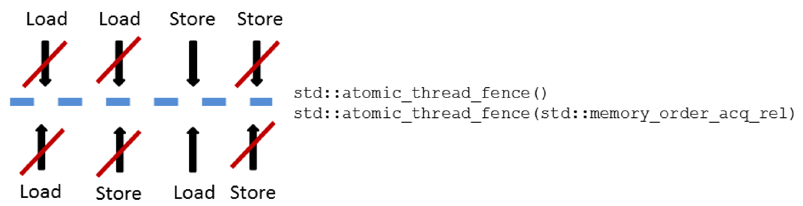
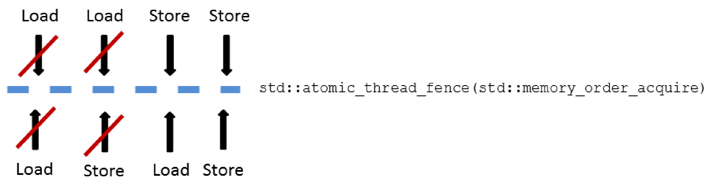
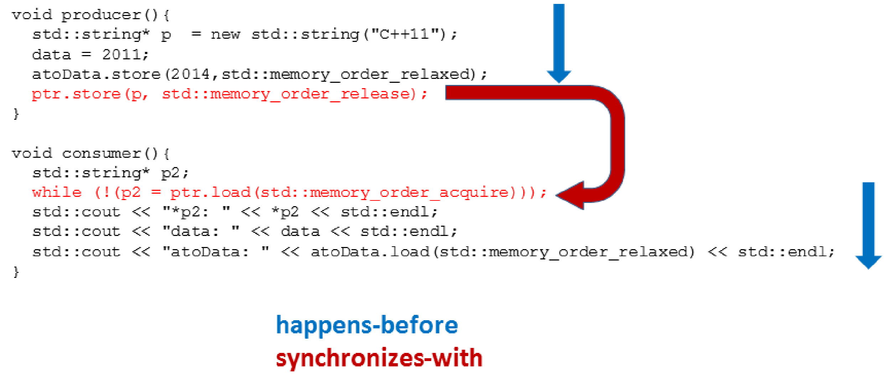

# 柵欄

C++支持兩種柵欄類型：`std::atomic_thread_fence`和`std::atomic_signal_fence`。

* `std::atomic_thread_fence` : 同步線程間的內存訪問。
* `std::atomic_signal_fence` : 線程內信號之間的同步。

**`std::atomic_thread_fence`**

`std::atomic_thread_fence`可以阻止特定的操作翻過柵欄。

`std::atomic_thread_fence`不需要原子變量，通常稱為柵欄或內存屏障。那就先來瞭解一下`std::atomic_thread_fence`。

## 柵欄當做內存屏障

這個小節的標題什麼意思呢？特定的操作不能翻過內存屏障。那什麼樣的操作屬於“特殊操作”呢？現在有兩種操作：讀寫操作或加載/存儲操作。` if(resultRead) return result `就是一個加載操作後跟一個存儲操作。

有四種不同的方式來組合加載和存儲操作：

* 加載-加載：一個加載操作後跟一個加載操作。
* 加載-存儲：一個加載操作後跟一個存儲操作。
* 存儲-加載：一個存儲操作後跟一個加載操作。
* 存儲-存儲：一個存儲操作後跟一個存儲操作。

當然，還有由多個加載和存儲(`count++`)組成的更復雜的操作，這些操作都可由以上四個操作組成。

那麼內存屏障是什麼呢？如果在加載-加載、加載-存儲、存儲-加載或存儲-存儲等操作之間設置內存屏障，則可以保證不會對特定的操作進行重新排序。如果使用非原子或具有自由語義的原子操作，則存在重新排序的風險。

## 三種柵欄類型

通常，柵欄有三種：全柵(full fence)、獲取柵欄(acquire fence)和釋放柵欄(release fence)。提醒一下，獲取是一個加載操作， 釋放是一個存儲操作。如果在加載和存儲操作的四種組合之間，放一個內存屏障中會發生什麼情況呢?

* 全柵: 任意兩個操作之間使用完整的柵欄`std::atomic_thread_fence()`，可以避免這些操作的重新排序。不過，對於存儲-加載操作來說，它們可能會被重新排序。
*  獲取柵欄: `std::atomic_thread_fence(std::memory_order_acquire)`避免在獲取柵欄之前的讀操作，被獲取柵欄之後的讀或寫操作重新排序。
* 釋放柵欄: `std::atomic_thread_fence(std::memory_order_release)`避免釋放柵欄之後的寫操作，在釋放柵欄之前通過讀或寫操作重新排序。

為了獲得和釋放柵欄的定義，以及對無鎖編程的影響，我們花費了大量精力對其進行整理。特別難以理解的是，這種柵欄與原子操作獲取-釋放語義之間的差別。先用圖來說明一些上面的定義。

哪種操作可以翻過內存屏障？先瞧瞧下面的三張圖。如果箭頭與紅色橫槓交叉，意味著柵欄會阻止這種操作。

**全柵**



當然，可以顯式地調用`std::atomic_thread_fence(std::memory_order_seq_cst)`，而不是`std::atomic_thread_fence()`。默認情況下，柵欄使用內存序為順序一致性。如果對全欄使用順序一致性，那麼`std::atomic_thread_fence`也將遵循全局序。

**獲取柵欄**


**釋放柵欄**


三種內存屏障可以描述得更簡單。

**所有柵欄一覽圖**


獲取-釋放柵欄與原子獲取-釋放語義有著相似的同步方式和順序。

## 獲取-釋放柵欄

獲取-釋放柵欄與原子類的獲取-釋放語義最明顯的區別是，柵欄不需要原子操作。還有一個更微妙的區別：獲取-釋放柵欄比原子操作更重量級。

### 原子操作 vs. 柵欄

簡單起見，現在使用柵欄或帶有獲取語義的原子操作時引用獲取操作，釋放操作也是如此。

獲取-釋放操作的主要思想是，在線程間建立同步和排序約束，這些同步和順序約束也適用於使用自由語義的原子操作或非原子操作。注意，獲取-釋放操作是成對出現的。此外，對獲取-釋放語義的原子變量的操作，必須作用在相同的原子變量上。不過，我現在是將這些操作分開來看待的。

讓我們從獲取操作開始對比。

### 獲取操作

在原子變量(內存序為`std::memory_order_acquire`)上進行的加載 (讀取)操作是一個獲取操作。


將`std::atomic_thread_fence`內存序設置為`std::memory_order_acquire`，這對內存訪問重排添加了更嚴格的約束:



比較中可以總結了兩點:

1. 具有獲取語義的柵欄會建立更強的順序約束。雖然，原子變量和柵欄的獲取操作，要求在獲取操作之前不能進行任何讀或寫操作。但是對獲取柵欄有另一種方式，獲取柵欄後不能進行讀操作。
2. 自由語義足以讀取原子變量`var`。由於`std::atomc_thread_fence(std::memory_order_acquire)`，所以這個操作在獲取柵欄之後不能進行讀取。

對於釋放柵欄也可以進行類似的試驗。

### 釋放操作

對內存序為`std::memory_order_release`的原子變量，進行存儲(寫)操作時，這些操作屬於釋放操作。


還有，釋放柵欄。


除了釋放操作對原子變量`var`的約束外，釋放柵欄有兩個屬性:

1. 存儲的操作不能在柵欄前進行。
2. 變量`var`使用自由語義。

現在，就使用柵欄寫一段程序。

## 使用原子變量或柵欄進行同步

之前，我們已經用獲取-釋放語義，實現了一個典型的消費者-生產者工作流。先使用原子的是原子操作，再切換到柵欄。

### 原子操作

我們從原子操作開始，大家對它們應該都很熟悉。

```c++
// acquireRelease.cpp

#include <atomic>
#include <thread>
#include <iostream>
#include <string>

using namespace std;

atomic<string*> ptr;
int data;
atomic<int> atoData;

void producer(){
  string *p = new string("C++11");
  data = 2011;
  atoData.store(2014, memory_order_relaxed);
  ptr.store(p, memory_order_release);
}

void consumer(){
  string* p2;
  while(!(p2 = ptr.load(memory_order_acquire)));
  cout << "*p2: " << *p2 << endl;
  cout << "data: " << data << endl;
  cout << "atoData: " << atoData.load(memory_order_relaxed) << endl;
}

int main(){
  
  cout << endl;
  
  thread t1(producer);
  thread t2(consumer);
  
  t1.join();
  t2.join();
  
  cout << endl;
  
}
```

這個程序應該很熟悉，這是我們在`std:: memory_order_consumption`小節中使用的示例。下圖強調了消費者線程t2看到來自生產者線程t1的所有值。



這段程序定義良好，因為先行關係是可傳遞的。只需要把三種發生前關係結合起來:

1. 第15-17行先行於第18行`ptr.store(p, std:: memory_order_release)`。
2. 第23行`while(!(p2= ptrl.load(std::memory_order_acquire)))` 先行於第24-26行。
3. 第18行與第23行同步⇒第18行線程內先行於第23行。

現在，事情變得更有趣了，我們要來聊聊柵欄了。有關C++內存模型的文獻中，柵欄幾乎完全被忽略了。

### 柵欄

將程序改成到使用柵欄。

```c++
// acquireReleaseFences.cpp

#include <atomic>
#include <thread>
#include <iostream>
#include <string>

using namespace std;

atomic<string*> ptr;
int data;
atomic<int> atoData;

void producer() {
  string* p = new string("C++11");
  data_ = 2011;
  atoData.store(2014, memory_order_relaxed);
  atomic_thread_fence(memory_order_release);
  ptr.store(p, memory_order_release);
}

void consumer() {
  string* p2;
  while (!(p2 = ptr.load(memory_order_relaxed)));
  atomic_thread_fence(memory_order_acquire);
  cout << "*p2: " << *p2 << endl;
  cout << "data: " << data_ << endl;
  cout << "atoData: " << atoData.load(memory_order_relaxed) << endl;
}

int main() {

  cout << endl;

  thread t1(producer);
  thread t2(consumer);

  t1.join();
  t2.join();
  
  delete ptr;

  cout << endl;

}
```

第一步是添加柵欄(使用釋放和獲取語義，第18行和第25行)。接下來，將原子操作從獲取或釋放語義很容易的改為自由語義(第19和24行)。當然，只能用相應的柵欄替換獲取或釋放操作。釋放柵欄建立了與獲取柵欄的同步，因此線程間的也有了先行關係。

下圖是程序的輸出：


為了更直觀的呈現給讀者，下圖是描述了整個關係。


關鍵問題是：為什麼獲取柵欄之後的操作，會看到釋放柵欄之前的操作呢？因為數據是一個非原子變量`atoData.store`，並且以自由語義使用，這意味著它們可以重新排序；不過，因為`std::atomic_thread_fence(std::memory_order_release)`與`std::atomic_thread_fence(std::memory_order_acquire)`相結合，所以兩個操作都不能重新排序。

用更簡潔的形式進行解釋：

1.  獲取-釋放柵欄阻止了原子和非原子操作跨柵欄的重排序。
2. 消費者線程`t2`正在等待`while (!(p2= ptr.load(std::memory_order_relaxed)))`循環跳出，直到在生產者線程`t1`中設置對指針進行設置`ptr.store(p,std::memory_order_relaxed) `。
3.  釋放柵欄與獲取柵欄同步。
4.  自由操作或非原子操作的所有結果(在釋放柵欄之前)，在獲得柵欄之後都是可見的。

> **釋放柵欄和獲取柵欄之間的同步**
>
> 這兩個定義來自於[N4659: Working Draft, Standard for Programming Language C++](http://www.open-std.org/jtc1/sc22/wg21/docs/papers/2017/n4659.pdf) ，並且標準文檔的文字比較難懂：“如果操作X和操作Y對原子對象M的操作存在有原子操作，釋放柵欄A同步於獲取柵欄B；那麼A的操作順序位於X之前，X對M進行修改，Y位於B之前，並且Y讀取X寫入的值，或在進行釋放操作時，釋放序列X中的任何操作所寫的值將被讀取。”
> 
>讓我藉由acquireReleaseFence.cpp解釋一下這段話：
> 
>* `atomic_thread_fence(memory_order_release)` (第18行)是一個釋放柵欄A。
> * `atomic_thread_fence(memory_order_acquire)` (第25行)是一個獲取柵欄B。
>* `ptr`(第10行)是一個原子對象M。
> * `ptr.store(p, memory_order_relaxed)` (第19行) 是一個原子存儲操作X。
> * `while (!(p2 = ptr.load(memory_order_relaxed)))` (第24行)是一個原子加載操作Y。

可以在acquireRelease.cpp程序中的原子變量上，混合獲取和釋放操作(使用獲取和釋放柵欄)，而不影響同步關係。

#### std::atomic_signal_fence

`std::atomic_signal_fence`在線程和信號句柄間，建立了非原子和自由原子訪問的內存同步序。下面的程序展示了`std::atomic_signal_fence`的用法。

```c++
// atomicSignal.cpp

#include <atomic>
#include <cassert>
#include <csignal>

std::atomic<bool> a{false};
std::atomic<bool> b{false};

extern "C" void handler(int){
  if (a.load(std::memory_order_relaxed)){
    std::atomic_signal_fence(std::memory_order_acquire);
    assert(b.load(std::memory_order_relaxed));
  }
}

int main(){
  
  std::signal(SIGTERM, handler);
  
  b.store(true, std::memory_order_relaxed);
  std::atomic_signal_fence(std::memory_order_release);
  a.store(true, std::memory_order_relaxed);
  
}
```

首先，第19行中為特定的信號SIGTERM設置了處理句柄。SIGTERM是程序的終止請求。` std::atomic_signal_handler`在釋放操作`std:: signal_fence(std::memory_order_release)`(第22行)和獲取操作`std:: signal_fence(std::memory_order_acquire)`(第12行)之間建立一個獲取-釋放柵欄。釋放操作不能跨越釋放柵欄進行重排序(第22行)，而獲取操作不能跨越獲取柵欄進行重排序(第11行)。因此，第13行`assert(b.load(std::memory_order_relax)`的斷言永遠不會觸發，因為`a.store(true, std:: memory_order_relaxed)`(第23行)執行了的話, `b.store(true, std::memory_order_relax)`(第21行)就一定執行過。

