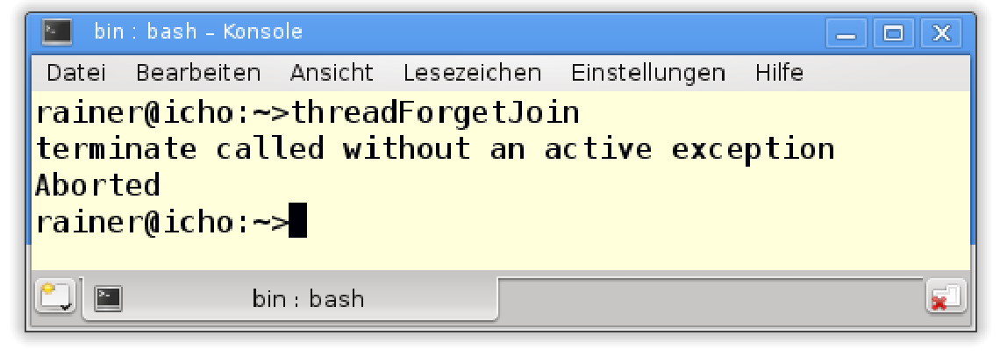
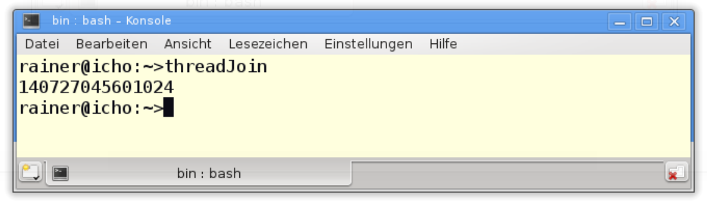
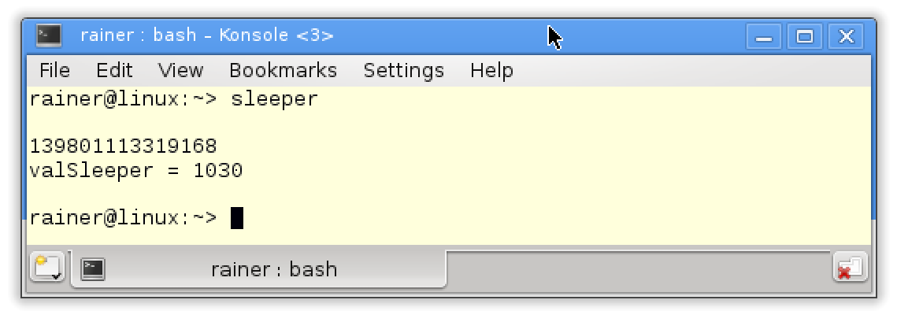
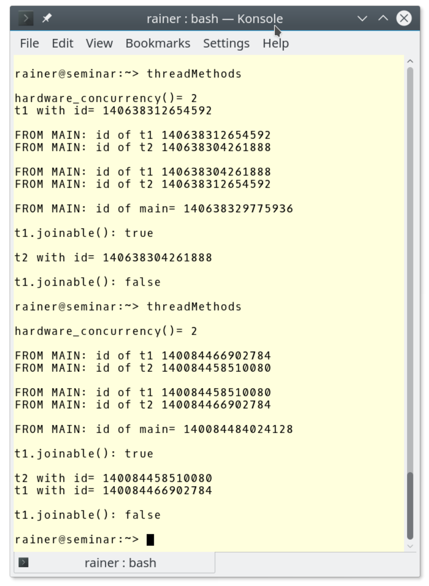

#線程

要用C++標準庫啟動一個線程，就必須包含`<thread>`頭文件。

## 創建線程

線程`std::thread`對象表示一個可執行單元。當工作包是可調用單元時，工作包可以立即啟動。線程對象是不可複製構造或複製賦值的，但可移動構造或移動賦值。

可調用單元是行為類似於函數。當然，它可以是一個函數，也可以是一個函數對象，或者一個Lambda表達式。通常忽略可調用單元的返回值。

介紹完理論知識之後，我們來動手寫個小例子。

```c++
// createThread.cpp

#include <iostream>
#include <thread>

void helloFunction() {
  std::cout << "Hello from a function." << std::endl;
}

class HelloFUncitonObject {
public:
  void operator()()const {
    std::cout << "Hello from a function object." << std::endl;
  }
};

int main() {
  
  std::cout << std::endl;

  std::thread t1(helloFunction);
  HelloFUncitonObject helloFunctionObject;
  std::thread t2(helloFunctionObject);

  std::thread t3([] {std::cout << "Hello from a lambda." << std::endl; });

  t1.join();
  t2.join();
  t3.join();

  std::cout << std::endl;

}
```

三個線程(`t1`、`t2`和`t3`)都會將信息寫入控制檯。線程`t2`的工作包是一個函數對象(第10 - 15行)，線程`t3`的工作包是一個Lambda函數(第26行)。第28 - 30行，主線程在等待子線程完成工作。

看一下輸出。


三個線程以任意順序執行，這三個輸出操作也可以交錯。

線程的創建者(例子中是主線程)負責管理線程的生命週期，所以讓我們來瞭解一下線程的生命週期。

##線程的生命週期

父母需要照顧自己的孩子，這個簡單的原則對線程的生命週期非常重要。下面的程序(子線程最後沒有匯入)，用來顯示線程ID。

```c++
#include <iostream>
#include <thread>

int main() {
  
  std::thread t([] {std::cout << std::this_thread::get_id() << std::endl; });
  
}
```

程序出現了錯誤，不過依舊打印了線程的ID。



那是什麼原因引起的異常呢？

**匯入和分離**

線程`t`的生命週期終止於可調用單元執行結束，而創建者有兩個選擇：

1. 等待線程完成: `t.join()`
2. 與創建線程解除關係:`t.detach() `

當後續代碼依賴於線程中調用單元的計算結果時，需要使用`t.join()`。`t.detach()`允許線程與創建線程分離執行，所以分離線程的生命週期與可執行文件的運行週期相關。通常，服務器上長時間運行的後臺服務，會使用分離線程。

如果`t.join()`和`t.detach()`都沒有執行，那麼線程`t`是可匯入的。可匯入線程的析構函數會拋出`std::terminate`異常，這也就是threadWithoutJoin.cpp程序產生異常的原因。如果在線程上多次調用`t.join()`或`t.detach()`，則會產生`std::system_error`異常。

解決問題的方法很簡單：使用`t.join()`。

```c++
#include <iostream>
#include <thread>

int main() {
  
  std::thread t([] {std::cout << std::this_thread::get_id() << std::endl; });
  
  t.join();
  
}
```

現在就能得到滿意的輸出了。



線程ID是`std::thread`唯一的標識符。

> **分離線程的挑戰**
>
> 當然，可以在最後一個程序中使用`t.detach()`代替`t.join()`。這樣，線程`t`不能匯入了；因此，它的析構函數沒有調用`std::terminate`函數。但現在有另一個問題：未定義行為。主程序可能在線程`t`前結束，所以由於主線程的生存期太短，無法顯示ID。詳細信息，可以參考變量的生存期。

>**Anthony Williams提出的scoped_thread**
>
>如果手動處理線程的生命週期可能有些麻煩，可以在包裝器中封裝`std::thread`。如果線程仍然是可匯入的，這個類應該在其析構函數中自動調用`t.join()`，也可以反過來調用`t.detach()`，但分離處理也有問題。
>
>Anthony Williams提出了這樣一個類，並在他的優秀著作[《C++ Concurrency in Action》](https://www.manning.com/books/c-plus-plus-concurrency-in-action)中介紹了它。他將包裝器稱為`scoped_thread`。`scoped_thread`在構造函數中獲取了線程對象，並檢查線程對象是否可匯入。如果傳遞給構造函數的線程對象不可匯入，則不需要`scoped_thread`。如果線程對象可匯入，則析構函數調用`t.join()`。因為，複製構造函數和複製賦值操作符被聲明為`delete`，所以`scoped_thread`的實例不能複製或賦值。
>
>```c++
>// scoped_thread.cpp
>
>#include <thread>
>#include <utility>
>
>class scoped_thread{
>std::thread t;
>public:
>	explicit scoped_thread(std::thread t_): t(std::move(t_)){
>		if (!t.joinable()) throw std::logic_error("No thread");
>	}
>	~scoped_thread(){
>		t.join();
>	}
>	scoped_thread(scoped_thread&)= delete;
>	scoped_thread& operator=(scoped_thread const &)= delete;
>};
>```

## 線程參數

和函數一樣，線程可以通過複製、移動或引用來獲取參數。`std::thread`是一個[可變參數模板]( http://en.cppreference.com/w/cpp/language/parameter_pack)，可以傳入任意數量的參數。

線程通過引用的方式獲取數據的情況，必須非常小心參數的生命週期和數據的共享方式。

### 複製或引用

我們來看一個代碼段。

```c++
std::string s{"C++11"}

std::thread t1([=]{ std::cout << s << std::endl; });
t1.join();

std::thread t2([&]{ std::cout << s << std::endl; });
t2.detach();
```

線程`t1`通過複製的方式獲取參數，線程`t2`通過引用的方式獲取參數。

> **線程的“引用”參數**
>
> 實際上，我騙了你。線程`t2`不是通過引用獲取其參數，而是Lambda表達式通過引用捕獲的參數。如果需要引用將參數傳遞給線程，則必須將其包裝在[引用包裝器](http://en.cppreference.com/w/cpp/utility/functional/reference_wrapper)中，使用[std::ref](http://en.cppreference.com/w/cpp/utility/functional/ref)就能完成這項任務。`std::ref`在`<functional>`頭文件中定義。
>
> ```c++
><functional>
> ...
> void transferMoney(int amount, Account& from, Account& to){
> ...
> }
> ...
> std::thread thr1(transferMoney, 50, std::ref(account1), std::ref(account2));
> ```
> 
> 線程`thr1`執行`transferMoney`函數。`transferMoney`的參數是使用引用的方式傳遞，所以線程`thr1`通過引用獲取`account1`和`account2`。

這幾行代碼中隱藏著什麼問題呢？線程`t2`通過引用獲取其字符串`s`，然後從其創建者的生命週期中分離。字符串`s`與創建者的生存期週期綁定，全局對象`std::cout`與主線程的生存週期綁定。因此，`std::cout`的生存週期可能比線程`t2`的生存週期短。現在，我們已經置身於未定義行為中了。

不相信？來看看未定義行為是什麼樣的。

```c++
// threadArguments.cpp

#include <chrono>
#include <iostream>
#include <thread>

class Sleeper {
public:
  Sleeper(int& i_) :i{ i_ } {};
  void operator()(int k) {
    for (unsigned int j = 0; j <= 5; ++j) {
      std::this_thread::sleep_for(std::chrono::microseconds(100));
      i += k;
    }
    std::cout << std::this_thread::get_id() << std::endl;
  }
private:
  int& i;
};


int main() {

  std::cout << std::endl;

  int valSleepr = 1000;
  std::thread t(Sleeper(valSleepr), 5);
  t.detach();
  std::cout << "valSleeper = " << valSleepr << std::endl;

  std::cout << std::endl;

}
```

問題在於：`valSleeper`在第29行時值是多少？`valSleeper`是一個全局變量。線程`t`獲得一個函數對象，該函數對象的實參為變量`valSleeper`和數字5(第27行)，而線程通過引用獲得`valSleeper`(第9行)，並與主線程(第28行)分離。接下來，執行函數對象的調用操作符(第10 - 16行)，它從0計數到5，在每100毫秒的中休眠，將`k`加到`i`上。最後，屏幕上顯示它的id。[Nach Adam Riese](https://de.wikipedia.org/wiki/Liste_gefl%C3%BCgelter_Worte/N#Nach_Adam_Riese) (德國成語：真是精準的計算呀！)，期望的結果應該是1000 + 6 * 5 = 1030。

然而，發生了什麼？結果為什麼完全不對？


這個輸出有兩個奇怪的地方：首先，`valSleeper`是1000；其次，ID沒有顯示。

這段程序至少有兩個錯誤：

1. `valSleeper`是線程共享的。這會導致數據競爭，因為線程可能同時讀寫`valSleeper`。
2. 主線程的生命週期很可能在子線程執行計算，或將其ID寫入`std::cout`之前結束。

這兩個問題都是構成競態條件，因為程序的結果取決於操作的交錯。構成競態的條件也是導致數據競爭的原因。

解決數據競爭也非常容易：使用鎖或原子保護`valSleeper`。為瞭解決`valSleeper`和`std::cout`的生命週期問題，必須匯入線程而不是分離它。

修改後的主函數體。

```c++
int main(){
  
  std::cout << std::endl;
  
  int valSleeper= 1000;
  std::thread t(Sleeper(valSleeper),5);
  t.join();
  std::cout << "valSleeper = " << valSleeper << std::endl;
  
  std::cout << std::endl;
  
}
```

現在，我們得到了正確的結果。當然，執行速度會變慢。



為了更完整的瞭解`std::thread`，接下來瞭解其成員函數。

###成員函數

下面是`std::thread`的接口，在一個簡潔的表中。更多詳情請訪問[cppreference.com](http://de.cppreference.com/w/cpp/thread/thread)。

|                  函數名稱                  |                    描述                    |
| :----------------------------------------: | :----------------------------------------: |
|                 `t.join()`                 |            等待，直到線程t完成             |
|                `t.detach()`                |        獨立於創建者執行創建的線程t         |
|               `t.joinable()`               |       如果線程t可以匯入，則返回true        |
| `t.get_id()`和`std::this_thread::get_id()` |                返回線程的ID                |
|   `std::thread::hardware_concurrency()`    |          返回可以併發運行的線程數          |
|  `std::this_thread::sleep_until(absTime)`  | 將線程t置為睡眠狀態，直到absTime時間點為止 |
|   `std::this_thread::sleep_for(relTime)`   | 將線程t置為睡眠狀態，直到休眠了relTime為止 |
|        `std::this_thread::yield()`         |           允許系統運行另一個線程           |
|     `t.swap(t2)`和`std::swap(t1, t2)`      |                交換線程對象                |

靜態函數`std::thread::hardware_concurrency`返回實現支持的併發線程數量，如果運行時無法確定數量，則返回0(這是根據C++標準編寫的)。`sleep_until`和`sleep_for`操作需要一個時間點或持續時間作為參數。

> **訪問特定系統的實現**
>
> 線程接口是底層實現的包裝器，可以使用`native_handle`來訪問(特定於系統的實現)。這個底層實現的句柄可用於線程、互斥對象和條件變量。

作為對本小節的總結，下面是在實踐中提到的一些方法。

```c++
// threadMethods.cpp

#include <iostream>
#include <thread>

using namespace std;

int main() {

  cout << boolalpha << endl;

  cout << "hardware_concurrency() = " << thread::hardware_concurrency() << endl;

  thread t1([] {cout << "t1 with id = " << this_thread::get_id() << endl; });
  thread t2([] {cout << "t2 with id = " << this_thread::get_id() << endl; });

  cout << endl;

  cout << "FROM MAIN: id of t1 " << t1.get_id() << endl;
  cout << "FROM MAIN: id of t2 " << t2.get_id() << endl;

  cout << endl;
  swap(t1, t2);

  cout << "FROM MAIN: id of t1 " << t1.get_id() << endl;
  cout << "FROM MAIN: id of t2 " << t2.get_id() << endl;

  cout << endl;

  cout << "FROM MAIN: id of main= " << this_thread::get_id() << endl;

  cout << endl;

  cout << "t1.joinable(): " << t1.joinable() << endl;

  cout << endl;

  t1.join();
  t2.join();

  cout << endl;

  cout << "t1.joinable(): " << t1.joinable() << endl;

  cout << endl;

}
```

與輸出相結合來看，應該很容易理解。



結果可能看起來有點奇怪，線程`t1`和`t2`(第14行和第15行)在不同時間點上運行。無法確定每個線程何時運行，只能確定在第38和39行`t1.join()`和`t2.join()`語句之前兩個線程是肯定運行了的。

線程共享的可變(非const)變量越多，程序的風險就越大。

