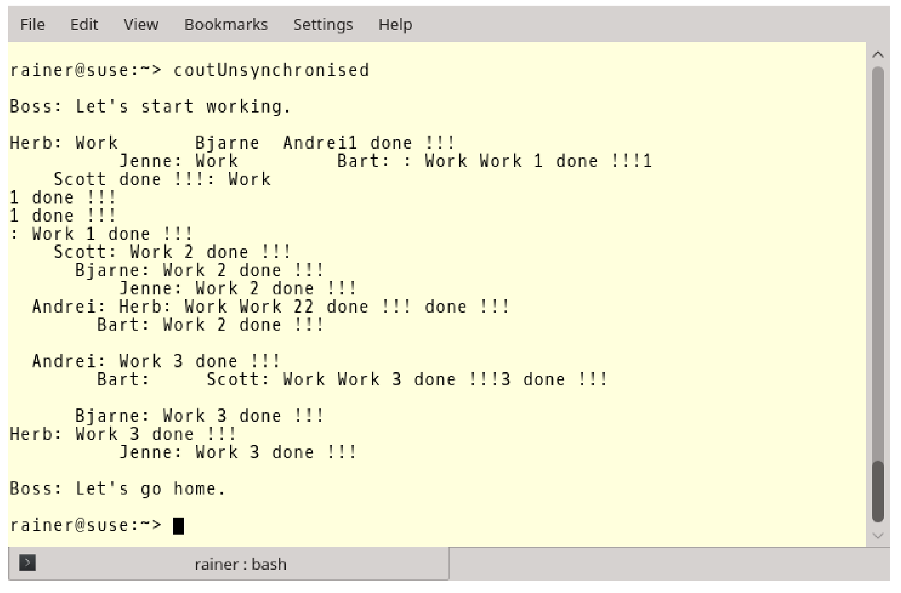
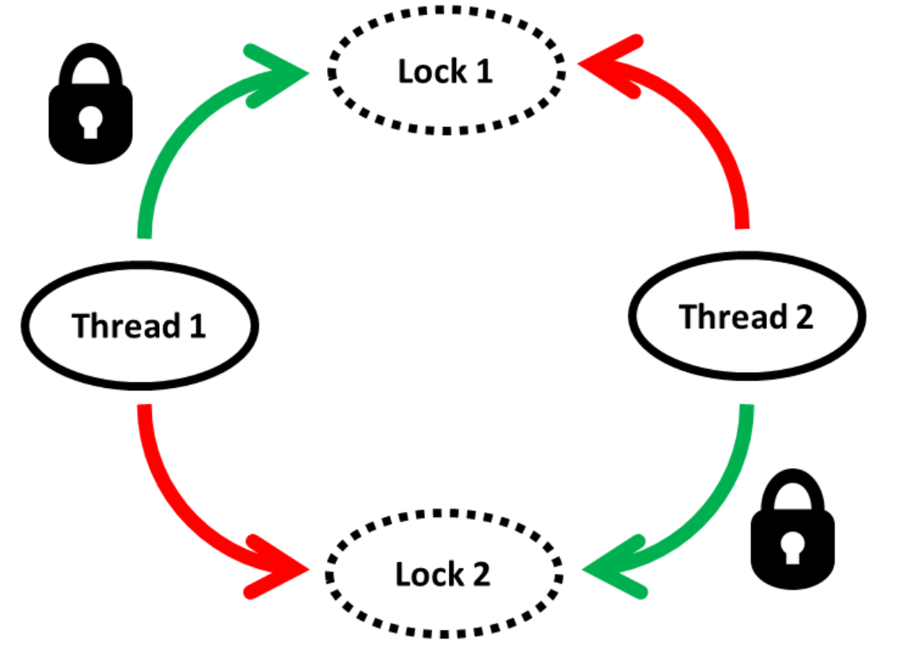

#共享數據

為了更清楚地說明這一點，就需要考慮共享數據的同步問題，因為數據競爭很容易在共享數據上發生。如果併發地對數據進行非同步讀寫訪問，則會產生未定義行為。

驗證併發、未同步的讀寫操作的最簡單方法，就是向`std::cout`寫入一些內容。

讓我們來看一下，使用不同步的方式進行`std::cout`打印輸出。

```c++
// coutUnsynchronised.cpp

#include <chrono>
#include <iostream>
#include <thread>

class Worker {
public:
  Worker(std::string n) :name(n) {}
  void operator()() {
    for (int i = 1; i <= 3; ++i) {
      // begin work
      std::this_thread::sleep_for(std::chrono::microseconds(200));
      // end work
      std::cout << name << ": " << "Work " << i << " done !!!" << std::endl;
    }
  }
private:
  std::string name;
};


int main() {
  
  std::cout << std::endl;

  std::cout << "Boss: Let's start working.\n\n";

  std::thread herb = std::thread(Worker("Herb"));
  std::thread andrei = std::thread(Worker(" Andrei"));
  std::thread scott = std::thread(Worker("  Scott"));
  std::thread bjarne = std::thread(Worker("   Bjarne"));
  std::thread bart = std::thread(Worker("    Bart"));
  std::thread jenne = std::thread(Worker("     Jenne"));


  herb.join();
  andrei.join();
  scott.join();
  bjarne.join();
  bart.join();
  jenne.join();

  std::cout << "\n" << "Boss: Let's go home." << std::endl;

  std::cout << std::endl;

}
```

該程序描述了一個工作流程：老闆有六個員工(第29 - 34行)，每個員工必須處理3個工作包，處理每個工作包需要200毫秒(第13行)。當員工完成了他的所有工作包時，他向老闆報告(第15行)。當老闆收到所有員工的報告，老闆就會把員工們送回家(第43行)。

這麼簡單的工作流程，輸出卻如此混亂。



讓輸出變清晰的最簡單解決方法，就是使用互斥量。

##互斥量

Mutex是互斥(**mut**ual **ex**clusion)的意思，它確保在任何時候只有一個線程可以訪問臨界區。

通過使用互斥量，工作流程的混亂變的和諧許多。

```c++
// coutSynchronised.cpp

#include <chrono>
#include <iostream>
#include <mutex>
#include <thread>

std::mutex coutMutex;

class Worker {
public:
  Worker(std::string n) :name(n) {}
  void operator()() {
    for (int i = 1; i <= 3; ++i) {
      // begin work
      std::this_thread::sleep_for(std::chrono::microseconds(200));
      // end work
      coutMutex.lock();
      std::cout << name << ": " << "Work " << i << " done !!!" << std::endl;
      coutMutex.unlock();
    }
  }
private:
  std::string name;
};


int main() {
  
  std::cout << std::endl;

  std::cout << "Boss: Let's start working.\n\n";

  std::thread herb = std::thread(Worker("Herb"));
  std::thread andrei = std::thread(Worker(" Andrei"));
  std::thread scott = std::thread(Worker("  Scott"));
  std::thread bjarne = std::thread(Worker("   Bjarne"));
  std::thread bart = std::thread(Worker("    Bart"));
  std::thread jenne = std::thread(Worker("     Jenne"));


  herb.join();
  andrei.join();
  scott.join();
  bjarne.join();
  bart.join();
  jenne.join();

  std::cout << "\n" << "Boss: Let's go home." << std::endl;

  std::cout << std::endl;

}
```

第8行中`coutMutex`保護了`std::cout`，第19行中的`lock()`和第21行中的`unlock()`調用，確保工作人員不會同時進行報告。


> **std:: cout是線程安全的**
>
> C++11標準中，`std::cout`不需要額外的保護，每個字符都是原子式書寫的。可能會有更多類似示例中的輸出語句交織在一起的情況，但這些只是視覺問題，而程序則是定義良好的。所有全局流對象都是線程安全的，並且插入和提取全局流對象(`std::cout`、`std::cin`、`std::cerr`和`std::clog`)也都是線程安全的。
>
> 更正式地說：寫入`std::cout`並不是數據競爭，而是一個競爭條件。這意味著輸出內容的情況，完全取決於交錯運行的線程。

C++11有4個不同的互斥量，可以遞歸地、暫時地鎖定，並且不受時間限制。

|     成員函數     | mutex | recursive_mutex | timed_mutex | recursive_timed_mutex |
| :--------------: | :---: | :-------------: | :---------: | :-------------------: |
|      m.lock      |  yes  |       yes       |     yes     |          yes          |
|    m.try_lock    |  yes  |       yes       |     yes     |          yes          |
|  m.try_lock_for  |       |                 |     yes     |          yes          |
| m.try_lock_until |       |                 |     yes     |          yes          |
|     m.unlock     |  yes  |       yes       |     yes     |          yes          |

遞歸互斥量允許同一個線程多次鎖定互斥鎖。互斥量保持鎖定狀態，直到解鎖次數與鎖定次數相等。可以鎖定互斥量的最大次數默認並未指定，當達到最大值時，會拋出[std::system_error]( http://en.cppreference.com/w/cpp/error/system_error)異常。

C++14中有`std::shared_timed_mutex`，C++17中有`std::shared_mutex`。`std::shared_mutex`和`std::shared_timed_mutex`非常相似，使用的鎖可以是互斥或共享的。另外，使用`std::shared_timed_mutex`可以指定時間點或時間段進行鎖定。

|        成員函數         | shared_timed_mutex | shared_mutex |
| :---------------------: | :----------------: | :----------: |
|         m.lock          |        yes         |     yes      |
|       m.try_lock        |        yes         |     yes      |
|     m.try_lock_for      |        yes         |              |
|    m.try_lock_until     |        yes         |              |
|        m.unlock         |        yes         |     yes      |
|      m.lock_shared      |        yes         |     yes      |
|    m.try_lock_shared    |        yes         |     yes      |
|  m.try_lock_shared_for  |        yes         |              |
| m.try_lock_shared_until |        yes         |              |
|     m.unlock_shared     |        yes         |     yes      |

`std::shared_timed_mutex(std::shared_mutex)`可以用來實現讀寫鎖，也就可以使用`std::shared_timed_mutex(std::shared_mutex)`進行獨佔或共享鎖定。如果將`std::shared_timed_mutex(std::shared_mutex)`放入`std::lock_guard`或`std::unique_lock`中，就可實現獨佔鎖；如果將`std::shared_timed_mutex(std::shared_lock)`放入`std::shared_lock`中，就可實現共享鎖。`m.try_lock_for(relTime)`和`m.try_lock_shared_for(relTime)`需要一個時間段；`m.try_lock_until(absTime)`和`m.try_lock_shared_until(absTime)`需要一個絕對的時間點。

`m.try_lock(m.try_lock_shared)`嘗試鎖定互斥量並立即返回。成功時，它返回true，否則返回false。相比之下，`m.try_lock_for(m.try_lock_shared_for)`和`m.try_lock_until(m.try_lock_shared_until)`也會嘗試上鎖，直到超時或完成鎖定，這裡應該使用穩定時鐘來限制時間(穩定的時鐘是不能調整的)。

不應該直接使用互斥量，應該將互斥量放入鎖中，下面解釋下原因。

### 互斥量的問題

互斥量的問題可以歸結為一個：死鎖。

> **死鎖**
>
> 兩個或兩個以上的個線程處於阻塞狀態，並且每個線程在釋放之前都要等待其他線程的釋放。

結果就是程序完全靜止。試圖獲取資源的線程，通常會永久的阻塞程序。形成這種困局很簡單，有興趣瞭解一下嗎?

### 異常和未知代碼

下面的代碼段有很多問題。

```c++
std::mutex m;
m.lock();
sharedVariable = getVar();
m.unlock();
```

問題如下：

1. 如果函數`getVar()`拋出異常，則互斥量`m`不會被釋放。
2. 永遠不要在持有鎖的時候調用函數。因為`m`不是遞歸互斥量，如果函數`getVar`試圖鎖定互斥量`m`，則程序具有未定義的行為。大多數情況下，未定義行為會導致死鎖。
3. 避免在持有鎖時調用函數。可能這個函數來自一個庫，但當這個函數發生改變，就有陷入僵局的可能。

程序需要的鎖越多，程序的風險就越高(非線性)。

### 不同順序鎖定的互斥鎖

下面是一個典型的死鎖場景，死鎖是按不同順序進行鎖定的。



線程1和線程2需要訪問兩個資源來完成它們的工作。當資源被兩個單獨的互斥體保護，並且以不同的順序被請求(線程1:鎖1，鎖2;線程2:鎖2，鎖1)時，線程交錯執行，線程1得到互斥鎖1，然後線程2得到互斥鎖2，從而程序進入停滯狀態。每個線程都想獲得另一個互斥鎖，但需要另一個線程釋放其需要的互斥鎖。“死亡擁抱”這個形容，很好地描述了這種狀態。

將這上圖轉換成代碼。

```c++
// deadlock.cpp

#include <iostream>
#include <chrono>
#include <mutex>
#include <thread>

struct CriticalData {
  std::mutex mut;
};

void deadLock(CriticalData& a, CriticalData& b) {

  a.mut.lock();
  std::cout << "get the first mutex" << std::endl;
  std::this_thread::sleep_for(std::chrono::microseconds(1));
  b.mut.lock();
  std::cout << "get the second mutext" << std::endl;
  // do something with a and b
  a.mut.unlock();
  b.mut.unlock();

}

int main() {

  CriticalData c1;
  CriticalData c2;

  std::thread t1([&] {deadLock(c1, c2); });
  std::thread t2([&] {deadLock(c2, c1); });

  t1.join();
  t2.join();

}
```

線程`t1`和`t2`調用死鎖函數(第12 - 23行)，向函數傳入了`c1`和`c2`(第27行和第28行)。由於需要保護`c1`和`c2`不受共享訪問的影響，它們在內部各持有一個互斥量(為了保持本例簡短，關鍵數據除了互斥量外沒有其他函數或成員)。

第16行中，約1毫秒的短睡眠就足以產生死鎖。


這時，只能按CTRL+C終止進程。

互斥量不能解決所有問題，但在很多情況下，鎖可以幫助我們解決這些問題。

### 鎖

鎖使用RAII方式處理它們的資源。鎖在構造函數中自動綁定互斥量，並在析構函數中釋放互斥量，這大大降低了死鎖的風險。

鎖有四種不同的形式：`std::lock_guard`用於簡單程序，`std::unique_lock`用於高級程序。從C++14開始就可以用`std::shared_lock`來實現讀寫鎖了。C++17中，添加了`std::scoped_lock`，它可以在原子操作中鎖定更多的互斥對象。

首先，來看簡單程序。

**std::lock_guard**

```c++
std::mutex m;
m.lock();
sharedVariable = getVar();
m.unlock();
```

互斥量`m`可以確保對`sharedVariable = getVar()`的訪問是有序的。有序指的是，每個線程按照某種順序，依次訪問臨界區。代碼很簡單，但是容易出現死鎖。如果臨界區拋出異常或者忘記解鎖互斥量，就會出現死鎖。使用`std::lock_guard`，可以很優雅的解決問題：

```c++
{
  std::mutex m,
  std::lock_guard<std::mutex> lockGuard(m);
  sharedVariable = getVar();
}
```

代碼很簡單，但是前後的花括號是什麼呢？`std::lock_guard`的生存週期受其作用域的限制，作用域由[花括號](http://en.cppreference.com/w/cpp/language/scope#Block_scope)構成。生命週期在達到右花括號時結束，`std::lock_guard`析構函數被調用，並且互斥量被釋放。這都是自動發生的，如果`sharedVariable = getVar()`中的`getVar()`拋出異常，釋放過程也會自動發生。函數作用域和循環作用域，也會限制實例對象的生命週期。

**std::scoped_lock**

C++17中，添加了`std::scoped_lock`。與`std::lock_guard`非常相似，但可以原子地鎖定任意數量的互斥對象。

1. 如果`std::scoped_lock`調用一個互斥量，它的行為就類似於`std::lock_guard`，並鎖定互斥量`m`: `m.lock`。如果`std::scoped_lock`被多個互斥對象調用`std::scoped_lock(mutextypes&…)`，則使用`std::lock(m…)`函數進行鎖定操作。
2. 如果當前線程已經擁有了互斥量，但這個互斥量不可遞歸，那麼這個行為就是未定義的，很有可能出現死鎖。
3. 只需要獲得互斥量的所有權，而不需要鎖定它們。這種情況下，必須將標誌`std::adopt_lock_t`提供給構造函數：`std::scoped_lock(std::adopt_lock_t, mutextypes&…m)`。

使用`std::scoped_lock`，可以優雅地解決之前的死鎖問題。下一節中，將討論如何杜絕死鎖。

**std::unique_lock**

`std::unique_lock`比`std::lock_guard`更強大，也更重量級。

除了包含`std::lock_guard`提供的功能之外，`std::unique_lock`還允許：

* 創建無需互斥量的鎖
* 不鎖定互斥量的情況下創建鎖
* 顯式地/重複地設置或釋放關聯的互斥鎖量
* 遞歸鎖定互斥量
* 移動互斥量
* 嘗試鎖定互斥量
* 延遲鎖定關聯的互斥量

下表展示了`std::unique_lock lk`的成員函數：

|               成員函數               |            功能描述            |
| :----------------------------------: | :----------------------------: |
|             `lk.lock()`              |         鎖定相關互斥量         |
|           `lk.try_lock()`            |       嘗試鎖定相關互斥量       |
|      `lk.try_lock_for(relTime)`      |       嘗試鎖定相關互斥量       |
|     `lk.try_lock_until(absTime)`     |       嘗試鎖定相關互斥量       |
|            `lk.unlock()`             |         解鎖相關互斥量         |
|            `lk.release()`            | 釋放互斥量，互斥量保持鎖定狀態 |
| `lk.swap(lk2)`和`std::swap(lk, lk2)` |             交換鎖             |
|             `lk.mutex()`             |    返回指向相關互斥量的指針    |
|     `lk.owns_lock()`和bool操作符     |  檢查鎖`lk`是否有鎖住的互斥量  |

`try_lock_for(relTime)`需要傳入一個時間段，`try_lock_until(absTime)`需要傳入一個絕對的時間點。`lk.try_lock_for(lk.try_lock_until)`會調用關聯的互斥量`mut`的成員函數`mut.try_lock_for(mut.try_lock_until) `。相關的互斥量需要支持定時阻塞，這就需要使用穩定的時鐘來限制時間。

`lk.try_lock`嘗試鎖定互斥鎖並立即返回。成功時返回true，否則返回false。相反，`lk.try_lock_for`和`lk.try_lock_until`則會讓鎖`lk`阻塞，直到超時或獲得鎖為止。如果沒有關聯的互斥鎖，或者這個互斥鎖已經被`std::unique_lock`鎖定，那麼`lk.try_lock`、`lk.try_lock_for`和`lk.try_lock_for`則拋出`std::system_error`異常。

`lk.release()`返回互斥量，必須手動對其進行解鎖。

`std::unique_lock`在原子步驟中可以鎖定多個互斥對象。因此，可以通過以不同的順序鎖定互斥量來避免死鎖。還記得在互斥量中出現的死鎖嗎?

```c++
// deadlock.cpp

#include <iostream>
#include <chrono>
#include <mutex>
#include <thread>

struct CriticalData {
  std::mutex mut;
};

void deadLock(CriticalData& a, CriticalData& b) {

  a.mut.lock();
  std::cout << "get the first mutex" << std::endl;
  std::this_thread::sleep_for(std::chrono::microseconds(1));
  b.mut.lock();
  std::cout << "get the second mutext" << std::endl;
  // do something with a and b
  a.mut.unlock();
  b.mut.unlock();

}

int main() {

  CriticalData c1;
  CriticalData c2;

  std::thread t1([&] {deadLock(c1, c2); });
  std::thread t2([&] {deadLock(c2, c1); });

  t1.join();
  t2.join();

}
```

讓我們來解決死鎖問題。死鎖必須原子地鎖定互斥對象，也正是下面的程序中所展示的。

```c++
// deadlockResolved.cpp

#include <iostream>
#include <chrono>
#include <mutex>
#include <thread>

using namespace std;

struct CriticalData {
  mutex mut;
};

void deadLock(CriticalData& a, CriticalData& b) {

  unique_lock<mutex> guard1(a.mut, defer_lock);
  cout << "Thread: " << this_thread::get_id() << " first mutex" << endl;

  this_thread::sleep_for(chrono::milliseconds(1));

  unique_lock<mutex> guard2(b.mut, defer_lock);
  cout << " Thread: " << this_thread::get_id() << " second mutex" << endl;

  cout << "  Thread: " << this_thread::get_id() << " get both mutex" << endl;
  lock(guard1, guard2);
  // do something with a and b
}

int main() {

  cout << endl;

  CriticalData c1;
  CriticalData c2;

  thread t1([&] {deadLock(c1, c2); });
  thread t2([&] {deadLock(c2, c1); });

  t1.join();
  t2.join();

  cout << endl;

}
```

如果使用`std::defer_lock`對`std::unique_lock`進行構造，則底層的互斥量不會自動鎖定。此時(第16行和第21行)，`std::unique_lock`就是互斥量的所有者。由於`std::lock`是可變參數模板，鎖操作可以原子的執行(第25行)。

> **使用std::lock進行原子鎖定**
>
> `std::lock`可以在原子的鎖定互斥對象。`std::lock`是一個可變參數模板，因此可以接受任意數量的參數。`std::lock`嘗試使用避免死鎖的算法，在一個原子步驟獲得所有鎖。互斥量會鎖定一系列操作，比如：`lock`、`try_lock`和`unlock`。如果對鎖或解鎖的調用異常，則解鎖操作會在異常重新拋出之前執行。

本例中，`std::unique_lock`管理資源的生存期，`std::lock`鎖定關聯的互斥量，也可以反過來。第一步中鎖住互斥量，第二步中`std::unique_lock`管理資源的生命週期。下面是第二種方法的例子：

```c++
std::lock(a.mut, b.mut);
std::lock_guard<std::mutex> guard1(a.mut, std::adopt_lock);
std::lock_guard<std::mutex> guard2(b.mut, std::adopt_lock);
```

這兩個方式都能解決死鎖。


> **使用std::scoped_lock解決死鎖**
>
> C++17中解決死鎖非常容易。有了`std::scoped_lock`幫助，可以原子地鎖定任意數量的互斥。只需使用`std::scoped_lock`，就能解決所有問題。下面是修改後的死鎖函數：
>
> ```c++
>// deadlockResolvedScopedLock.cpp
> ...
> void deadLock(CriticalData& a, CriticalData& b) {
> cout << "Thread: " << this_thread::get_id() << " first mutex" << endl;
> this_thread::sleep_for(chrono::milliseconds(1));
>   cout << " Thread: " << this_thread::get_id() << " second mutex" << endl;
>   cout << " Thread: " << this_thread::get_id() << " get both mutex" << endl;
>   
>   std::scoped_lock(a.mut, b.mut);
> // do something with a and b
>   }
>   
> ...
> ```

**std::shared_lock**

C++14中添加了`std::shared_lock`。

`std::shared_lock`與`std::unique_lock`的接口相同，但與`std::shared_timed_mutex`或`std::shared_mutex`一起使用時，行為會有所不同。許多線程可以共享一個`std::shared_timed_mutex (std::shared_mutex)`，從而實現讀寫鎖。讀寫器鎖的思想非常簡單，而且非常有用。執行讀操作的線程可以同時訪問臨界區，但是隻允許一個線程寫。

讀寫鎖並不能解決最根本的問題——線程爭著訪問同一個關鍵區域。

電話本就是使用讀寫鎖的典型例子。通常，許多人想要查詢電話號碼，但只有少數人想要更改。讓我們看一個例子：

```c++
// readerWriterLock.cpp

#include <iostream>
#include <map>
#include <shared_mutex>
#include <string>
#include <thread>

std::map<std::string, int> teleBook{ {"Dijkstra", 1972}, {"Scott", 1976},
                                                          {"Ritchie", 1983} };

std::shared_timed_mutex teleBookMutex;

void addToTeleBook(const std::string& na, int tele) {
  std::lock_guard<std::shared_timed_mutex> writerLock(teleBookMutex);
  std::cout << "\nSTARTING UPDATE " << na;
  std::this_thread::sleep_for(std::chrono::milliseconds(500));
  teleBook[na] = tele;
  std::cout << " ... ENDING UPDATE " << na << std::endl;
}

void printNumber(const std::string& na) {
  std::shared_lock<std::shared_timed_mutex> readerLock(teleBookMutex);
  std::cout << na << ": " << teleBook[na];
}

int main() {

  std::cout << std::endl;

  std::thread reader1([] {printNumber("Scott"); });
  std::thread reader2([] {printNumber("Ritchie"); });
  std::thread w1([] {addToTeleBook("Scott",1968); });
  std::thread reader3([] {printNumber("Dijkstra"); });
  std::thread reader4([] {printNumber("Scott"); });
  std::thread w2([] {addToTeleBook("Bjarne", 1965); });
  std::thread reader5([] {printNumber("Scott"); });
  std::thread reader6([] {printNumber("Ritchie"); });
  std::thread reader7([] {printNumber("Scott"); });
  std::thread reader8([] {printNumber("Bjarne"); });

  reader1.join();
  reader2.join();
  reader3.join();
  reader4.join();
  reader5.join();
  reader6.join();
  reader7.join();
  reader8.join();
  w1.join();
  w2.join();

  std::cout << std::endl;

  std::cout << "\nThe new telephone book" << std::endl;
  for (auto teleIt : teleBook) {
    std::cout << teleIt.first << ": " << teleIt.second << std::endl;
  }

  std::cout << std::endl;

}
```

第9行中的電話簿是共享變量，必須對其進行保護。八個線程要查詢電話簿，兩個線程想要修改它(第31 - 40行)。為了同時訪問電話簿，讀取線程使用`std::shared_lock<std::shared_timed_mutex>`(第23行)。寫線程需要以獨佔的方式訪問臨界區，第15行中的`std::lock_guard<std::shared_timed_mutex>`具有獨佔性。最後，程序顯示了更新後的電話簿(第55 - 58行)。


屏幕截圖顯示，讀線程的輸出是重疊的，而寫線程是一個接一個地執行。這就意味著，讀取操作應該是同時執行的。

這很容易讓“電話簿”有未定義行為。

### 未定義行為

程序有未定義行為。更準確地說，它有一個數據競爭。啊哈！？在繼續之前，停下來想幾秒鐘。

數據競爭的特徵是，至少有兩個線程同時訪問共享變量，並且其中至少有一個線程是寫線程，這種情況很可能在程序執行時發生。使用索引操作符讀取容器中的值，並可以修改它。如果元素在容器中不存在，就會發生這種情況。如果在電話簿中沒有找到“Bjarne”，則從讀訪問中創建一對`(“Bjarne”，0)`。可以通過在第40行前面打印Bjarne的數據，強制數據競爭。

可以看到的是，Bjarne的值是0。


修復這個問題的最直接的方法是使用`printNumber`函數中的讀取操作:

```c++
// readerWriterLocksResolved.cpp

...

void printNumber(const std::string& na){
  std::shared_lock<std::shared_timed_mutex> readerLock(teleBookMutex);
  auto searchEntry = teleBook.find(na);
  if(searchEntry != teleBook.end()){
    std::cout << searchEntry->first << ": " << searchEntry->second << std::endl;
  }
  else{
    std::cout << na << " not found!" << std::endl;
  }
}
...
```

如果電話簿裡沒有相應鍵值，就把鍵值寫下來，並且向控制檯輸出“找不到!”。


第二個程序執行的輸出中，可以看到Bjarne的信息沒有找到。第一個程序執行中，首先執行了`addToTeleBook`，所以Bjarne被找到了。

### 線程安全的初始化

如果變量從未修改過，那麼就不需要鎖或原子變量來進行同步，只需確保以線程安全的方式初始化就可以了。

C++中有三種以線程安全初始化變量的方法：

* 常量表達式
* `std::call_once`與`std::once_flag`結合的方式
* 作用域的靜態變量

> **主線程中的安全初始化**
>
> 以線程安全的方式初始化變量的最簡單方法，是在創建任何子線程之前在主線程中初始化變量。

**常數表達式**

常量表達式，是編譯器可以在編譯時計算的表達式，隱式線程安全的。將關鍵字`constexpr`放在變量前面，會使該變量成為常量表達式。常量表達式必須初始化。

```c++
constexpr double pi = 3.14;
```

此外，用戶定義的類型也可以是常量表達式。不過，必須滿足一些條件才能在編譯時初始化：

* 不能有虛方法或虛基類
* 構造函數必須為空，且本身為常量表達式
* 必須初始化每個基類和每個非靜態成員
* 成員函數在編譯時應該是可調用的，必須是常量表達式

`MyDouble`的實例滿足所有這些需求，因此可以在編譯時實例化。所以，這個實例化是線程安全的。

```c++
// constexpr.cpp

#include <iostream>

class MyDouble {
private:
  double myVal1;
  double myVal2;
public:
  constexpr MyDouble(double v1, double v2):myVal1(v1),myVal2(v2){}
  constexpr double getSum() const { return myVal1 + myVal2; }
};

int main() {

  constexpr double myStatVal = 2.0;
  constexpr MyDouble myStatic(10.5, myStatVal);
  constexpr double sumStat = myStatic.getSum();

}
```

**std::call_once和std::once_flag**

通過使用`std::call_once`函數，可以註冊一個可調用單元。`std::once_flag`確保已註冊的函數只調用一次。可以通過相同的`std::once_flag`註冊其他函數，只能調用註冊函數組中的一個函數。

`std::call_once`遵循以下規則:

*  只執行其中一個函數的一次，未定義選擇哪個函數執行。所選函數與`std::call_once`在同一個線程中執行。
* 上述所選函數的執行成功完成之前，不返回任何調用。
* 如果函數異常退出，則將其傳播到調用處。然後，執行另一個函數。

這個短例演示了`std::call_once`和`std::once_flag`的應用(都在頭文件`<mutex>`中聲明)。

```c++
// callOnce.cpp

#include <iostream>
#include <thread>
#include <mutex>

std::once_flag onceFlag;

void do_once() {
  std::call_once(onceFlag, [] {std::cout << "Only once." << std::endl; });
}

void do_once2() {
  std::call_once(onceFlag, [] {std::cout << "Only once2." << std::endl; });
}

int main() {
  
  std::cout << std::endl;

  std::thread t1(do_once);
  std::thread t2(do_once);
  std::thread t3(do_once2);
  std::thread t4(do_once2);

  t1.join();
  t2.join();
  t3.join();
  t4.join();

  std::cout << std::endl;

}
```

程序從四個線程開始(第21 - 24行)。其中兩個調用`do_once`，另兩個調用`do_once2`。預期的結果是“Only once”或“Only once2”只顯示一次。


單例模式保證只創建類的一個實例，這在多線程環境中是一個具有挑戰性的任務。由於`std::call_once`和`std::once_flag`的存在，實現這樣的功能就非常容易了。

現在，單例以線程安全的方式初始化。

```c++
// singletonCallOnce.cpp

#include <iostream>
#include <mutex>

using namespace std;

class MySingleton {

private:
  static once_flag initInstanceFlag;
  static MySingleton* instance;
  MySingleton() = default;
  ~MySingleton() = default;

public:
  MySingleton(const MySingleton&) = delete;
  MySingleton& operator=(const MySingleton&) = delete;

  static MySingleton* getInstance() {
    call_once(initInstanceFlag, MySingleton::initSingleton);
    return instance;
  }

  static void initSingleton() {
    instance = new MySingleton();
  }
};

MySingleton* MySingleton::instance = nullptr;
once_flag MySingleton::initInstanceFlag;

int main() {

  cout << endl;

  cout << "MySingleton::getInstance(): " << MySingleton::getInstance() << endl;
  cout << "MySingleton::getInstance(): " << MySingleton::getInstance() << endl;

  cout << endl;

}
```

靜態變量`initInstanceFlag`在第11行聲明，在第31行初始化。靜態方法`getInstance`(第20 - 23行)使用`initInstanceFlag`標誌，來確保靜態方法`initSingleton`(第25 - 27行)只執行一次。

> **default和delete修飾符**
>
> 可以使用關鍵字`default`向編譯器申請函數實現，編譯器可以創建並實現它們。
>
> 用`delete`修飾一個成員函數的話，則該函數不可用，因此不能被調用。如果嘗試使用它們，將得到一個編譯時錯誤。這裡有[default和delete](https://isocpp.org/wiki/faq/cpp11-language-classes)的詳細信息。

`MySingleton::getIstance() `函數顯示了單例的地址。


### 有作用域的靜態變量

具有作用域的靜態變量只創建一次，並且是惰性的，惰性意味著它們只在使用時創建。這一特點是基於Meyers單例的基礎，以[Scott Meyers](https://en.wikipedia.org/wiki/Scott_Meyers)命名，這是迄今為止C++中單例模式最優雅的實現。C++11中，帶有作用域的靜態變量有一個額外的特點，可以以線程安全的方式初始化。

下面是線程安全的Meyers單例模式。

```c++
// meyersSingleton.cpp

class MySingleton {
public:
  static MySingleton& getInstance() {
    static MySingleton instance;
    return instance;
  }

private:
  MySingleton();
  ~MySingleton();
  MySingleton(const MySingleton&) = delete;
  MySingleton& operator=(const MySingleton&) = delete;
  
};

MySingleton::MySingleton()= default;
MySingleton::~MySingleton()= default;


int main(){
  
  MySingleton::getInstance();
  
}
```

> **編譯器對靜態變量的支持**
>
> 如果在併發環境中使用Meyers單例，請確保編譯器對於C++11的支持。開發者經常依賴於C++11的靜態變量語義，但是有時他們的編譯器不支持這項特性，結果可能會創建多個單例實例。

討論了這麼多，而在`thread_local`中就沒有共享變量的問題了。

接下來，我們來瞭解一下`thread_local`。