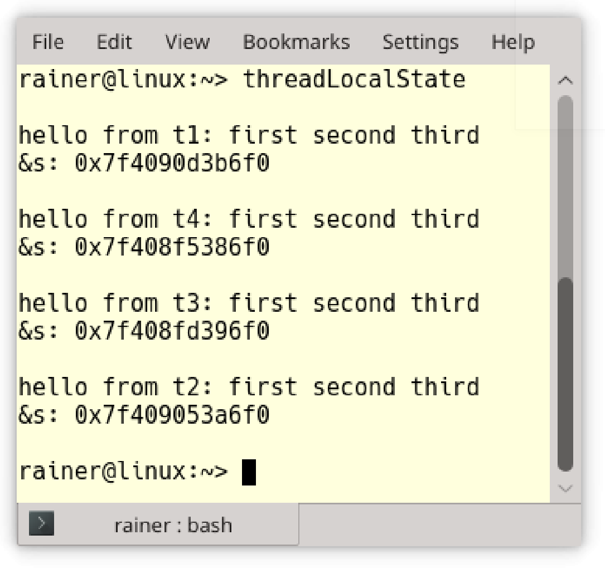

# 線程-本地數據

線程-本地數據(也稱為線程-本地存儲)是為每個線程單獨創建的，其行為類似於靜態數據。在命名空間範圍內，或作為靜態類成員的線程局部變量，是在第一次使用之前創建，而在函數中聲明的線程局部變量是在第一次使用時創建，並且線程-本地數據只屬於線程。

```c++
// threadLocal.cpp

#include <iostream>
#include <string>
#include <mutex>
#include <thread>

std::mutex coutMutex;

thread_local std::string s("hello from ");

void addThreadLocal(std::string const& s2) {
  
  s += s2;
  // protect std::cout
  std::lock_guard<std::mutex> guard(coutMutex);
  std::cout << s << std::endl;
  std::cout << "&s: " << &s << std::endl;
  std::cout << std::endl;

}

int main() {

  std::cout << std::endl;

  std::thread t1(addThreadLocal, "t1");
  std::thread t2(addThreadLocal, "t2");
  std::thread t3(addThreadLocal, "t3");
  std::thread t4(addThreadLocal, "t4");

  t1.join();
  t2.join();
  t3.join();
  t4.join();

}
```

通過在第10行中使用關鍵字`thread_local`，可以創建線程本地字符串`s`。線程`t1` - `t4`(第27 - 30行)使用`addThreadLocal`函數(第12 - 21行)作為工作包。線程分別獲取字符串`t1`到`t4`作為參數，並添加到線程本地字符串`s`中。另外，`addThreadLocal`在第18行會打印`s`的地址。


程序的輸出在第17行顯示內容，在第18行顯示地址。要為字符串`s`創建線程本地字符串：首先，每個輸出顯示新的線程本地字符串；其次，每個字符串都有不同的地址。

我經常在研討會上討論：靜態變量、`thread_local`變量和局部變量之間的區別是什麼？靜態變量與主線程的生命週期相同，`thread_local`變量與其所在線程的生存週期相同，而局部變量與創建作用域的生存週期相同。為了說明我的觀點，來看一下代碼。

```c++
// threadLocalState.cpp

#include <iostream>
#include <string>
#include <mutex>
#include <thread>

std::mutex coutMutex;

thread_local std::string s("hello from ");

void first() {
  s += "first ";
}

void second() {
  s += "second ";
}

void third() {
  s += "third";
}

void addThreadLocal(std::string const& s2) {
  
  s += s2;

  first();
  second();
  third();
  // protect std::cout
  std::lock_guard<std::mutex> guard(coutMutex);
  std::cout << s << std::endl;
  std::cout << "&s: " << &s << std::endl;
  std::cout << std::endl;

}

int main() {

  std::cout << std::endl;

  std::thread t1(addThreadLocal, "t1: ");
  std::thread t2(addThreadLocal, "t2: ");
  std::thread t3(addThreadLocal, "t3: ");
  std::thread t4(addThreadLocal, "t4: ");

  t1.join();
  t2.join();
  t3.join();
  t4.join();

}
```

代碼中，函數`addThreadLocal `(第24行)先調用函數`first` ，然後調用`second`，再調用`third` 。每個函數都使用`thread_local`字符串`s`來添加它的函數名。這種變化的關鍵之處在於，字符串`s`在函數`first`、`second`和`third`中操作時，處於一種本地數據的狀態(第28 - 30行)，並且從輸出表明字符串是獨立存在的。



> **單線程到多線程**
>
> 線程本地數據有助於將單線程程序移植成多線程程序。如果全局變量是線程局部的，則可以保證每個線程都得到其數據的副本，從而避免數據競爭。

與線程-本地數據相比，條件變量的使用門檻更高。

