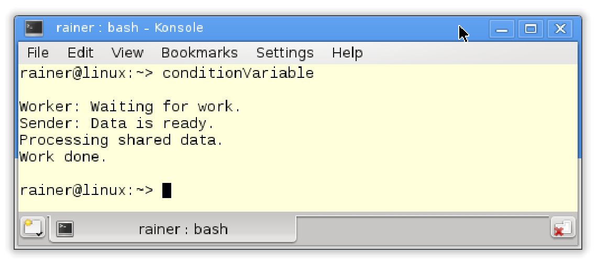

# 條件變量

條件變量通過消息對線程進行同步(需要包含`<condition_variable>`頭文件)，一個線程作為發送方，另一個線程作為接收方，接收方等待來自發送方的通知。條件變量的典型用例：發送方-接收方或生產者-消費者模式。

條件變量`cv`的成員函數

|              成員函數               |                         函數描述                         |
| :---------------------------------: | :------------------------------------------------------: |
|          `cv.notify_one()`          |                   通知一個等待中的線程                   |
|          `cv.notify_all()`          |                   通知所有等待中的線程                   |
|        `cv.wait(lock, ...)`         |            持有`std::unique_lock`，並等待通知            |
|  `cv.wait_for(lock, relTime, ...)`  |    持有`std::unique_lock`，並在給定的時間段內等待通知    |
| `cv.wait_until(lock, absTime, ...)` | 持有`std::unique_lock`的同時，並在給定的時間點前等待通知 |
|        `cv.native_handle()`         |                  返回條件變量的底層句柄                  |

`cv.notify_one`和`cv.notify_all`相比較，`cv.notify_all`會通知所有正在等待的線程，`cv.notify_one`只通知一個正在等待的線程，其他條件變量依舊保持在等待狀態。介紹條件變量的詳細信息之前，來看個示例。

```c++
// conditionVariable.cpp

#include <iostream>
#include <condition_variable>
#include <mutex>
#include <thread>

std::mutex mutex_;
std::condition_variable condVar;

bool dataReady{ false };

void doTheWork() {
  std::cout << "Processing shared data." << std::endl;
}

void waitingForWork() {
  std::cout << "Worker: Waiting for work." << std::endl;
  std::unique_lock<std::mutex> lck(mutex_);
  condVar.wait(lck, [] {return dataReady; });
  doTheWork();
  std::cout << "Work done." << std::endl;
}

void setDataReady() {
  {
    std::lock_guard<std::mutex> lck(mutex_);
    dataReady = true;
  }
  std::cout << "Sender: Data is ready." << std::endl;
  condVar.notify_one();
}

int main() {

  std::cout << std::endl;

  std::thread t1(waitingForWork);
  std::thread t2(setDataReady);

  t1.join();
  t2.join();

  std::cout << std::endl;

}
```

該程序有兩個子線程：`t1`和`t2`。第38行和第39行中，線程得到工作包`waitingForWork`和`setDataRead`。`setDataReady`使用條件變量`condVar`通知其他線程準備工作已經完成：`condVar.notify_one()`。當持有鎖時，線程`t1`等待它的通知：`condVar.wait(lck, []{ return dataReady; }) `。發送方和接收方需要一個鎖，對於發送方，`std::lock_guard`就足夠了，因為`lock`和`unlock`只調用一次；對於接收方來說，`std::unique_lock`是必需的，因為它需要鎖定和解鎖互斥鎖。

程序的輸出如下：



> **std::condition_variable_any**
>
> `std::condition_variable`只能等待類型為`std::unique_lock<mutex>`的對象，但是`std::condition_variable_any`可以等待符合[BasicLockable]( http://en.cppreference.com/w/cpp/concept/BasicLockable)原則的鎖類型。`std::condition_variable_any`與`std::condition_variable`支持的接口相同。

## 謂詞

在沒有謂詞的情況下也可以調用`wait`，那麼讀者朋友應該很想知道，為什麼調用`wait`需要謂詞。

等待使用謂詞與否都是可以的，先來看個例子。

```c++
// conditionVariableBlock.cpp

#include <iostream>
#include <condition_variable>
#include <mutex>
#include <thread>

std::mutex mutex_;
std::condition_variable condVar;

void waitingForWork() {

  std::cout << "Worker: Waiting for work." << std::endl;

  std::unique_lock<std::mutex> lck(mutex_);
  condVar.wait(lck);
  // do the work
  std::cout << "Work done." << std::endl;

}

void setDataReady() {

  std::cout << "Sender: Data is ready." << std::endl;
  condVar.notify_one();

}

int main() {

  std::cout << std::endl;

  std::thread t1(setDataReady);
  std::thread t2(waitingForWork);

  t1.join();
  t2.join();

  std::cout << std::endl;

}
```

程序的第一次運行正常，但第二次阻塞是因為通知(第25行)發生在線程`t2`(第34行)進入等待狀態(第16行)之前。


現在就很清楚了，謂詞是無狀態條件變量，所以等待過程中總是檢查謂詞。條件變量有兩個已知有害現象：未喚醒和偽喚醒。

## 未喚醒和偽喚醒

**未喚醒**

該現象是發送方在接收方到達其等待狀態之前發送通知，結果是通知丟失了。C++標準將條件變量描述為同步機制：“條件變量類是同步原語，可用於阻塞一個線程，或同時阻塞多個線程……”所以通知丟失了，接收者就會持續等待……

**偽喚醒**

還有一種情況，就會沒有發通知，但接收方會被喚醒。使用[POSIX Threads](https://en.wikipedia.org/wiki/POSIX_Threads)和 [Windows API](https://en.wikipedia.org/wiki/Windows_API)時，都會出現這樣的現象。偽喚醒的真相，很可能是本來就沒有處於休眠狀態。這意味著，在被喚醒的線程有機會運行之前，另一個線程早就等候多時了。

## 等待線程的工作流程

等待線程的工作流程相當複雜。

下面是來自前面示例conditionVariable.cpp的19和20行。

```c++
std::unique_lock<std::mutex> lck(mutex_);
condVar.wait(lck, []{ return dataReady; });
```

上面兩行與下面四行等價：

```c++
std::unique_lock<std::mutex> lck(mutex_);
while ( ![]{ return dataReady; }() {
	condVar.wait(lck);
}
```

首先，必須區分`std::unique_lock<std::mutex> lck(mutex_)`的第一次調用與條件變量的通知：`condVar.wait(lck)`。

* `std::unique_lock<std::mutex> lck(mutex_)` : 初始化階段，線程就將互斥量鎖定，並對謂詞函數` []{ return dataReady;} `進行檢查。
  *  謂詞返回值：
    * true : 線程繼續等待。
    * false : `condVar.wait()`解鎖互斥量，並將線程置為等待(阻塞)狀態。
* `condVar.wait(lck)` : 如果`condition_variable condVar`處於等待狀態，並獲得通知或偽喚醒處於運行狀態，則執行以下步驟：
  * 線程解除阻塞，重新獲得互斥鎖。
  * 檢查謂詞函數。
  * 當謂詞函數返回值為：
    * true : 線程繼續工作。
    * false : `condVar.wait()`解鎖互斥量，並將線程置為等待(阻塞)狀態。

即使共享變量是原子的，也必須在互斥鎖保護下進行修改，以便將正確地內容告知等待的線程。

> **使用互斥鎖來保護共享變量**
>
> 即使將`dataReady`設置為原子變量，也必須在互斥鎖的保護下進行修改；如果沒有，對於等待線程來說`dataReady`的內容就可能是錯的，此競爭條件可能導致死鎖。讓我們再次查看下等待的工作流，並假設`deadReady`是一個原子變量，在不受互斥量`mutex_`保護時進行修改的情況。
>
> ```c++
>std::unique_lock<std::mutex> lck(mutex_);
> while ( ![]{ return dataReady.load(); }() {
> // time window
> condVar.wait(lck);
>   }
>   ```
> 
> 假設在條件變量`condVar`，在不處於等待狀態時發送通知。這樣，線程執行到第2行和第4行之間時(參見注釋時間窗口)會丟失通知。之後，線程返回到等待狀態，可能會永遠休眠。
>
> 如果`dataReady`被互斥鎖保護，就不會發生這種情況。由於與互斥鎖能夠同步線程，只有在接收線程處於等待狀態的情況下才會發送通知。

大多數用例中，可以使用任務，用簡單的方式同步線程。“任務-通知”章節中，將條件變量和任務進行了對比。