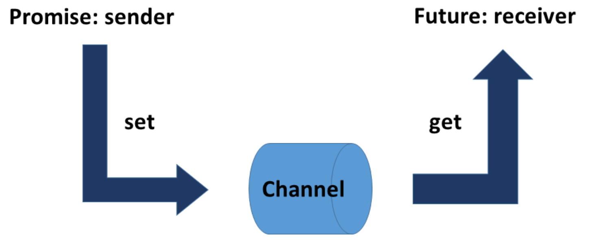
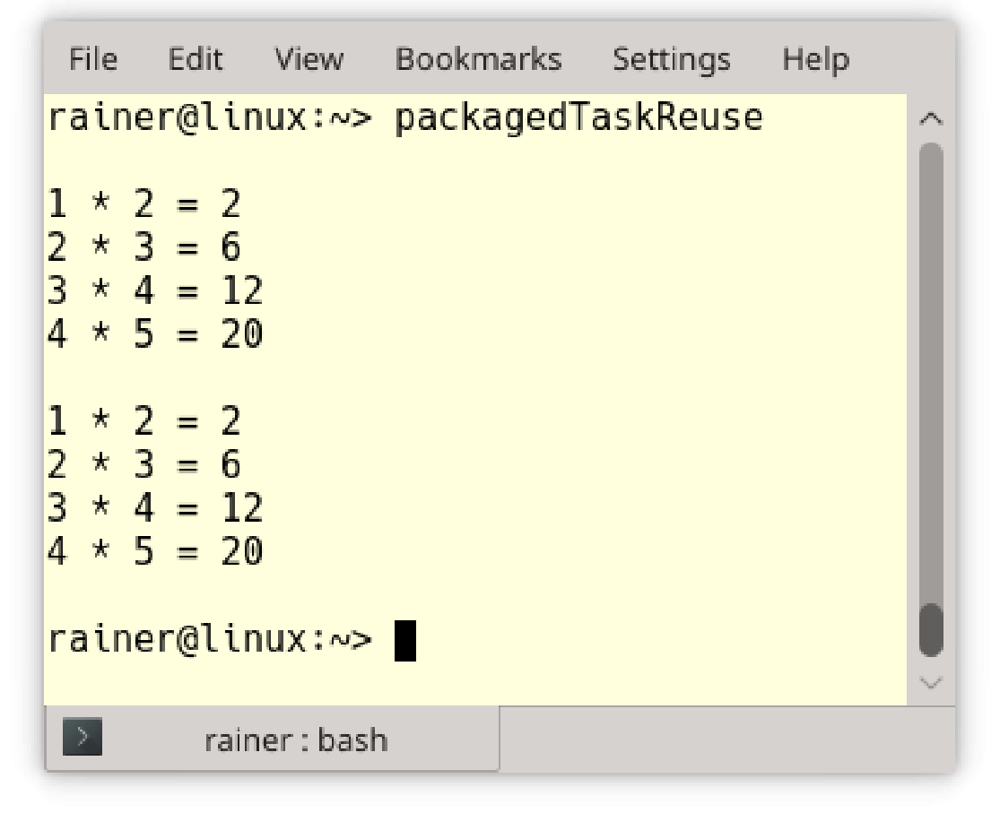

# 任務

除了線程之外，C++還有可以異步處理任務，這種方式處理任務需要包含`<future>`頭文件。任務由一個參數化工作包和兩個組件組成：promise和future，兩者構建一條數據通道。promise執行工作包並將結果放入數據通道，對應的future可以獲取結果，兩個通信端可以在不同的線程中運行。特別的是future可以在之後的某個時間點獲取結果，所以通過promise計算結果與通過future查詢結果的步驟是分開的。

> **將任務視為通信端間的數據通道**
>
> 任務的行為類似於通信點之間的數據通道。數據通道的一端稱為promise，另一端稱為future。這些端點可以存在於相同的線程中，也可以存在於不同的線程中。promise將其結果放入數據通道，future會在晚些時候把結果取走。



##  任務 vs. 線程

任務與線程有很大的不同。

```c++
// asyncVersusThread.cpp

#include <future>
#include <thread>
#include <iostream>

int main() {

  std::cout << std::endl;

  int res;
  std::thread t([&] {res = 2000 + 11; });
  t.join();
  std::cout << "res: " << res << std::endl;

  auto fut = std::async([] {return 2000 + 11; });
  std::cout << "fut.get(): " << fut.get() << std::endl;

  std::cout << std::endl;

}
```

線程`t`和`std::async`異步調用函數同時計算2000和11的和。主線程通過共享變量`res`獲取其線程`t`的計算結果，並在第14行中顯示它。第16行中，使用`std::async`在發送方(`promise`)和接收方(`future`)之間創建數據通道。future 變量使用`fut.get()`(第17行)，通過數據通道獲得計算結果。`fut.get `為阻塞調用。

下面是程序輸出的結果：


基於這個程序，我想強調線程和任務之間的區別。

任務 vs. 線程

|     標準     |         線程         |        任務         |
| :----------: | :------------------: | :-----------------: |
|   構成元素   |   創建線程和子線程   |   promise和future   |
|   通訊方式   |       共享變量       |      通信通道       |
|   創建線程   |       必定創建       |        可選         |
|   同步方式   |  通過`join()`(等待)  | 使用`get`阻塞式調用 |
| 線程中的異常 | 子線程和創建線程終止 |   返回promise的值   |
|   通信類型   |        變量值        | 變量值、通知和異常  |

線程需要包含`<thread>`頭文件，任務需要包含`<future>`頭文件。

創建線程和子線程之間的通信需要使用共享變量，任務通過其隱式的數據通道保護數據通信。因此，任務不需要互斥鎖之類的保護機制。

雖然，可以使用共享變量(的可變)來在子線程及其創建線程之間進行通信，但任務的通信方式更為明確。future只能獲取一次任務的結果(通過調用`fut.get()`)，多次調用它會導致未定義的行為(而`std::shared_future`可以查詢多次)。

創建線程需要等待子線程匯入。而使用`fut.get()`時，該調用將一直阻塞，直到獲取結果為止。

如果子線程中拋出異常，創建的線程將終止，創建者和整個進程也將終止。相反，promise可以將異常發送給future，而future必須對異常進行處理。

一個promise可以對應於一個或多個future。它可以發送值、異常，或者只是通知，可以使用它們替換條件變量。

`std::async `是創建future最簡單的方法。

**std::async**

`std::async`的行為類似於異步函數調用，可調用帶有參數的函數。`std::async`是一個可變參數模板，因此可以接受任意數量的參數。對`std::async`的調用會返回一個future 的對象`fut`。可以通過`fut.get()`獲得結果。

> **std::async應該首選**
>
> C++運行時決定`std::async`是否在獨立的線程中執行，決策可能取決於可用的CPU內核的數量、系統的利用率或工作包的大小。通過使用`std::async`，只需要指定運行的任務，C++運行時會自動管理線程。

可以指定`std::async`的啟動策略。

##啟動策略

使用啟動策略，可以顯式地指定異步調用應該在同一線程(`std::launch::deferred`)中執行，還是在不同線程(`std::launch::async`)中執行。

> **[及早求值]([https://zh.wikipedia.org/wiki/%E5%8F%8A%E6%97%A9%E6%B1%82%E5%80%BC](https://zh.wikipedia.org/wiki/及早求值))與[惰性求值]([https://zh.wikipedia.org/wiki/%E6%83%B0%E6%80%A7%E6%B1%82%E5%80%BC](https://zh.wikipedia.org/wiki/惰性求值))**
>
> 及早求值與惰性求值是計算結果表達式的兩種策略。在[及早求值](https://en.wikipedia.org/wiki/Eager_evaluation)的情況下，立即計算表達式，而在[惰性求值](https://en.wikipedia.org/wiki/Lazy_evaluation) 的情況下，僅在需要時才計算表達式。及早求值通常稱為貪婪求值，而惰性求值通常稱為按需調用。使用惰性求值，可以節省時間和計算資源。

調用`auto fut = std::async(std::launch::deferred，…)`的特殊之處在於，promise可能不會立即執行，調用`fut.get()`時才執行對應的promise 。這意味著，promise只在future調用`fut.get()`時計算得到結果。

```c++
// asyncLazy.cpp

#include <chrono>
#include <future>
#include <iostream>

int main() {

  std::cout << std::endl;

  auto begin = std::chrono::system_clock::now();

  auto asyncLazy = std::async(std::launch::deferred,
    [] {return std::chrono::system_clock::now(); });

  auto asyncEager = std::async(std::launch::async,
    [] {return std::chrono::system_clock::now(); });

  std::this_thread::sleep_for(std::chrono::seconds(1));

  auto lazyStart = asyncLazy.get() - begin;
  auto eagerStart = asyncEager.get() - begin;

  auto lazyDuration = std::chrono::duration<double>(lazyStart).count();
  auto eagerDuration = std::chrono::duration<double>(eagerStart).count();

  std::cout << "asyncLazy evaluated after : " << lazyDuration
    << " seconds." << std::endl;
  std::cout << "asyncEager  evaluated after : " << eagerDuration
    << " seconds." << std::endl;

  std::cout << std::endl;

}
```

兩個`std::async`調用(第13行和第16行)都返回當前時間點。但是，第一個調用是`lazy`，第二個調用是`eager`。第21行中的`asyncLazy.get()`調用觸發了第13行promise的執行——短睡一秒(第19行)。這對於`asyncEager`來說是不存在的，`asyncEager.get()`會立即獲取執行結果。

下面就是該程序輸出的結果：


不必把future綁定到變量上。

## [發後即忘]([https://zh.wikipedia.org/wiki/%E5%B0%84%E5%BE%8C%E4%B8%8D%E7%90%86](https://zh.wikipedia.org/wiki/射後不理))(Fire and Forget)

發後即忘是比較特殊的future。因為其future不受某個變量的約束，所以只是在原地執行。對於一個發後即忘的future，相應的promise運行在一個不同的線程中，所以可以立即開始(這是通過`std::launch::async`策略完成的)。

我們對普通的future和發後即忘的future進行比較。

```c++
auto fut= std::async([]{ return 2011; });
std::cout << fut.get() << std::endl;

std::async(std::launch::async,
						[]{ std::cout << "fire and forget" << std::endl; });
```

發後即忘的future看起來很有美好，但有一個很大的缺點。`std::async`創建的future會等待promise完成，才會進行析構。這種情況下，等待和阻塞就沒有太大的區別了。future的析構函數會中阻塞程序的進程，當使用發後即忘的future時，這一點變得更加明顯，看起來程序上是併發的，但實際上是串行運行的。

```c++
// fireAndForgetFutures.cpp

#include <chrono>
#include <future>
#include <iostream>
#include <thread>

int main() {

  std::cout << std::endl;

  std::async(std::launch::async, [] {
    std::this_thread::sleep_for(std::chrono::seconds(2));
    std::cout << "first thread" << std::endl;
    });

  std::async(std::launch::async, [] {
    std::this_thread::sleep_for(std::chrono::seconds(2));
    std::cout << "second thread" << std::endl; }
  );

  std::cout << "main thread" << std::endl;

  std::cout << std::endl;

}
```

程序在線程中執行兩個promise，這樣就會產生髮後即忘的future。future在析構函數中阻塞線程，直到相關的promise完成。promise是按照源代碼順序執行的，執行順序與執行時間無關。


`std::async`是一種方便的機制，可用於在分解較大的計算任務。

## 並行計算

標量乘積的計算可分佈在四個異步調用中。

```c++
// dotProductAsync.cpp

#include <iostream>
#include <future>
#include <random>
#include <vector>
#include <numeric>

using namespace std;

static const int NUM = 100000000;

long long getDotProduct(vector<int>& v, vector<int>& w) {

  auto vSize = v.size();

  auto future1 = async([&] {
    return inner_product(&v[0], &v[vSize / 4], &w[0], 0LL);
    });

  auto future2 = async([&] {
    return inner_product(&v[vSize / 4], &v[vSize / 2], &w[vSize / 4], 0LL);
    });

  auto future3 = async([&] {
    return inner_product(&v[vSize / 2], &v[vSize * 3 / 4], &w[vSize / 2], 0LL);
    });

  auto future4 = async([&] {
    return inner_product(&v[vSize * 3 / 4], &v[vSize], &w[vSize * 3 / 4], 0LL);
    });

  return future1.get() + future2.get() + future3.get() + future4.get();
}


int main() {

  cout << endl;

  random_device seed;

  // generator
  mt19937 engine(seed());

  // distribution
  uniform_int_distribution<int> dist(0, 100);

  // fill the vector
  vector<int> v, w;
  v.reserve(NUM);
  w.reserve(NUM);
  for (int i = 0; i < NUM; ++i) {
    v.push_back(dist(engine));
    w.push_back(dist(engine));
  }

  cout << "getDotProduct(v, w): " << getDotProduct(v, w) << endl;

  cout << endl;

}
```

該程序使用了隨機庫和時間庫，創建兩個向量`v`和`w`並用隨機數填充(第50-56行)，每個向量添加(第53 - 56行)1億個元素。第54和55行中的`dist(engine)`生成均勻分佈在0到100之間的隨機數。標量乘積的計算在`getDotProduct`中進行(第13 - 34行)。內部實現中，`std::async`使用標準庫算法`std::inner_product`。最後，使用future獲取結果進行相加，就得到了最終結果。


`std::packaged_task`通常也用於併發。

**std::packaged_task**

`std::packaged_task`是用於異步調用的包裝器。通過`pack.get_future() `可以獲得相關的future。可以使用可調用操作符`pack(pack())`執行`std::packaged_task`。

處理`std::packaged_task`通常包括四個步驟:

I. 打包:

```c++
std::packaged_task<int(int, int)> sumTask([](int a, int b){ return a + b; });
```

II. 創建future:

````c++
std::future<int> sumResult= sumTask.get_future();
````

III. 執行計算:

```c++
sumTask(2000, 11);
```

IV. 查詢結果:

```c++
sumResult.get();
```

下面的示例，展示了這四個步驟。

```c++
// packagedTask.cpp

#include <utility>
#include <future>
#include <iostream>
#include <thread>
#include <deque>

class SumUp {
public:
  int operator()(int beg, int end) {
    long long int sum{ 0 };
    for (int i = beg; i < end; ++i) sum += i;
    return static_cast<int>(sum);
  }
};

int main() {

  std::cout << std::endl;

  SumUp sumUp1;
  SumUp sumUp2;
  SumUp sumUp3;
  SumUp sumUp4;

  // wrap the task
  std::packaged_task<int(int, int)> sumTask1(sumUp1);
  std::packaged_task<int(int, int)> sumTask2(sumUp2);
  std::packaged_task<int(int, int)> sumTask3(sumUp3);
  std::packaged_task<int(int, int)> sumTask4(sumUp4);

  // create the futures
  std::future<int> sumResult1 = sumTask1.get_future();
  std::future<int> sumResult2 = sumTask2.get_future();
  std::future<int> sumResult3 = sumTask3.get_future();
  std::future<int> sumResult4 = sumTask4.get_future();

  // push the task on the container
  std::deque<std::packaged_task<int(int, int)>> allTasks;
  allTasks.push_back(std::move(sumTask1));
  allTasks.push_back(std::move(sumTask2));
  allTasks.push_back(std::move(sumTask3));
  allTasks.push_back(std::move(sumTask4));

  int begin{ 1 };
  int increment{ 2500 };
  int end = begin + increment;

  // preform each calculation in a separate thread
  while (!allTasks.empty()) {
    std::packaged_task<int(int, int)> myTask = std::move(allTasks.front());
    allTasks.pop_front();
    std::thread sumThread(std::move(myTask), begin, end);
    begin = end;
    end += increment;
    sumThread.detach();
  }
  
  // pick up the results
  auto sum = sumResult1.get() + sumResult2.get() +
    sumResult3.get() + sumResult4.get();

  std::cout << "sum of 0 .. 10000 = " << sum << std::endl;

  std::cout << std::endl;

}
```

這段程序的是計算從0到10000的整數和。創建四個`std::packaged_task`的對象，並且每個`std::packaged_task`有自己的線程，並使用future來彙總結果。當然，也可以直接使用[Gaußschen Summenformel](https://de.wikipedia.org/wiki/Gau%C3%9Fsche_Summenformel)(高斯求和公式)。真奇怪，我沒有找到英文網頁。(譯者注：打開網頁就是最熟悉的高斯求和公式，也就是[等差數列求和公式]([https://baike.baidu.com/item/%E9%AB%98%E6%96%AF%E7%AE%97%E6%B3%95/4727683](https://baike.baidu.com/item/高斯算法/4727683))。翻了下維基百科，確實沒有相關的英文頁面。)

**I. 打包任務**：程序將工作包打包進`std::packaged_task`(第28 - 31行)的實例中，工作包就是`SumUp`的實例(第9 - 16行)，使用函數操作符完成任務(第11 - 15行)。函數操作符將`beg`到`end - 1`的所有整數相加並返回結果。第28 - 31行中的`std::packaged_task`實例可以處理需要兩個`int`參數的函數調用，並返回一個`int: int(int, int)`類型的任務包。

**II.創建future**：第34到37行中，使用`std::packaged_task`創建future對象，這時`std::packaged_task`對象屬於通信通道中的promise。future的類型有明確定義：`std::future<int> sumResult1 = sumTask1.get_future()`，也可以讓編譯器來確認future的具體類型：`auto  sumResult1 sumTask1.get_future()`。

**III. 進行計算**：開始計算。將任務包移動到[`std::deque`](http://en.cppreference.com/w/cpp/container/deque)(第40 - 44行)中，while循環(第51 - 58行)會執行每個任務包。為此，將`std::deque`的隊頭任務包移動到一個`std::packaged_task`實例中(第52行)，並將這個實例移動到一個新線程中(第54行)，並讓這個線程在後臺運行(第57行)。因為`packaged_task`對象不可複製的，所以會在52和54行中使用`move`語義。這個限制不僅適用於所有的promise實例，但也適用於future和線程實例。但有一個例外：`std::shared_future`。

**IV. 查詢結果**：最後一步中，從每個future獲取計算的結果，並把它們加起來(第61行)。


下表展示`std::packaged_task pack`的接口

|                   成員函數                   |                    函數描述                    |
| :------------------------------------------: | :--------------------------------------------: |
| `pack.swap(pack2)`和`std::swap(pack, pack2)` |                    交換對象                    |
|                `pack.valid()`                |            檢查對象中的函數是否合法            |
|             `pack.get_future()`              |                   返回future                   |
|     `pack.make_ready_at_thread_exit(ex)`     | 執行的函數，如果線程還存在，那麼結果還是可用的 |
|                `pack.reset()`                |       重置任務的狀態，擦除之前執行的結果       |

與`std::async`或`std::promise`相比，`std::packaged_task`可以復位並重復使用。下面的程序展示了`std::packaged_task`的“特殊”使用方式。

```c++
// packagedTaskReuse.cpp

#include <functional>
#include <future>
#include <iostream>
#include <utility>
#include <vector>

void calcProducts(std::packaged_task<int(int, int)>& task,
  const std::vector<std::pair<int, int>>& pairs) {
  for (auto& pair : pairs) {
    auto fut = task.get_future();
    task(pair.first, pair.second);
    std::cout << pair.first << " * " << pair.second << " = " << fut.get()<<
      std::endl;
    task.reset();
  }
}

int main() {

  std::cout << std::endl;

  std::vector<std::pair<int, int>> allPairs;
  allPairs.push_back(std::make_pair(1, 2));
  allPairs.push_back(std::make_pair(2, 3));
  allPairs.push_back(std::make_pair(3, 4));
  allPairs.push_back(std::make_pair(4, 5));

  std::packaged_task<int(int, int)> task{ [](int fir, int sec) {
    return fir * sec; }
  };

  calcProducts(task, allPairs);

  std::cout << std::endl;
  
  std::thread t(calcProducts, std::ref(task), allPairs);
  t.join();

  std::cout << std::endl;

}
```

函數`calcProduct`(第9行)有兩個參數：`task`和`pairs`。使用任務包`task`來計算`pairs`中的每個整數對的乘積(第13行)，並在第16行重置任務`task`。這樣，`calcProduct`就能在主線程(第34行)和另外開啟的線程(第38行)中運行。下面是程序的輸出。



**std::promise和std::future**

`std::promise`和`std::future`可以完全控制任務。

promise和future是一對強有力的組合。promise可以將值、異常或通知放入數據通道。一個promise可以對應多個`std::shared_future`對象。

下面是`std::promise`和`std::future`用法的示例。兩個通信端點都可以在不同的的線程中，因此通信可以在線程間發生。

```c++
// promiseFuture.cpp

#include <future>
#include <iostream>
#include <thread>
#include <utility>

void product(std::promise<int>&& intPromise, int a, int b) {
  intPromise.set_value(a * b);
}

struct Div {

  void operator()(std::promise<int>&& intPromise, int a, int b) const {
    intPromise.set_value(a / b);
  }

};

int main() {
  
  int a = 20;
  int b = 10;

  std::cout << std::endl;

  // define the promises
  std::promise<int> prodPromise;
  std::promise<int> divPromise;

  // get the futures
  std::future<int> prodResult = prodPromise.get_future();
  std::future<int> divResult = divPromise.get_future();

  // calculate the result in a separate thread
  std::thread prodThread(product, std::move(prodPromise), a, b);
  Div div;
  std::thread divThread(div, std::move(divPromise), a, b);

  // get the result
  std::cout << "20*10 = " << prodResult.get() << std::endl;
  std::cout << "20/10 = " << divResult.get() << std::endl;

  prodThread.join();

  divThread.join();

  std::cout << std::endl;

}
```

將函數`product`(第8 -10行)、`prodPromise`(第32行)以及數字`a`和`b`放入線程`Thread prodThread`(第36行)中。`prodThread`的第一個參數需要一個可調用的參數，上面程序中就是函數乘積函數。函數需要一個類型右值引用的promise(`std::promise<int>&& intPromise`)和兩個數字。`std::move`(第36行)創建一個右值引用。剩下的就簡單了，`divThread`(第38行)將`a`和`b`分開傳入。

future通過`prodResult.get()`和`divResult.get()`獲取結果


**std::promise**

`std::promise`允許設置一個值、一個通知或一個異常。此外，promise可以以延遲的方式提供結果。

`std::promise prom`的成員函數

|                   成員函數                   |        函數描述         |
| :------------------------------------------: | :---------------------: |
| `prom.swap(prom2)`和`std::swap(prom, prom2)` |        交換對象         |
|             `prom.get_future()`              |       返回future        |
|            `prom.set_value(val)`             |         設置值          |
|           `prom.set_exception(ex)`           |        設置異常         |
|     `prom.set_value_at_thread_exit(val)`     |  promise退出前存儲該值  |
|   `prom.set_exception_at_thread_exit(ex)`    | promise退出前存儲該異常 |

如果多次對promise設置值或異常，則會拋出`std::future_error`。

**std::future**

`std::future`可以完成的事情有：

* 從promise中獲取值。
* 查詢promise值是否可獲取。
* 等待promise通知，這種等待可以用一個時間段或一個絕對的時間點來完成。
* 創建共享future(`std::shared_future`)。

future實例`fut`的成員函數

|         成員函數          |                           函數描述                           |
| :-----------------------: | :----------------------------------------------------------: |
|       `fut.share()`       |                   返回`std::shared_future`                   |
|        `fut.get()`        |                      返回可以是值或異常                      |
|       `fut.valid()`       | 檢查當前實例是否可用調用`fut.get()`。使用get()之後，返回false |
|       `fut.wait()`        |                           等待結果                           |
|  `fut.wait_for(relTime)`  | 在`relTime`時間段內等待獲取結果，並返回`std:: future_status`實例 |
| `fut.wait_until(absTime)` | 在`absTime`時間點前等待獲取結果，並返回`std:: future_status`實例 |

與`wait`不同，`wait_for`和`wait_until`會返回future的狀態。

**std::future_status**

future和共享future的`wait_for`和`wait_until`成員函數將返回其狀態。有三種可能:

```c++
enum class future_status {
  ready,
  timeout,
  deferred
};	
```

下表描述了每種狀態:

|   狀態   |          描述          |
| :------: | :--------------------: |
| deferred |      函數還未運行      |
|  ready   |    結果已經準備就緒    |
| timeout  | 結果超時得到，視為過期 |

使用`wait_for`或`wait_until`可以一直等到相關的promise完成。

```c++
// waitFor.cpp

#include <iostream>
#include <future>
#include <thread>
#include <chrono>

using namespace std::literals::chrono_literals;

void getAnswer(std::promise<int> intPromise) {
  std::this_thread::sleep_for(3s);
  intPromise.set_value(42);
}

int main() {

  std::cout << std::endl;

  std::promise<int> answerPromise;
  auto fut = answerPromise.get_future();

  std::thread prodThread(getAnswer, std::move(answerPromise));

  std::future_status status{};
  do {
    status = fut.wait_for(0.2s);
    std::cout << "... doing something else" << std::endl;
  } while (status != std::future_status::ready);

  std::cout << std::endl;

  std::cout << "The Answer: " << fut.get() << '\n';

  prodThread.join();

  std::cout << std::endl;
}
```

在future`fut`在等待promise時，可以執行其他操作。


如果多次獲取future`fut`的結果，會拋出`std::future_error`異常。

promise和future是一對一的關係，而`std::shared_future`支持一個promise 對應多個future。

**std::shared_future**

創建`std::shared_future `的兩種方式：

1. 通過promise實例`prom`創建`std::shared_future`:` std::shared_future<int> fut = prom.get_future()`。
2. 使用`fut`的`fut.share()`進行創建。執行了`fut.share()`後，`fut.valid()`會返回false。

共享future是與相應的promise相關聯的，可以獲取promise的結果。共享future與`std::future`有相同的接口。

除了有`std::future`的功能外，`std::shared_future`還允許和其他future查詢關聯promise的值。

`std::shared_future`的操作很特殊，下面的代碼中就直接創建了一個`std::shared_future`。

```c++
// sharedFuture.cpp

#include <future>
#include <iostream>
#include <thread>
#include <utility>

std::mutex coutMutex;

struct Div {

  void operator()(std::promise<int>&& intPromise, int a, int b) {
    intPromise.set_value(a / b);
  }

};

struct Requestor {

  void operator()(std::shared_future<int> shaFut) {

    // lock std::cout
    std::lock_guard<std::mutex> coutGuard(coutMutex);

    // get the thread id
    std::cout << "threadId(" << std::this_thread::get_id() << "): ";

    std::cout << "20/10= " << shaFut.get() << std::endl;

  }

};

int main() {

  std::cout << std::endl;

  // define the promises
  std::promise<int> divPromise;

  // get the futures
  std::shared_future<int> divResult = divPromise.get_future();

  // calculate the result in a separate thread
  Div div;
  std::thread divThread(div, std::move(divPromise), 20, 10);

  Requestor req;
  std::thread sharedThread1(req, divResult);
  std::thread sharedThread2(req, divResult);
  std::thread sharedThread3(req, divResult);
  std::thread sharedThread4(req, divResult);
  std::thread sharedThread5(req, divResult);

  divThread.join();

  sharedThread1.join();
  sharedThread2.join();
  sharedThread3.join();
  sharedThread4.join();
  sharedThread5.join();

  std::cout << std::endl;

}
```

promise和future的工作包都是函數對象。第46行中將`divPromise`移動到線程`divThread`中執行，因此會將`std::shared_future`複製到5個線程中(第49 - 53行)。與只能移動的`std::future`對象不同，可以`std::shared_future`對象可以進行復制。

主線程在第57到61行等待子線程完成它們的任務。


前面提到過，可以通過使用`std::future`的成員函數創建`std::shared_future`。我們把上面的代碼改一下。

```c++
// sharedFutureFromFuture.cpp

#include <future>
#include <iostream>
#include <thread>
#include <utility>

std::mutex coutMutex;

struct Div {

  void operator()(std::promise<int>&& intPromise, int a, int b) {
    intPromise.set_value(a / b);
  }

};

struct Requestor {

  void operator()(std::shared_future<int> shaFut) {

    // lock std::cout
    std::lock_guard<std::mutex> coutGuard(coutMutex);

    // get the thread id
    std::cout << "threadId(" << std::this_thread::get_id() << "): ";

    std::cout << "20/10= " << shaFut.get() << std::endl;

  }

};

int main() {

  std::cout << std::boolalpha << std::endl;

  // define the promises
  std::promise<int> divPromise;

  // get the futures
  std::future<int> divResult = divPromise.get_future();

  std::cout << "divResult.valid(): " << divResult.valid() << std::endl;

  // calculate the result in a separate thread
  Div div;
  std::thread divThread(div, std::move(divPromise), 20, 10);

  std::cout << "divResult.valid(): " << divResult.valid() << std::endl;

  std::shared_future<int> sharedResult = divResult.share();

  std::cout << "divResult.valid(): " << divResult.valid() << "\n\n";

  Requestor req;
  std::thread sharedThread1(req, sharedResult);
  std::thread sharedThread2(req, sharedResult);
  std::thread sharedThread3(req, sharedResult);
  std::thread sharedThread4(req, sharedResult);
  std::thread sharedThread5(req, sharedResult);

  divThread.join();

  sharedThread1.join();
  sharedThread2.join();
  sharedThread3.join();
  sharedThread4.join();
  sharedThread5.join();

  std::cout << std::endl;

}
```

`std::future`(第44行和第50行)前兩次調用`divResult.valid()`都返回true。第52行執行`divResult.share()`之後，因為該操作使得狀態轉換為共享，所以在執行到第54行時，程序會返回false。


## 異常

如果`std::async`或`std::packaged_task`的工作包拋出錯誤，則異常會存儲在共享狀態中。當future`fut`調用`fut.get()`時，異常將重新拋出。

`std::promise prom`提供了相同的功能，但是它有一個成員函數`prom.set_value(std::current_exception())`可以將異常設置為共享狀態。

數字除以0是未定義的行為，函數`executeDivision`顯示計算結果或異常。

```c++
// promiseFutureException.cpp

#include <exception>
#include <future>
#include <iostream>
#include <thread>
#include <utility>

#ifdef WIN32
#include <string>
#endif

struct Div {
  void operator()(std::promise<int>&& intPromise, int a, int b){
    try {
      if (b == 0) {
        std::string errMess = std::string("Illegal division by zero: ") +
          std::to_string(a) + "/" + std::to_string(b);
        throw std::runtime_error(errMess);
      }
      intPromise.set_value(a / b);
    }
    catch (...) {
      intPromise.set_exception(std::current_exception());
    }
  }
};

void executeDivision(int nom, int denom) {
  std::promise<int> divPromise;
  std::future<int> divResult = divPromise.get_future();

  Div div;
  std::thread divThread(div, std::move(divPromise), nom, denom);

  // get the result or the exception
  try {
    std::cout << nom << "/" << denom << " = " << divResult.get() << std::endl;
  }
  catch (std::runtime_error& e) {
    std::cout << e.what() << std::endl;
  }

  divThread.join();
}

int main() {

  std::cout << std::endl;

  executeDivision(20, 0);
  executeDivision(20, 10);

  std::cout << std::endl;

}
```

這個程序中，promise會處理分母為0的情況。如果分母為0，則在第24行中將異常設置為返回值：`intPromise.set_exception(std::current_exception())`。future需要在try-catch中處理異常(第37 - 42行)。

下面是程序的輸出。


> **std::current_exception和std::make_exception_ptr**
>
> `std::current_exception()`捕獲當前異常對象，並創建一個
>`std:: exception_ptr`。`std::exception_ptr`保存異常對象的副本或引用。如果在沒有異常處理時調用該函數，則返回一個空的[`std::exception_ptr`]( http://en.cppreference.com/w/cpp/error/current_exception)。
> 
> 為了不在try/catch中使用`intPromise.set_exception(std::current_exception())`檢索拋出的異常，可以直接調用`intPromise.set_exception(std::make_exception_ptr(std::runtime_error(errMess)))`。

如果在`std::promise`銷燬之前沒有調用設置類的成員函數，或是在`std::packaged_task`調用它，那麼`std::future_error`異常和錯誤代碼`std::future_errc::broken_promise`將存儲在共享future中。

## 通知

任務是條件變量的一種替代方式。如果使用promise和future來同步線程，它們與條件變量有很多相同之處。大多數時候，promise和future是更好的選擇。

在看例子之前，先了解下任務和條件變量的差異。

|     對比標準     | 條件變量 | 任務 |
| :--------------: | :------: | :--: |
|     多重同步     |   Yes    |  No  |
|    臨界區保護    |   Yes    |  No  |
| 接收錯誤處理機制 |    No    | Yes  |
|      偽喚醒      |   Yes    |  No  |
|      未喚醒      |   Yes    |  No  |

與promise和future相比，條件變量的優點是可以多次同步線程，而promise只能發送一次通知，因此必須使用更多promise和future對，才能模擬出條件變量的功能。如果只同步一次，那條件變量正確的使用方式或許將更具大的挑戰。promise和future對不需要共享變量，所以不需要鎖，並且不大可能出現偽喚醒或未喚醒的情況。除了這些，任務還可以處理異常。所以，在同步線程上我會更偏重於選擇任務，而不是條件變量。

還記得使用條件變量有多難嗎？如果忘記了，這裡展示了兩個線程同步所需的關鍵部分。

```c++
void waitingForWork(){
  std::cout << "Worker: Waiting for work." << std::endl;
  
  std::unique_lock<std::mutex> lck(mutex_);
  condVar.wait(lck, []{ return dataReady; });
  doTheWork();
  std::cout << "Work done." << std::endl;
}

void setDataReady(){
  std::lock_guard<std::mutex> lck(mutex_);
  dataReady=true;
  std::cout << "Sender: Data is ready." << std::endl;
  condVar.notify_one();
}
```

函數`setDataReady`為同步通知，函數`waitingForWork`為同步等待。

使用任務完成相同的工作流程。

```c++
// promiseFutureSynchronise.cpp

#include <future>
#include <iostream>
#include <utility>


void doTheWork() {
  std::cout << "Processing shared data." << std::endl;
}

void waitingForWork(std::future<void>&& fut) {

  std::cout << "Worker: Waiting for work." << std::endl;
  fut.wait();
  doTheWork();
  std::cout << "Work done." << std::endl;

}

void setDataReady(std::promise<void>&& prom) {

  std::cout << "Sender: Data is ready." << std::endl;
  prom.set_value();

}

int main() {

  std::cout << std::endl;

  std::promise<void> sendReady;
  auto fut = sendReady.get_future();

  std::thread t1(waitingForWork, std::move(fut));
  std::thread t2(setDataReady, std::move(sendReady));

  t1.join();
  t2.join();

  std::cout << std::endl;

}
```

是不是非常簡單？

通過`sendReady`(第32行)獲得了一個future`fut`(第33行)，promise使用其返回值`void (std::promise<void> sendReady)`進行通信，並且只能夠發送通知。兩個通信端點分別移動到線程`t1`和`t2`中(第35行和第36行)，調用`fut.wait()`(第15行)等待promise的通知(`prom.set_value()`(第24行))。

程序結構和輸出，與條件變量章節程序的輸出一致。

