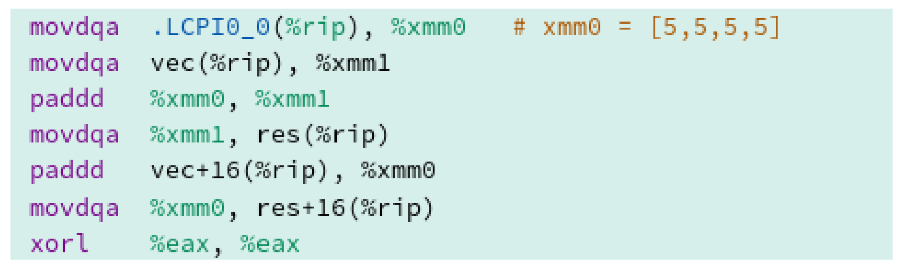

# 執行策略

C++17標準中定義了三種執行策略:

* `std::execution::sequenced_policy`
* `std::execution::parallel_policy`
* `std::execution::parallel_unsequenced_policy`

(譯者注：C++20中添加了`unsequenced_policy`策略)

相應的策略標定了程序應該串行、並行，還是與向量化並行。

* `std::execution::seq `: 串行執行
* `std::execution::par `: 多線程並行執行
* `std::execution::par_unseq`: 多個線程上並行，可以循環交叉，也能使用[SIMD]( https://en.wikipedia.org/wiki/SIMD)(單指令多數據)

`std::execution::par`或`std::execution::par_unseq`允許算法並行或向量化並行。

下面的代碼片段展示了所有執行策略的使用方式。

```c++

#include <execution>
#include <vector>
#include <algorithm>

int main() {
  
  std::vector<int> v = { 1, 2, 3, 4, 5, 6, 7, 8, 9 };

  // standard sequential sort
  std::sort(v.begin(), v.end());

  // sequential execution
  std::sort(std::execution::seq, v.begin(), v.end());
                    
  // permitting parallel execution
  std::sort(std::execution::par, v.begin(), v.end());

  //permitting parallel and vectorized execution
  std::sort(std::execution::par_unseq, v.begin(), v.end());

}
```

示例中，可以使用經典的`std::sort`(第11行)。C++17中，可以明確指定使用方式：串行(第14行)、並行(第17行)，還是向量化並行(第20行)。

`std::is_execution_policy`可以檢查模板參數`T`是標準數據類型，還是執行策略類型：`std::is_execution_policy<T>::value`。如果`T`是`std::execution::sequenced_policy`, `std::execution::parallel_policy`, `std::execution::parallel_unsequenced_policy`，或已定義的執行策略類型，則表達式結果為true；否則，為false。

## 並行和向量化執行

算法是否以並行和向量化的方式運行，取決於許多因素。例如：CPU和編譯器是否支持SIMD指令，還取決於編譯器實現和代碼的優化級別。

下面的示例使用循環填充數組。

```c++

#include <iostream>

const int SIZE = 8;

int vec[] = { 1, 2, 3, 4, 5, 6, 7, 8 };
int res[] = { 0, 0, 0, 0, 0, 0, 0, 0 };

int main() {

  for (int i = 0; i < SIZE; ++i) {
    res[i] = vec[i] + 5;
  }

  for (int i = 0; i < SIZE; ++i) {
    std::cout << res[i] << " ";
  }
  std::cout << std::endl;

}
```

第12行是這個示例中的關鍵。我們可以在[compiler explorer]( https://godbolt.org)看一下clang 3.6生成的相應彙編指令。

**無優化**

彙編指令中，每個加法都是串行進行的。


**使用最高優化級別**

通過使用最高的優化級別`-O3`，寄存器(如：xmm0)可以容納128位，或者說是4個整型數字。這樣，加法就可以同時在四個元素進行了。



無執行策略算法的重載，與具有串行執行策略`std::execution::seq`算法的重載在**異常**處理方面有所不同。

##異常

如果執行策略的算法發生異常，將調用[`std::terminate`](https://en.cppreference.com/w/cpp/error/terminate)。`std::terminate`調用[`std::terminate_handler`](https://en.cppreference.com/w/cpp/error/terminate_handler)，之後使用[`std::abort`]( https://en.cppreference.com/w/cpp/utility/program/abort)，讓異常程序終止。執行策略的算法與調用`std::execution::seq`執行策略的算法之間沒有區別。無執行策略的算法會傳播異常，因此可以對異常進行處理。exceptionExecutionPolicy.cpp可以佐證我的觀點。

```c++
// exceptionExecutionPolicy.cpp

#include <algorithm>
#include <execution>
#include <iostream>
#include <stdexcept>
#include <string>
#include <vector>

int main() {

  std::cout << std::endl;

  std::vector<int> myVec{ 1,2,3,4,5 };

  try {
    std::for_each(myVec.begin(), myVec.end(),
      [](int) {throw std::runtime_error("Without  execution policy"); }
    );
  }
  catch (const std::runtime_error & e) {
    std::cout << e.what() << std::endl;
  }

  try {
    std::for_each(std::execution::seq, myVec.begin(), myVec.end(),
      [](int) {throw std::runtime_error("With execution policy"); }
    );
  }
  catch (const std::runtime_error & e) {
    std::cout << e.what() << std::endl;
  }
  catch (...) {
    std::cout << "Catch-all exceptions" << std::endl;
  }

}
```

第21行可以捕獲異常`std::runtime_error`，但不能捕獲第30行中的異常，甚至在第33行中的捕獲全部異常也無法捕獲相應的異常。

使用新的MSVC編譯器，並開啟`std:c++latest`選項，程序會給出期望的輸出。


只有第一個異常順利捕獲。

##數據競爭和死鎖的風險

並行算法無法避免數據競爭和死鎖。

下面的並行代碼中，就存在數據競爭。

```c++

#include <execution>
#include <vector>

int main() {

  std::vector<int> v = { 1, 2, 3 };
  int sum = 0;
  std::for_each(std::execution::par, v.begin(), v.end(), [&sum](int i) {
    sum += i + i;
    });

}
```

代碼段中，`sum`有數據競爭。`sum`上累加了`i + i`的和，並且是併發修改的，所以必須保護`sum`。

```c++

#include <execution>
#include <vector>
#include <mutex>

std::mutex m;

int main() {

  std::vector<int> v = { 1, 2, 3 };

  int sum = 0;
  std::for_each(std::execution::par, v.begin(), v.end(), [&sum](int i) {
    std::lock_guard<std::mutex> lock(m);
    sum += i + i;
    });

}
```

將執行策略更改為`std::execution::par_unseq`時，會出現條件競爭，並導致死鎖。

```c++

#include <execution>
#include <vector>
#include <mutex>

std::mutex m;

int main() {

  std::vector<int> v = { 1, 2, 3 };

  int sum = 0;
  std::for_each(std::execution::par_unseq, v.begin(), v.end(), [&sum](int i) {
    std::lock_guard<std::mutex> lock(m);
    sum += i + i;
    });

}
```

同一個線程上，Lambda函數可能連續兩次調用`m.lock`，這會產生未定義行為，大多數情況下會導致死鎖。這裡，可以使用原子來避免死鎖。

```c++
#include <execution>
#include <vector>
#include <mutex>
#include <atomic>

std::mutex m;

int main() {

  std::vector<int> v = { 1, 2, 3 };

  std::atomic<int> sum = 0;
  std::for_each(std::execution::par_unseq, v.begin(), v.end(), [&sum](int i) {
    std::lock_guard<std::mutex> lock(m);
    sum += i + i;
    });

}
```

因為`sum`是一個原子計數器，所以將語義放寬也沒關係：`sum.fetch_add(i * i, std::memory_order_relaxed)` .

執行策略可以作為參數傳入69個STL重載算法中，以及C++17添加的8個新算法中。

