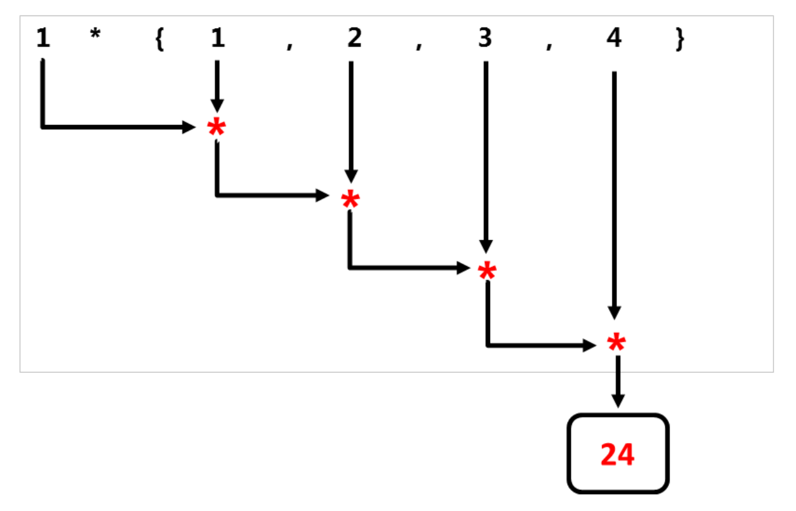

# 新算法

新算法包含在`std`命名空間中，`std::for_each`和`std::for_each_n`在`<algorithm>`頭文件中聲明，其餘六種算法在`<numeric>`頭文件中聲明。

下面是新算法的概述。

|              算法               |                             描述                             |
| :-----------------------------: | :----------------------------------------------------------: |
|         `std::for_each`         |                將一元函數對象應用於引用範圍。                |
|        `std::for_each_n`        |          將一元函數對象應用於引用範圍的前n個元素。           |
|      `std::exclusive_scan`      | 將二元函數對象從左向右應用與引用範圍。“排除性”(exclusive)表示第i個輸入元素不包含在第i個和內。二元函數對象的第一個參數是之前計算的結果，運算可能以任意順序進行，並存儲中間結果。若二元函數對象不滿足結合律，則函數行為不確定。行為與[`std::partial_sum`](http://en.cppreference.com/w/cpp/algorithm/partial_sum)類似。 |
|      `std::inclusive_scan`      | 將二元函數對象從左向右應用與引用範圍。“包含性”(inclusive)表示第i個輸入元素包含於第i個和中。二元函數對象的第一個參數是之前計算的結果，運算可能以任意順序進行，並存儲中間結果。若二元函數對象不滿足結合律，則函數行為不確定。行為與[`std::partial_sum`](http://en.cppreference.com/w/cpp/algorithm/partial_sum)類似 |
| `std::transform_exclusive_scan` | 首先，將一元函數對象應用於引用範圍，然後使用`std::exclusive_scan`。若二元函數對象不滿足結合律，則函數行為不確定。 |
| `std::transform_inclusive_scan` | 首先，將一元函數對象應用於引用範圍，然後使用`std::inclusive_scan`。若二元函數對象不滿足結合律，則函數行為不確定。 |
|          `std::reduce`          | 將二元函數對象從左向右應用與引用範圍。若二元函數對象不滿足交換律或結合律，則函數行為不確定。行為與[`std::accumulate`](http://en.cppreference.com/w/cpp/algorithm/accumulate)類似。 |
|     `std::transform_reduce`     | 首先，將一元函數對象應用於引用範圍，然後使用`std::reduce`。若二元函數對象不滿足交換律或結合律，則函數行為不確定。 |

表中的函數描述不大容易理解，若對`std::accumulate`和`std::partial_sum`比較瞭解，那對前綴求和算法應該是非常熟悉。歸約算法可以並行使用累加的方式，掃描算法可以並行的使用`partial_sum`。這就是`std::reduce`(歸約算法)需要滿足交換律和結合律的原因。

首先，給出一個算法示例，然後介紹這些函數的功能。示例中，忽略了新的`std::for_each`算法。與返回一元函數的C++98實現不同，C++17中什麼也不返回。`std::accumulate`從左到右處理元素，而`std::reduce`可以以任意的順序處理元素。讓我們從使用`std::accumulate`和`std::reduce`的小代碼段開始，二元函數對象為Lambda函數` [](int a, int b){ return a * b; }`。

```c++
std::vector<int> v{1, 2, 3, 4};
std::accumulate(v.begin(), v.end(), 1, [](int a, int b){ return a * b; });
std::reduce(std::execution::par, v.begin(), v.end(), 1 ,
[](int a, int b){ return a * b; });
```

下面兩張圖顯示了`std::accumulate`和`std::reduce`的不同策略。

`std::accumulate`從左開始，依次使用二進制操作符。



與`std::accumulate`不同，`std::reduce`以一種不確定的方式使用二元操作符。


結合律允許`std::reduce`算法計算任意鄰接元素對。因為元素順序可交換，所以中間結果可以按任意順序計算。

> **當前可用的算法實現**
>
> 展示代碼之前，必須做個說明。據我所知，本書更新的時候(2018年9月)，並沒有完全符合標準的並行STL實現。MSVC 17.8也只是增加了對大約30種算法的支持。
>
> MSVC 17.8中的並行算法
>
> | `std::adjacent_difference` |      `std::adjacent_find`       |          `std::all_of`          |
>| :------------------------: | :-----------------------------: | :-----------------------------: |
> |       `std::any_of`        |          `std::count`           |         `std::count_if`         |
>|        `std::equal`        |      `std::exclusive_scan`      |           `std::find`           |
> |      `std::find_end`       |      `std::find_first_of`       |         `std::find_if`          |
> |      `std::for_each`       |        `std::for_each_n`        |      `std::inclusive_scan`      |
> |      `std::mismatch`       |         `std::none_of`          |          `std::reduce`          |
> |       `std::remove`        |        `std::remove_if`         |          `std::search`          |
> |      `std::search_n`       |           `std::sort`           |       `std::stable_sort`        |
> |      `std::transform`      | `std::transform_exclusive_scan` | `std::transform_inclusive_scan` |
> |  `std::transform_reduce`   |                                 |                                 |
> 
> 這裡使用HPX實現功能，並生成輸出，[HPX (High-Performance ParalleX)](http://stellar.cct.lsu.edu/projects/hpx)是一種可用於任何規模的並行和分佈式應用程序的通用C++運行時系統框架。HPX已經在其的一個名稱空間中實現了所有並行STL。
> 
> 為了完整性，這裡是並行STL的部分實現連接:
>
> * [Intel](https://software.intel.com/en-us/get-started-with-pstl)
>* [Thibaut Lutz](https://github.com/t-lutz/ParallelSTL)
> * [Nvidia(thrust)]( https://thrust.github.io/doc/group__execution__policies.html)
>* [Codeplay](https://github.com/KhronosGroup/SyclParallelSTL)

新算法示例代碼

```c++
// newAlgorithm.cpp

#include <algorithm>
#include <execution>
#include <numeric>
#include <iostream>
#include <string>
#include <vector>


int main() {

  std::cout << std::endl;

  // for_each_n

  std::vector<int> intVec{ 1,2,3,4,5,6,7,8,9,10 };
  std::for_each_n(std::execution::par,
    intVec.begin(), 5, [](int& arg) {arg *= arg; });

  std::cout << "for_each_n: ";
  for (auto v : intVec)std::cout << v << " ";
  std::cout << "\n\n";

  // exclusive_scan and inclusive_scan
  std::vector<int> resVec{ 1,2,3,4,5,6,7,8,9 };
  std::exclusive_scan(std::execution::par,
    resVec.begin(), resVec.end(), resVec.begin(), 1,
    [](int fir, int sec) {return fir * sec; });

  std::cout << "exclusive_scan: ";
  for (auto v : resVec)std::cout << v << " ";
  std::cout << std::endl;

  std::vector<int> resVec2{ 1,2,3,4,5,6,7,8,9 };

  std::inclusive_scan(std::execution::par,
    resVec2.begin(), resVec2.end(), resVec2.begin(),
    [](int fir, int sec) {return fir * sec; });

  std::cout << "inclusive_scan: ";
  for (auto v : resVec2)std::cout << v << " ";
  std::cout << "\n\n";

  // transform_exclusive_scan and transform_inclusive_scan
  std::vector<int> resVec3{ 1,2,3,4,5,6,7,8,9 };
  std::vector<int> resVec4(resVec3.size());
  std::transform_exclusive_scan(std::execution::par,
    resVec3.begin(), resVec3.end(),
    resVec4.begin(), 0,
    [](int fir, int sec) {return fir + sec; },
    [](int arg) {return arg *= arg; });

  std::cout << "transform_exclusive_scan: ";
  for (auto v : resVec4)std::cout << v << " ";
  std::cout << std::endl;

  std::vector<std::string> strVec{ "Only", "for","testing", "purpose" };
  std::vector<int> resVec5(strVec.size());

  std::transform_inclusive_scan(std::execution::par,
    strVec.begin(), strVec.end(),
    resVec5.begin(), 0,
    [](auto fir, auto sec) {return fir + sec; },
    [](auto s) {return s.length(); });

  std::cout << "transform_inclusive_scan: ";
  for (auto v : resVec5) std::cout << v << " ";
  std::cout << "\n\n";

  // reduce and transform_reduce
  std::vector<std::string> strVec2{ "Only", "for", "testing", "purpose" };

  std::string res = std::reduce(std::execution::par,
    strVec2.begin() + 1, strVec2.end(), strVec2[0],
    [](auto fir, auto sec) {return fir + ":" + sec; });

  std::cout << "reduce: " << res << std::endl;

  std::size_t res7 = std::transform_reduce(std::execution::par,
    strVec2.begin(), strVec2.end(),
    [](std::string s) {return s.length(); },
    0, [](std::size_t a, std::size_t b) {return a + b; });


  std::cout << "transform_reduce: " << res7 << std::endl;

  std::cout << std::endl;

}
```

程序在第17行使用了`std::vector<int>`，在第58行使用了`std::vectorstd::string`。

第18行中的`std::for_each_n`將向量的前n個元素映射為2次冪。`std::exclusive_scan`(第27行)和`std::inclusive_scan`(第37行)非常相似，兩者都對元素應用二元操作。區別在於`std::exclusive_scan`排除了每個迭代中的最後一個元素。

第48行中的`std::transform_exclusive_scan`比較難理解。第一步中，使用Lambda函數`[](int arg){return arg *= arg;}`，對`resVec3.begin()`到`resVec3.end()`範圍內的每個元素，進行2次冪操作。第二步，對保存中間結果的向量(`resVec4`)使用二元運算`[](int fir, int sec){return fir + sec;}`。這樣，使用0作為元素求和的初始值，結果放在`resVec4.begin()`中。

第61行中的`std::transform_inclusive_scan`類似，而這裡操作的是元素的長度。

這裡的`std::reduce`應該比較容易理解，程序中在輸入向量的每兩個元素之間放置“:”字符，因為結果字符串不應該以“:”字符開頭，所以從第二個元素`(strVec2.begin() + 1)`開始，並使用`strVec2[0]`作為初始值。

> **transform_reduce與map_reduce** 
>
> 關於第80行的`std::transform_reduce`，我還想多補充兩句。首先，C++算法的轉換算法，在其他語言中通常稱為映射(map)。因此，也可以稱`std::transform_reduce`為` std::map_reduce`。`std::transform_reduce`的後端實現，使用的是C++中著名的並行[MapReduce](https://en.wikipedia.org/wiki/MapReduce)算法。相應地，`std::transform_reduce`在某個範圍內使用一元函數(`([](std::string s){ return s.length();})`)，並將結果歸約為一個輸出值：`[](std::size_t a, std::size_t b){return a+b;}`。

下面是程序的輸出。


## 更多的重載

歸約和掃描算法的C++實現有很多重載版本。最簡版本中，可以在沒有二元函數對象和初始元素的情況下使用。如果不使用二元函數對象，則默認將加法作為二元操作符。如果沒有指定初始元素，則初始元素取決於使用的算法:

* `std::inclusive_scan`和`std::transform_inclusive_scan`算法 : 選用第一個元素。
* `std::reduce` 和`std::transform_reduce`算法 : 相應類型的構造值`std::iterator_traits<InputIt>::value_type{}`。

接下來，從函數的角度再來看看這些新算法。

## 功能性繼承
時間寶貴，長話短說：所有的C++新算法在純函數語言Haskell中都有對應。

*  `std::for_each_n`對應map。
* `std::exclusive_scan`和`std::inclusive_scan` 分別對應scanl和scanl1。
* `std::transform_exclusive_scan`和`std::transform_inclusive_scan` 分別對應map與scan1和scan2的組合。
* `std::reduce`對應foldl或foldl1。
* `std::transform_reduce` 對應於foldl或foldl1與map的組合。

展示Haskell的實際效果之前，先了解下功能上的差異。

* map將一個函數應用於列表。
* foldl和foldl1將一個二元操作符應用於列表，並將該列表的值歸約成一個。與foldl1不同，foldl需要一個初始值。
* scanl和scanl1與foldl和foldl1類似，但可以獲取計算時的中間結果列表。
* foldl , foldl1 , scanl和scanl1從左向右處理元素。

讓我們看一下這些Haskell函數，下面是Haskell解釋器的命令行界面。


(1)和(2)定義了一個整數列表和一個字符串列表。(3)中將Lambda函數`(\a -> a * a)`應用到整數列表中。(4)和(5)比較複雜，表達式(4)以1作為乘法的中間元素，乘以`(*)`所有整數對。表達式(5)做相應的加法運算。理解(6)、(7)和(9)是比較具有挑戰性的，必須從右到左讀。`scanl1(+).map(\a->length)`(7)是一個函數組合，點`(.)`左右是兩個函數。第一個函數將每個元素映射為自身長度，第二個函數將長度列表累加。(9)與(7)相似，不同之處在於`foldl`生成一個值，並需要一個初始值。到這，表達式(8)就好理解了，它連續地用“:”字符將兩個字符串連接起來。