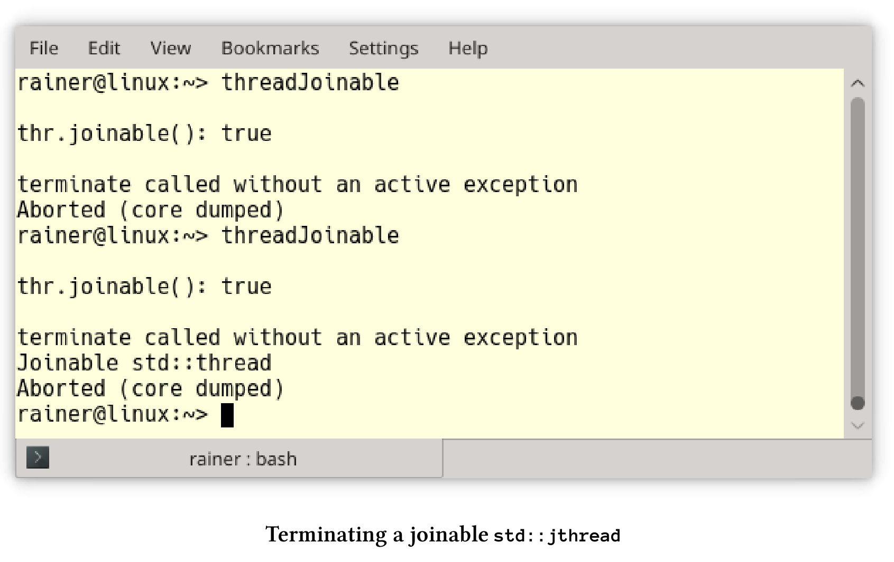

# 可協作中斷的線程

`std::jthread`代表協作線程，除了C++11添加的`std::thread`外，`std::jthread`還可以自動匯入啟動的線程，併發出中斷信號。它的特性在提案[P0660R8](http://www.open-std.org/jtc1/sc22/wg21/docs/papers/2019/p0660r8.pdf)中進行了詳細描述：可中斷的協程。

## 自動匯入

下面`std::thread`的行為並不樂觀。如果`std::thread`仍是可匯入的，則在其析構函數中調用`std::terminate`。如果調用了`thre .join()`或`thre .detach()`，則線程`thr`是可匯入的。

```c++
// threadJoinable.cpp

#include <iostream>
#include <thread>

int main() {

  std::cout << std::endl;
  std::cout << std::boolalpha;

  std::thread thr{ [] {std::cout << "Joinable std::thread" << std::endl; } };

  std::cout << "thr.joinable(): " << thr.joinable() << std::endl;

  std::cout << std::endl;

}
```

程序執行的時候，會崩潰掉。



運行了兩次，`std::thread`都會非法終止。第二次運行時，線程`thr`有顯示了消息:“Joinable std::thread”。

下一個示例中，我將頭文件`<thread>`替換為`“jthread.hpp”`。並使用C++20標準中的`std::jthread`。

```c++
// jthreadJoinable.cpp

#include <iostream>
#include "jthread.hpp"

int main() {

  std::cout << std::endl;
  std::cout << std::boolalpha;

  std::jthread thr{ [] {std::cout << "Joinable std::thread" << std::endl; } };

  std::cout << "thr.joinable(): " << thr.joinable() << std::endl;

  std::cout << std::endl;

}
```

現在，如果線程`thr`會在調用析構時還是可匯入的，則會自動匯入。


## 中斷std::jthread

為了理解其中的思想，我舉一個簡單的例子。

```c++
// interruptJthread.cpp

#include "jthread.hpp"
#include <chrono>
#include <iostream>

using namespace ::std::literals;

int main() {

  std::cout << std::endl;

  std::jthread nonInterruptable([] {
    int counter{ 0 };
    while (counter < 10) {
      std::this_thread::sleep_for(0.2s);
      std::cerr << "nonInterruptable: " << counter << std::endl;
      ++counter;
    }
    });

  std::jthread interruptable([](std::stop_token stoken) {
    int counter{ 0 };
    while (counter < 10) {
      std::this_thread::sleep_for(0.2s);
      if (stoken.stop_requested()) return;
      std::cerr << "interruptable: " << counter << std::endl;
      ++counter;
    }
    });

  std::this_thread::sleep_for(1s);

  std::cerr << std::endl;
  std::cerr << "Main thread interrupts both jthreads" << std::endl;
  nonInterruptable.request_stop();
  interruptable.request_stop();

  std::cout << std::endl;

}
```

主程序中啟動了兩個線程`nonInterruptable`和`interruptable`(第13行和第22行)。與線程`nonInterruptable`不同，線程`interruptable `會獲取一個`std::stop_token`，並在26行使用它來檢查線程是否被中斷:`stoken.stop_requested()`。在中斷的情況下返回Lambda函數，然後線程結束。`interruptable.request_stop() `(第37行)觸發線程的結束。而`nonInterruptable.request_stop()`並沒有什麼效果。


下面來了解停止令牌、匯入線程和條件變量的更多細節。

## 停止令牌

`jthread`的附加功能基於`std::stop_token`、`std::stop_callback`和`std::stop_source`。

**std::stop_token , std::stop_source 和std::stop_callback**

`std::stop_token`、`std::stop_callback`或`std::stop_source`使其能夠異步請求執行停止，或查詢執行是否收到了停止信號。可以將`std::stop_token`傳遞給操作，然後使用它來主動輪詢停止請求的令牌，或者通過`std::stop_callback`註冊回調。停止請求由`std::stop_source`發送，這個信號影響所有相關的`std::stop_token`。`std::stop_source`、`std::stop_token`和`std::stop_callback`共享停止狀態的所有權，其中`request_stop()`、`stop_requested()`和`stop_possible()`是原子操作。

`std::stop_source`和`std::stop_token`組件為停止處理提供了以下屬性。

`std::stop_source src`的成員函數

|       成員函數       |                           功能描述                           |
| :------------------: | :----------------------------------------------------------: |
|   src.get_token()    | 如果!stop_possible()，則構造一個不共享stop的stop_token對象狀態；否則，構造一個stop_token對象，並共享使用*this的停止狀態 |
| src.stop_possible()  |             如果停止源可以用於請求停止，則為true             |
| src.stop_requested() | 如果其中一個所有者調用了stop_possible()和request_stop()，則為true。 |
|  src.request_stop()  | 如果!stop_possible()或stop_requested()，則調用沒有效果；否則，提出一個停止請求，以便同步調用stop_requested() == true和所有已註冊的回調。 |

` std::stop_token stoken`的成員函數

|        成員函數         |                           功能描述                           |
| :---------------------: | :----------------------------------------------------------: |
| stoken.stop_possible()  |        如果後續調用stop_required()將永遠不會返回true         |
| stoken.stop_requested() | 如果在相關的std::stop_source上調用了request_stop()，則為true，否則為false |

如果`std::stop_token`臨時禁用了，那麼可以用默認構造的令牌替換它。默認構造的令牌無效。下面的代碼片段展示了，如何禁用和啟用線程接受信號的功能。

臨時禁用一個`std::stop_token`

```c++
std::jthread jthr([](std::stop_token stoken){
 ...
 std::stop_token interruptDisabled;
 std::swap(stoken, interruptDisabled);
 ...
 std::swap(stoken, interruptDisabled);
 ...
}
```

`std::stop_token interruptDisabled`是無效的。這意味著，從第4行到第5行停止令牌被禁用，第6行才啟用。

下面的示例展示了回調的用法。

```c++
// invokeCallback.cpp

#include "jthread.hpp"
#include <chrono>
#include <iostream>
#include <vector>

using namespace ::std::literals;

auto func = [](std::stop_token stoken) {
  int counter{ 0 };
  auto thread_id = std::this_thread::get_id();
  std::stop_callback callBack(stoken, [&counter, thread_id] {
    std::cout << "Thread id: " << thread_id
      << "; counter : " << counter << std::endl;
    });
  while (counter < 10) {
    std::this_thread::sleep_for(0.2s);
    ++counter;
  }
};

int main() {

  std::cout << std::endl;

  std::vector<std::jthread> vecThreads(10);
  for (auto& thr : vecThreads)thr = std::jthread(func);

  std::this_thread::sleep_for(1s);

  for (auto& thr : vecThreads)thr.request_stop();

  std::cout << std::endl;

}
```

這10個線程中的每個都調用Lambda函數func(第10 - 21行)。第13 - 16行中的回調顯示線程id和計數器。由於主線程的睡眠時間為1秒，子線程的睡眠時間為1秒，所以調用回調時計數器為4。`request_stop()`會在每個線程上觸發回調。


**匯入線程**

`std::jhread`是一個`std::thread`變種，它具有發出中斷信號，並自動匯入的附加功能。為了支持這個功能，它需要一個`std::stop_token`。

`std::jthread jthr`停止令牌的成員函數

|        成員函數        |         功能描述         |
| :--------------------: | :----------------------: |
| jthr.get_stop_source() |      返回stop_token      |
|  jthr.request_stop()   | 與src.request_stop()相同 |

**condition_variable_any成員函數wait的新重載**

`std::condition_variable_any`的三個`wait`變體`wait_for`和`wait_until`將有新的重載，新的重載會使用`std::stop_token`。

```c++
template <class Predicate>
 bool wait_until(Lock& lock,
 Predicate pred,
 stop_token stoken);

template <class Clock, class Duration, class Predicate>
 bool wait_until(Lock& lock,
 const chrono::time_point<Clock, Duration>& abs_time,
 Predicate pred,
 stop_token stoken);

template <class Rep, class Period, class Predicate>
 bool wait_for(Lock& lock,
 const chrono::duration<Rep, Period>& rel_time,
 Predicate pred,
 stop_token stoken);
```

這個新的重載需要一個謂詞函數。該版本在傳入的`std::stop_token stoken`發出中斷信號時，得到通知。這三個重載相當於下面的表達式：

```c++
// wait_until in lines 1 - 4
while(!pred() && !stoken.stop_requested()) {
  wait(lock, [&pred, &stoken] {
  	return pred() || stoken.stop_requested();
  });
}
return pred();

// wait_until in lines 6 - 10
while(!pred() && !stoken.stop_requested() && Clock::now() < abs_time) {
  cv.wait_until(lock,
  abs_time,
  [&pred, &stoken] {
  	return pred() || stoken.stop_requested();
  });
}
return pred();

// wait_for in lines 12 - 16
return wait_until(lock, chrono::steady_clock::now() + rel_time, std::move(pred), std\
::move(stoken));
```

調用`wait`之後，可以對停止請求進行檢查。

```c++
cv.wait_until(lock, predicate, stoken);
if (stoken.stop_requested()){
	// interrupt occurred
}
```

