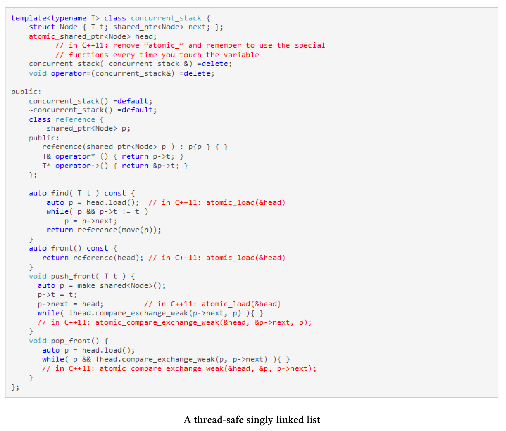

# 原子智能指針

`std::shared_ptr`由控制塊和相關資源組成。`std::shared_ptr`能夠保證控制塊是線程安全的，但是對相關資源的訪問就不是了。這意味著，修改引用計數器是一個原子操作，可以確保資源刪除一次。

> **線程安全的重要性** 
>
> 這裡只說明`std::shared_ptr`具有定義良好的多線程語義是有多麼重要。乍一看，使用`std::shared_ptr`並不是多線程程序的明智選擇。根據定義，它是共享和可變的，是數據競爭和未定義行為的理想對象。另一方面，現代C++中有一條準則：不要接觸內存。這意味著在多線程程序中，要儘可能使用智能指針。

關於原子智能指針的[N4162](http://wg21.link/n4162)提議，直接解決了當前智能指針實現的缺陷。這些缺陷可以歸結為以下三點：一致性、正確性和高效性。下面將概述這三點，詳系內容可參見提案N4162。

* 一致性：`std::shared_ptr`對非原子數據類型，只能進行原子操作。
* 正確性：因為正確的使用方式是基於嚴格的規則，所以使用全局性的原子操作非常容易出錯。很容易忘記使用原子操作——例如，使用`ptr = localPtr`代替`std::atomic_store(&ptr, localPtr)`。由於數據競爭，結果是未定義的。如果使用原子智能指針，系統將不允許數據競爭的出現。
* 高效性：與`atomic_*`函數相比，原子智能指針有很大的優勢。原子版本是為特殊用例設計的，可以在內部使用`std::atomic_flag`作為一種低開銷的自旋鎖。如果將指針函數的非原子版設計為線程安全的，並用於單線程場景，那就太大材小用了，並且還會受到性能上的懲罰。

對我來說，正確性是最重要的。為什麼?答案就在提案中。這個建議提供了一個線程安全的單鏈表，它支持插入、刪除和搜索元素，並且這個單鏈表以無鎖的方式實現。

## 線程安全的單鏈表

需要使用C++11編譯器編譯的地方都用紅色標記。這個鏈表，使用原子智能指針實現要容易得多，也不容易出錯。C++20的類型系統不允許在原子智能指針上使用非原子操作。

[N4162](http://wg21.link/n4162)提議將`std::atomic_shared_ptr`和`std::atomic_weak_ptr`作為原子智能指針。將它們合併到主流的ISO C++標準中，就變成了`std::atomic`: `std::atomicstd::shared_ptr<T>`和`std::atomicstd::weak_ptr<T>`偏特化模板。

因此，`std::shared_ptr`的原子操作在C++20中是廢棄的。