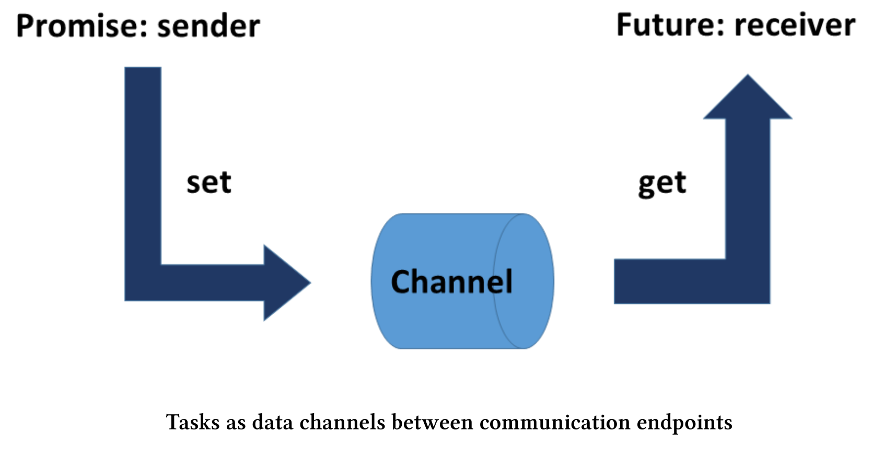

# 擴展特性

promise和future形式的任務在C++11中的名聲很微妙。一方面，它們比線程或條件變量更容易使用；另一方面，也有明顯的不足——不能合成。C++20/23中彌補了這個缺陷。

我曾經以`std::async`、`std::packaged_task`或`std::promise`和`std::future`的形式，寫過關於任務的文章。C++20/23中，我們可以使用加強版的future。

## 併發技術標準 v1

**std::future**

擴展future很容易解釋。首先，擴展了C++11的`std::future`接口；其次，一些新功能可組合創建特殊的future。先從第一點開始說起：

擴展future有三種新特性:

* 展開構造函數，可用於展開已包裝的外部future(`future<future<T>>`)。
* 如果共享狀態可用，則返回謂詞is_ready。
*  添加了可延續附加到future的方法。

起初，future的狀態可以是valid或ready。

**valid與ready**

*  valid: 如果future具有共享狀態(帶有promise)，那麼它就是有效的。這並不是必須的，因為可以默認構造一個沒有promise的`std::future`。
* ready: 如果共享狀態可用，future就已經準備好了。換句話說，如果promise已經完成，則future就已經準備好了。

因此，`(valid == true)`是`(ready == true)`的一個必要不充分條件。

我對promise和future的建模就是數據通道的兩個端點。



現在，valid和ready的區別就非常自然了。如果有一個數據通道的promise，則future的狀態是valid。如果promise已經將其結果放入數據通道中，則future的狀態是ready。

現在，為了延遲future，我們來瞭解一下then。

**使用then的延遲**

then具有將一個future附加到另一個future的能力，這樣一個future就能被另一個future所嵌套。展開構造函數的任務是對外部future進行展開的。

> **N3721提案**
>
> 迎來第一個代碼段之前，必須介紹一下[N3721](https://isocpp.org/files/papers/N3721.pdf)提案。本節的大部分內容是關於“`std::future<T>`和相關API”的改進建議。奇怪的是，提案作者最初沒有使用`get`獲取future最後的結果。因此，我在示例添加了`res.get`，並將結果保存在變量`myResult`中，並修正了一些錯別字。

```c++
#include <future>
using namespace std;
int main() {

  future<int> f1 = async([]() {return123; });
  future<string> f2 = f1.then([](future<int> f) {
    return to_string(f.get()); // here .get() won't block
    });

  auto myResult = f2.get();

}
```

`to_string(f.get())`(第7行)和`f2.get()`(第10行)之間有細微的區別。正如我在代碼片段中已經提到的：第一個調用是非阻塞/異步的，第二個調用是阻塞/同步的。`f2.get() `會一直等待，直到future鏈的結果可用。這種方法也適用於長鏈似的調用：`f1.then(…).then(…).then(…).then(…).then(…)`。最後，阻塞式調用`f2.get()`獲取結果。

**std::async , std::packaged_task和std::promise**

關於`std::async`、`std::package_task`和`std::promise`的擴展沒有太多可說的。那為什麼還要提一下，是因為在C++ 20/23中這三種擴展都會返回擴展了的future。

future的構成令人越來越興奮了，現在我們可以組合異步任務了。

**創建新future**

C++20獲得了四個用於創建新future的新函數。這些函數是`std::make_ready_future`、`std::make_execptional_future`、`std::when_all`和`std::when_any`。首先，讓我們看看`std::make_ready_future`和`std::make_exceptional_future`。

**std::make_ready_future和std::make_exceptional_future**

這兩個功能都立即創建了一個處於ready狀態的future 。第一種情況下，future是有價值的；第二種情況下是出現了異常。一開始看起來很奇怪的事情，但細想卻很有道理。C++11中，創建一個future需要promise。即使共享狀態可用，這也是必要的。

使用make_ready_future創建future

```c++
future<int> compute(int x) {
  if (x < 0) return make_ready_future<int>(-1);
  if (x == 0) return make_ready_future<int>(0);
  future<int> f1 = async([]() { return do_work(x); });
  return f1;
}
```

因此，如果(x > 0)保持不變，則只能通過promise來計算結果。

簡短說明一下：這兩個函數都是單子(monad)中返回的函數掛件。現在，讓我們從future的合成開始說起。

**std::when_any和std::when_all**

這兩種功能有很多共同之處。首先，來看看輸入：

```c++
template < class InputIt >
auto when_any(InputIt first, InputIt last)
	-> future<when_any_result<
		std::vector<typename std::iterator_traits<InputIt>::value_type>>>;

template < class... Futures >
auto when_any(Futures&&... futures)
	-> future<when_any_result<std::tuple<std::decay_t<Futures>...>>>;

template < class InputIt >
auto when_all(InputIt first, InputIt last)
	-> future<std::vector<typename std::iterator_traits<InputIt>::value_type>>;

template < class... Futures >
auto when_all(Futures&&... futures)
	-> future<std::tuple<std::decay_t<Futures>...>>;
```

這兩個函數都接受一對關於future範圍的迭代器，或任意數量的future迭代器。二者最大的區別是，在使用迭代器對的情況下，future必須是相同類型的；而對於任意數量的future，可以使用不同類型的future，甚至可以混用`std::future`和`std::shared_future`。

函數的輸出，取決於是否使用了一對迭代器或任意數量的future(可變參數模板)。這兩個函數都返回一個future。如果使用一對迭代器，將得到`std::vector`: `future<vector<future<R>>>`中的future。如果使用可變參數模板，會得到`std::tuple`: `future<tuple<future<R0>, future<R1>,…>>`。

已經瞭解了它們的共性。如果所有輸入future(when_all)或任何輸入future(when_any)都處於ready狀態，那麼這兩個函數返回的future也就處於ready狀態。

接下來的兩個例子，會展示`std::when_all`和`std::when_any`的用法。

**std::when_all**

Future的組合與`std::when_all`

```c++
#include <future>

using namespace std;

int main() {

  shared_future<int> shared_future1 = async([] {return intResult(123); });
  future<string> future2 = async([]() {return stringResult("hi"); });

  future<tuple<shared_future<int>, future<string>>>all_f =
    when_all(shared_future1, future2);

  future<int> result = all_f.then(
    [](future<tuple<shared_future<int>, future<string>>> f) {
      return doWork(f.get());
    });

  auto myResult = result.get();
}
```

`future all_f`(第10行)由future的`shared_future1`(第7行)和`future2`(第8行)組成。如果所有future都準備好了，則執行第13行獲取future的結果。本例中，將執行第15行中的`all_f`。結果保存在future中，可以在第18行進行獲取。

**std::when_any**

Future的組合與std::when_any

```c++
#include <future>
#include <vector>

using namespace std;

int main() {

  vector<future<int>> v{ ..... };
  auto future_any = when_any(v.begin(), v.end());

  when_any_result<vector<future<int>>> result = future_any.get();

  future<int>& read_future = result.futures[result.index];

  auto myResult = ready_future.get();
}
```

when_any中的future可以在第11行中獲取結果。`result`會提供已經準備就緒future的信息。如果不使用when_any_result，就沒必要查詢每個future是否處於ready狀態了。

如果它的某個輸入future處於ready狀態，那麼future_any就處於ready狀態。第11行中的`future_any.get()`會返回future的結果。通過使用`result.futures[result.index]`(第13行)，可以獲取ready_future，並且由於使用`ready_future.get()`，也可以對任務的結果進行查詢。

如[P0701r1](http://www.open-std.org/jtc1/sc22/wg21/docs/papers/2017/p0701r1.html)中描述，“它們沒想象的那樣通用、有表現力或強大”，其既不是標準化的future，也不是併發的[TS v1 future](http://en.cppreference.com/w/cpp/experimental/concurrency)。此外，執行者作為執行的基本構件，必須與新的future相統一。

## 統一的Future

標準化和併發TSv1的future有什麼缺點嗎?

**缺點**

上述文件(P0701r1)很好地說明瞭future的不足之處。

**future/promise不應該耦合到std::thread執行代理中**

C++11只有一個executor:`std::thread`。因此，future和`std::thread`是不可分割的。這種情況在C++17和STL的並行算法中得到了改變，新的executor中變化更大，並可以使用它來配置future。例如，future可以在單獨的線程中運行，也可以在線程池中運行，或者只是串行運行。

**在哪裡持續調用了.then ?**

下面的例子中，有一個簡單的延續。

使用`std::future`的延續

```c++
future<int> f1 = async([]() { return 123; });
future<string> f2 = f1.then([](future<int> f) {
	return to_string(f.get());
});
```

問題是：延續應該在哪裡運行?有一些可能性:

1.  消費端：消費者執行代理總是執行延續。
2. 生產端：生產者執行代理總是執行延續。
3.  inline_executor語義：如果在設置延續時，共享狀態已就緒，則使用者線程將執行該延續。如果在設置延續時，共享狀態還沒有準備好，則生產者線程將執行該延續。
4.  thread_executor語義：使用新`std::thread`執行延續。

前兩種可能性有一個顯著的缺點：它們會阻塞。第一種情況下，使用者阻塞，直到生產者準備好為止。第二種情況下，生產者阻塞，直到消費者準備好。

下面是文檔[P0701r1](http://www.open-std.org/jtc1/sc22/wg21/docs/papers/2017/p0701r1.html)中的一些不錯的executor傳播用例:

```c++
auto i = std::async(thread_pool, f).then(g).then(h);
// f, g and h are executed on thread_pool.

auto i = std::async(thread_pool, f).then(g, gpu).then(h);
// f is executed on thread_pool, g and h are executed on gpu.

auto i = std::async(inline_executor, f).then(g).then(h);
// h(g(f())) are invoked in the calling execution agent.
```

**將future傳遞給.then的延續是不明智的**

因為傳遞給continuation的是future，而不是它的值，所以語法非常複雜。越多的傳遞會讓表達式變得非常複雜。

```c++
std::future<int> f1 = std::async([]() { return 123; });
std::future<std::string> f2 = f1.then([](std::future<int> f) {
	return std::to_string(f.get());
});
```

現在，我假設這個值可以傳遞，因為`std::future<int>`重載了`to_string`。

使用`std::future`傳遞值的延續

```c++
std::future<int> f1 = std::async([]() { return 123; });
std::future<std::string> f2 = f1.then(std::to_string);
```

**when_all和when_any的返回類型讓人費解**

介紹`std::when_all`和`std::when_any`的這兩章，展示了它們相當複雜的使用方法。

**future析構中的條件塊必須去掉**

觸發即忘的future看起來非常有用，但也有一個很大的限制。由`std::async`創建的future會等待它的析構函數，直到對應的promise完成。看起來併發的東西，實際是串行運行的。根據文檔P0701r1的觀點，這是不可接受的，並且非常容易出錯。

我在參考章節中描述了觸發即忘future的特殊行為。

**當前值和future值應該易於組合**

C++11中，沒有簡易的方法來創建future，必須從promise開始。

在當前標準中創造future 

```c++
std::promise<std::string> p;
std::future<std::string> fut = p.get_future();
p.set_value("hello");
```

這可能會因為併發技術規範v1中的`std::make_ready_future`函數而改變。

使用併發TS v1標準創建future

```c++
std::future<std::string> fut = make_ready_future("hello");
```

使用future和非future參數將使我們的工作更加舒服。

```c++
bool f(std::string, double, int);

std::future<std::string> a = /* ... */;
std::future<int> c = /* ... */;

std::future<bool> d1 = when_all(a, make_ready_future(3.14), c).then(f);
// f(a.get(), 3.14, c.get())

std::future<bool> d2 = when_all(a, 3.14, c).then(f);
// f(a.get(), 3.14, c.get())
```

併發技術標準v1中，`d1`和`d2`都是不可能的。

**五個新概念**

提案[1054R0](http://www.open-std.org/jtc1/sc22/wg21/docs/papers/2018/p1054r0.html)提出了future和promise的5個新概念。

* FutureContinuation：使用future的值或異常作為參數調用的可調用對象。
* SemiFuture：它可以被綁定到一個執行器上，併產生一個`ContinuableFuture`的操作`(f = sf.via(exec))`。
* ContinuableFuture：它細化了SemiFuture，實例可以在`(f.then(c))`上附加一個`FutureContinuation`。當future處於ready狀態時，就會在future關聯執行器上執行。
* SharedFuture：它細化了ContinuableFuture，實例可以附加多個FutureContinuation。
* Promise：每一個promise都與一個future相關聯，當future中設置好一個值或一個異常時，future處於ready狀態。

文章還對這些新概念進行了詳細描述。

future和promise的五個新概念

```c++
template <typename T>
struct FutureContinuation
{
  // At least one of these two overloads exists:
  auto operator()(T value);
  auto operator()(exception_arg_t, exception_ptr exception);
};

template <typename T>
struct SemiFuture
{
  template <typename Executor>
  ContinuableFuture<Executor, T> via(Executor&& exec) &&;
};

template <typename Executor, typename T>
struct ContinuableFuture
{
  template <typename RExecutor>
  ContinuableFuture<RExecutor, T> via(RExecutor&& exec) &&;
  
  template <typename Continuation>
  ContinuableFuture<Executor, auto> then(Continuation&& c) &&;
};

template <typename Executor, typename T>
struct SharedFuture
{
  template <typename RExecutor>
  ContinuableFuture<RExecutor, auto> via(RExecutor&& exec);
  
  template <typename Continuation>
  SharedFuture<Executor, auto> then(Continuation&& c);
};

template <typename T>
struct Promise
{
  void set_value(T value) &&;
  
  template <typename Error>
  void set_exception(Error exception) &&;
  
  bool valid() const;
};
```

根據這些概念，提出一些意見:

* 可以使用值或異常調用FutureContinuation。它是一個可調用的單元，使用future的值或異常。
* 所有future(SemiFuture 、ContinuableFuture和SharedFuture)都有一個方法，可以通過該方法指定一個執行器並返回一個ContinuableFuture，並且可以通過使用不同的執行程序將一種future類型轉換為另一種類型。
* 只有一個ContinuableFuture或SharedFuture有then方法用來繼續。then方法可以接受FutureContinuation，並返回ContinuableFuture。
* SharedFuture是一個可複製的future 。
* Promise可以設置值或異常。

**未完成的工作**

[提案1054R0]( http://www.open-std.org/jtc1/sc22/wg21/docs/papers/2018/p1054r0.html)中為未來留下了幾個需要完成的工作：

* future和promise還有前進空間。
* 非併發執行代理使用future和promise時需要同步。
* `std::future/std::promise`的互操作性.
* future的展開，支持包括`future<future<T>>`的更高級形式。
* when_all/when_any/when_n 
* async 

