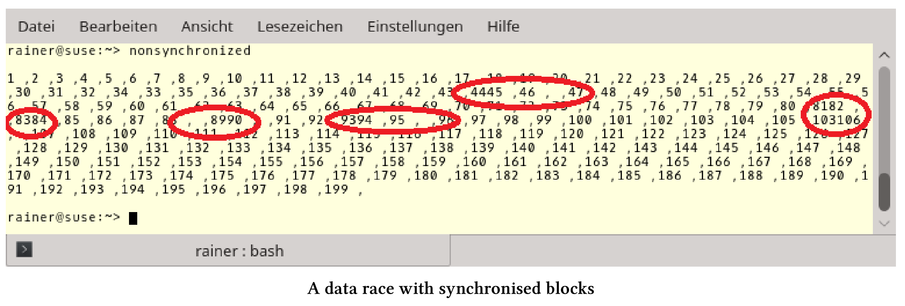

# 事務性內存

事務性內存是基於數據庫理論中的事務概念。事務性內存可讓使用線程變得更加容易，原因有二：第一，避免數據競爭和死鎖；第二，可以組合事務。

事務具有以下屬性的操作：原子性(Atomicity)、一致性(Consistency)、獨立性(Isolation)和持久性(Durability)(ACID)。除了持久性和存儲操作結果之外，所有的屬性都適用於C++的事務性內存。現在還有三個問題。

## ACI(D)

ACID是數據庫事務正確執行的四個基本要素的縮寫。

對於由一些語句組成的原子塊，原子性、一致性和獨立性意味著什麼呢?

原子塊

```c++
atomic{
  statement1;
  statement2;
  statement3;
}
```

原子性：執行塊中的所有語句或不執行塊中任何語句。

一致性：系統始終處於一致的狀態，所有事務確定統一的順序。

獨立性：每個事務在完全獨立的情況下運行。

如何應用這些屬性?事務會記住初始狀態，並且在不同步的情況下執行。如果在執行過程中發生衝突，事務將中斷，並恢復到初始狀態，此回滾操作將再次執行事務。如果事務結束時，初始狀態仍然存在，則為提交事務。衝突通常可以通過標記狀態的引用來檢測。

事務是一種推測行為，只有在初始狀態時才會提交。與互斥鎖相比，它是一種相對樂觀的方法。事務在不同步的情況下執行，只有在沒有衝突的情況下才會釋放。互斥是一種較為悲觀的方法。首先，互斥確保沒有其他線程可以進入臨界區。接下來，如果線程是互斥量的獨佔所有者，那麼它將進入臨界區，從而阻塞其他線程。

C++以兩種方式支持事務性內存：同步塊和原子塊。

## 同步塊和原子塊

目前為止，只聊了事務，現在來聊下同步塊和原子塊，兩者可以相互封裝。更具體地說，同步塊不是事務，因為它們可以執行不安全事務。事務不安全的例子，類似於控制檯輸出的代碼無法撤消。因此，同步塊通常也稱為自由塊。

**同步塊**

同步塊的行為就像全局鎖一樣，這意味著所有同步塊都遵循相同的順序，特別對同步塊的所有更改，都可以在之後的同步塊中使用。由於事務的提交與啟動是同步的，所以在同步的塊之間存在著同步關係。它們會建立一個總順序，所以同步塊不會死鎖。互斥鎖保護的是程序的關鍵區域，而同步塊的則是保護整個程序。

這也就是為什麼下面的程序定義良好的原因。

一個同步塊

```c++
// synchronized.cpp

#include <iostream>
#include <vector>
#include <thread>

int i = 0;

void increment() {
  synchronized{
    std::cout << ++i << " ,";
  }
}

int main() {

  std::cout << std::endl;

  std::vector<std::thread> vecSyn(10);
  for (auto& thr : vecSyn)
    thr = std::thread([] {for (int n = 0; n < 10; ++n)increment(); });
  for (auto& thr : vecSyn)thr.join();

  std::cout << "\n\n";

}
```

第7行中的變量`i`是一個全局變量，同步塊中的操作是事務不安全的，但是程序是定義良好的。10個線程併發調用函數`increment`(第21行)，10次增加第11行的變量`i`，對`i`和`std::cout`的訪問是完全按順序進行的，這就是同步塊的特性。

程序返回預期的結果。`i`的值是按遞增的順序寫的，中間用逗號隔開。下面是輸出。


那麼數據競爭呢?可以把它們與同步塊放在一起。對源代碼的一個小修改就可以引入數據競爭。

同步塊的數據競爭

```c++
// nonsynchronized.cpp

#include <chrono>
#include <iostream>
#include <vector>
#include <thread>

using namespace std::chrono_literals;


int i = 0;

void increment() {
  synchronized{
    std::cout << ++i << " ,";
    this_thread::sleep_for(1ns);
  }
}

int main() {

  std::cout << std::endl;

  std::vector<std::thread> vecSyn(10);
  std::vector<std::thread> vecUnsyn(10);

  for (auto& thr : vecSyn)
    thr = std::thread([] {for (int n = 0; n < 10; ++n)increment(); });
  for (auto& thr : vecUnsyn)
    thr = std::thread([] {for (int n = 0; n < 10; ++n)increment(); });

  for (auto& thr : vecSyn)thr.join();
  for (auto& thr : vecSvecUnsynyn)thr.join();

  std::cout << "\n\n";

}
```

為了觀察到數據競爭，我讓同步塊休眠了1納秒(第16行)。同時，在沒有沒有同步塊(第30行)時，訪問輸出流`std::cout`。總共有20個線程增加了全局變量`i`，其中一半沒有同步，所以輸出顯示就出問題了。



我在有輸出的問題的輸出周圍畫上紅色的圓圈。這些是`std::cout`由至少兩個線程同時寫入的位置。C++11保證字符是自動編寫的，而這並不是問題的原因。更糟糕的是，變量`i`是由多於兩個線程進行修改的，這就是一場數據競賽。因此，程序會出現未定義行為。計數器的最終結果應該是200，但結果是199。這意味著，計數中有值被覆蓋了。

同步塊的順序也適用於原子塊。

**原子塊**

可以在同步塊中執行事務不安全代碼，但不能在原子塊中執行。原子塊有三種形式：`atomic_noexcept`、`atomic_commit`和`atomic_cancel`。三個後綴`_noexcept`、`_commit`和`_cancel`定義了原子塊如何對異常進行管理：

atomic_noexcept：如果拋出異常，將調用`std::abort`中止程序。

atomic_cancel：默認情況下，會調用`std::abort`。如果拋出一個終止事務的安全異常，則不存在這種情況。在這種情況下，事務將取消，並進入初始狀態並拋出異常。

atomic_commit：如果拋出異常，則提交事務。

具有事務安全異常的有: [std::bad_alloc](http://en.cppreference.com/w/cpp/memory/new/bad_alloc), [std::bad_array_length]( https://www.cs.helsinki.fi/group/boi2016/doc/cppreference/reference/en.cppreference.com/w/cpp/memory/new/bad_array_length.html), [std::bad_array_new_length](http://en.cppreference.com/w/cpp/memory/new/bad_array_new_length), [std::bad_cast](http://en.cppreference.com/w/cpp/types/bad_cast), [std::bad_typeid](http://en.cppreference.com/w/cpp/types/bad_typeid), [std::bad_exception](http://en.cppreference.com/w/cpp/error/bad_exception), [std::exception](http://en.cppreference.com/w/cpp/error/exception), 以及所有(從這些異常中)派生出來的異常。

## transaction_safe與transaction_unsafe的代碼比較

可以將函數聲明為transaction_safe，或者將transaction_unsafe屬性附加到它。

transaction_safe與transaction_unsafe

```c++
int transactionSafeFunction() transaction_safe;

[[transaction_unsafe]] int transactionUnsafeFunction();
```

transaction_safe屬於函數類型，但transaction_safe是什麼意思?根據[N4265]( http://www.open-std.org/jtc1/sc22/wg21/docs/papers/2014/n4265.html), transaction_safe函數是一個具有transaction_safe定義的函數。如果不出現下列屬性定義，則該定義成立:

* 有volatile參數或變量。
* 有事務不安全的語句。
* 當函數體中使用一個類的構造和析構函數，而這個類具有volatile的非靜態成員。

當然，這個transaction_safe定義是不穩定的，你可以閱讀提案[N4265]( http://www.open-std.org/jtc1/sc22/wg21/docs/papers/2014/n4265.html) ，瞭解更多細節。

