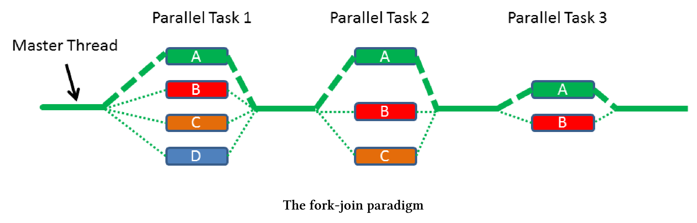

# 任務塊

任務塊使用fork-join範型來並行執行任務，其已經是[C++擴展並行性2版技術規範](http://www.open-std.org/jtc1/sc22/wg21/docs/papers/2018/n4742.html)的一部分。因此，我們很有可能在C++20中看到它們。

誰在C++中發明了任務塊?微軟的[Parallel Patterns Library (PPL)](https://en.wikipedia.org/wiki/Parallel_Patterns_Library)和英特爾的[Threading Building Blocks (TBB)](https://en.wikipedia.org/wiki/Threading_Building_Blocks)都參與了[N4441提案](http://www.open-std.org/jtc1/sc22/wg21/docs/papers/2015/n4411.pdf)。另外，Intel使用了他們的[Cilk Plus語言庫](https://en.wikipedia.org/wiki/Cilk)。

fork-join這個很容易理解。

## Fork和Join

解釋fork-join範式最直接的方法是使用圖形。



它是如何工作的?

創建者調用`define_task_block`或`define_task_block_restore_thread`，此調用會創建一個任務塊，該任務塊可以創建任務，也可以等待任務完成，同步位於任務塊的末尾。創建新任務是fork階段，任務塊的同步是工作流的聯接階段，這只是一個簡單的描述。讓我們來看一段代碼。

定義一個任務塊

```c++
template <typename Func>
int traverse(node& n, Func &&f){
  int left = 0, right = 0;
  define_task_block(
  	[&](task_block& tb){
      if (n.left) tb.run([&]{left = traverse(*n.left, f);});
      if (n.right) tb.run([&]{right = traverse(*n.right, f);});
    }
  );
  return f(n) + left + right;
}
```

traverse是一個函數模板，它在樹的每個節點上調用函數`f`。關鍵字`define_task_block`定義了任務塊，任務塊`tb`可以在任務塊中啟動一個新任務，這發生在第6行和第7行樹的左右分支上。第9行是任務塊的末端，因此是同步點。

> **HPX(高性能ParalleX)**
>
> 上面的例子來自[HPX (High-Performance ParalleX)](http://stellar.cct.lsu.edu/projects/hpx/)框架的文檔，它是一個通用的C++運行時，適用於任何規模的並行和分佈式應用程序。HPX已經實現了許多本章介紹的，即將發佈的C++ 20/23標準中的特性。

可以使用`define_task_block`函數或`define_task_block_restore_thread`函數定義一個任務塊。

## define_task_block與define_task_block_restore_thread

區別在於，`define_task_block_restore_thread`函數保證任務塊的創建者線程與任務塊完成後運行的線程是相同的，而`define_task_block`函數則相反。

define_task_block與define_task_block_restore_thread

```c++
  ...
  define_task_block([&](auto& tb){
    tb.run([&]{[]fun();});
    define_task_block_restore_thread([&](auot& tb){
      tb.run([&]{[]{func2();}); 
      define_task_block([&](auto& tb){
        tb.run([&]{func3();});
      });
      ...
      ...
    });
    ...
    ...
  });
  ...
  ...
```

任務塊確保最外層任務塊(第2 - 14行)的創建者線程，與完成任務塊後運行語句的線程完全相同。這意味著執行第2行的線程與執行第15和16行的線程相同。這種保證不適用於嵌套的任務塊，第6 - 8行任務塊的創建者線程不會自動執行第9行和第10行。現在執行第4行的創建者線程與執行第12行和第13行的線程是相同的，如果需要嵌套，則應該使用define_task_block_restore_thread函數(第4行)。

## 接口

任務塊的接口非常有限，不能構造、銷燬、複製或移動task_block類的實例。只能對其使用define_task_block函數或define_task_block_restore_thread函數。`task_block tb`在定義的任務塊範圍內活動，因此可以啟動新任務(`tb.run`)或等待(`tb.wait`)直到任務完成。

任務塊的最小接口

```c++
define_task_block([&](auto& tb){
  tb.run([&]{process(x1, x2)});
  if(x2==x3) tb.wait();
  process(x3, x4);
});
```

這段代碼在做什麼呢?第2行啟動了一個新任務，這個任務需要數據`x1`和`x2`才能進行，第4行使用數據`x3`和`x4`。如果`x2 == x3`為真，則必須保護變量不受共享訪問。這就是任務塊`tb`等待第2行任務完成的原因。

如果函數`task_block::run`或`task_block::wait`檢測到當前任務塊中有異常，則會拋出一個類似於`task_cancelled_exception`的異常。

## 調度器

調度器管理線程運行，這意味著決定誰執行任務不再是程序開發者的責任。線程只是一個實現細節。

執行新創建的任務有兩種策略。父線程表示創建者線程，子線程表示新任務。

竊取子任務：調度程序竊取其任務並執行它。

竊取父任務：現在調度器竊取任務塊`tb`本身執行任務。

[提案N4441](http://www.open-std.org/jtc1/sc22/wg21/docs/papers/2015/n4411.pdf)支持這兩種策略。

