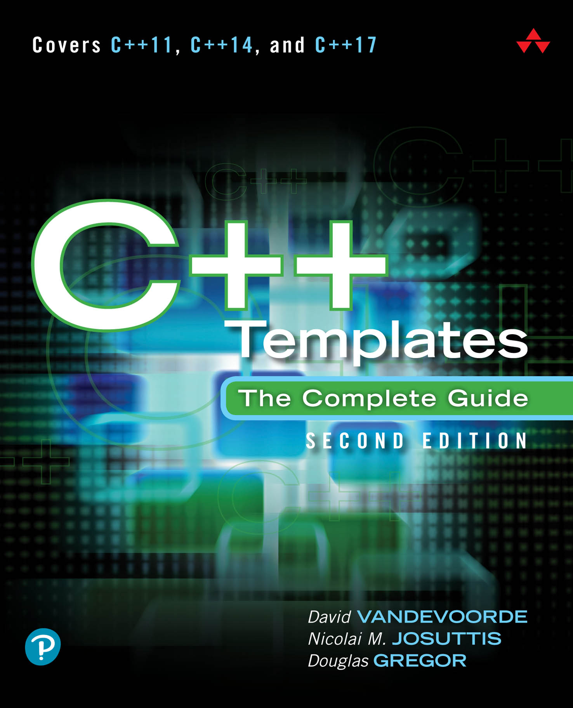

# C++ Templates

*Second Edition*

* 作者：David Vandevoorde，Nicolai M. Josuttis，Douglas Gregor
* 譯者：陳曉偉
* 首次發佈時間：2017年9月8日([來源](https://www.amazon.com/C-Templates-Complete-Guide-2nd/dp/0321714121))

> 翻譯是譯者用自己的思想，換一種語言，對原作者想法的重新闡釋。鑑於我的學識所限，誤解和錯譯在所難免。如果你能買到本書的原版，且有能力閱讀英文，請直接去讀原文。因為與之相較，我的譯文可能根本不值得一讀。
>
> 
 — 雲風，程序員修煉之道第2版譯者

PDF可在本庫的[Release頁面](https://github.com/xiaoweiChen/Cpp-Templates-2nd/releases)獲取。

## 本書概述

模板是C++中一個強大的特性，但對模板的誤解，並未隨著C++語言和開發社區的發展而消弭，從而無法使模板無法發揮其全力。本書的三位作者，同時作為C++專家，展示瞭如何使用現代模板來構建乾淨、快捷、高效、容易維護的軟件。

第二版對C++11、C++14和C++17標準進行了更新，對改進模板或與模板交互的特性進行了解釋，包括可變參數模板、泛型Lambda、類模板參數演繹、編譯時if、轉發引用和用戶定義文字。還深入研究了一些基本的語言概念(比如值類別)，幷包含了所有標準類型特徵。

本書從基本概念和相關語言特徵開始，其餘部分作為參考。先關注語言，再是編碼、高級應用程序和複雜的慣用法。過程中，示例清楚地說明瞭抽象概念，並演示了模板的最佳實踐。

#### 關鍵特性

- 準確理解模板的行為，避免陷阱

- 使用模板編寫有效、靈活、可維護的軟件

- 掌握有效的習語和技巧

- 保持性能或安全的情況下重用源碼

- C++標準庫中的泛型編程

- 預覽即將發佈的“概念"特性

  

## 適讀人群

如果您是使用C++的開發人員，想要學習或複習模板，請仔細閱讀第1部分。即使已經非常熟悉模板，快速瀏覽這一部分也有助於熟悉本書使用的編程方式和術語。該部分也涵蓋瞭如何組織模板相關代碼的內容。

可以按自己喜歡方式學習。第2部分中有模板更多的許多細節信息，也可以在第3部分中閱讀實用的編碼技術(並參考第2部分了解相關的語言問題)。如果閱讀這本書是為了應對開發中的具體問題，那麼後一種方法可能有助於問題的解決。

附錄包含了許多在正文中經常提到的信息，我們也試圖讓其變得更有趣。

根據經驗，學習新東西的最好方法是看例子。因此，可以在本書中找到大量的例子。有些只是用幾行代碼解釋一個抽象概念，而另一些是具體應用的完整源碼。後一種示例將通過註釋來說明需要包含程序代碼的文件。可以在這本書的網站<http://www.tmplbook.com>上找到這些文件。

## 作者簡介

**David Vandevoorde**在20世紀80年代後期開始用C++編程。從倫斯勒理工學院獲得博士學位後，成為惠普C++編譯器團隊的技術負責人。1999年，加入了愛迪生設計集團(EDG)，該集團的C++編譯器技術是業界領先的。他是C++標準委員會的活躍成員，也是comp.lang.c++新聞組的主持人(參與創辦)。也是《C++ Solutions》的作者，該書是《C++ Programming Language, 3rd Edition》的配套書籍。

**Nicolai M. Josuttis**因其暢銷的標準書籍《The C++ Standard Library - A Tutorial and Reference》而聞名於世，是一名獨立技術顧問，為電信、交通、金融和製造業設計面向對象的軟件。也是C++標準委員會的活躍成員，也是System Bauhaus的合夥人，System Bauhaus是一個由面向對象系統開發專家組成的德國團體。Josuttis還寫過其他幾本關於面向對象編程和C++的書。

**Douglas Gregor**是蘋果公司的高級Swift/C++/Objective-C編譯工程師，擁有倫斯勒理工學院的計算機科學博士學位，並在印第安納大學從事博士後工作。

## 本書相關

* github地址：<https://github.com/xiaoweiChen/Cpp-Templates-2nd>
* 譯文的LaTeX 環境配置：<https://www.cnblogs.com/1625--H/p/11524968.html>
* vscode中配置latex：<https://blog.csdn.net/Ruins_LEE/article/details/123555016>
* 開源示例：<https://github.com/downdemo/Cpp-Templates-2ed>
* 開源翻譯：

  * <https://github.com/Walton1128/CPP-Templates-2nd-->
  * <https://github.com/r00tk1ts/cpp-templates-2nd>
  * <https://www.zhihu.com/column/c_1397602018500890624>

