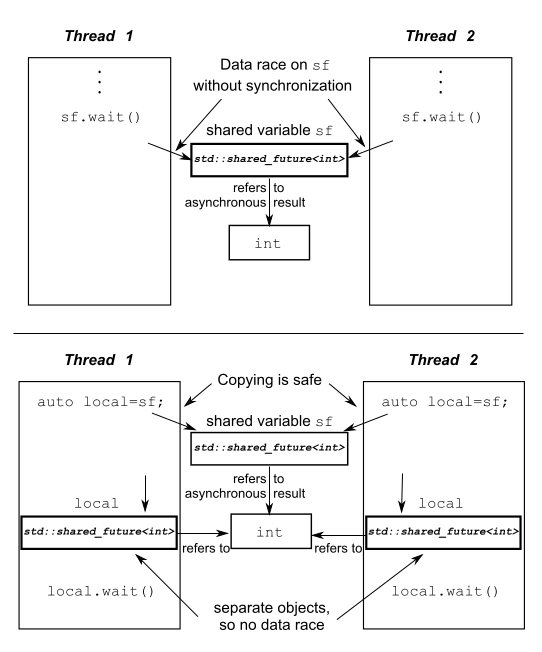

# 4.2 使用期望等待一次性事件

假設你乘飛機去國外度假。當你到達機場，並且辦理完各種登機手續後，你還需要等待機場廣播通知你登機，可能要等很多個小時。你可能會在候機室裡面找一些事情來打發時間，比如：讀書，上網，或者來一杯價格不菲的機場咖啡，不過從根本上來說你就在等待一件事情：機場廣播能夠登機的時間。給定的飛機班次再之後沒有可參考性；當你在再次度假的時候，你可能會等待另一班飛機。

`C++`標準庫模型將這種一次性事件稱為*期望*(future)。當一個線程需要等待一個特定的一次性事件時，在某種程度上來說它就需要知道這個事件在未來的表現形式。之後，這個線程會週期性(較短的週期)的等待或檢查，事件是否觸發(檢查信息板)；在檢查期間也會執行其他任務(品嚐昂貴的咖啡)。另外，在等待任務期間它可以先執行另外一些任務，直到對應的任務觸發，而後等待期望的狀態會變為*就緒*(ready)。一個“期望”可能是數據相關的(比如，你的登機口編號)，也可能不是。當事件發生時(並且期望狀態為就緒)，這個“期望”就不能被重置。

在C++標準庫中，有兩種“期望”，使用兩種類型模板實現，聲明在<future>頭文件中: 唯一*期望*(unique futures)(`std::future<>`)和*共享期望*(shared futures)(`std::shared_future<>`)。這是仿照`std::unique_ptr`和`std::shared_ptr`。`std::future`的實例只能與一個指定事件相關聯，而`std::shared_future`的實例就能關聯多個事件。後者的實現中，所有實例會在同時變為就緒狀態，並且他們可以訪問與事件相關的任何數據。這種數據關聯與模板有關，比如`std::unique_ptr` 和`std::shared_ptr`的模板參數就是相關聯的數據類型。在與數據無關的地方，可以使用`std::future<void>`與`std::shared_future<void>`的特化模板。雖然，我希望用於線程間的通訊，但是“期望”對象本身並不提供同步訪問。當多個線程需要訪問一個獨立“期望”對象時，他們必須使用互斥量或類似同步機制對訪問進行保護，如在第3章提到的那樣。不過，在你將要閱讀到的4.2.5節中，多個線程會對一個`std::shared_future<>`實例的副本進行訪問，而不需要期望同步，即使他們是同一個異步結果。

最基本的一次性事件，就是一個後臺運行出的計算結果。在第2章中，你已經瞭解了`std::thread` 執行的任務不能有返回值，並且我能保證，這個問題將在使用“期望”後解決——現在就來看看是怎麼解決的。

### 4.2.1 帶返回值的後臺任務

假設，你有一個需要長時間的運算，你需要其能計算出一個有效的值，但是你現在並不迫切需要這個值。可能你已經找到了生命、宇宙，以及萬物的答案，就像道格拉斯·亞當斯[1]一樣。你可以啟動一個新線程來執行這個計算，但是這就意味著你必須關注如何傳回計算的結果，因為`std::thread`並不提供直接接收返回值的機制。這裡就需要`std::async`函數模板(也是在頭文`<future>`中聲明的)了。

當任務的結果你不著急要時，你可以使用`std::async`啟動一個異步任務。與`std::thread`對象等待的方式不同，`std::async`會返回一個`std::future`對象，這個對象持有最終計算出來的結果。當你需要這個值時，你只需要調用這個對象的get()成員函數；並且會阻塞線程直到“期望”狀態為就緒為止；之後，返回計算結果。下面清單中代碼就是一個簡單的例子。

清單4.6 使用`std::future`從異步任務中獲取返回值

```
#include <future>
#include <iostream>

int find_the_answer_to_ltuae();
void do_other_stuff();
int main()
{
  std::future<int> the_answer=std::async(find_the_answer_to_ltuae);
  do_other_stuff();
  std::cout<<"The answer is "<<the_answer.get()<<std::endl;
}
```

與`std::thread` 做的方式一樣，`std::async`允許你通過添加額外的調用參數，向函數傳遞額外的參數。當第一個參數是一個指向成員函數的指針，第二個參數提供有這個函數成員類的具體對象(不是直接的，就是通過指針，還可以包裝在`std::ref`中)，剩餘的參數可作為成員函數的參數傳入。否則，第二個和隨後的參數將作為函數的參數，或作為指定可調用對象的第一個參數。就如`std::thread`，當參數為*右值*(rvalues)時，拷貝操作將使用移動的方式轉移原始數據。這就允許使用“只移動”類型作為函數對象和參數。來看一下下面的程序清單：

 清單4.7 使用`std::async`向函數傳遞參數
 
```
#include <string>
#include <future>
struct X
{
  void foo(int,std::string const&);
  std::string bar(std::string const&);
};
X x;
auto f1=std::async(&X::foo,&x,42,"hello");  // 調用p->foo(42, "hello")，p是指向x的指針
auto f2=std::async(&X::bar,x,"goodbye");  // 調用tmpx.bar("goodbye")， tmpx是x的拷貝副本
struct Y
{
  double operator()(double);
};
Y y;
auto f3=std::async(Y(),3.141);  // 調用tmpy(3.141)，tmpy通過Y的移動構造函數得到
auto f4=std::async(std::ref(y),2.718);  // 調用y(2.718)
X baz(X&);
std::async(baz,std::ref(x));  // 調用baz(x)
class move_only
{
public:
  move_only();
  move_only(move_only&&)
  move_only(move_only const&) = delete;
  move_only& operator=(move_only&&);
  move_only& operator=(move_only const&) = delete;
  
  void operator()();
};
auto f5=std::async(move_only());  // 調用tmp()，tmp是通過std::move(move_only())構造得到
```

在默認情況下，“期望”是否進行等待取決於`std::async`是否啟動一個線程，或是否有任務正在進行同步。在大多數情況下(估計這就是你想要的結果)，但是你也可以在函數調用之前，向`std::async`傳遞一個額外參數。這個參數的類型是`std::launch`，還可以是`std::launch::defered`，用來表明函數調用被延遲到wait()或get()函數調用時才執行，`std::launch::async` 表明函數必須在其所在的獨立線程上執行，`std::launch::deferred | std::launch::async`表明實現可以選擇這兩種方式的一種。最後一個選項是默認的。當函數調用被延遲，它可能不會在運行了。如下所示：

```
auto f6=std::async(std::launch::async,Y(),1.2);  // 在新線程上執行
auto f7=std::async(std::launch::deferred,baz,std::ref(x));  // 在wait()或get()調用時執行
auto f8=std::async(
              std::launch::deferred | std::launch::async,
              baz,std::ref(x));  // 實現選擇執行方式
auto f9=std::async(baz,std::ref(x));
f7.wait();  //  調用延遲函數
```

在本章的後面和第8章中，你將會再次看到這段程序，使用`std::async`會讓分割算法到各個任務中變的容易，這樣程序就能併發的執行了。不過，這不是讓一個`std::future`與一個任務實例相關聯的唯一方式；你也可以將任務包裝入一個`std::packaged_task<>`實例中，或通過編寫代碼的方式，使用`std::promise<>`類型模板顯示設置值。與`std::promise<>`對比，`std::packaged_task<>`具有更高層的抽象，所以我們從“高抽象”的模板說起。

### 4.2.2 任務與期望

`std::packaged_task<>`對一個函數或可調用對象，綁定一個期望。當`std::packaged_task<>` 對象被調用，它就會調用相關函數或可調用對象，將期望狀態置為就緒，返回值也會被存儲為相關數據。這可以用在構建線程池的結構單元(可見第9章)，或用於其他任務的管理，比如在任務所在線程上運行任務，或將它們順序的運行在一個特殊的後臺線程上。當一個粒度較大的操作可以被分解為獨立的子任務時，其中每個子任務就可以包含在一個`std::packaged_task<>`實例中，之後這個實例將傳遞到任務調度器或線程池中。對任務的細節進行抽象，調度器僅處理`std::packaged_task<>`實例，而非處理單獨的函數。

`std::packaged_task<>`的模板參數是一個函數簽名，比如void()就是一個沒有參數也沒有返回值的函數，或int(std::string&, double*)就是有一個非const引用的`std::string`和一個指向double類型的指針，並且返回類型是int。當你構造出一個`std::packaged_task<>`實例時，你必須傳入一個函數或可調用對象，這個函數或可調用的對象需要能接收指定的參數和返回可轉換為指定返回類型的值。類型可以不完全匹配；你可以用一個int類型的參數和返回一個float類型的函數，來構建`std::packaged_task<double(double)>`的實例，因為在這裡，類型可以隱式轉換。

指定函數簽名的返回類型可以用來標識，從get_future()返回的`std::future<>`的類型，不過函數簽名的參數列表，可用來指定“打包任務”的函數調用操作符。例如，模板偏特化`std::packaged_task<std::string(std::vector<char>*,int)>`將在下面的代碼清單中使用。

清單4.8 `std::packaged_task<>`的偏特化

```
template<>
class packaged_task<std::string(std::vector<char>*,int)>
{
public:
  template<typename Callable>
  explicit packaged_task(Callable&& f);
  std::future<std::string> get_future();
  void operator()(std::vector<char>*,int);
};
```

這裡的`std::packaged_task`對象是一個可調用對象，並且它可以包含在一個`std::function`對象中，傳遞到`std::thread`對象中，就可作為線程函數；傳遞另一個函數中，就作為可調用對象，或可以直接進行調用。當`std::packaged_task`作為一個函數調用時，可為函數調用操作符提供所需的參數，並且返回值作為異步結果存儲在`std::future`，可通過get_future()獲取。你可以把一個任務包含入`std::packaged_task`，並且在檢索期望之前，需要將`std::packaged_task`對象傳入，以便調用時能及時的找到。

當你需要異步任務的返回值時，你可以等待期望的狀態變為“就緒”。下面的代碼就是這麼個情況。

**線程間傳遞任務**

很多圖形架構需要特定的線程去更新界面，所以當一個線程需要界面的更新時，它需要發出一條信息給正確的線程，讓特定的線程來做界面更新。`std::packaged_task`提供了完成這種功能的一種方法，且不需要發送一條自定義信息給圖形界面相關線程。下面來看看代碼。

清單4.9 使用`std::packaged_task`執行一個圖形界面線程

```
#include <deque>
#include <mutex>
#include <future>
#include <thread>
#include <utility>

std::mutex m;
std::deque<std::packaged_task<void()> > tasks;

bool gui_shutdown_message_received();
void get_and_process_gui_message();

void gui_thread()  // 1
{
  while(!gui_shutdown_message_received())  // 2
  {
    get_and_process_gui_message();  // 3
    std::packaged_task<void()> task;
    {
      std::lock_guard<std::mutex> lk(m);
      if(tasks.empty())  // 4
        continue;
      task=std::move(tasks.front());  // 5
      tasks.pop_front();
    }
    task();  // 6
  }
}

std::thread gui_bg_thread(gui_thread);

template<typename Func>
std::future<void> post_task_for_gui_thread(Func f)
{
  std::packaged_task<void()> task(f);  // 7
  std::future<void> res=task.get_future();  // 8
  std::lock_guard<std::mutex> lk(m);  // 9
  tasks.push_back(std::move(task));  // 10
  return res;
}
```

這段代碼十分簡單：圖形界面線程①循環直到收到一條關閉圖形界面的信息後關閉②，進行輪詢界面消息處理③，例如用戶點擊，和執行在隊列中的任務。當隊列中沒有任務④，它將再次循環；除非，他能在隊列中提取出一個任務⑤，然後釋放隊列上的鎖，並且執行任務⑥。這裡，“期望”與任務相關，當任務執行完成時，其狀態會被置為“就緒”狀態。

將一個任務傳入隊列，也很簡單：提供的函數⑦可以提供一個打包好的任務，可以通過這個任務⑧調用get_future()成員函數獲取“期望”對象，並且在任務被推入列表⑨之前，“期望”將返回調用函數⑩。當需要知道線程執行完任務時，向圖形界面線程發佈消息的代碼，會等待“期望”改變狀態；否則，則會丟棄這個“期望”。

這個例子使用`std::packaged_task<void()>`創建任務，其包含了一個無參數無返回值的函數或可調用對象(如果當這個調用有返回值時，返回值會被丟棄)。這可能是最簡單的任務，如你之前所見，`std::packaged_task`也可以用於一些複雜的情況——通過指定一個不同的函數簽名作為模板參數，你不僅可以改變其返回類型(因此該類型的數據會存在期望相關的狀態中)，而且也可以改變函數操作符的參數類型。這個例子可以簡單的擴展成允許任務運行在圖形界面線程上，且接受傳參，還有通過`std::future`返回值，而不僅僅是完成一個指標。

這些任務能作為一個簡單的函數調用來表達嗎？還有，這些任務的結果能從很多地方得到嗎？這些情況可以使用第三種方法創建“期望”來解決：使用`std::promise`對值進行顯示設置。

### 4.2.3 使用std::promises

當你有一個應用，需要處理很多網絡連接，它會使用不同線程嘗試連接每個接口，因為這能使網絡儘早聯通，儘早執行程序。當連接較少的時候，這樣的工作沒有問題(也就是線程數量比較少)。不幸的是，隨著連接數量的增長，這種方式變的越來越不合適；因為大量的線程會消耗大量的系統資源，還有可能造成上下文頻繁切換(當線程數量超出硬件可接受的併發數時)，這都會對性能有影響。最極端的例子就是，因為系統資源被創建的線程消耗殆盡，系統連接網絡的能力會變的極差。在不同的應用程序中，存在著大量的網絡連接，因此不同應用都會擁有一定數量的線程(可能只有一個)來處理網絡連接，每個線程處理可同時處理多個連接事件。

考慮一個線程處理多個連接事件，來自不同的端口連接的數據包基本上是以亂序方式進行處理的；同樣的，數據包也將以亂序的方式進入隊列。在很多情況下，另一些應用不是等待數據成功的發送，就是等待一批(新的)來自指定網絡接口的數據接收成功。

`std::promise<T>`提供設定值的方式(類型為T)，這個類型會和後面看到的`std::future<T>` 對象相關聯。一對`std::promise/std::future`會為這種方式提供一個可行的機制；在期望上可以阻塞等待線程，同時，提供數據的線程可以使用組合中的“承諾”來對相關值進行設置，以及將“期望”的狀態置為“就緒”。

可以通過get_future()成員函數來獲取與一個給定的`std::promise`相關的`std::future`對象，就像是與`std::packaged_task`相關。當“承諾”的值已經設置完畢(使用set_value()成員函數)，對應“期望”的狀態變為“就緒”，並且可用於檢索已存儲的值。當你在設置值之前銷燬`std::promise`，將會存儲一個異常。在4.2.4節中，會詳細描述異常是如何傳送到線程的。

清單4.10中，是單線程處理多接口的實現，如同我們所說的那樣。在這個例子中，你可以使用一對`std::promise<bool>/std::future<bool>`找出一塊傳出成功的數據塊；與“期望”相關值只是一個簡單的“成功/失敗”標識。對於傳入包，與“期望”相關的數據就是數據包的有效負載。

清單4.10 使用“承諾”解決單線程多連接問題

```
#include <future>

void process_connections(connection_set& connections)
{
  while(!done(connections))  // 1
  {
    for(connection_iterator  // 2
            connection=connections.begin(),end=connections.end();
          connection!=end;
          ++connection)
    {
      if(connection->has_incoming_data())  // 3
      {
        data_packet data=connection->incoming();
        std::promise<payload_type>& p=
            connection->get_promise(data.id);  // 4
        p.set_value(data.payload);
      }
      if(connection->has_outgoing_data())  // 5
      {
        outgoing_packet data=
            connection->top_of_outgoing_queue();
        connection->send(data.payload);
        data.promise.set_value(true);  // 6
      }
    }
  }
}
```

函數process_connections()中，直到done()返回true①為止。每一次循環，程序都會依次的檢查每一個連接②，檢索是否有數據③或正在發送已入隊的傳出數據⑤。這裡假設輸入數據包是具有ID和有效負載的(有實際的數在其中)。一個ID映射到一個`std::promise`(可能是在相關容器中進行的依次查找)④，並且值是設置在包的有效負載中的。對於傳出包，包是從傳出隊列中進行檢索的，實際上從接口直接發送出去。當發送完成，與傳出數據相關的“承諾”將置為true，來表明傳輸成功⑥。這是否能映射到實際網絡協議上，取決於網絡所用協議；這裡的“承諾/期望”組合方式可能會在特殊的情況下無法工作，但是它與一些操作系統支持的異步輸入/輸出結構類似。

上面的代碼完全不理會異常，它可能在想象的世界中，一切工作都會很好的執行，但是這有悖常理。有時候磁盤滿載，有時候你會找不到東西，有時候網絡會斷，還有時候數據庫會奔潰。當你需要某個操作的結果時，你就需要在對應的線程上執行這個操作，因為代碼可以通過一個異常來報告錯誤；不過使用`std::packaged_task`或`std::promise`，就會帶來一些不必要的限制(在所有工作都正常的情況下)。因此，C++標準庫提供了一種在以上情況下清理異常的方法，並且允許他們將異常存儲為相關結果的一部分。

### 4.2.4 為“期望”存儲“異常”

看完下面短小的代碼段，思考一下，當你傳遞-1到square_root()中時，它將拋出一個異常，並且這個異常將會被調用者看到：

```
double square_root(double x)
{
  if(x<0)
  {
    throw std::out_of_range(“x<0”);
  }
  return sqrt(x);
}
```

假設調用square_root()函數不是當前線程，

```
double y=square_root(-1);
```

你將這樣的調用改為異步調用：

```
std::future<double> f=std::async(square_root,-1);
double y=f.get();
```

如果行為是完全相同的時候，其結果是理想的；在任何情況下，y獲得函數調用的結果，當線程調用f.get()時，就能再看到異常了，即使在一個單線程例子中。

好吧，事實的確如此：函數作為`std::async`的一部分時，當在調用時拋出一個異常，那麼這個異常就會存儲到“期望”的結果數據中，之後“期望”的狀態被置為“就緒”，之後調用get()會拋出這個存儲的異常。(注意：標準級別沒有指定重新拋出的這個異常是原始的異常對象，還是一個拷貝；不同的編譯器和庫將會在這方面做出不同的選擇)。當你將函數打包入`std::packaged_task`任務包中後，在這個任務被調用時，同樣的事情也會發生；當打包函數拋出一個異常，這個異常將被存儲在“期望”的結果中，準備在調用get()再次拋出。

當然，通過函數的顯式調用，`std::promise`也能提供同樣的功能。當你希望存入的是一個異常而非一個數值時，你就需要調用set_exception()成員函數，而非set_value()。這通常是用在一個catch塊中，並作為算法的一部分，為了捕獲異常，使用異常填充“承諾”：

```
extern std::promise<double> some_promise;
try
{
  some_promise.set_value(calculate_value());
}
catch(...)
{
  some_promise.set_exception(std::current_exception());
}
```

這裡使用了`std::current_exception()`來檢索拋出的異常；可用`std::copy_exception()`作為一個替換方案，`std::copy_exception()`會直接存儲一個新的異常而不拋出：

```
some_promise.set_exception(std::copy_exception(std::logic_error("foo ")));
```

這就比使用try/catch塊更加清晰，當異常類型是已知的，它就應該優先被使用；不是因為代碼實現簡單，而是它給編譯器提供了極大的代碼優化空間。

另一種向“期望”中存儲異常的方式是，在沒有調用“承諾”上的任何設置函數前，或正在調用包裝好的任務時，銷燬與`std::promise`或`std::packaged_task`相關的“期望”對象。在這任何情況下，當“期望”的狀態還不是“就緒”時，調用`std::promise`或`std::packaged_task`的析構函數，將會存儲一個與`std::future_errc::broken_promise`錯誤狀態相關的`std::future_error`異常；通過創建一個“期望”，你可以構造一個“承諾”為其提供值或異常；你可以通過銷燬值和異常源，去違背“承諾”。在這種情況下，編譯器沒有在“期望”中存儲任何東西，等待線程可能會永遠的等下去。

直到現在，所有例子都在用`std::future`。不過，`std::future`也有侷限性，在很多線程在等待的時候，只有一個線程能獲取等待結果。當多個線程需要等待相同的事件的結果，你就需要使用`std::shared_future`來替代`std::future`了。

### 4.2.5 多個線程的等待

雖然`std::future`可以處理所有在線程間數據轉移的必要同步，但是調用某一特殊` std::future`對象的成員函數，就會讓這個線程的數據和其他線程的數據不同步。當多線程在沒有額外同步的情況下，訪問一個獨立的`std::future`對象時，就會有數據競爭和未定義的行為。這是因為：`std::future`模型獨享同步結果的所有權，並且通過調用get()函數，一次性的獲取數據，這就讓併發訪問變的毫無意義——只有一個線程可以獲取結果值，因為在第一次調用get()後，就沒有值可以再獲取了。

如果你的並行代碼沒有辦法讓多個線程等待同一個事件，先別太失落；`std::shared_future`可以來幫你解決。因為`std::future`是隻移動的，所以其所有權可以在不同的實例中互相傳遞，但是隻有一個實例可以獲得特定的同步結果；而`std::shared_future`實例是可拷貝的，所以多個對象可以引用同一關聯“期望”的結果。

在每一個`std::shared_future`的獨立對象上成員函數調用返回的結果還是不同步的，所以為了在多個線程訪問一個獨立對象時，避免數據競爭，必須使用鎖來對訪問進行保護。優先使用的辦法：為了替代只有一個拷貝對象的情況，可以讓每個線程都擁有自己對應的拷貝對象。這樣，當每個線程都通過自己擁有的`std::shared_future`對象獲取結果，那麼多個線程訪問共享同步結果就是安全的。可見圖4.1。

 

圖4.1 使用多個`std::shared_future`對象來避免數據競爭

有可能會使用`std::shared_future`的地方，例如，實現類似於複雜的電子表格的並行執行；每一個單元格有單一的終值，這個終值可能是有其他單元格中的數據通過公式計算得到的。公式計算得到的結果依賴於其他單元格，然後可以使用一個`std::shared_future`對象引用第一個單元格的數據。當每個單元格內的所有公式並行執行後，這些任務會以期望的方式完成工作；不過，當其中有計算需要依賴其他單元格的值，那麼它就會被阻塞，直到依賴單元格的數據準備就緒。這將讓系統在最大程度上使用可用的硬件併發。

`std::shared_future`的實例同步`std::future`實例的狀態。當`std::future`對象沒有與其他對象共享同步狀態所有權，那麼所有權必須使用`std::move`將所有權傳遞到`std::shared_future`，其默認構造函數如下：

```
std::promise<int> p;
std::future<int> f(p.get_future());
assert(f.valid());  // 1 "期望" f 是合法的
std::shared_future<int> sf(std::move(f));
assert(!f.valid());  // 2 "期望" f 現在是不合法的
assert(sf.valid());  // 3 sf 現在是合法的
```

這裡，“期望”f開始是合法的①，因為它引用的是“承諾”p的同步狀態，但是在轉移sf的狀態後，f就不合法了②，而sf就是合法的了③。

如其他可移動對象一樣，轉移所有權是對右值的隱式操作，所以你可以通過`std::promise`對象的成員函數get_future()的返回值，直接構造一個`std::shared_future`對象，例如：

```
std::promise<std::string> p;
std::shared_future<std::string> sf(p.get_future());  // 1 隱式轉移所有權
```

這裡轉移所有權是隱式的；用一個右值構造`std::shared_future<>`，得到`std::future<std::string>`類型的實例①。

`std::future`的這種特性，可促進`std::shared_future`的使用，容器可以自動的對類型進行推斷，從而初始化這個類型的變量(詳見附錄A，A.6節)。`std::future`有一個share()成員函數，可用來創建新的`std::shared_future` ，並且可以直接轉移“期望”的所有權。這樣也就能保存很多類型，並且使得代碼易於修改：

```
std::promise< std::map< SomeIndexType, SomeDataType, SomeComparator,
     SomeAllocator>::iterator> p;
auto sf=p.get_future().share();
```

在這個例子中，sf的類型推到為`std::shared_future<std::map<SomeIndexType, SomeDataType, SomeComparator, SomeAllocator>::iterator>`，一口氣還真的很難唸完。當比較器或分配器有所改動，你只需要對“承諾”的類型進行修改即可；“期望”的類型會自動更新，與“承諾”的修改進行匹配。

有時候你需要限定等待一個事件的時間，不論是因為你在時間上有硬性規定(一段指定的代碼需要在某段時間內完成)，還是因為在事件沒有很快的觸發時，有其他必要的工作需要特定線程來完成。為了處理這種情況，很多等待函數具有用於指定超時的變量。

--------

[1] 在《銀河系漫遊指南》(*The Hitchhiker’s Guide to the Galaxy*)中, 計算機在經過深度思考後，將“人生之匙和宇宙萬物”的答案確定為42。