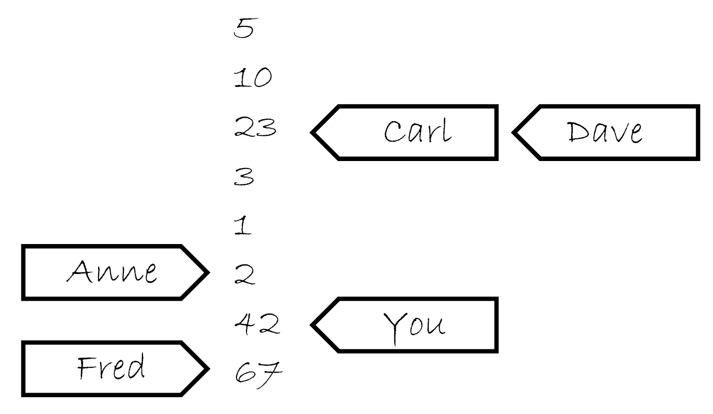

# 5.3 同步操作和強制排序

假設你有兩個線程，一個向數據結構中填充數據，另一個讀取數據結構中的數據。為了避免惡性條件競爭，第一個線程設置一個標誌，用來表明數據已經準備就緒，並且第二個線程在這個標誌設置前不能讀取數據。下面的程序清單就是這樣的情況。

清單5.2 不同線程對數據的讀寫

```
#include <vector>
#include <atomic>
#include <iostream>

std::vector<int> data;
std::atomic<bool> data_ready(false);

void reader_thread()
{
  while(!data_ready.load())  // 1
  {
    std::this_thread::sleep(std::milliseconds(1));
  }
  std::cout<<"The answer="<<data[0]<<"\m";  // 2
}
void writer_thread()
{
  data.push_back(42);  // 3
  data_ready=true;  // 4
}
```

先把等待數據的低效循環①放在一邊（你需要這個循環，否則想要在線程間共享數據就是不切實際的：數據的每一項都必須是原子的）。你已經知道，當非原子讀②和寫③對同一數據結構進行無序訪問時，將會導致未定義行為的發生，因此這個循環就是確保訪問循序被嚴格的遵守的。

強制訪問順序是由對`std::atomic<bool>`類型的data_ready變量進行操作完成的；這些操作通過*[先行發生](http://en.wikipedia.org/wiki/Happened-before)*(happens-before)和*同步發生*(synchronizes-with)確定必要的順序。寫入數據③的操作，在寫入data_ready標誌④的操作前發生，並且讀取標誌①發生在讀取數據②之前。當data_ready①為true，寫操作就會與讀操作同步，建立一個“先行發生”關係。因為“先行發生”是可傳遞的，所以寫入數據③先行於寫入標誌④，這兩個行為又先行於讀取標誌的操作①，之前的操作都先行於讀取數據②，這樣你就擁有了強制順序：寫入數據先行於讀取數據，其他沒問題了。圖5.2展示了先行發生在兩線程間的重要性。我向讀者線程的while循環中添加了一對迭代。


圖5.2 對非原子操作，使用原子操作對操作進行強制排序

所有事情看起來非常直觀：對一個值來說，寫操作必然先於讀操作！在默認它們都是原子操作的時候，這無疑是正確的(這就是原子操作為默認屬性的原因)，不過這裡需要詳細說明：原子操作對於排序要求，也有其他的選項，會在稍後進行詳述。

現在，你已經瞭解了“先行發生”和“同步發生”操作，也是時候看看他們真正的意義了。我將從“同步發生”開始說起。

## 5.3.1 同步發生

“同步發生”只能在原子類型之間進行操作。例如對一個數據結構進行操作(對互斥量上鎖)，如果數據結構包含有原子類型，並且操作內部執行了一定的原子操作，那麼這些操作就是同步發生關係。從根本上說，這種關係只能來源於對原子類型的操作。

“同步發生”的基本想法是：在變量x進行適當標記的原子寫操作W，同步與對x進行適當標記的原子讀操作，讀取的是W操作寫入的內容；或是在W之後，同一線程上的原子寫操作對x寫入的值；亦或是任意線程對x的一系列原子讀-改-寫操作(例如，fetch_add()或compare_exchange_weak())。這裡，第一個線程讀取到的值是W操作寫入的(詳見5.3.4節)。

先將“適當的標記”放在一邊，因為所有對原子類型的操作，默認都是適當標記的。這實際上就是：如果線程A存儲了一個值，並且線程B讀取了這個值，線程A的存儲操作與線程B的載入操作就是同步發生的關係，如同清單5.2所示的那樣。

我確信你假設過，所有細微的差別都在“適當的標記”中。`C++`內存模型允許為原子類型提供各種約束順序，並且這個標記我們已經提過了。內存排序的各種選項和它們如何與同步發生的關係，將會在5.3.3節中討論。

讓我們先退一步，再來看一下“先行發生”關係。

## 5.3.2 先行發生

“先行發生”關係是一個程序中，基本構建塊的操作順序；它指定了某個操作去影響另一個操作。對於單線程來說，就簡單了：當一個操作排在另一個之後，那麼這個操作就是先行執行的。這意味著，如果源碼中操作A發生在操作B之前，那麼A就先行於B發生。你可以回看清單5.2：對data的寫入③先於對data_ready④的寫入。如果操作在同時發生，因為操作間無序執行，通常情況下，它們就沒有先行關係了。這就是另一種排序未被指定的情況。下面的程序會輸出“1，2”或“2，1”，因為兩個get_num()的執行順序未被指定。

清單5.3 對於參數中的函數調用順序是未指定順序的

```
#include <iostream>
void foo(int a,int b)
{
  std::cout<<a<<”,”<<b<<std::endl;
}
int get_num()
{
  static int i=0;
  return ++i;
}
int main()
{
  foo(get_num(),get_num());  // 無序調用get_num()
}
```

這種情況下，操作在單一聲明中是可測序的，例如，逗號操作符的使用，或一個表達式的結果作為一個參數傳給另一個表達式。但在通常情況下，操作在單一聲明中是不可測序的，所以對其無法先行安排順序(也就沒有先行發生了)。當然，所有操作在一個聲明中先行於在下一個聲明中的操作。

這只是對之前單線程排序規則的重述，放在這裡有什麼新意嗎？有新意的是線程間的互相作用：如果操作A在線程上，並且線程先行於另一線程上的操作B，那麼A就先行於B。這也沒什麼：你只是添加了一個新關係(線程間的先行)，但當你正在編寫多線程程序時，是就這是一個至關重要的關係了。

從基本層面上講，線程間的先行比較簡單，並且依賴與同步關係(詳見5.3.1節):如果操作A在一個線程上，與另一個線程上的操作B同步，那麼A就線程間先行於B。這同樣是一個傳遞關係：如果A線程間先行於B，並且B線程間先行於C，那麼A就線程間先行於C。你可以回看一下清單5.2。

線程間先行可以與排序先行關係相結合：如果操作A排序先行於操作B，並且操作B線程間先行於操作C，那麼A線程間先行於C。同樣的，如果A同步於B，並且B排序先於C，那麼A線程間先行於C。兩者的結合，意味著當你對數據進行一系列修改(單線程)時，為線程後續執行C，只需要對可見數據進行一次同步。

這些是線程間強制排序操作的關鍵規則，也是讓清單5.2正常運行的因素。並在數據依賴上有一些細微的差別，你馬上就會看到。為了讓你理解這些差別，需要講述一下原子操作使用的內存排序標籤，以及這些標籤和同步發生之間的聯繫。

## 5.3.3 原子操作的內存順序

這裡有六個內存序列選項可應用於對原子類型的操作：memory_order_relaxed, memory_order_consume, memory_order_acquire, memory_order_release, memory_order_acq_rel, 以及memory_order_seq_cst。除非你為特定的操作指定一個序列選項，要不內存序列選項對於所有原子類型默認都是memory_order_seq_cst。雖然有六個選項，但是它們僅代表三種內存模型：排序一致序列(*sequentially consistent*)，獲取-釋放序列(*memory_order_consume, memory_order_acquire, memory_order_release和memory_order_acq_rel*)，和自由序列(*memory_order_relaxed*)。

這些不同的內存序列模型，在不同的CPU架構下，功耗是不一樣的。例如，基於處理器架構的可視化精細操作的系統，比起其他系統，添加的同步指令可被排序一致序列使用(在獲取-釋放序列和自由序列之前)，或被獲取-釋放序列調用(在自由序列之前)。如果這些系統有多個處理器，這些額外添加的同步指令可能會消耗大量的時間，從而降低系統整體的性能。另一方面，CPU使用的是x86或x86-64架構(例如，使用Intel或AMD處理器的臺式電腦)，使用這種架構的CPU不需要任何對獲取-釋放序列添加額外的指令(沒有保證原子性的必要了)，並且，即使是排序一致序列，對於加載操作也不需要任何特殊的處理，不過在進行存儲時，有點額外的消耗。

不同種類的內存序列模型，允許專家利用其提升與更細粒度排序相關操作的性能。當默認使用排序一致序列(相較於其他序列，它是最簡單的)時，對於在那些不大重要的情況下是有利的。

選擇使用哪個模型，或為了瞭解與序列相關的代碼，為什麼選擇不同的內存模型，是需要了解一個重要的前提，那就是不同模型是如何影響程序的行為。讓我們來看一下選擇每個操作序列和同步相關的結果。

**排序一致隊列**

默認序列命名為排序一致，是因為程序中的行為從任意角度去看，序列順序都保持一致。如果原子類型實例上的所有操作都是序列一致的，那麼一個多線程程序的行為，就以某種特殊的排序執行，好像單線程那樣。這是目前來看，最容易理解的內存序列，這也就是將其設置為默認的原因：所有線程都必須瞭解，不同的操作也遵守相同的順序。因為其簡單的行為，可以使用原子變量進行編寫。通過不同的線程，你可以寫出所有序列上可能的操作，這樣就可以消除那些不一致，以及驗證你代碼的行為是否與預期相符。這也就意味著，所有操作都不能重排序；如果你的代碼，在一個線程中，將一個操作放在另一個操作前面，那麼這個順序就必須讓其他所有的線程所瞭解。

從同步的角度看，對於同一變量，排序一致的存儲操作同步相關於同步一致的載入操作。這就提供了一種對兩個(以上)線程操作的排序約束，但是排序一致的功能要比排序約束大的多。所以，對於使用排序一致原子操作的系統上的任一排序一致的原子操作，都會在對值進行存儲以後，再進行加載。清單5.4就是這種一致性約束的演示。這種約束不是線程在自由內存序列中使用原子操作；這些線程依舊可以知道，操作以不同順序排列，所以你必須使用排序一致操作，去保證在多線的情況下有加速的效果。

不過，簡單是要付出代價的。在一個多核若排序的機器上，它會加強對性能的懲罰，因為整個序列中的操作都必須在多個處理器上保持一致，可能需要對處理器間的同步操作進行擴展(代價很昂貴！)。即便如此，一些處理器架構(比如通用x86和x86-64架構)就提供了相對廉價的序列一致，所以你需要考慮使用序列一致對性能的影響，這就需要你去查閱你目標處理器的架構文檔，進行更多的瞭解。

以下清單展示了序列一致的行為，對於x和y的加載和存儲都顯示標註為memory_order_seq_cst，不過在這段代碼中，標籤可能會忽略，因為其是默認項。

清單5.4 全序——序列一致

```
#include <atomic>
#include <thread>
#include <assert.h>

std::atomic<bool> x,y;
std::atomic<int> z;

void write_x()
{
  x.store(true,std::memory_order_seq_cst);  // 1
}

void write_y()
{
  y.store(true,std::memory_order_seq_cst);  // 2
}
void read_x_then_y()
{
  while(!x.load(std::memory_order_seq_cst));
  if(y.load(std::memory_order_seq_cst))  // 3
    ++z;
}
void read_y_then_x()
{
  while(!y.load(std::memory_order_seq_cst));
  if(x.load(std::memory_order_seq_cst))  // 4
    ++z;
}
int main()
{
  x=false;
  y=false;
  z=0;
  std::thread a(write_x);
  std::thread b(write_y);
  std::thread c(read_x_then_y);
  std::thread d(read_y_then_x);
  a.join();
  b.join();
  c.join();
  d.join();
  assert(z.load()!=0);  // 5
}
```

assert⑤語句是永遠不會觸發的，因為不是存儲x的操作①發生，就是存儲y的操作②發生。如果在read_x_then_y中加載y③返回false，那是因為存儲x的操作肯定發生在存儲y的操作之前，那麼在這種情況下在read_y_then_x中加載x④必定會返回true，因為while循環能保證在某一時刻y是true。因為memory_order_seq_cst的語義需要一個單全序將所有操作都標記為memory_order_seq_cst，這就暗示著“加載y並返回false③”與“存儲y①”的操作，有一個確定的順序。只有一個全序時，如果一個線程看到x==true，隨後又看到y==false，這就意味著在總序列中存儲x的操作發生在存儲y的操作之前。

當然，因為所有事情都是對稱的，所以就有可能以其他方式發生，比如，加載x④的操作返回false，或強制加載y③的操作返回true。在這兩種情況下，z都等於1。當兩個加載操作都返回true，z就等於2，所以任何情況下，z都不能是0。

當read_x_then_y知道x為true，並且y為false，那麼這些操作就有“先發執行”關係了，如圖5.3所示。


圖5.3 序列一致與先發執行

虛線始於read_x_then_y中對y的加載操作，到達write_y中對y的存儲，其暗示了排序關係需要保持序列一致：在操作的全局操作順序memory_order_seq_cst中，加載操作必須在存儲操作之前發生，就產生了圖中的結果。

序列一致是最簡單、直觀的序列，但是他也是最昂貴的內存序列，因為它需要對所有線程進行全局同步。在一個多處理系統上，這就需要處理期間進行大量並且費時的信息交換。

為了避免這種同步消耗，你需要走出序列一致的世界，並且考慮使用其他內存序列。

**非排序一致內存模型**

當你踏出序列一致的世界，所有事情就開始變的複雜。可能最需要處理的問題就是：再也不會有全局的序列了。這就意味著不同線程看到相同操作，不一定有著相同的順序，還有對於不同線程的操作，都會整齊的，一個接著另一個執行的想法是需要摒棄的。不僅是你有沒有考慮事情真的同時發生的問題，還有線程沒必要去保證一致性。為了寫出(或僅是瞭解)任何一段使用非默認內存序列的代碼，要想做這件事情，那麼之前的那句話就是至關重要的。你要知道，這不僅僅是編譯器可以重新排列指令的問題。即使線程運行相同的代碼，它們都能拒絕遵循事件發生的順序，因為操作在其他線程上沒有明確的順序限制；因為不同的CPU緩存和內部緩衝區，在同樣的存儲空間中可以存儲不同的值。這非常重要，這裡我再重申一遍：線程沒必要去保證一致性。

不僅是要摒棄交錯執行操作的想法，你還要放棄使用編譯器或處理器重排指令的想法。在沒有明確的順序限制下，唯一的要求就是，所有線程都要統一對每一個獨立變量的修改順序。對不同變量的操作可以體現在不同線程的不同序列上，提供的值要與任意附加順序限制保持一致。

踏出排序一致世界後，最好的示範就是使用memory_order_relaxed對所有操作進行約束。如果你已經對其有所瞭解，那麼你可以跳到獲取-釋放序列繼續閱讀，獲取-釋放序列允許你選擇在操作間引入順序關係(並且收回你的理智)。

**自由序列**

在原子類型上的操作以自由序列執行，沒有任何同步關係。在同一線程中對於同一變量的操作還是服從先發執行的關係，但是這裡不同線程幾乎不需要相對的順序。唯一的要求是，在訪問同一線程中的單個原子變量不能重排序；當一個給定線程已經看到一個原子變量的特定值，線程隨後的讀操作就不會去檢索變量較早的那個值。當使用memory_order_relaxed，就不需要任何額外的同步，對於每個變量的修改順序只是線程間共享的事情。

為了演示如何不去限制你的非限制操作，你只需要兩個線程，就如同下面代碼清單那樣。

清單5.5 非限制操作只有非常少的順序要求

```
#include <atomic>
#include <thread>
#include <assert.h>

std::atomic<bool> x,y;
std::atomic<int> z;

void write_x_then_y()
{
  x.store(true,std::memory_order_relaxed);  // 1
  y.store(true,std::memory_order_relaxed);  // 2
}
void read_y_then_x()
{
  while(!y.load(std::memory_order_relaxed));  // 3
  if(x.load(std::memory_order_relaxed))  // 4
    ++z;
}
int main()
{
  x=false;
  y=false;
  z=0;
  std::thread a(write_x_then_y);
  std::thread b(read_y_then_x);
  a.join();
  b.join();
  assert(z.load()!=0);  // 5
}
```

這次assert⑤可能會觸發，因為加載x的操作④可能讀取到false，即使加載y的操作③讀取到true，並且存儲x的操作①先發與存儲y的操作②。x和y是兩個不同的變量，所以這裡沒有順序去保證每個操作產生相關值的可見性。

非限制操作對於不同變量可以自由重排序，只要它們服從任意的先發執行關係即可(比如，在同一線程中)。它們不會引入同步相關的順序。清單5.5中的先發執行關係如圖5.4所示(只是其中一個可能的結果)。儘管，在不同的存儲/加載操作間有著先發執行關係，這裡不是在一對存儲於載入之間了，所以載入操作可以看到“違反”順序的存儲操作。


圖5.4 非限制原子操作與先發執行

讓我們來看一個略微複雜的例子，其有三個變量和五個線程。

清單5.6 非限制操作——多線程版

```
#include <thread>
#include <atomic>
#include <iostream>

std::atomic<int> x(0),y(0),z(0);  // 1
std::atomic<bool> go(false);  // 2

unsigned const loop_count=10;

struct read_values
{
  int x,y,z;
};

read_values values1[loop_count];
read_values values2[loop_count];
read_values values3[loop_count];
read_values values4[loop_count];
read_values values5[loop_count];

void increment(std::atomic<int>* var_to_inc,read_values* values)
{
  while(!go)
    std::this_thread::yield();  // 3 自旋，等待信號
  for(unsigned i=0;i<loop_count;++i)
  {
    values[i].x=x.load(std::memory_order_relaxed);
    values[i].y=y.load(std::memory_order_relaxed);
    values[i].z=z.load(std::memory_order_relaxed);
    var_to_inc->store(i+1,std::memory_order_relaxed);  // 4
    std::this_thread::yield();
  }
}

void read_vals(read_values* values)
{
  while(!go)
    std::this_thread::yield(); // 5 自旋，等待信號
  for(unsigned i=0;i<loop_count;++i)
  {
    values[i].x=x.load(std::memory_order_relaxed);
    values[i].y=y.load(std::memory_order_relaxed);
    values[i].z=z.load(std::memory_order_relaxed);
    std::this_thread::yield();
  }
}

void print(read_values* v)
{
  for(unsigned i=0;i<loop_count;++i)
  {
    if(i)
      std::cout<<",";
    std::cout<<"("<<v[i].x<<","<<v[i].y<<","<<v[i].z<<")";
  }
  std::cout<<std::endl;
}

int main()
{
  std::thread t1(increment,&x,values1);
  std::thread t2(increment,&y,values2);
  std::thread t3(increment,&z,values3);
  std::thread t4(read_vals,values4);
  std::thread t5(read_vals,values5);

  go=true;  // 6 開始執行主循環的信號

  t5.join();
  t4.join();
  t3.join();
  t2.join();
  t1.join();

  print(values1);  // 7 打印最終結果
  print(values2);
  print(values3);
  print(values4);
  print(values5);
}
```

這段代碼本質上很簡單。你擁有三個全局原子變量①和五個線程。每一個線程循環10次，使用memory_order_relaxed讀取三個原子變量的值，並且將它們存儲在一個數組上。其中三個線程每次通過循環④來更新其中一個原子變量，這時剩下的兩個線程就只負責讀取。當所有線程都“加入”，就能打印出來每個線程存到數組上的值了。

原子變量go②用來確保循環在同時退出。啟動線程是昂貴的操作，並且沒有明確的延遲，第一個線程可能在最後一個線程開始前結束。每個線程都在等待go變為true前都在進行循環③⑤，並且一旦go設置為true所有線程都會開始運行⑥。

程序一種可能的輸出為：

```
(0,0,0),(1,0,0),(2,0,0),(3,0,0),(4,0,0),(5,7,0),(6,7,8),(7,9,8),(8,9,8),(9,9,10)
(0,0,0),(0,1,0),(0,2,0),(1,3,5),(8,4,5),(8,5,5),(8,6,6),(8,7,9),(10,8,9),(10,9,10)
(0,0,0),(0,0,1),(0,0,2),(0,0,3),(0,0,4),(0,0,5),(0,0,6),(0,0,7),(0,0,8),(0,0,9)
(1,3,0),(2,3,0),(2,4,1),(3,6,4),(3,9,5),(5,10,6),(5,10,8),(5,10,10),(9,10,10),(10,10,10)
(0,0,0),(0,0,0),(0,0,0),(6,3,7),(6,5,7),(7,7,7),(7,8,7),(8,8,7),(8,8,9),(8,8,9)
```

前三行中線程都做了更新，後兩行線程只是做讀取。每三個值都是一組x，y和z，並按照這樣的順序依次循環。對於輸出，需要注意的一些事是：

1. 第一組值中x增1，第二組值中y增1，並且第三組中z增1。<br>
2. x元素只在給定集中增加，y和z也一樣，但是增加是不均勻的，並且相對順序在所有線程中都不同。<br>
3. 線程3看不到x或y的任何更新；他能看到的只有z的更新。這並不妨礙別的線程觀察z的更新，並同時觀察x和y的更新。<br>

對於非限制操作，這個結果是合法的，但是不是唯一合法的輸出。任意組值都用三個變量保持一致，值從0到10依次遞增，並且線程遞增給定變量，所以打印出來的值在0到10的範圍內都是合法的。

**瞭解自由排序**

為了瞭解自由序列是如何工作的，先將每一個變量想象成一個在獨立房間中拿著記事本的人。他的記事本上是一組值的列表。你可以通過打電話的方式讓他給你一個值，或讓他寫下一個新值。如果你告訴他寫下一個新值，他會將這個新值寫在表的最後。如果你讓他給你一個值，他會從列表中讀取一個值給你。

在你第一次與這個人交談時，如果你問他要一個值，他可能會給你現在列表中的任意值。如果之後你再問他要一個值，它可能會再給你同一個值，或將列表後面的值給你，他不會給你列表上端的值。如果你讓他寫一個值，並且隨後再問他要一個值，他要不就給你你剛告訴他的那個值，要不就是一個列表下端的值。

試想當他的筆記本上開始有5，10，23，3，1，2這幾個數。如果你問他索要一個值，你可能獲取這幾個數中的任意一個。如果他給你10，那麼下次再問他要值的時候可能會再給你10，或者10後面的數，但絕對不會是5。如果那你問他要了五次，他就可能回答“10，10，1，2，2”。如果你讓他寫下42，他將會把這個值添加在列表的最後。如果你再問他要值，他可能會告訴你“42”，直到有其他值寫在了後面並且他認為他願意將那個數告訴你。

現在，想象你有個朋友叫Carl，他也有那個計數員的電話。Carl也可以打電話給計算員，讓他寫下一個值或獲取一個值，他對Carl回應的規則和你是一樣的。他只有一部電話，所以他一次只能處理一個人的請求，所以他記事本上的列表是一個簡單的列表。但是，你讓他寫下一個新值的時候，不意味著他會將這個消息告訴Carl，反之亦然。如果Carl從他那裡獲取一個值“23”，之後因為你告訴他寫下42，這不意味著下次他會將這件事告訴Carl。他可能會告訴Carl任意一個值，23，3，1，2，42亦或是67(是Fred在你之後告訴他的)。他會很高興的告訴Carl“23，3，3，1，67”，與你告訴他的值完全不一致。這就像它在使用便籤跟蹤告訴每個人的數，就像圖5.5那樣。



圖5.5 計數員的筆記

現在，想象一下，不僅僅只有一個人在房間裡，而是在一個小農場裡，每個人都有一部電話和一個筆記本。這就是我們的原子變量。每一個變量擁有他們自己的修改順序(筆記上的簡單數值列表)，但是每個原子變量之間沒有任何關係。如果每一個調用者(你，Carl，Anne，Dave和Fred)是一個線程，那麼對每個操作使用memory_order_relaxed你就會得到上面的結果。這裡還有些事情你可以告訴在小房子的人，例如，“寫下這個值，並且告訴我現在列表中的最後一個值”(exchange)，或“寫下這個值，當列表的最後一個值為某值；如果不是，告訴我看我是不是猜對了”(compare_exchange_strong)，但是這都不影響一般性原則。

如果你仔細想想清單5.5的邏輯，那麼write_x_then_y就像某人打電話給房子x裡的人，並且告訴他寫下true，之後打電話給在y房間的另一個人，告訴他寫下true。線程反覆執行調用read_y_then_x，就像打電話給房間y的人問他要值，直到要到true，然後打電話給房間x的，繼續問他要值。在x房間中的人有義務告訴你在他列表中任意指定的值，他也是有權利所false的。

這就讓自由的原子操作變得難以處理。他們必須與原子操作結合使用，這些原子操作必須有較強的排序語義，為了讓內部線程同步變得更有用。我強烈建議避免自由的原子操作，除非它們是硬性要求的，並且在使用它們的時候需要十二分的謹慎。給出的不直觀的結果，就像是清單5.5中使用雙線程和雙變量的結果一樣，不難想象在有更多線程和更多變量時，其會變的更加複雜。

要想獲取額外的同步，且不使用全局排序一致，可以使用*獲取-釋放序列*(acquire-release ordering)。

**獲取-釋放序列**

這個序列是*自由序列*(relaxed ordering)的加強版；雖然操作依舊沒有統一的順序，但是在這個序列引入了同步。在這種序列模型中，原子加載就是*獲取*(acquire)操作(memory_order_acquire)，原子存儲就是*釋放*(memory_order_release)操作，原子讀-改-寫操作(例如fetch_add()或exchange())在這裡，不是“獲取”，就是“釋放”，或者兩者兼有的操作(memory_order_acq_rel)。這裡，同步在線程釋放和獲取間是*成對的*(pairwise)。釋放操作與獲取操作同步，這樣就能讀取已寫入的值。這意味著不同線程看到的序列雖還是不同，但這些序列都是受限的。下面列表中是使用獲取-釋放序列(而非序列一致方式)，對清單5.4的一次重寫。

清單5.7 獲取-釋放不意味著統一操作順序

```
#include <atomic>
#include <thread>
#include <assert.h>

std::atomic<bool> x,y;
std::atomic<int> z;
void write_x()
{
  x.store(true,std::memory_order_release);
}
void write_y()
{
  y.store(true,std::memory_order_release);
}
void read_x_then_y()
{
  while(!x.load(std::memory_order_acquire));
  if(y.load(std::memory_order_acquire))  // 1
    ++z;
}
void read_y_then_x()
{
  while(!y.load(std::memory_order_acquire));
  if(x.load(std::memory_order_acquire))  // 2
    ++z;
}
int main()
{
  x=false;
  y=false;
  z=0;
  std::thread a(write_x);
  std::thread b(write_y);
  std::thread c(read_x_then_y);
  std::thread d(read_y_then_x);
  a.join();
  b.join();
  c.join();
  d.join();
  assert(z.load()!=0); // 3
}
```

在這個例子中斷言③可能會觸發(就如同自由排序那樣)，因為可能在加載x②和y①的時候，讀取到的是false。因為x和y是由不同線程寫入，所以序列中的每一次釋放到獲取都不會影響到其他線程的操作。

圖5.6展示了清單5.7的先行關係，對於讀取的結果，兩個(讀取)線程看到的是兩個完全不同的世界。如前所述，這可能是因為這裡沒有對先行順序進行強制規定導致的。


圖5.6 獲取-釋放，以及先行過程

為了瞭解獲取-釋放序列有什麼優點，你需要考慮將兩次存儲由一個線程來完成，就像清單5.5那樣。當你需要使用memory_order_release改變y中的存儲，並且使用memory_order_acquire來加載y中的值，就像下面程序清單所做的那樣，而後，就會影響到序列中對x的操作。

清單5.8 獲取-釋放操作會影響序列中的釋放操作

```
#include <atomic>
#include <thread>
#include <assert.h>

std::atomic<bool> x,y;
std::atomic<int> z;

void write_x_then_y()
{
  x.store(true,std::memory_order_relaxed);  // 1 
  y.store(true,std::memory_order_release);  // 2
}
void read_y_then_x()
{
  while(!y.load(std::memory_order_acquire));  // 3 自旋，等待y被設置為true
  if(x.load(std::memory_order_relaxed))  // 4
    ++z;
}
int main()
{
  x=false;
  y=false;
  z=0;
  std::thread a(write_x_then_y);
  std::thread b(read_y_then_x);
  a.join();
  b.join();
  assert(z.load()!=0);  // 5
}
```

最後，讀取y③時會得到true，和存儲時寫入的一樣②。因為存儲使用的是memory_order_release，讀取使用的是memory_order_acquire，存儲就與讀取就同步了。因為這兩個操作是由同一個線程完成的，所以存儲x①先行於加載y②。對y的存儲同步與對y的加載，存儲x也就先行於對y的加載，並且擴展先行於x的讀取。因此，加載x的值必為true，並且斷言⑤不會觸發。如果對於y的加載不是在while循環中，那麼情況可能就會有所不同；加載y的時候可能會讀取到false，在這種情況下對於讀取到的x是什麼值，就沒有要求了。為了保證同步，加載和釋放操作必須成對。所以，無論有何影響，釋放操作存儲的值，必須要讓獲取操作看到。當存儲如②或加載如③，都是一個釋放操作時，對x的訪問就無序了，也就無法保證④處讀到的是true，並且還會觸發斷言。

你也可以將獲取-釋放序列與之前提到記錄員和他的小隔間相關聯，不過你可能需要添加很多東西到這個模型中。首先，試想每個存儲操作做一部分更新，那麼當你電話給一個人，讓他寫下一個數字，你也需要告訴他更新哪一部分：“請在423組中寫下99”。對於某一組的最後一個值的存儲，你也需要告訴那個人：“請寫下147，這是最後存儲在423組的值”。小隔間中的人會即使寫下這一信息，以及告訴他的值。這個就是存儲-釋放操作的模型。下一次，你告訴另外一個人寫下一組值時，你需要改變組號：“請在組424中寫入41”

當你詢問一個時，你就要做出一個選擇：你要不就僅僅詢問一個值(這就是一次自由加載，這種情況下，小隔間中的人會給你的)，要不詢問一個值以及其關於組的信息(是否是某組中的最後一個，這就是加載-獲取模型)。當你詢問組信息，且值不是組中的最後一個，隔間中的人會這樣告訴你，“這個值是987，它是一個‘普通’值”，但當這個值是最後一個時，他會告訴你：“數字為987，這個值是956組的最後一個，來源於Anne”。現在，獲取-釋放的語義就很明確了：當你查詢一個值，你告訴他你知道到所有組後，她會低頭查看他的列表，看你知道的這些數，是不是在對應組的最後，並且告訴你那個值的屬性，或繼續在列表中查詢。

如何理解這個模型中獲取-釋放的語義？讓我們看一下我們的例子。首先，線程a運行write_x_then_y函數，然後告訴在x屋的記錄員，“請寫下true作為組1的一部分，信息來源於線程a”，之後記錄員工整的寫下了這些信息。而後，線程a告訴在y屋的記錄員，“請寫下true作為組1的一部分，信息來源於線程a”。在此期間，線程b運行read_y_then_x。線程b持續向y屋的記錄員詢問值與組的信息，直到它聽到記錄員說“true”。記錄員可能不得不告訴他很多遍，不過最終記錄員還是說了“true”。y屋的記錄員不僅僅是說“true”，他還要說“組1最後是由線程a寫入”。

現在，線程b會持續詢問x屋的記錄員，但這次他會說“請給我一個值，我知道這個值是組1的值，並且是由線程a寫入的”。所以現在，x屋中的記錄員就開始查找組1中由線程a寫入的值。這裡他注意到，他寫入的值是true，同樣也是他列表中的最後一個值，所以它必須讀出這個值；否則，他講打破這個遊戲的規則。

當你回看5.3.2節中對“線程間先行”的定義，一個很重要的特性就是它的傳遞：當A線程間先行於B，並且B線程間先行於C，那麼A就線程間先行於C。這就意味著，獲取-釋放序列可以在若干線程間使用同步數據，甚至可以在“中間”線程接觸到這些數據前，使用這些數據。

**與同步傳遞相關的獲取-釋放序列**

為了考慮傳遞順序，你至少需要三個線程。第一個線程用來修改共享變量，並且對其中一個做“存儲-釋放”處理。然後第二個線程使用“加載-獲取”讀取由“存儲-釋放”操作過的變量，並且再對第二個變量進行“存儲-釋放”操作。最後，由第三個線程通過“加載-獲取”讀取第二個共享變量。提供“加載-獲取”操作，來讀取被“存儲-釋放”操作寫入的值，是為了保證同步關係，這裡即便是中間線程沒有對共享變量做任何操作，第三個線程也可以讀取被第一個線程操作過的變量。下面的代碼可以用來描述這樣的場景。

清單5.9 使用獲取和釋放順序進行同步傳遞

```
std::atomic<int> data[5];
std::atomic<bool> sync1(false),sync2(false);

void thread_1()
{
  data[0].store(42,std::memory_order_relaxed);
  data[1].store(97,std::memory_order_relaxed);
  data[2].store(17,std::memory_order_relaxed);
  data[3].store(-141,std::memory_order_relaxed);
  data[4].store(2003,std::memory_order_relaxed);
  sync1.store(true,std::memory_order_release);  // 1.設置sync1
}

void thread_2()
{
  while(!sync1.load(std::memory_order_acquire));  // 2.直到sync1設置後，循環結束
  sync2.store(true,std::memory_order_release);  // 3.設置sync2
}
void thread_3()
{
  while(!sync2.load(std::memory_order_acquire));   // 4.直到sync1設置後，循環結束
  assert(data[0].load(std::memory_order_relaxed)==42);
  assert(data[1].load(std::memory_order_relaxed)==97);
  assert(data[2].load(std::memory_order_relaxed)==17);
  assert(data[3].load(std::memory_order_relaxed)==-141);
  assert(data[4].load(std::memory_order_relaxed)==2003);
}
```

儘管thread_2只接觸到變量syn1②和sync2③，不過這對於thread_1和thread_3的同步就足夠了，這就能保證斷言不會觸發。首先，thread_1將數據存儲到data中先行於存儲sync1①（它們在同一個線程內）。因為加載sync1①的是一個while循環，它最終會看到thread_1存儲的值(是從“釋放-獲取”對的後半對獲取)。因此，對於sync1的存儲先行於最終對於sync1的加載(在while循環中)。thread_3的加載操作④，位於存儲sync2③操作的前面(也就是先行)。存儲sync2③因此先行於thread_3的加載④，加載又先行於存儲sync2③，存儲sync2又先行於加載sync2④，加載syn2又先行於加載data。因此，thread_1存儲數據到data的操作先行於thread_3中對data的加載，並且保證斷言都不會觸發。

在這個例子中，你可以將sync1和sync2，通過在thread_2中使用“讀-改-寫”操作(memory_order_acq_rel)，將其合併成一個獨立的變量。其中會使用compare_exchange_strong()來保證thread_1對變量只進行一次更新：

```
std::atomic<int> sync(0);
void thread_1()
{
  // ...
  sync.store(1,std::memory_order_release);
}

void thread_2()
{
  int expected=1;
  while(!sync.compare_exchange_strong(expected,2,
              std::memory_order_acq_rel))
    expected=1;
}
void thread_3()
{
  while(sync.load(std::memory_order_acquire)<2);
  // ...
}
```

如果你使用“讀-改-寫”操作，選擇語義就很重要了。在這個例子中，你想要同時進行獲取和釋放的語義，所以memory_order_acq_rel是一個合適的選擇，但你也可以使用其他序列。使用memory_order_acquire語義的fetch_sub是不會和任何東西同步的，即使它存儲了一個值，這是因為其沒有釋放操作。同樣的，使用memory_order_release語義的fetch_or也不會和任何存儲操作進行同步，因為對於fetch_or的讀取，並不是一個獲取操作。使用memory_order_acq_rel語義的“讀-改-寫”操作，每一個動作都包含獲取和釋放操作，所以可以和之前的存儲操作進行同步，並且可以對隨後的加載操作進行同步，就像上面例子中那樣。

如果你將“獲取-釋放”操作和“序列一致”操作進行混合，“序列一致”的加載動作，就像使用了獲取語義的加載操作；並且序列一致的存儲操作，就如使用了釋放語義的存儲。“序列一致”的讀-改-寫操作行為，就像同時使用了獲取和釋放的操作。“自由操作”依舊那麼自由，但其會和額外的同步進行綁定（也就是使用“獲取-釋放”的語義）。

儘管潛在的結果並不那麼直觀，每個使用鎖的同學都不得不去解決同一個序列問題：鎖住互斥量是一個獲取操作，並且解鎖這個互斥量是一個釋放操作。隨著互斥量的增多，你必須確保同一個互斥量在你讀取變量或修改變量的時候是鎖住的，並且同樣適合於這裡；你的獲取和釋放操作必須在同一個變量上，以保證訪問順序。當數據被一個互斥量所保護時，鎖的性質就保證得到的結果是沒有區別的，因為鎖住與解鎖的操作都是序列一致的操作。同樣的，當你對原子變量使用獲取和釋放序列，為的是構建一個簡單的鎖，那麼這裡的代碼必然要使用鎖，即使內部操作不是序列一致的，其外部表現將會是序列一致的。

當你的原子操作不需要嚴格的序列一致序列，成對同步的“獲取-釋放”序列可以提供，比全局序列一致性操作，更加低廉的潛在同步。這裡還需要對心理代價進行權衡，為了保證序列能夠正常的工作，還要保證非直觀的跨線程行為是沒有問題的。

**獲取-釋放序列和memory_order_consume的數據相關性**

在介紹本章節的時候，我說過，memory_order_consume是“獲取-釋放”序列模型的一部分，但是在前面我們沒有對其進行過多的討論。這是因為memory_order_consume很特別：它完全依賴於數據，並且其展示了與線程間先行關係(可見5.3.2節)的不同之處。

這裡有兩種新關係用來處理數據依賴：*前序依賴*(dependency-ordered-before)和*攜帶依賴*(carries-a-dependency-to)。就像*前列*(sequenced-before)，攜帶依賴對於數據依賴的操作，嚴格應用於一個獨立線程和其基本模型；如果A操作結果要使用操作B的操作數，而後A將攜帶依賴於B。如果A操作的結果是一個標量，比如int，而後的攜帶依賴關係仍然適用於，當A的結果存儲在一個變量中，並且這個變量需要被其他操作使用。這個操作是也是可以傳遞的，所以當A攜帶依賴B，並且B攜帶依賴C，就額可以得出A攜帶依賴C的關係。

當其不影響線程間的先行關係時，對於同步來說，這並未帶來任何的好處，但是它做到：當A前序依賴B，那麼A線程間也前序依賴B。

這種內存序列的一個很重要使用方式，是在原子操作載入指向數據的指針時。當使用memory_order_consume作為加載語義，並且memory_order_release作為之前的存儲語義，你要保證指針指向的值是已同步的，並且不需要對其他任何非獨立數據施加任何同步要求。下面的代碼就展示了這麼一個場景。

清單5.10 使用`std::memroy_order_consume`同步數據

```
struct X
{
int i;
std::string s;
};

std::atomic<X*> p;
std::atomic<int> a;

void create_x()
{
  X* x=new X;
  x->i=42;
  x->s="hello";
  a.store(99,std::memory_order_relaxed);  // 1
  p.store(x,std::memory_order_release);  // 2
}

void use_x()
{
  X* x;
  while(!(x=p.load(std::memory_order_consume)))  // 3
    std::this_thread::sleep(std::chrono::microseconds(1));
  assert(x->i==42);  // 4
  assert(x->s=="hello");  // 5
  assert(a.load(std::memory_order_relaxed)==99);  // 6
}

int main()
{
  std::thread t1(create_x);
  std::thread t2(use_x);
  t1.join();
  t2.join();
}
```

儘管，對a的存儲①在存儲p②之前，並且存儲p的操作標記為memory_order_release，加載p③的操作標記為memory_order_consume，這就意味著存儲p僅先行那些需要加載p的操作。同樣，也意味著X結構體中數據成員所在的斷言語句④⑤不會被觸發，這是因為對x變量操作的表達式對加載p的操作攜帶有依賴。另一方面，對於加載變量a⑥的斷言就不能確定是否會被觸發；這個操作並不依賴於p的加載操作，所以這裡沒法保證數據已經被讀取。當然，這個情況也是很明顯的，因為這個操作被標記為memory_order_relaxed。

有時，你不想為攜帶依賴增加其他的開銷。你想讓編譯器在寄存器中緩存這些值，以及優化重排序操作代碼，而不是對這些依賴大驚小怪。這種情況下，你可以使用`std::kill_dependecy()`來顯式打破依賴鏈。`std::kill_dependency()`是一個簡單的函數模板，其會複製提供的參數給返回值，但是依舊會打破依賴鏈。例如，當你擁有一個全局的只讀數組，當其他線程對數組索引進行檢索時，你使用的是`std::memory_order_consume`，那麼你可以使用`std::kill_dependency()`讓編譯器知道這裡不需要重新讀取該數組的內容，就像下面的例子一樣：

```
int global_data[]={ … };
std::atomic<int> index;

void f()
{
  int i=index.load(std::memory_order_consume);
  do_something_with(global_data[std::kill_dependency(i)]);
}
```

當然，你不需要在如此簡單的場景下使用`std::memory_order_consume`，但是你可以在類似情況，且代碼較為複雜時，調用`std::kill_dependency()`。你必須記住，這是為了優化，所以這種方式必須謹慎使用，並且需要性能數據證明其存在的意義。

現在，我們已經討論了所有基本內存序列，是時候看看更加複雜的同步關係了————釋放隊列。

## 5.3.4 釋放隊列與同步

回到5.3.1節，我提到過，通過其他線程，即使有(有序的)多個“讀-改-寫”操作(所有操作都已經做了適當的標記)在存儲和加載操作之間，你依舊可以獲取原子變量存儲與加載的同步關係。現在，我已經討論所有可能使用到的內存序列“標籤”，我在這裡可以做一個簡單的概述。當存儲操作被標記為memory_order_release，memory_order_acq_rel或memory_order_seq_cst，加載被標記為memory_order_consum，memory_order_acquire或memory_order_sqy_cst，並且操作鏈上的每一加載操作都會讀取之前操作寫入的值，因此鏈上的操作構成了一個釋放序列(*release sequence*)，並且初始化存儲同步(對應memory_order_acquire或memory_order_seq_cst)或是前序依賴(對應memory_order_consume)的最終加載。操作鏈上的任何原子“讀-改-寫”操作可以擁有任意個存儲序列(甚至是memory_order_relaxed)。

為了瞭解這些操作意味著什麼，以及其重要性，考慮一個atomic<int>用作對一個共享隊列的元素進行計數：

清單5.11 使用原子操作從隊列中讀取數據

```
#include <atomic>
#include <thread>

std::vector<int> queue_data;
std::atomic<int> count;

void populate_queue()
{
  unsigned const number_of_items=20;
  queue_data.clear();
  for(unsigned i=0;i<number_of_items;++i)
  {
    queue_data.push_back(i);
  }

  count.store(number_of_items,std::memory_order_release);  // 1 初始化存儲
}

void consume_queue_items()
{
  while(true)
  {
    int item_index;
    if((item_index=count.fetch_sub(1,std::memory_order_acquire))<=0)  // 2 一個“讀-改-寫”操作
    {
      wait_for_more_items();  // 3 等待更多元素
      continue;
    }
    process(queue_data[item_index-1]);  // 4 安全讀取queue_data
  }
}

int main()
{
  std::thread a(populate_queue);
  std::thread b(consume_queue_items);
  std::thread c(consume_queue_items);
  a.join();
  b.join();
  c.join();
}
```

一種處理方式是讓線程產生數據，並存儲到一個共享緩存中，而後調用count.store(number_of_items, memory_order_release)①讓其他線程知道數據是可用的。線程群消耗著隊列中的元素，之後可能調用count.fetch_sub(1, memory_order_acquire)②向隊列索取一個元素，不過在這之前，需要對共享緩存進行完整的讀取④。一旦count歸零，那麼隊列中就沒有更多的元素了，當元素耗盡時線程必須等待③。

當有一個消費者線程時還好，fetch_sub()是一個帶有memory_order_acquire的讀取操作，並且存儲操作是帶有memory_order_release語義，所以這裡存儲與加載同步，線程是可以從緩存中讀取元素的。當有兩個讀取線程時，第二個fetch_sub()操作將看到被第一個線程修改的值，且沒有值通過store寫入其中。先不管釋放序列的規則，這裡第二個線程與第一個線程不存在先行關係，並且其對共享緩存中值的讀取也不安全，除非第一個fetch_sub()是帶有memory_order_release語義的，這個語義為兩個消費者線程間建立了不必要的同步。無論是釋放序列的規則，還是帶有memory_order_release語義的fetch_sub操作，第二個消費者看到的是一個空的queue_data，無法從其獲取任何數據，並且這裡還會產生條件競爭。幸運的是，第一個fetch_sub()對釋放順序做了一些事情，所以store()能同步與第二個fetch_sub()操作。這裡，兩個消費者線程間不需要同步關係。這個過程在圖5.7中展示，其中虛線表示的就是釋放順序，實線表示的是先行關係。


圖5.7 清單5.11中對隊列操作的釋放順序

操作鏈中可以有任意數量的鏈接，但是提供的都是“讀-改-寫”操作，比如fetch_sub()，store()，每一個都會與使用memory_order_acquire語義的操作進行同步。在這裡例子中，所有鏈接都是一樣的，並且都是獲取操作，但它們可由不同內存序列語義組成的操作混合。(譯者：也就是不是單純的獲取操作)

雖然，大多數同步關係，是對原子變量的操作應用了內存序列，但這裡依舊有必要額外介紹一個對排序的約束——柵欄(*fences*)。

## 5.3.5 柵欄

如果原子操作庫缺少了柵欄，那麼這個庫就是不完整的。柵欄操作會對內存序列進行約束，使其無法對任何數據進行修改，典型的做法是與使用memory_order_relaxed約束序的原子操作一起使用。柵欄屬於全局操作，執行柵欄操作可以影響到在線程中的其他原子操作。因為這類操作就像畫了一條任何代碼都無法跨越的線一樣，所以柵欄操作通常也被稱為*內存柵欄*(memory barriers)。回憶一下5.3.3節，自由操作可以使用編譯器或者硬件的方式，在獨立的變量上自由的進行重新排序。不過，柵欄操作就會限制這種自由，並且會介紹之前沒有介紹到的“先行”和“同步”關係。

我們給在不同線程上的兩個原子操作中添加一個柵欄，代碼如下所示：

清單5.12 柵欄可以讓自由操作變的有序

```
#include <atomic>
#include <thread>
#include <assert.h>

std::atomic<bool> x,y;
std::atomic<int> z;

void write_x_then_y()
{
  x.store(true,std::memory_order_relaxed);  // 1
  std::atomic_thread_fence(std::memory_order_release);  // 2
  y.store(true,std::memory_order_relaxed);  // 3
}

void read_y_then_x()
{
  while(!y.load(std::memory_order_relaxed));  // 4
  std::atomic_thread_fence(std::memory_order_acquire);  // 5
  if(x.load(std::memory_order_relaxed))  // 6
    ++z;
}

int main()
{
  x=false;
  y=false;
  z=0;
  std::thread a(write_x_then_y);
  std::thread b(read_y_then_x);
  a.join();
  b.join();
  assert(z.load()!=0);  // 7
}
```

釋放柵欄②與獲取柵欄⑤同步，這是因為加載y的操作④讀取的是在③處存儲的值。所以，在①處存儲x先行於⑥處加載x，最後x讀取出來必為true，並且斷言不會被觸發⑦。原先不帶柵欄的存儲和加載x都是無序的，並且斷言是可能會觸發的。需要注意的是，這兩個柵欄都是必要的：你需要在一個線程中進行釋放，然後在另一個線程中進行獲取，這樣才能構建出同步關係。

在這個例子中，如果存儲y的操作③標記為memory_order_release，而非memory_order_relaxed的話，釋放柵欄②也會對這個操作產生影響。同樣的，當加載y的操作④標記為memory_order_acquire時，獲取柵欄⑤也會對之產生影響。使用柵欄的一般想法是：當一個獲取操作能看到釋放柵欄操作後的存儲結果，那麼這個柵欄就與獲取操作同步；並且，當加載操作在獲取柵欄操作前，看到一個釋放操作的結果，那麼這個釋放操作同步於獲取柵欄。當然，你也可以使用雙邊柵欄操作，舉一個簡單的例子，當一個加載操作在獲取柵欄前，看到一個值有存儲操作寫入，且這個存儲操作發生在釋放柵欄後，那麼釋放柵欄與獲取柵欄是同步的。

雖然，柵欄同步依賴於讀取/寫入的操作發生於柵欄之前/後，但是這裡有一點很重要：同步點，就是柵欄本身。當你執行清單5.12中的write_x_then_y，並且在柵欄操作之後對x進行寫入，就像下面的代碼一樣。這裡，觸發斷言的條件就不保證一定為true了，儘管寫入x的操作在寫入y的操作之前發生。

```
void write_x_then_y()
{
  std::atomic_thread_fence(std::memory_order_release);
  x.store(true,std::memory_order_relaxed);
  y.store(true,std::memory_order_relaxed);
}
```

這裡裡的兩個操作，就不會被柵欄分開，並且也不再有序。只有當柵欄出現在存儲x和存儲y操作之間，這個順序是硬性的。當然，柵欄是否存在不會影響任何擁有先行關係的執行序列，這種情況是因為一些其他原子操作。

這個例子，以及本章中的其他例子，變量使用的都是完整的原子類型。不過，正真的好處在於，使用原子操作去執行一個序列，可以避免對於一些數據競爭的未定義行為，可以會看一下清單5.2。

## 5.3.6 原子操作對非原子的操作排序

當你使用一個普通的非原子bool類型來替換清單5.12中的x(就如同你下面看到的代碼)，行為和替換前完全一樣。

清單5.13 使用非原子操作執行序列

```
#include <atomic>
#include <thread>
#include <assert.h>

bool x=false;  // x現在是一個非原子變量
std::atomic<bool> y;
std::atomic<int> z;

void write_x_then_y()
{
  x=true;  // 1 在柵欄前存儲x
  std::atomic_thread_fence(std::memory_order_release);
  y.store(true,std::memory_order_relaxed);  // 2 在柵欄後存儲y
}

void read_y_then_x()
{
  while(!y.load(std::memory_order_relaxed));  // 3 在#2寫入前，持續等待
  std::atomic_thread_fence(std::memory_order_acquire);
  if(x)  // 4 這裡讀取到的值，是#1中寫入
    ++z;
}
int main()
{
  x=false;
  y=false;
  z=0;
  std::thread a(write_x_then_y);
  std::thread b(read_y_then_x);
  a.join();
  b.join();
  assert(z.load()!=0);  // 5 斷言將不會觸發
}
```

柵欄仍然為存儲x①和存儲y②，還有加載y③和加載x④提供一個執行序列，並且這裡仍然有一個先行關係，在存儲x和加載x之間，所以斷言⑤不會被觸發。②中的存儲和③中對y的加載，都必須是原子操作；否則，將會在y上產生條件競爭，不過一旦讀取線程看到存儲到y的操作，柵欄將會對x執行有序的操作。這個執行順序意味著，x上不存在條件競爭，即使它被另外的線程修改或被其他線程讀取。

不僅是柵欄可對非原子操作排序。你在清單5.10中看到memory_order_release/memory_order_consume對，也可以用來排序非原子訪問，為的是可以動態分配對象，並且本章中的許多例子都可以使用普通的非原子操作，去替代標記為memory_order_relaxed的操作。

對非原子操作的排序，可以通過使用原子操作進行，這裡“前序”作為“先行”的一部分，就顯得十分重要了。如果一個非原子操作是“序前”於一個原子操作，並且這個原子操作需要“先行”與另一個線程的一個操作，那麼這個非原子操作也就“先行”於在另外線程的那個操作了。 這一序列操作，就是在清單5.13中對x的操作，並且這也就是清單5.2能工作的原因。對於C++標準庫的高階同步工具來說，這些都是基本，例如互斥量和條件變量。可以回看它們都是如何工作的，可以對清單5.1中簡單的自旋鎖展開更加深入的思考。

使用`std::memory_order_acquire`序列的lock()操作是在flag.test_and_set()上的一個循環，並且使用`std::memory_order_release`序列的unlock()調用flag.clear()。當第一個線程調用lock()時，標誌最初是沒有的，所以第一次調用test_and_set()將會設置標誌，並且返回false，表示線程現在已鎖，並且結束循環。之後，線程可以自由的修改由互斥量保護的數據。這時，任何想要調用lock()的線程，將會看到已設置的標誌，而後會被test_and_set()中的循環所阻塞。

當線程帶鎖線程完成對保護數據的修改，它會調用unlock()，相當於調用帶有`std::memory_order_release`語義的flag.clear()。這與隨後其他線程訪問flag.test_and_set()時調用lock()同步(見5.3.1節)，這是因為對lock()的調用帶有`std::memory_order_acquire`語義。因為對於保護數據的修改，必須先於unlock()的調用，所以修改“先行”於unlock()，並且還“先行”於之後第二個線程對lock()的調用(因為同步關係是在unlock()和lock()中產生的)，還“先行”於當第二個線程獲取鎖後，對保護數據的任何訪問。

雖然，其他互斥量的內部實現不盡相同，不過基本原理都是一樣的:在某一內存位置上，lock()作為一個獲取操作存在，在同樣的位置上unlock()作為一個釋放操作存在。
