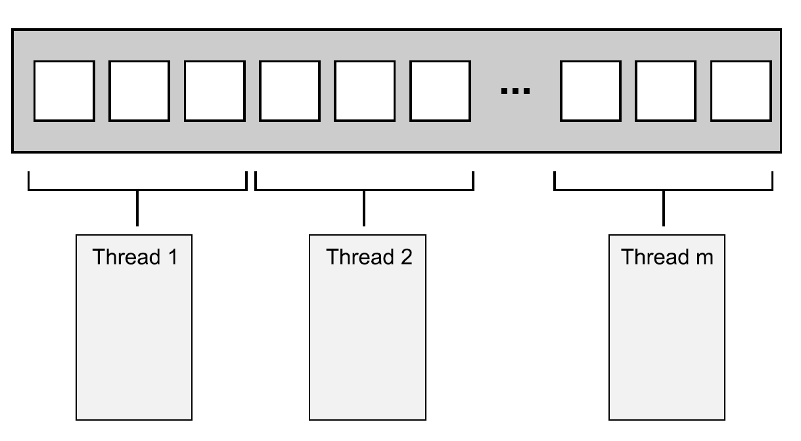

# 8.1 線程間劃分工作的技術

試想，你被要求負責建造一座房子。為了完成任務，你需要挖地基、砌牆、添加水暖、接入電線，等等。理論上，如果你很擅長建造屋子，那麼這些事情都可以由你來完成，但是這樣就要花費很長很長時間，並且需要不斷的切換任務。或者，你可以僱傭一些人來幫助你完成房子的建造。那麼現在你需要決定僱多少人，以及僱傭人員具有什麼樣的技能。比如，你可以僱幾個人，這幾個人什麼都會。現在你還得不斷的切換任務，不過因為僱傭了很多人，就要比之前的速度快很多。

或者，你可以僱傭一個包工隊(專家組)，由瓦工，木匠，電工和水管工組成。你的包工隊員只做其擅長的，所以當沒有水暖任務時，水管工會坐在那裡休息，喝茶或咖啡。因為人多的緣故，要比之前一個人的速度快很多，並且水管工在收拾廁所的時候，電工可以將電線連接到廚房，不過當沒有屬於自己的任務時，有人就會休息。即使有人在休息，你可能還是能感覺到包工隊要比僱傭一群什麼都會的人快。包工隊不需要更換工具，並且每個人的任務都要比會的人做的快。是快還是慢，取決於特定的情況——需要嘗試，進行觀察。

即使僱傭包工隊，你依舊可以選擇人數不同的團隊(可能在一個團隊中，瓦工的數量超過電工)。同樣，這會是一種補足，並且在建造不止一座房子的時候，會改變整體效率。即使水管工沒有太多的任務，在建造過一次房子後，你依舊能讓他總是處於忙碌的狀態。當包工隊無事可做的時候，你是不會給他們錢的；即使每次工作只有那麼幾個人工作，你還需要負擔整個團隊的開銷。

建造例子已經足夠說明問題；這與線程所做的事情有什麼關係呢？好吧，這些問題也會發生在線程上。你需要決定使用多少個線程，並且這些線程應該去做什麼。還需要決定是使用“全能”的線程去完成所有的任務，還是使用“專業”線程只去完成一件事情，或將兩種方法混合。使用併發的時候，需要作出諸多選擇來驅動併發，這裡的選擇會決定代碼的性能和清晰度。因此，這裡的選擇至關重要，所以在你設計應用程序的結構時，再作出適當的決定。在本節中，將看到很多劃分任務的技術，就先從線程間劃分數據開始吧！

## 8.1.1 在線程處理前對數據進行劃分

最簡單的並行算法，就是並行化的`std::for_each`，其會對一個數據集中每個元素執行同一個操作。為了並行化該算法，可以為數據集中每個元素分配一個處理線程。如何劃分才能獲得最佳的性能，很大程度上取決於數據結構實現的細節，在之後有關性能問題的章節會再提及此問題。

最簡單的分配方式：第一組N個元素分配一個線程，下一組N個元素再分配一個線程，以此類推，如圖8.1所示。不管數據怎麼分，每個線程都會對分配給它的元素進行操作，不過並不會和其他線程進行溝通，直到處理完成。



圖8.1 向線程分發連續的數據塊

使用過*MPI*(Message Passing Interface)[1]和OpenMP[2]的人對這個結構一定很熟悉：一項任務被分割成多個，放入一個並行任務集中，執行線程獨立的執行這些任務，結果在會有主線程中合併。這種方式在2.4節中的accumulate的例子中使用過了；在這個例子中，所有並行任務和主線程的任務都是累加和。對於for_each來說，主線程將無事可做，因為這個計算不需要最終處理。

最後一步對於並行程序來說十分重要；如清單2.8中那樣原始的實現，最後一步就是一個串行的。不過，這一步同樣也是能被並行化的；accumulate實際上是一個遞減操作，所以清單2.8中，當線程數量大於一個線程上最小處理項時，可以對accumulate進行遞歸調用。或者，工作線程就像做一個完整的任務一樣，對步驟進行遞減，而非每次都產生新的線程。

雖然這個技術十分強大，但是並不是哪都適用。有時不能像之前那樣，對任務進行整齊的劃分，因為只有對數據進行處理後，才能進行明確的劃分。這裡特別適用了遞歸算法，就像快速排序；下面就來看看這種特別的方式。

## 8.1.2 遞歸劃分

快速排序有兩個最基本的步驟：將數據劃分到中樞元素之前或之後，然後對中樞元素之前和之後的兩半數組再次進行快速排序。這裡不能通過對數據的簡單劃分達到並行，因為，只有在一次排序結束後，才能知道哪些項在中樞元素之前和之後。當要對這種算法進行並行化，很自然的會想到使用遞歸。每一級的遞歸都會多次調用quick_sort函數，因為需要知道哪些元素在中樞元素之前和之後。遞歸調用是完全獨立的，因為其訪問的是不同的數據集，並且每次迭代都能併發執行。圖8.2展示了這樣的遞歸劃分。


圖 8.2 遞歸劃分數據

在第4章中，已經見過這種實現。比起對大於和小於的數據塊遞歸調用函數，使用`std::async()`可以為每一級生成小於數據塊的異步任務。使用`std::async()`時，`C++`線程庫就能決定何時讓一個新線程執行任務，以及同步執行任務。

重要的是：對一個很大的數據集進行排序時，當每層遞歸都產生一個新線程，最後就會產生大量的線程。你會看到其對性能的影響，如果有太多的線程存在，那麼你的應用將會運行的很慢。如果數據集過於龐大，會將線程耗盡。那麼在遞歸的基礎上進行任務的劃分，就是一個不錯的主意；你只需要將一定數量的數據打包後，交給線程即可。`std::async()`可以出裡這種簡單的情況，不過這不是唯一的選擇。

另一種選擇是使用`std::thread::hardware_concurrency()`函數來確定線程的數量，就像在清單2.8中的並行版accumulate()一樣。然後，你可以將已排序的數據推到線程安全的棧上(如第6、7章中提及的棧)。當線程無所事事，不是已經完成對自己數據塊的梳理，就是在等待一組排序數據的產生；線程可以從棧上獲取這組數據，並且對其排序。

下面的代碼就是使用以上方式進行的實現。

清單8.1 使用棧的並行快速排序算法——等待數據塊排序

```
template<typename T>
struct sorter  // 1
{
  struct chunk_to_sort
  {
    std::list<T> data;
    std::promise<std::list<T> > promise;
  };

  thread_safe_stack<chunk_to_sort> chunks;  // 2
  std::vector<std::thread> threads;  // 3
  unsigned const max_thread_count;
  std::atomic<bool> end_of_data;

  sorter():
    max_thread_count(std::thread::hardware_concurrency()-1),
    end_of_data(false)
  {}

  ~sorter()  // 4
  {
    end_of_data=true;  // 5

    for(unsigned i=0;i<threads.size();++i)
    {
      threads[i].join();  // 6
    }
  }

  void try_sort_chunk()
  {
    boost::shared_ptr<chunk_to_sort > chunk=chunks.pop();  // 7
    if(chunk)
    {
      sort_chunk(chunk);  // 8
    }
  }

  std::list<T> do_sort(std::list<T>& chunk_data)  // 9
  {
    if(chunk_data.empty())
    {
      return chunk_data;
    }

    std::list<T> result;
    result.splice(result.begin(),chunk_data,chunk_data.begin());
    T const& partition_val=*result.begin();

    typename std::list<T>::iterator divide_point=  // 10
       std::partition(chunk_data.begin(),chunk_data.end(),
        [&](T const& val){return val<partition_val;});

    chunk_to_sort new_lower_chunk;
    new_lower_chunk.data.splice(new_lower_chunk.data.end(),
       chunk_data,chunk_data.begin(),
       divide_point);

    std::future<std::list<T> > new_lower=
      new_lower_chunk.promise.get_future();
    chunks.push(std::move(new_lower_chunk));  // 11
    if(threads.size()<max_thread_count)  // 12
    {
      threads.push_back(std::thread(&sorter<T>::sort_thread,this));
    }

    std::list<T> new_higher(do_sort(chunk_data));

    result.splice(result.end(),new_higher);
    while(new_lower.wait_for(std::chrono::seconds(0)) !=
       std::future_status::ready)  // 13
    {
      try_sort_chunk();  // 14
    }

    result.splice(result.begin(),new_lower.get());
    return result;
  }

  void sort_chunk(boost::shared_ptr<chunk_to_sort> const& chunk)
  {
    chunk->promise.set_value(do_sort(chunk->data));  // 15
  }

  void sort_thread()
  {
    while(!end_of_data)  // 16
    {
      try_sort_chunk();  // 17
      std::this_thread::yield();  // 18
    }
  }
};

template<typename T>
std::list<T> parallel_quick_sort(std::list<T> input)  // 19
{
  if(input.empty())
  {
    return input;
  }
  sorter<T> s;

  return s.do_sort(input);  // 20
}
```

這裡，parallel_quick_sort函數⑲代表了sorter類①的功能，其支持在棧上簡單的存儲無序數據塊②，並且對線程進行設置③。do_sort成員函數⑨主要做的就是對數據進行劃分⑩。相較於對每一個數據塊產生一個新的線程，這次會將這些數據塊推到棧上⑪；並在有備用處理器⑫的時候，產生新線程。因為小於部分的數據塊可能由其他線程進行處理，那麼就得等待這個線程完成⑬。為了讓所有事情順利進行(只有一個線程和其他所有線程都忙碌時)，當線程處於等待狀態時⑭，就讓當前線程嘗試處理棧上的數據。try_sort_chunk只是從棧上彈出一個數據塊⑦，並且對其進行排序⑧，將結果存在promise中，讓線程對已經存在於棧上的數據塊進行提取⑮。

當end_of_data沒有被設置時⑯，新生成的線程還在嘗試從棧上獲取需要排序的數據塊⑰。在循環檢查中，也要給其他線程機會⑱，可以從棧上取下數據塊進行更多的操作。這裡的實現依賴於sorter類④對線程的清理。當所有數據都已經排序完成，do_sort將會返回(即使還有工作線程在運行)，所以主線程將會從parallel_quick_sort⑳中返回，在這之後會銷燬sorter對象。析構函數會設置end_of_data標誌⑤，以及等待所有線程完成工作⑥。標誌的設置將終止線程函數內部的循環⑯。

在這個方案中，不用為spawn_task產生的無數線程所困擾，並且也不用再依賴`C++`線程庫，為你選擇執行線程的數量(就像`std::async()`那樣)。該方案制約線程數量的值就是`std::thread::hardware_concurrency()`的值，這樣就能避免任務過於頻繁的切換。不過，這裡還有兩個問題：線程管理和線程通訊。要解決這兩個問題就要增加代碼的複雜程度。雖然，線程對數據項是分開處理的，不過所有對棧的訪問，都可以向棧添加新的數據塊，並且移出數據塊以作處理。這裡重度的競爭會降低性能(即使使用無鎖(無阻塞)棧)，原因將會在後面提到。

這個方案使用到了一個特殊的線程池——所有線程的任務都來源於一個等待鏈表，然後線程會去完成任務，完成任務後會再來鏈表提取任務。這個線程池很有問題(包括對工作鏈表的競爭)，這個問題的解決方案將在第9章提到。關於多處理器的問題，將會在本章後面的章節中做出更為詳細的介紹(詳見8.2.1)。

幾種劃分方法：1，處理前劃分；2，遞歸劃分(都需要事先知道數據的長度固定)，還有上面的那種劃分方式。事情並非總是這樣好解決；當數據是動態生成，或是通過外部輸入，那麼這裡的辦法就不適用了。在這種情況下，基於任務類型的劃分方式，就要好於基於數據的劃分方式。

## 8.1.3 通過任務類型劃分工作

雖然為每個線程分配不同的數據塊，但工作的劃分(無論是之前就劃分好，還是使用遞歸的方式劃分)仍然在理論階段，因為這裡每個線程對每個數據塊的操作是相同的。而另一種選擇是讓線程做專門的工作，也就是每個線程做不同的工作，就像水管工和電工在建造一所屋子的時候所做的不同工作那樣。線程可能會對同一段數據進行操作，但它們對數據進行不同的操作。

對分工的排序，也就是從併發分離關注結果；每個線程都有不同的任務，這就意味著真正意義上的線程獨立。其他線程偶爾會向特定線程交付數據，或是通過觸發事件的方式來進行處理；不過總體而言，每個線程只需要關注自己所要做的事情即可。其本身就是基本良好的設計，每一段代碼只對自己的部分負責。

**分離關注**

當有多個任務需要持續運行一段時間，或需要及時進行處理的事件(比如，按鍵事件或傳入網絡數據)，且還有其他任務正在運行時，單線程應用採用的是單職責原則處理衝突。單線程的世界中，代碼會執行任務A(部分)後，再去執行任務B(部分)，再檢查按鈕事件，再檢查傳入的網絡包，然後在循環回去，執行任務A。這將會使得任務A複雜化，因為需要存儲完成狀態，以及定期從主循環中返回。如果在循環中添加了很多任務，那麼程序將運行的很慢；並且用戶會發現，在他/她按下按鍵後，很久之後才會有反應。我確定你已經在一些程序中見過這種情況：你給程序分配一項任務後，發現接口會封鎖，直到這項任務完成。

當使用獨立線程執行任務時，操作系統會幫你處理接口問題。在執行任務A時，線程可以專注於執行任務，而不用為保存狀態從主循環中返回。操作系統會自動保存狀態，當需要的時候，將線程切換到任務B或任務C。如果目標系統是帶有多核或多個處理器，任務A和任務B可很可能真正的併發執行。這樣處理按鍵時間或網絡包的代碼，就能及時執行了。所有事情都完成的很好，用戶得到了及時的響應；當然，作為開發者只需要寫具體操作的代碼即可，不用再將控制分支和使用用戶交互混在一起了。

聽起來不錯，玫瑰色的願景呀。事實真像上面所說的那樣簡單？一切取決於細節。如果每件事都是獨立的，那麼線程間就不需要交互，這樣的話一切都很簡單了。不幸的是，現實沒那麼美好。後臺那些優雅的任務，經常會被用戶要求做一些事情，並且它們需要通過更新用戶接口的方式，來讓用戶知道它們完成了任務。或者，用戶可能想要取消任務，這就需要用戶向接口發送一條消息，告知後臺任務停止運行。這兩種情況都需要認真考慮，設計，以及適當的同步，不過這裡擔心的部分還是分離的。用戶接口線程只能處理用戶接口，當其他線程告訴該線程要做什麼時，用戶接口線程會進行更新。同樣，後臺線程只運行它們所關注的任務；只是，有時會發生“允許任務被其他線程所停止”的情況。在這兩種情況下，後臺線程需要照顧來自其他線程的請求，線程本身只知道它們請求與自己的任務有所關聯。

多線程下有兩個危險需要分離關注。第一個是對錯誤擔憂的分離，主要表現為線程間共享著很多的數據，或者不同的線程要相互等待；這兩種情況都是因為線程間很密切的交互。當這種情況發生，就需要看一下為什麼需要這麼多交互。當所有交互都有關於同樣的問題，就應該使用單線程來解決，並將引用同一原因的線程提取出來。或者，當有兩個線程需要頻繁的交流，且沒有其他線程時，那麼就可以將這兩個線程合為一個線程。

當通過任務類型對線程間的任務進行劃分時，不應該讓線程處於完全隔離的狀態。當多個輸入數據集需要使用同樣的操作序列，可以將序列中的操作分成多個階段，來讓每個線程執行。

**劃分任務序列**

當任務會應用到相同操作序列，去處理獨立的數據項時，就可以使用*流水線*(pipeline)系統進行併發。這好比一個物理管道：數據流從管道一端進入，在進行一系列操作後，從管道另一端出去。

使用這種方式劃分工作，可以為流水線中的每一階段操作創建一個獨立線程。當一個操作完成，數據元素會放在隊列中，以供下一階段的線程提取使用。這就允許第一個線程在完成對於第一個數據塊的操作，並要對第二個數據塊進行操作時，第二個線程可以對第一個數據塊執行管線中的第二個操作。

這就是在線程間劃分數據的一種替代方案(如8.1.1描述)；這種方式適合於操作開始前，且對輸入數據處長度不清楚的情況。例如，數據來源可能是從網絡，或者可能是通過掃描文件系統來確定要處理的文件。

流水線對於隊列中耗時的操作處理的也很合理；通過對線程間任務的劃分，就能對應用的性能所有改善。假設有20個數據項，需要在四核的機器上處理，並且每一個數據項需要四個步驟來完成操作，每一步都需要3秒來完成。如果你將數據分給了四個線程，那麼每個線程上就有5個數據項要處理。假設在處理的時候，沒有其他線程對處理過程進行影響，在12秒後4個數據項處理完成，24秒後8個數據項處理完成，以此類推。當20個數據項都完成操作，就需要1分鐘的時間。在管線中就會完全不同。四步可以交給四個內核。那麼現在，第一個數據項可以被每一個核進行處理，所以其還是會消耗12秒。的確，在12秒後你就能得到一個處理過的數據項，這相較於數據劃分並沒有好多少。不過，當流水線流動起來，事情就會不一樣了；在第一個核處理第一個數據項後，數據項就會交給下一個內核，所以第一個核在處理完第一個數據項後，其還可以對第二個數據項進行處理。那麼在12秒後，每3秒將會得到一個已處理的數據項，這就要好於每隔12秒完成4個數據項。

為什麼整批處理的時間要長於流水線呢？因為你需要在最終核開始處理第一個元素前等待9秒。更平滑的操作，能在某些情況下獲益更多。考慮如下情況：當一個系統用來播放高清數字視頻。為了讓視頻能夠播放，你至少要保證25幀每秒的解碼速度。同樣的，這些圖像需要有均勻的間隔，才會給觀眾留有連續播放的感覺；一個應用可以在1秒解碼100幀，不過在解完就需要暫停1s的時候，這個應用就沒有意義了。另一方面，觀眾能接受在視頻開始播放的時候有一定的延遲。這種情況，並行使用流水線就能得到穩定的解碼率。

看了這麼多線程間劃分工作的技術，接下來讓我們來看一下在多線程系統中有哪些因素會影響性能，並且這些因素是如何影響你選擇劃分方案的。

----------

[1] http://www.mpi-forum.org/

[2] http://www.openmp.org/
