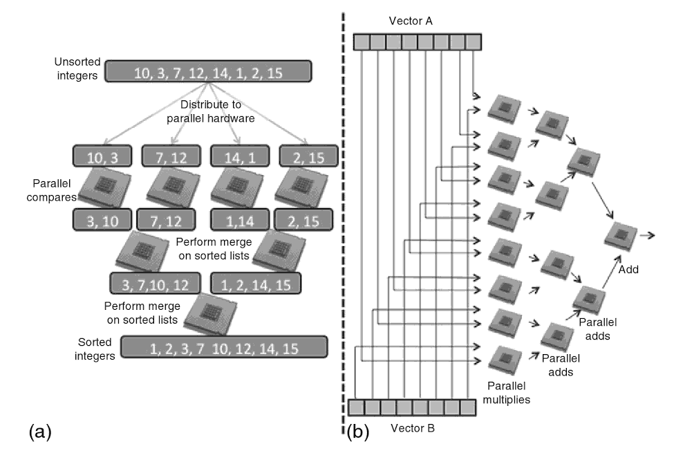
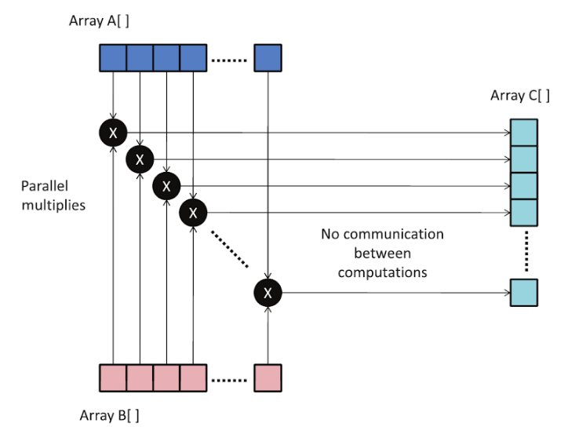
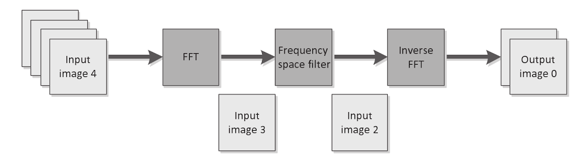
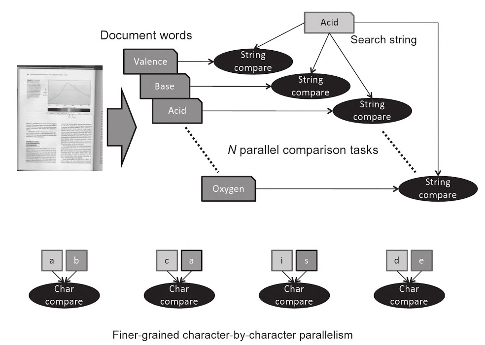
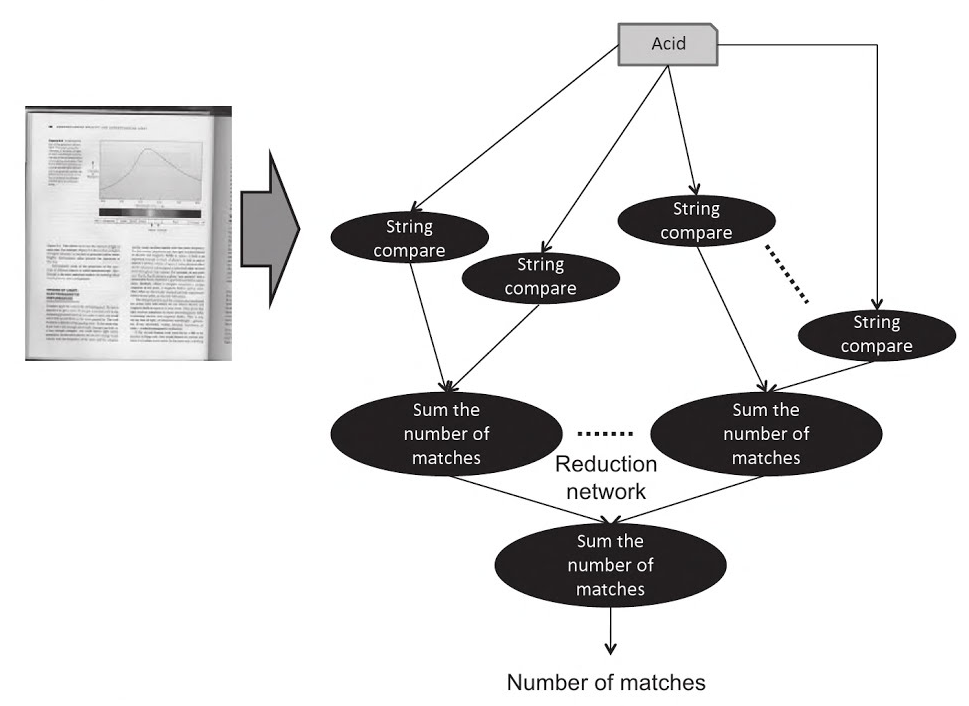

#1.3 並行思想

大多數應用開始都是運行在單核上。不過，在高性能計算時代，當系統提供多個計算資源時，這些資源就會用來為應用加速。標準的方法包括“分而治之”和“分散-聚合”的分解方式，為編程者提供一系列高效利用並行資源的方式。“分而治之”是將一個問題遞歸的劃分為數個子問題，直到可用的計算資源能夠解決劃分後的子問題。“分散-聚合”會先發送一部分輸入數據到每個並行資源中，然後將這些輸入數據處理後的結果進行收集，再將這些結果合併到一個結果數據集中。以前，劃分後的任務大小與計算資源的能力有很大關係。圖1.1展示了普遍應用處理排序和矢量相乘的方式，以往的應用會將任務映射到可並行的計算資源中進行加速計算。



圖1.1 (a)簡單的排序例子：分而治之的實現，將一個列表劃分為短列表，然後對這些短列表進行排序，然後將這些已經排序的短列表進行排序。 (b)矢量-標量乘法：將乘法分開計算，然後將乘法的結果通過一系列操作進行相加。

現代計算系統發展中，並行化和異構化成為一種趨勢，這樣傳統的編程方式就一定會受到衝擊。因為CMOS(互補金屬氧化物半導體，Complementary Metal Oxide Semiconductor)的功耗和熱極限是額定的，微處理器供應商發現硬件的瓶頸很難讓設備獲取更高的性能，所以其不得不使用多芯片的方式(或定製的方式)來替代單個芯片。因為硬件供應商們已經這樣做了，那麼對於編程者來說，就再也沒有“免費的午餐”了(The Free Lunch Is Over)。同時，需要編程者抽離應用中並行的部分。編程者還要根據相關算法去劃分任務，並且將這些劃分好的任務映射到不同的硬件平臺上。

過去的10年，並行計算設備的數量和計算能力都在快速的增長。近期，GPU出現在計算領域；今天，其能夠使用很低的功耗，並提供很高的計算能力，讓如今計算機的計算能力達到了一個新的水平。GPU已不是單純基於驅動的3D實時圖像渲染技術的硬件設備，GPU在其他方面的進化也十分迅速，並且成為一種完全可編程的設備，能夠對數據和任務並行的任務進行處理。硬件製造商如今將CPU和GPU集成在了一塊芯片上面，這將是下一代異構計算的趨勢。計算敏感和數據敏感的應用都可以看做為一個任務，任務的代碼在內核中。內核可運行在GPU上，GPU使用低功耗和高性能完成相應的任務，而CPU之後僅負責對非kernel代碼任務的執行。

很多系統，以及大自然和人造世界中的某些現象，都展示著不同類別的並行和併發：

- 分子動力學——分子之間是互相影響的。
- 天氣和海洋模型——成千上萬的波浪和潮汐。
- 多媒體系統——視覺和音效，成千上萬像素和波形。
- 汽車生產流水線——成千上萬的汽車部件，每一款部件都由很多相同的產品線在生產。

並行計算由Almasi和Gottlieb[1]定義，這種計算模式下，很多計算可以同時進行。原理就是將大問題分割成小問題，這樣小問題之間沒有關聯，就可以同時進行解決。這種程度的並行，依賴其實是物質內在的本質(還記得大自然中存在著有很多並行的現象吧)，應用這樣的原理就可以來處理手頭上的問題。對於算法技巧和軟件設計來說，瞭解哪些部分可以並行也是很重要的。我們先對兩個簡單例子進行討論，展示其內在的並行計算：1.兩個整型數組相乘；2.文本查找。

第一個例子會將兩個整型數組A和B拆分後進行相乘，每個拆分數組中都有N個數組成，然後將乘後的結果存儲到C數組中。圖1.2展示了拆分的方式。串行的C++代碼如下清單1.1所示。



圖1.2：A與B數組相乘，並將結果存入C數組中。

```c++
// 清單 1.1: 數組相乘
for (int i = 0; i < N; ++i){
  C[i] = A[i] * B[i];
}
```

雖然這段代的計算敏感度並不高，但這段代碼確實可以並行。低計算敏感度說明該算法的計算部分操作，要少於內存操作。A和B中的元素都是相互獨立的，如果要並行化這段代碼，需要選擇C++代碼段中能夠獨立執行的代碼段進行並行化。這段代碼是可以數據並行的，A和B數組可以經過同樣的處理，然後產生C數組中的數據。

我們再可以來看一個通過劃分方式，實現簡單任務並行的例子。任務有在操作系統處理中有著不同的狀態，比如：完成、等待、處理、掛起等。這裡我們討論的是，使用整個任務的部分輸入作為一個子項進行操作。任務並行可以進一步推廣到流水線上，或是複雜的並行交互上。圖1.3展示了一個任務並行在流水線的例子，這個例子使用快速傅里葉變化將圖像從時域輸出到頻域上。



圖1.3：FFT的任務並行例子。不同的圖像將會被分為三個獨立的任務進行。

讓我們來看第二個例子。這裡我們要嘗試對不同的查找詞進行分割，然後統計查找詞在文本中出現的次數(可見圖1.4)。假設查找詞有N個，那我們可以將查找詞和輸入字符串進行匹配(相當於一個任務)。每個例子中查找詞都會和輸入的文本字符串進行匹配操作。這種方式很高效，並行度不錯。不過，每次輸入的字符串都要和這N個查找詞進行匹配。每個並行任務都在執行相同的操作。與上個例子相比，這是一個任務細粒度並行化的例子。這兩個例子展示了數據和任務級別的並行。



圖1.4：任務級並行，多個查找詞可以同時進行查找。也展示了，在一個詞內，細粒度“字符與字符”相比較的並行性。

匹配數量是確定的，那我們需要將其出現的次數進行相加。同樣的，相加操作也可以並行化。這一步中，會介紹“歸約”原理，我們將使用高效的方式，利用並行資源來對各個詞進行統計。圖1.5所示的歸約樹，就是我們用來處理相加計算的方式，其時間複雜度為O(logN)。



圖1.5：結束了圖1.4中的字符串比較之後，就要將匹配的結果進行相加，放入到一個結果節點中。

------

[1] G.S.Almamsi, A Goulieb, Highlu Parraleel Computing, Benjamin-Cummings Publishing Co.. Inc.. RedWood City, Ca, USA, 1989