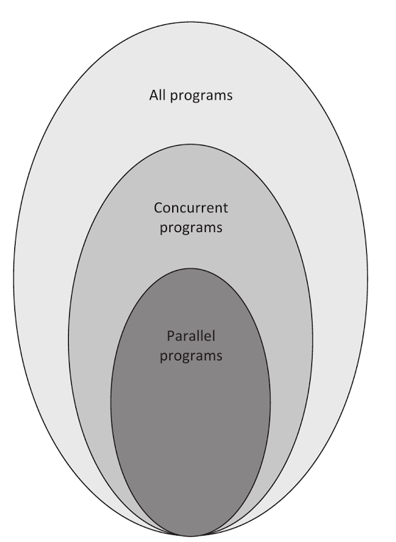

# 1.4 併發和並行編程模型

嘗試使用OpenCL進行應用開發之前，需要來討論一下並行和併發執行模型，以便於我們選擇合適的模型。雖然，後面的模型OpenCL都能支持，不過具體的底層硬件可能會有一些限制，這就需要進行一定的嘗試。

當我們在討論併發編程時，就意味著獨立的系統在執行多個獨立的任務。不過，人們一般不會關心這些任務是否真正的在系統中同時執行。例如一個簡單的繪圖程序，其收到用戶使用鼠標和鍵盤發送過來的輸入信號，或更新當前顯示的圖片。應用可以併發的接收輸入信號，並處理與顯示相關的對應信號，從而更新顯示圖像。這些任務的表現看起來是併發的，不過這些任務實際是並行執行。實際上，這些任務執行在一個CPU上，它們不能並行的執行。在這個例子中，應用或操作系統需要在不同任務間進行切換，確保這些任務都能執行在同一個內核上。

並行化關心的是兩個或多個事件同時執行，以提高整體性能。比如如下的賦值語句：

```
// 代碼清單1.2
Step 1: A = B + C
Step 2: D = E + G
Step 3: R = A + D
```

A和D分別在第一和第二步進行賦值，並且這兩步之間沒有數據依賴，相互獨立。第一步和第二步等號左右的數據均不相同，所以第一步和第二步可以並行的執行。第三步數據依賴於第一步和第二步的結果，所以其只能在第一步和第二步執行完成之後執行。

並行編程必須是併發的，不過併發編程不一定並行。雖然很多併發程序可以並行執行，但是互相有依賴的併發任務就不能並行了。比如：交錯執行就符合併發的定義，而不能並行的執行。所以，並行是併發的一個子集，併發程序是所有程序集的一個子集。圖1.6展示了這三種程序集間的關係。



圖1.6：三種程序集間的關係

接下來的章節中，會介紹一些知名的方式進行異構編程。這裡對併發和並行的介紹，是為第2和第3章介紹OpenCL做好鋪墊。

