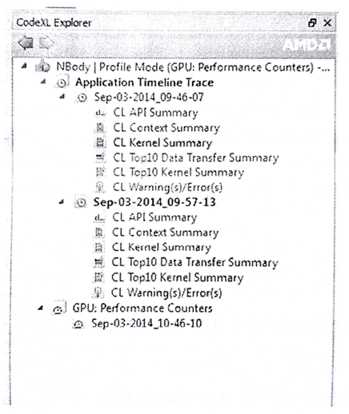
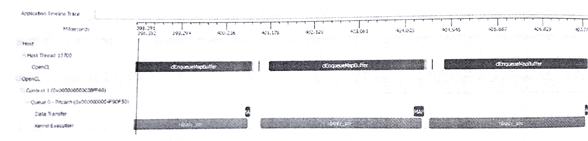
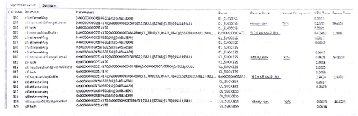
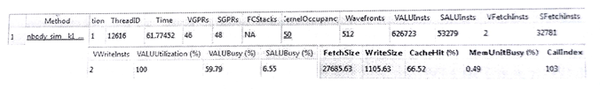

#10.4 如何使用AMD CodeXL

性能分析模式下，CodeXL可以作為性能分析工具將OpenCL運行時和AMD GPU執行時的數據彙總在一起。我們可以通過這種方式找到應用的瓶頸所在，並且找到最佳的方式在AMD平臺上對應用性能進行優化。在這之後，我們將性能分析模式下的CodeXL稱為*分析器*(profiler)。

為了在Visual Studio中使用CodeXL插件，只需要簡單的將解決方案導入Visual Studio即可。通常，CodeXL事件瀏覽窗口和Visual Studio解決方案窗口停靠在一起。再將某一個C/C++工程設置為啟動工程，並且在CodeXL菜單欄中選定Proflie Mode。這個模式可以獲取到的信息如下所示：

- GPU應用時間線軌跡
- GPU在執行內核時的性能計數
- 收集CPU在執行時的性能信息

菜單欄中，我們可以收集一個應用的時間線軌跡或GPU性能計數器。當應用完成執行，分析器會對收集到的信息進行處理，然後在界面上進行顯示。CodeXL獨立運行時也可以完成該功能，可以通過一個命令工具——sprofile(在CodeXL的安裝路徑下)。使用sprofile的方式不需要加載源碼，只需要執行對應的二進制文件即可。

每一次執行對於分析器來說都是一個新的任務，所以分析器會將其分為多個任務。圖10.1中展示了具有三個任務的CodeXL分析器。

圖10.1 CodeXL分析模式下的任務。兩個任務獲取的的是應用時間線，另一個獲取的是GPU計數器

##10.4.1 OpenCL應用的跟蹤信息

OpenCL跟蹤鏈表中的信息都是有關OpenCL API的調用。對於每次的API調用，分析器都會記錄其輸入參數，以及輸出結果。另外，分析器同時也記錄了CPU上代碼的時間戳和OpenCL運行時的時間戳信息。輸出數據記錄在一個文本格式的文件中，稱為應用性能跟蹤文件。

對於OpenCL程序的跟蹤對於理解複雜程序的高級框架是十分有幫助的。OpenCL應用的跟蹤數據可助我們瞭解如下信息：

- 通過時間線的角度，我們可以瞭解應用的高級架構。並且，可以確定應用中創建的OpenCL上下文數量，以及命令隊列創建的數量和其在應用中的應用。內核執行和數據傳輸操作的時間也在時間線上可見。
- 總結頁面可以幫助我們瞭解，當前應用的瓶頸是否在內核執行或數據傳輸上。我們找到最耗時的10個內核和數據傳輸操作，以及API調用(調用次數最多的API或執行最耗時的API)。
- 可以通過API跟蹤的頁面，來瞭解和調試所有API的輸入參數和輸出數據。
- 查看警告，並嘗試使用最佳的方式調用OpenCL API。

應用的時間線(如圖10.2所示)提供了應用在執行時的甘特圖。最頂部的時間線是時間格，用來表示該應用總體的耗時情況。其計時的方式是以第一次OpenCL的調用作為起始，最後一個OpenCL調用作為結束。下面的時間線中，主機端線程對OpenCL的調用都展示在事件先中。對於每個主機端線程，OpenCL API調用都會在甘特圖中繪製成一個單獨的時間格。

圖10.2 Nbody應用在CodeXL性能分析模式下的時間線。我們能看到數據傳輸和內核運行的耗時情況。

下面的主機線程中，OpenCL樹展示了所有創建的上下文和命令隊列，以及數據傳輸操作和每個命令隊列中的內核執行事件。我們可以對事件線進行縮放、平移、摺疊和展開，或選擇一段感興趣的區域。我們也可以通過相關的API調用，看到API的時間格，反之亦然。時間線另外一個很實用的功能是，右鍵點擊對應的API，可以顯示該API在源碼中的位置。

用時間線對於調試OpenCL應用十分有用。下面介紹一下時間線所帶來的好處：

- 你需要確定你應用中的外部框架是否正確。通過測試時間線，你可以確定隊列和上下文對象的創建，與你的期望是否一致。
- 可以增加對同步操作的信心。例如，當內核A需要依賴一個內存操作，並且這個內存的數據來源於內核B，那麼內核A就應該出現在內核B之後的時間線中。通過傳統的調試方式，我們很難找到同步所引發的錯誤。
- 最後，你可以瞭解到應用是利用硬件是否高效。時間線展示了同時執行的獨立內核和數據傳輸操作。

##10.4.2 跟蹤主機端API

主機端API跟蹤展示(如圖10.3)，列出了每個主機線程調用OpenCL API的情況。這裡我們使用AMD OpenCL SDK中的Nbody應用作為測試用例。每個調用過OpenCL API的線程都會展示在表中。

圖10.3 Nbody應用在CodeXL性能分析模式下對API調用的跟蹤

主機API跟蹤包含一系列主機線程對OpenCL API的調用。對於每一次調用，列表中都會用相應的索引(根據執行順序)進行表示，API函數的名稱，傳入參數和返回值都會進行記錄。當要了解傳入的參數時，分析器就會嘗試去解應用指針、反編碼枚舉值等方式，給開發者提供儘可能多有用的信息。雙擊主機API，就可以看到對應API在主機線程中對應時間線的位置。

主機API跟蹤允許我們對每個API的輸入和輸出結果進行分析。例如，可以簡單查詢所有API是否都返回了CL_SUCCESS，或對應的數組對象是否使用正確的標識進行創建。這裡我們也可以看到冗餘的API使用。

##10.4.3 總結頁面信息

應用跟蹤事件時間線同樣也提供對OpenCL應用的性能總結。通常，會告訴我們應用的瓶頸所在。總結頁面在每個CodeXL分析器中都有，可以通過打開對應的界面看到。總結頁面的主要彙總信息介紹如下：

- **API總結頁面**：頁面展示了主機端調用的所用OpenCL API
- **上下文總結頁面**：頁面統計了每個上下文對象上的所有內核和數據傳輸操作，也展示了數組和圖像對象創建的個數。
- **內核總結頁面**：頁面統計了應用所創建的所有內核。
- **10個最耗時數據傳輸操作的總結頁面**：頁面將數據傳輸操作耗時進行排序，展示10個耗時最長的數據傳輸操作。
- **10個最耗時內核的總結頁面**：頁面將內核執行耗時進行排序，展示了10個耗時最長的內核。
- **警告/錯誤頁面**：展示應用可能存在的問題。其能為未釋放的OpenCL資源、OpenCL API失敗的調用，以及如何改進能獲取更優的性能。點擊相關OpenCL API的超鏈接，就能看到相應API的一些信息。

上下文總結表中，就能看到內核執行或數據傳輸是如何限制應用的性能。如果應用的性能瓶頸在於數據傳輸，那麼就意味著有大量數據盡心傳輸(讀、寫、拷貝或映射)。之後我們可對相關算法進行分析，看是否能減少相應的數據傳輸。總結頁面中的時間線可以幫助我們瞭解，應用的執行過程中，是否使用了最高效的數據傳輸方式——同內核執行併發執行。

如果應用的瓶頸在於內核執行，就要看一下哪個內核的耗時過長。如果確定了對應的內核，將可以通過GPU執行的性能數據，對該內核的瓶頸進行具體分析。

##10.4.4 GPU內核性能計數

API跟蹤只提供時間戳信息，通過時間戳我們可以得到內核執行的時間。其不會告訴我們內核中的性能瓶頸在哪裡。當我們使用跟蹤數據發現哪個內核需要優化時，我們可以收集相關內核在GPU設備上的執行信息。

GPU內核性能計數器可以用來在內核執行時，發現內核可能存在的瓶頸。這些數據可以提供給開發者，讓開發者來確定具體的瓶頸。AMD Radeon GPU支持性能計數器，GPU是否支持性能計數器的信息可以在CodeXL的文檔中找到。

圖10.4 CodeXL分析器展示了Nbody內核在GPU上執行的性能計數情況

圖10.4中展示了Nbody內核GPU上的性能計數情況。使用性能計數器，我們可以做下面的事情：

- 決定內核所需要分配的資源數量(通用寄存器，局部內存大小)。這些資源會受到正在GPU中運行的波面陣的影響。可以分配較高的波面陣數量來隱藏數據延遲。
- 決定在GPU運行指令時，所要是用ALU的數量，以及全局和局部內存的數量。
- 可以瞭解緩存的命中率，以及寫入或讀取全局內存中的數據量。
- 決定使用相應的向量ALU單元和內存單元。
- 瞭解任意局部內存(局部共享數據)的塊衝突，SIMD單元嘗試讀取或寫入同一個局部共享數據的相同位置，這樣導致訪存串行化，並且增加訪問延遲。

輸出數據記錄在一個csv(comma-separated-variable)格式的文件中。你可以點擊相應的內核名稱，進入“Method”列找到OpenCL內核源碼，AMD中間碼(IL，Intermediate language)，以及GPU指令集(ISA)，或是內核的CPU彙編代碼。根據圖10.4中的信息，我們可以嘗試對內核性能進行優化。例如，儘管有大量的向量指令(626723每工作項)，沒有分支(VALU利用率100%)，對應矢量ALU在執行的時候也只有59%的使用率。每個工作項只有兩個獲取指令，所以內核中不可能被內存訪問所限制，所以原因可能是緩存的命中率過低。這就解釋了為什麼矢量ALU使用率低下的原因。重構代碼當然是一個不錯的選擇，不過工作量有點大，也可以嘗試增加波面陣的數量，用來掩蓋緩存未命中的延遲。這兩種選擇都可以對應用進行優化。

##10.4.5 使用CodeXL對CPU性能進行分析

CodeXL也提供了很多CPU分析方式。CodeXL對CPU代碼的分析是通過基於指令的採樣，或是基於時間的採樣獲得。CPU性能數據有助於開發者對分支、數據訪問、指令訪問和L2緩存的行為進行了解，從而進行研究。

本章著重是告訴OpenCL開發者如何使用CodeXL，如果讀者想要了解CodeXL對CPU的分析詳情，可以閱讀最先版本的CodeXL的用戶指南。用戶指南的獲取地址為：http://developer.amd.com/tools-and-sdks/opencl-zone/codexl/ [譯者注：書中的地址已經404，[新地址](http://gpuopen.com/compute-product/codexl/?webSyncID=dcc7dd2d-c047-1d25-0893-e75291622902&sessionGUID=9a4a8d26-e132-c584-67b8-e88956971a45)]

