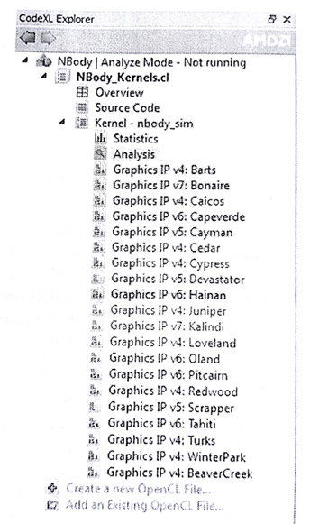
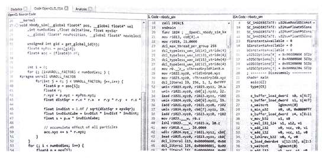
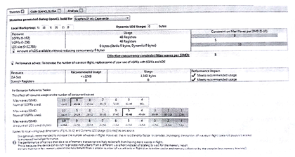
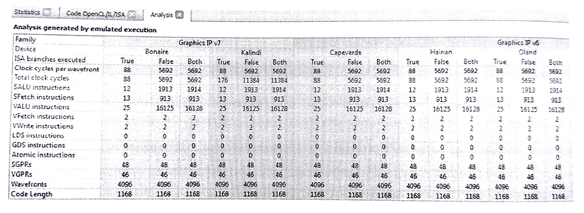

#10.5 使用CodeXL分析內核

分析模式下，CodeXL可以當做靜態分析工具使用。AMD顯卡上，分析模式可以用來編譯、分析和反彙編一個OpenCL內核。分析模式可選擇界面方式和命令行方式。在這之後我們就稱CodeXL為“內核分析器”。內核分析器也可以通過命令行使用，在CodeXL安裝目錄下，有一個CodeXLAnalyzer.exe，可以直接在命令行中執行。

內核分析器是一個離線編譯器，還是一個分析工具。其能將內核源碼編譯成任意支持的GPU(需要驅動支持)上可執行的二進制文件。為了使用內核分析器，AMD OpenCL運行時需要提前在系統中安裝好。為了對OpenCL內核進行靜態分析，內核必須由內核分析器編譯。為了使用內核分析器編譯內核，只需要將OpenCL內核源碼放置在CodeXL的主窗口內(如圖10.6所示)即可。內核分析器可以帶來以下一些收益：

1. 使用OpenCL內核源碼：內核分析器不需要編譯主機端源碼，只需要編譯OpenCL內核即可，其對於OpenCL內核源碼來說，是一個很有用的工具。內核分析器包含一個離線編譯器，這個編譯器可以編譯和反彙編OpenCL內核，並且通過分析工具能看到內核的ISA碼。編譯中出現的錯誤將出現在輸出界面中。當不同的GPU設備支持不同的OpenCL擴展和內置函數時，內核分析器可以對內核進行檢查，看其是否能在不同的GPU設備上編譯通過。
2. 生成OpenCL二進制文件：通常開發者不會希望將自己的內核源碼進行發佈。在這種情況下，OpenCL內核會以二進制文件和主要執行庫或可執行文件一起發佈。同樣，OpenCL API也能對內核進行編譯，並且保存成二進制文件。生成的二進制文件，只能用於同一平臺上的設備。內核分析器命令行方式也可以生成二進制內核文件，用戶使用這個工具可以生成AMD平臺上支持的二進制內核。另外，內核分析器將一些選項的設置在內核二進制ELF文件中的某些字段中。這樣就能避免以源碼的形式發佈內核了。這個二進制文件中只包含了ISA或LLVM的中間碼，或源碼。OpenCL內核二進制中不同字段所扮演的角色不同：
	· ISA字段：如果開發者要包含一種特殊GPU設備的ISA碼在二進制內核中，那麼就要為其他OpenCL設備重新生成相應的二進制內核。
    · LLVM IR字段：OpenCL二進制俄日那勁中的LLVM IR(或AMD IL)都支持大部分AMD設備。在OpenCL運行時，會將IR翻譯成對應GPU的ISA。
3. 預先對內核的性能進行評估：因為每個內核都能相對於主機端代碼單獨執行。這樣就不需要知道太多OpenCL程序實現的細節。從而，能根據目標機器的信息對內核提前進行性能評估。

內核分析器載入內核源碼時，內核分析器可以只構建OpenCl內核，並且完成對該內核的分析。執行`build and Analyze`這步時，內核分析器會展示一些Graphics IP版本號(如圖10.5所示)。每一個Graphics IP版本都會展示相應的AMD IL和GPU ISA代碼(如圖10.6所示)。

圖10.5 AMD CodeXL的分析模式。NBody中OpenCL內核在不同版本的圖像架構下的不同中間碼展示。

圖10.6 內核分析的ISA顯示頁面。NBody OpenCL內核在多個GPU架構下編譯。對於每個GPU架構，AMD IL碼和GPU ISA碼都可以進行評估。

下一節中，將會展開上面的內容，繼續介紹內核分析器，並且也會討論分析內核IL和ISA代碼的好處。內核分析器包括了ISA頁面顯示，統計顯示和分析顯示頁面。

##10.5.1 內核分析器的統計和ISA碼展示頁面

與X86的ISA相同，GPU的ISA也是一段很複雜的指令隊列。有時這些代碼對於非常牛X的開發者來說，也很難讀懂。不過，內核分析器基於高階分析所產生的GPU ISA碼，可在應用早期階段幫助OpenCL應用開發者提升應用性能。為指定設備進行內核優化時，通常就會對ISA碼進行分析。瞭解ISA碼的益處，如下所示：

- 可以看到使用了多少通用寄存器，並且瞭解使用的寄存器數量是否會過多。要是過多的話，應用就會使用全局內存來替代這些寄存器，從而造成訪存的高延遲。寄存器使用的統計有助於我們對內核代碼進行重構，從而減少或複用一定數量的通用寄存器，或者更多的使用局部內存。
- 可以看到不同的顯卡架構，ISA指令中進行了不同次數的讀取和存儲，這些指令使用的數量，對於開發者來說是可控的。在瞭解指令數量之後，可以儘可能減少每個工作項讀取或存儲數據的尺寸。
- 可以通過類似循環展開的方式觀察生成ISA碼有和不同，從而達到優化的目的。而且開發者可以瞭解OpenCL的一些內置函數(比如原子操作)是如何進行實現的。

這樣就可以通過分析ISA碼，對OpenCl內核源碼進行優化。優化之後的內核代碼可使用內核分析器生成ISA代碼，觀察相應的分支是出現了，還是消失了。不過這種方式很那將OpenCL源碼與ISA碼關聯到一起。開發者可以選擇使用`-O0`作為內核分析器的編譯選項，不讓編譯器對OpenCL內核進行任何的優化。

內核分析器的統計界面，如圖10.7所示。統計頁面可以幫助開發者瞭解OpenCL內核使用了多少資源。AMD OpenCL編譯器會將OpenCL內核所要使用GPU資源進行記錄。當每個計算單元上的波面陣數量確定，那麼內核就會使用佔用的方式使用對應資源。現代AMD GPU可以在每個SIMD單元上併發執行10個波面陣，從而能夠很好的隱藏延遲。計算單元上波面陣數量的分配也是要根據相應的資源(局部內存，矢量和標量寄存器)進行。NBody中內核佔用的資源如圖10.7所示。我們可以看到Nbody內核被計算單元中的向量寄存器所限制。

圖10.7 內核分析器中對於NBody內核的統計顯示。我們可以看到併發波面陣的數量，其分配數量被向量寄存器的數量所限制。

##10.5.2 內核分析器的分析界面

內核分析器的統計和ISA頁面，都能可以同時展示IL碼、ISA碼和OpenCL內核源碼。

內核分析器包含了一個OpenCL內核分析頁面。在分析界面中可以加載每次任務中的所有內核。分析頁面會計算出OpenCL內核運行的近似時間。該時間是通過對目標設備進行仿真後，運行得到的。

圖10.8 對NBody應用的內核分析界面。對於不同框架的GPU，進行相應的性能評估。

OpenCL內核運行仿真時間如圖10.8所示。內核分析器會對OpenCL內核進行評估。當內核分析器無法使用輸入數據執行時，其會取推斷有多少循環和分支需要執行，並且推斷需要執行多少次。推斷方式描述如下：

- **全真**：所有線程的分支狀態為真——進入設計好的標籤內。
- **全假**：所有線程的分支狀態為假——執行下一個分支。
- **皆有**：一些線程的分支狀態為假——執行所有分支。這樣有些進入"else"分支的語句就完全不起作用。

內核分析器就是通過以上的方法對OpenCL內核，進行耗時評估的。圖10.8展示了對NBody內核在不同架構GPU上的評估。“True”、“False”和“Both”列展示了每中類型的推斷，這些推斷可以用來評估OpenCL內核運行時間的上限和下限。

另外，分析界面也提供統計，比如：需要執行多少向量和標量指令，標量獲取指令的數量。對於開發者來說，這些統計對於應用的性能評估很有幫助；對於是那些沒有特定GPU設備的開發人員來說，這樣無疑是在開發時的一種解脫。

