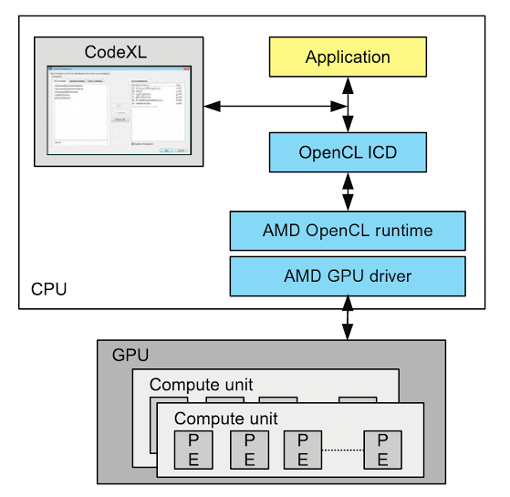
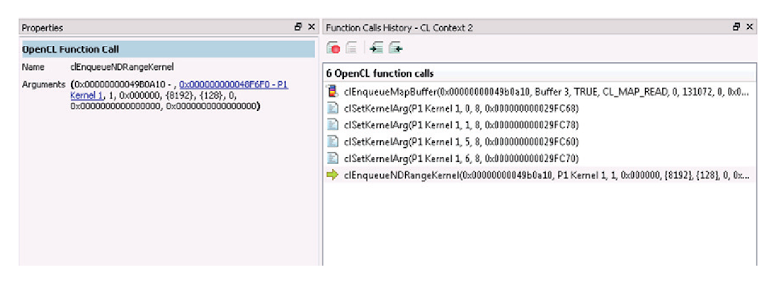
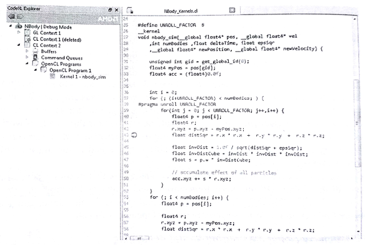
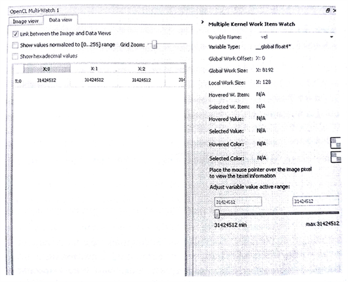

#10.6 使用CodeXL調試OpenCL內核

之前章節中，我們已經瞭解瞭如何對我們的OpenCL內核源碼進行優化。不過，優化的前提是程序運行結果必須是正確的。通常，調試並行程序就已經很困難了，現在需要對使用異構設備的程序進行調試，這無疑是難上加難。

OpenCL中，開發人員只需要調用相關的API，不需要知道平臺底層是如何進行實現。調試器讓平臺底層實現以“白盒”的方式展示給開發者，開發者可以清晰的瞭解到，每個命令對於並行計算系統的影響。這種方式可以幫助開發者找到錯誤使用OpenCL的地方，以及是否是在對應平臺上的優化所帶來的問題。本節，我們將來瞭解一下，如何使用CodeXL在異構下進行調試。在調試模式下，CodeXL可以作為OpenCL和OpenGL的調試器，以及內存分析工具。其能幫助開發者找到應用中的錯誤，優化OpenCL的性能，以及優化內存的使用。

圖10.9 以抽象層級的方式展示了CodeXL和OpenCL應用間的互動關係。

圖10.9展示了一個簡單的的層級結構，其描述了CodeXL如何在調試模式下，和OpenCL設備進行互動。這裡會展示一些比較重要的模塊或組件。CodeXL會截獲應用和OpenCL *可安裝客戶端驅動*(ICD, Installable client driver)。這就使能了CodeXL對OpenCL API調用的記錄、所有OpenCL對象記錄，以及彙總了這些對象上所攜帶的數據。下面的章節中，我們將簡要了解一下CodeXL調試的能力，以及在調試模式下如何使用CodeXL。下面我們就簡要的介紹一下CodeXL的調試模式。

之前說過，異構應用有兩部分不同的代碼構成：

1. API級別的代碼(比如，clCreateBuffer(), clEnqueueNDRangeKenrel())。這些調用執行在主機端。
2. OpenCL命令，包括設備執行和數據傳輸。

CodeXL允許開發者使用斷點的方式(主機端和設備端皆可)的方式調試OpenCL應用。我們這裡簡要了解一下CodeXL如何進行主機端代碼和內核的調試。

##10.6.1 API級別調試

我們先用NBody作為一個例子，來瞭解一下如何進行API級別的調試。為了進行API級別的調試，CodeXL必須先切換到調試模式。API級別的調試中，CodeXL可以看到每個API運行時所傳入的參數。API級別的調試具有如下的一些特性：

- **API函數斷點**：CodeXL可以設置斷點，斷點設置和使用的方式與其他常用調試器相同。
- **記錄OpenCL API調用情況**：調試模式會讓應用暫停執行，CodeXL會給我們展示在之前的運行過程中的最後一次OpenCL API的調用情況。圖10.10展示了CodeXL作為調試器回溯該應用中所使用到的OpenCL命令。
- **程序和內核信息**：OpenCL上下文對象包含多個程序對象和內核對象。CodeXL可以驗證哪些程序對象與哪個上下文對象相關聯。如果程序是使用`clCreateProgramWithSource()`創建，我們還可以看到傳入到該函數的內核源碼。
- **圖像和數組對象數據**：一個OpenCL上下文對象中包含多個數組對象和圖像對象。CodeXL也可以讓開發者直接查看這些對象中的數據。對於圖像類型，CodeXL允許我們以圖像的角度來查看圖像對象中的數據。
- **內存檢查**：CodeXL可以讓我們瞭解對應上下文對象的數組對象中內存內存使用情況。內存檢查功能可以用來檢查內存洩漏，因為在設備端內存不能直接被查看到，所以要查到相關問題會非常的困難。
- **API使用統計**：CodeXL展示了當前選擇的上下文對象中的統計的API使用信息。通過分解API在上下文中的調用，我們就能知道一個函數被調用了多少次。

圖10.10 CodeXL對於OpenCL程序進行API調用的回溯。

##10.6.2 調試內核

CodeXL可以在運行時對OpenCL內核進行調試，可以檢查每個工作項對應變量的值，以及工作組中對應變量的值，還可以查看到內核調用堆棧等信息。CodeXL有幾種方式可以進行對OpenCL應用進行調試：

1. **OpenCL內核斷點**：開發者可以在內核源碼文件上進行斷點設置。
2. **進入式調試**：開發者可以通過單步進入式調試的方式，直接從相關`clEnqueueNDRangeKernel()`函數進入相關內核中去。
3. **內核函數斷點**：可以在斷點對話框中添加相應的內核函數名作為函數斷點。當內核運行匹配到相應函數名時，對應內核開始執行，調試結束是在內核函數開始運行的時候(這個也就是用來觀察內核調用順序，如果不在內核內部設置斷點，調試過程是無法進入內核內部的)。

圖10.11展示了OpenCL內核在調試時的窗口狀態。在調試OpenCL應用時，需要持續的跟蹤大量工作項的狀態。一個內核通常會在一個GPU設備上啟動成千上萬個工作項。CodeXL可以幫助開發者聚焦於對應的工作項，並展示對應工作項中變量的值。

CodeXL也會提供一個統一的斷點對話框，可讓開發者看到調試描述下所有的斷點(包括API和內核)，以及可以通過"Add/Remobe Breakpoints"選項對斷點進行添加或刪除。在對話框中，開發者也能對CodeXL進行配置，讓其自動斷在任意一次OpenCL API的調用處。

圖10.11 對NBody內核設置斷點

*多角度觀察——在內核調試時查看數據*

CodeXL允許我們在內核中設置斷點，並且單步對內核進行調試。這樣就可以幫助我們確定，對應的內核是否按照我們的想法進行操作。不過，為了寫出正確的程序，能看到輸入和輸出，以及內核執行時的中間數據，對於調試來說也很重要。調試器就提供了多個監視窗口，對數據進行觀察。

圖10.12展示了多個監視窗口的模式。我們可以看到，多觀察窗口允許我們觀察全局內存中的數據。其也提供觀察圖像對象的選項。多個窗口方便我們觀察多個工作項中的變量。

圖10.12 多監視窗口可以展示全局內存的值。圖像對象中的數據也可以通過該方式進行查看