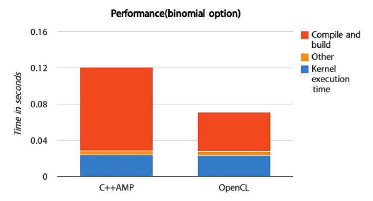

#11.12 初步結果

為了`C++ AMP`的性能，我們使用了兩種方式對二項式期權進行了[性能測試](http://bitbucket.org/UncleHandsome/benchmark)。第一種方式是直接使用OpenCL實現，並使用一種較為特殊的實現完成該程序。第二種方式是通過`C++ AMP`的方式，編譯使用CLamp，在實驗中我們將執行的OpenCL代碼轉換成相同平臺，以便進行對比。我們使用的配置如下：

- GPU: AMD Radeon R7 260X
- Linux kernel: 3.16.4-1-ARCH
- AMD Catalyst driver: 14.301.1001
- AMD OpenCL accelerated parallel processing(APP) software development kit (SDK): v2.9-1

表中展示了`C++ AMP`所生成的執行內核，與直接寫成的OpenCL內核完成時間幾乎相同，不過在編譯階段`C++ AMP`還是用時過長。這是因為當前的實現中，編譯階段會取添加一些數學函數，讓內核源碼代碼的長度比直接使用OpenCL內核代碼的長度長10倍。其他的時間就是對OpenCL內存進行寫入，以及參數的傳遞。因為在性能測試中使用了`CL_MEM_USE_HOST_PTR`對於當前測試版本的`C++ AMP`來說，沒有多餘的性能開銷。

通常情況下，應用中只需要對內核加載一次，所以編譯的時間通常不會算在計算時間內。不過，對於不同的用戶，所關注的點不一樣，所以用戶可以從自己的角度對這兩應用版本進行對比。

這次對二項式期權的比較當中，OpenCL主機端和設備端的代碼加起來一共160行，而`C++ AMP`的代碼只有80行。這就能很明顯的看出，具有高級編程模式的`C++ AMP`使用起來要比OpenCL更為簡單。