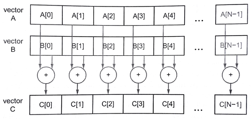

#11.2 簡單介紹C++ AMP

`C++ AMP`是一個編程模型，可將`C++`實現的算法數據並行化。與OpenCL和CUDA C比起來，`C++ AMP`封裝了很多底層的細節，包括數據轉移之類的，這樣會然改程序看上去更加整潔。`C++ AMP`還是包含了非常多的特性，能讓編程者在錯綜複雜的系統中進行性能加速。

因為`C++ AMP`的標準是開源的，所以可以有很多不同的實現。我們這裡所使用的`C++ AMP`基於開源Clnag和LLVM編譯器，多核(MulticoreWare)公司發佈了`CLamp`——GPU上使用OpenCL實現的`C++ AMP`。其可以在Linux和Mac OS X上運行，並且能支持大多數不同供應商的GPU卡，比如AMD、Intel和NVIDIA。

`C++ AMP`已經作為`C++11`標準的一個擴展。添加了一些標準頭文件，這些頭文件中定義了一些已經模板化的數據並行算法，還另外的為`C++`編程語言添加了兩條規則。第一條：添加的函數限定於運行在GPU上；第二條：允許GPU線程共享數據。本章並不是要對`C++ AMP`進行詳細的介紹。我們會主要關注`C++ AMP`一些重要的核心特性，並且介紹一個`C++ AMP`編譯器是如何使用OpenCL實現這些特性的。如果有讀者對`C++ AMP`本身很感興趣，微軟已經發布了一本關於`C++ AMP`的書籍[1]，可以作為`C++ AMP`的入門。

下面讓我們通過一個向量相加的例子，來了解一下`C++ AMP`:

```c++
#include <amp.h>
#include <vector>

using namespace concurrency;

int main(void){
  const int N = 10;
  std::vector<float> a(N);
  std::vector<float> b(N);
  std::vector<float> c(N);
  
  float sum = 0.f;
  for (int i = 0; i < N; i++){
    a[i] = 1.0f * rand() / RAND_MAX;
    b[i] = 1.0f * rand() / RAND_MAX;
  }
  
  array_view<const float, 1> av(N, a);
  array_view<const float, 1> bv(N, b);
  array_view<float, 1> cv(N, c);
  
  parallel_for_each(cv.get_extent(),
  		[=](index<1> idx)restrict(amp){
        	cv[idx] = av[idx] + bv[idx];
        });
  cv.synchronize();
  return 0;
}
```

圖11.1 `C++ AMP`代碼示例——向量相加

向量相加的原理圖，如圖11.2所示：



圖11.2 向量相加的原理圖

圖11.1的第1行包含了`C++ AMP`的頭文件——amp.h，該頭文件了包含了核心特性的聲明。`C++ AMP`類和函數都屬於`concurrency`命名空間。使用“using”的方式可以讓我們在這段簡單的代碼中，不用為相應的函數加上前綴`concurrency::`。

主函數在第4行，其啟動了一個主機線程，該線程包含一段已加速的數據並行計算。`C++ AMP`中的“主機”這個術語的意思和OpenCL是一樣的。不過，在OpenCL中還存在“設備”的概念，也就是幫助主程序加速的執行設備，而在`C++ AMP`中使用“加速器”這一概念來表述。`C++ AMP`其中的一個高級特性就是支持Lambda表達式，Lambda的使用可以讓主機和加速器的代碼放在一起，甚至放在同一個函數中。所以在`C++ AMP`中就幾乎沒有主機和加速器代碼之分。後面將會介紹，編譯器如何將`C++ AMP`中的Lambda編譯到OpenCL上下文中。

##11.2.1 C++ AMP array_view

`C++ AMP`中，類模板array_view作為數據讀寫的傳媒。一個array_view對象是一個多維的數據集合。這種方式並不是將已有數據拷貝到一個新的位置，而是使用一種新的方式去訪問原始數據所在的地址。模板有兩個參數：數據的類型和數據的維度。通過不同維度上的索引，可以訪問到不同等級的類型或對象。本例中，我們使用了1維，數據類型為float的array_view(或“一個等級為1的array_view”)。

圖11.1中的第14行，array_view使用標準`C++ vector`a創建了一個實例——av(a)。這裡`C++ AMP`編譯器使用一段常量數據作為輸入，認為其是一維數組，並且認為數組的長度為給定的數值N。

第16行對cv進行構建是，設置的兩個參數，第一個表示數據元素的個數。av，bv和cv中元素的數量都為N。通常這裡設置的N稱為預設值。為了表示和操作這個值，`C++ AMP`提供了一個預設值模板`extent`——只需要設置一個整型作為模板參數，用來獲取數據等級。具有維度的類模板，有些就支持指定特定的預設值指定一個或者多個整型數值，就像對cv的操作一樣。cv構造函數傳入的第二個參數是用來存儲主機數據的數組。

##11.2.2 C++ AMP parallel_for_each，或調用內核

圖11.1中第16行使用了parallel_for_each結構，其屬於`C++ AMP`數據並行計算的代碼段。其類似於對OpenCL內核的啟動。`C++ AMP`中對於數據集的操作稱為*計算區域*(compute domain)，並且定義了一個預設值對象。與OpenCL類似，每個線程都調用的是同一個函數，並且線程間都由自己區域，是完全分開的(類似於NDRange)。

與`C++ STL`中標準算法for_each類似，parallel_for_each函數模板就是將指定函數應用到對應的數據集上。第一個參數為一個預設值對象，其用指定數據並行計算的範圍。本例中，我們要對array_view上的每個數據執行了對應的操作，所以傳入的預設值為cv array_view的範圍。這裡，我們通過成員函數獲取array_view的範圍值(cv.get_extent())。這一個1維的預設值，其計算區域的整型值的範圍為[0，n)。

**與內核一樣的仿函數**

parallel_for_each的第二個參數是一個`C++`函數對象(或仿函數)。圖11.1中，我們使用了`C++11`中的Lambda語法的方式，很容易的創建這個函數對象(或仿函數對象)。parallel_for_each會將這個函數對象(或仿函數)應用到計算區域的每個數據中。

**獲取內核參數**

`[=]`字符使用的是Lambda表達式中的“獲取”方式，讓當前範圍內中所聲明的變量，以引用的方式傳入Lambda函數中。本例中，我們將三個array_view對象傳入Lambda函數中。函數調用時，這些函數已經在主線程中初始化完畢。對於的index就是對應向量的長度或數量，其值與預設值的等級值相同。index參數idx用來索引array_view對象中的值，第20行。

**amp的限定修飾**

本例中使用了一個擴展特性:restrict(amp)限定修飾符。`C++ AMP`中借用了C99中的關鍵字“restrict”，並且允許在其之後可以跟某個函數的函數列表(包括Lambda函數)。restrict關鍵字後面允許使用括號，括號內可以有一個或者多個限定符。`C++ AMP`只定義了兩個限定符：`amp`和`cpu`。從限定符的字面意思也能猜出，這無疑是指定哪種計算設備作為加速代碼執行的設備，不是將加速代碼編譯成CPU代碼，就是將其代碼編譯成C++語言子集中的某種代碼。

如第18行所示，在傳給paralle_for_each必須在調用操作符時使用restrict(amp)進行指定。其他函數也許要以類似的限定方式調用。restrict(amp)限定了指定函數必須以調用硬件加速器。當沒有進行限定指定，那麼就默認為restrict(cpu)方式。有些函數也可以進行雙重指定，restrict(cpu, amp)，這種方式函數可能會在主機或加速器上執行，這需要對創建兩種限定設備的上下文。

之前說過，限定符支持使用`C++`語言子集作為函數體。在第一個`C++ AMP`的發佈版本中，限定符反應了當前GPU在作為數據並行加速器時的一些限制。例如，`C++`的new操作符、遞歸，以及不允許使用虛函數。隨著時間的推移，我們能期待這些限定逐漸解除，並且希望`C++ AMP`路線圖上特性的限制越來越少。restrict(cpu)限定符，允許`C++`的所有操作，因為`C++ AMP`加速器代碼是要在主機端運行。相較restrict(cpu)，restrict(amp)的限定則會更多一些。

restrict(amp)中的Lambda函數體，其連續調用了幾個array_view對象。只要在函數生命域內的變量都能被Lambda函數所捕獲。這裡每個值都能在加速器運行加速代碼時所使用到。對於`C++11`中的不可變Lambda函數，其不會在函數體中改變獲取變量的值。**不過，array_view對象中的元素將被改變，並且這些改變將會返回主機端。**本例中，我們在parallel_for_each中對cv進行修改，這些修改將會影響主機端向量c中的值。

-------------

[1] K. Gregory, A. Miller, `C++ AMP： Accelerated Massive Parallelism with Microsoft Visual C++`, Microsoft, 2012, 326 pp., ISBN:9780735664729.