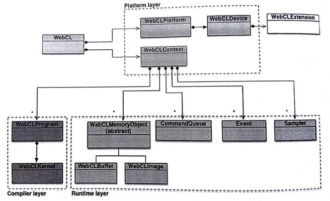
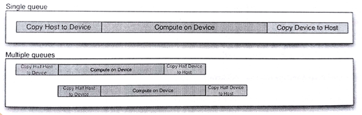

#12.2 如何使用WebCL編程

WebCL 1.0其實就是使用JavaScript實現的OpenCL 1.2。同樣的OpenCL API、語法以及運行時，無需太多行代碼就能完成(JavaScript是面向對象的語言)。我們通常會將WebCL與其他類似的技術聯繫在一起進行比較。如果你對WebGL很不瞭解，也沒有關係。

與OpenCL一樣，WebCL的編程也是由兩部分構成：

1. 主機端(例如，Web瀏覽器)用來控制和執行JavaScript程序
2. 設備端(例如，GPU)用來進行計算——OpenCL內核

和WebGL一樣，WebCL也屬於窗口對象的特性。首先，我們要檢查WebCL是否可用，如果可用，則創建對應的上下文對象：

```javaScript
// First check if the WebCL extension is installed at all
if (window.webcl == undefined){
  alert("Unfortunately your system does not support WebCL." +
  "Make sure that you have both the OpenCL dirver" +
  "and the WebCL browser extension installed.");
}

// Get a list of available CL platforms, and another list of the
// available devices on each platform. If there are no platforms
// or no available devices on any platform, then we can conclude
// that WebCL is not available
webcl = window.webcl
try{
  var platforms = webcl.getPlatforms();
  var devices = [];
  for (var i in platforms){
    var p = platforms[i];
    devices[i] = p.getDevices();
  }
  
  alert("Excellent! Your system does support WebCL");
} catch(e){
  alert("Unfortunately platform or device inquiry failed.");
}

// Setup WebCL context using the default device
var ctx = webcl.createContext();
```



圖12.1 WebCL對象


圖12.1中描述了WebCL中的對象結構關係。注意WebCL是接口的名字，而webcl是JavaScript的對象。更多信息可以查閱WebCL的標準[1]。

Web應用無法獲取平臺信息之後，列出所有可以用的設備；而是通過獲取到的設備信息瞭解對應平臺，從而指定對應的設備或平臺。

```javaScript
// Find appropriate device
for (var j = 0, jl = device.length; j < jl; ++j){
  var d = devices[j];
  var devExts = d.getInfo(cl.DEVICE_EXTENSIONS);
  var devGMem = d.getInfo(cl.DEVICE_GLOBAL_MEM_SIZE);
  var devLMem = d.getInfo(cl.DEVICE_LOCAL_MEM_SIZE);
  var devCompUnits = d.getInfo(cl.DEVICE_MAX_COMPUTE_UNITS);
  var devHasImage = d.getInfo(cl.DEVICE_IMAGE_SUPPORT);
  
// select device that matches your requirements
  platform = ...
  device = ...
}

// assuming we found the best device, we can create the context
var context = webcl.createContext(platform, device);
```

應用會在運行時對OpenCL對象進行管理，比如：命令隊列、內存對象、程序對象、內核對象，以及入隊命令(比如：執行內核、讀取內存對象或寫入內存對象)。

WebCL中定義瞭如下對象：

- **命令隊列**
- 內存對象(**數組**和**圖像**)
- **採樣器**對象，其描述了在內核中如何對圖像進行讀取
- **程序**對象，其包含了一些列內核函數
- **內核**對象，在內核源碼中使用__kernel聲明的函數，其作為真正的執行對象
- **事件**對象，其用來追蹤命令執行狀態，以及對一個命令進行性能分析
- 命令同步對象，比如**標記**和**柵欄**

首先我們需要創建程序對象。WebCL與WebGL 1.0類似，假設可以提供一段內核源碼。這樣的話，Web應用就需要內嵌一個編譯器。源碼先從設備上進行載入，之後進行編譯。和其他編譯器一樣，OpenCL編譯器也定義了一些編譯選項。

```javaScript
// Create the compute program from the source strings
program = context.createProgram(source);

// Build the program executable with relaxed math flag
try{
  program.build(device, "-cl-fast-relaxed-math");
} catch(err) {
  throw 'Error building program:' + err + program.getBuildInfo(device, cl.PROGRAM_BUILD_LOG);
}
```

如此這般，我們的程序就可以編譯了，並且一個程序對象內具有一個或者多個內核函數。這些內核函數作為我們程序的入口函數，就如同靜態庫中的接口一樣。為了區別不同的內核函數，我們需要創建WebCLKernel對象：

```javaScript
// Create the compute kernels from within the program
var kernel = program.createKernel("kernel_function_name");
```

就像普通函數一樣，內核函數通常都會有一些參數。JavaScript會提供一些數據類型，typed arrays[2]就是用來傳遞不同類型的內核參數(具體參數類型見表12.1)。對於其他類型的數據，我們可以使用WebCL對象：

- WebCLBuffer和WebCLImage，可以用來包裝數組
- WebCLSampler可以對圖像進行採樣

一個WebCLBuffer對象可以將數據以一維的方式存儲起來。數組中錯存儲的元素類型都可以使標量類型(比如：int或float)，向量類型，或是自定義結構體類型。

表12.1 setArg()中使用的webcl.type與C類型之間的關係

內核參數類型|setArg()值的類型|setArg()數組類型|注意
----|----|----|----
char, uchar|scalar|Uint8Array, Int8Arrary|1 byte
short, ushort|scalar|Uint16Array, Int16Array|2 bytes
int, uint| scalar|Uint32Array, Int32Array|4 bytes
long, ulong |scalar|Uint64Array, Int64Array|8 bytes
float | scalar|Float32Array|4 bytes
charN|vector|Int8Array for (u)charN|N = 2,3,4,8,16
shortN|vector|Int16Array for (u)shortN|N = 2,3,4,8,16
intN|vector|Int32Array for (u)intN|N = 2,3,4,8,16
floatN|vector|Float32Array for floatN and halfN|N = 2,3,4,8,16
doubleN|vector|Float64Array for (u)doubleN|N = 2,3,4,8,16
char, ..., double *|WebCLBuffer||
image2d_t| WebCLImage||
sampler_t|WebCLSampler||
__local||Int32Array([size_in_bytes])|內核內部定義大小

```javaScript
// Create a 1D buffer
var buffer = webcl.createBuffer(flags, sizeInBytes, optional srcBuffer);

// flags:
// webcl.MEM_READ_WRITE Default. Memory object is read and written by kernel
// webcl.MEM_WRITE_ONLY Memory object only writeten by kernel
// webcl.MEM_READ_ONLY Memory object only read by kernel
// webcl.MEM_USE_HOST_PTR Implementation requests OpenCL to allocate host memory
// webcl.MEM_COPY_HOST_PTR Implementation requests OpenCL to allocate host memory and copy data from srcBuffer memory. srcBuffer must be specified
```

注意，只有從內存對象或其子對象中讀取數據，或讀取多個具有重疊區域的子內存對象是有定義的。其他方式的併發讀寫都會產生未定義的行為。

WebCL圖像對象可以存儲1,2,3維的紋理，渲染內存或圖像。圖像對象中的元素可以從預定義的圖像格式列表中選擇。當前的WebCL版本最多隻支持到二維圖像。

```javaScript
// create a 32-bit RGBA WebCLImage object
// first, we define the format of the image
var imageFormat = {
  // memory layout in which pixel data channels are stored in the image
  'channelOrder':webcl.RGBA,
  // type of the channel data
  'channelType':webcl.UNSIGNED_INT8,
  // image size
  'width':image_width,
  'height':image_height,
  // scan-line pitch in bytes.
  // If imageBuffer is null, which is the default if rowPitch is not specified.
  'rowPitch'：image_pitch
};

// Image on device
// imageBuffer is a typed array that contain the image data already allocated by the application
// imageBuffer.byteLength >= rowPitch * image_height. The size of each element in bytes must be a power of 2.

var image = context.createImage(webcl.MEM_READ_ONLY | webcl.MEM_USE_HOST_PTR, imageFormat, imageBuffer);
```

WebCLSampler告訴內核函數讀和對圖像數據進行讀取。WebCL的採樣器和WebGL的採樣器類似。

```javaScript
// create a smpler object
var sampler = context.createSampler(normalizedCoords, addressingMode, filterMode);
// normalizedCoods indicates if image coordinates specified are normalized.
// addressingMode indicated how out-of-range image coordinations are handled when reading an image.
// This can be set to webcl.ADDRESS_MIRRORED_REPEAT
// webcl.ADDRESS_REPEAT, webcl.ADDRESS_CLAMP_TO_EDGE,
// webcl.ADDRESS_CLAMP and webcl.ADDRESS_NONE.
// filterMode specifies the type of filter to apply when reading an image. This can be webcl.FILTER_NEAREST or webcl.FILTER_LINEAR
```

使用WebCLKernel.setArg()將標量、向量或內存對象以參數的形式傳入內核。需要傳遞局部內存時，我們可以使用長度為1的Int32Array，其中的數值是需要分配多少字節的局部內存，因為局部內存不能在主機端或設備端初始化，不過主機端可以通過內核參數的形式告訴設備端要分配多少局部內存。

根據經驗內核所需要的所有參數，都需要是一個對象。即使是標量也也要包裝在長度為1的數組中。向量根據長度放置在數組中。數組、圖像和採樣器都是WebCL對象。內存對象(數組和圖像)需要在內核執行命令入隊前，通過主機內存轉移到設備內存。

這裡展示一個例子:

```javaScript
// Sets value of kernel argument idx with value as memory object or sampler
kernel.setArg(idx.a_buffer);
kernel.setArg(idx.a_image);
kernel.setArg(idx.a_sampler);

// Sets value of argument 0 to the integer value 5
kernel.setArg(0, new Int32Array([5]));

// Sets value of argument 1 to the float value 1.34
kernel.setArg(1, new Float32Array([1.34]));

// Sets value of argument 2 as a 3-float vector
// buffer should be  a Float32Array with 3 floats
kernel.setArg(2, new Float32Array([1.0, 2.0, 3.0]));

// Allocate 4096 bytes of local memory for argument 4
kernel.setArg(3, new Int32Array([4096]));
```

當需要傳遞一個標量時，需要告訴程序內核標量數據的類型。JavaScript只有一種類型——數字——所以我們需要通過setArg提供數據類型信息。

注意：

- 長整型是64位整數，其無法在JavaScript中表示。其只能表示成兩個32位整數：低32位存儲在數組的第一個元素中，高32位存儲在第二個元素中。
- 如果使用__constant對內核參數進行修飾，那麼其大小就不能超多webcl.DEVICE_MAX_CONSTANT_BUFFER_SIZE。
- OpenCL允許通過數組傳遞自定義結構體，不過為了可移植性WebCL還不支持自定義結構體的傳遞。其中很重要的原因是因為主機端和設備端的存儲模式可能不同(大端或小端)，其還需要開發者對於不同端的設備進行數據整理，即使主機和設備位於同一設備上。
- 所有WebCL API都是線程安全的，除了kernel.setArg()。不過，kernel.setArg()在被不同的內核對象併發訪問的時候也是安全的。未定義的行為會發生在多個線程調用同一個WebCLKernel對象時。

WebCL的對象中，命令隊列中包含一系列操作和命令。應用可能使用多個獨立的命令隊列，直到其中有數據共享時才進行同步。

命令需要有序入隊，不過在設備端可能是順序執行(默認)，或者是亂序執行。亂序意味著當命令隊列中包含兩個命令A和B時，順序的執行能保證A一定能在B之前執行，而亂序的話就不能保證A和B結束的順序。對於亂序隊列，可以使用等待事件或入隊一個柵欄命令，來保證命令的之間的依賴順序。亂序隊列屬於進階的主題，本章就不再進行描述。對其感興趣的讀者可以去[這裡](http://sa09.ida.ucdavis.edu/docs/SA09-opencl-dg-events-stream.pdf)[3]看看。目前很多的OpenCL實現並不支持亂序隊列。你可以嘗試使用`QUEUE_OUT_OF_ORDER_EXEC_MODE_ENABLE`測試一下OpenCL實現是否支持亂序隊列。如果得到的是`INVALID_QUEUE_PROERTIES`異常拋出的話，那麼你所使用的設備就不支持亂序隊列。

```javaScript
// Create an in-order command-queue(default)
var queue = context.createCommandQueue(device);

// Create an in-order command-queue with profiling of commands enabled
var queue = context.createCommandQueue(device, webcl.QUEUE_PROFILING_ENABLE)；

// Create an out-of-order command-queue
var queue = context.createCommandQueue(device, webcl.QUEUE_OUT_OF_ORDER_EXEC_MODE_ENABLE);
```

命令隊列在指定設備上創建。多個命令隊列具有其相對應的設備。應用可以通過主機端和設備端的數據傳輸，重疊的執行內核。圖12.2展示了將問題分成兩部分可能會更快的完成：



- 第一部分是主機端向設備端傳輸數據，分解之後只需要原來拷貝時間的一半即可完成工作。然後，執行內核，基本上也是一半的時間完成。最後將數據傳回主機，同樣還是原先一半的時間。
- 第一個傳輸數據完成後，第二個才開始，有些類似於CPU的流水線。

當有一系列命令入隊後，使用WebCL中的enqueueNDRange(kenrel, offsets, globals, locals)就能執行對應的命令:

- kernel——執行命令的內核對象。
- offsets——對全局區域的偏移。如果傳null，則代表offsets=[0, 0, 0]。
- globals——內核所要解決問題的尺寸。
- locals——每個維度上的工作組中，工作項的數量。如果傳null，設備會對其自行設定。

例如，如果我們要操作一個寬度width，高度為height大小的圖像，那麼globals可以設置為[width, height]，locals是可以設置為[16, 16]。這裡需要注意的是，如果enqueuNDRange()中locals的大小超過了webcl.KERNEL_WORK_GROUP_SIZE，enqueuNDRange()就會執行失敗。

-----------

[1] WebCL 1.0 Specification, http://www.khronos.org/registry/webcl/specs/latest/1.0

[2] Typed Array Specification, http://www.khronos.org/registry/typedarray/specs/latest

[3] Derek Gerstmann Siggraph Asia 2009 on Advanced OpenCL Event Model Usage, http://sa09.ida.ucdavis.edu/docs/SA09-opencl-dg-events-stream.pdf