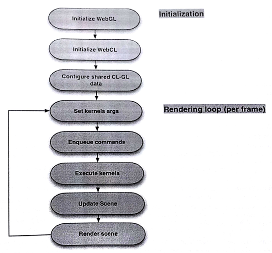

#12.4 WebCL的交互性

再來說一下WebCL在計算方面的使用(而非渲染)。不過，數據已經在圖形處理器處的時候，需要對數據進行渲染，是直接使用這段內存直接讓OpenGL進行顯式比較高效，還是將數據拷貝到CPU端，再讓CPU交由OpenGL去顯示高效呢？這裡就需要WebGL的擴展能力了。

WebGL需要先創建上下文，然後再創建一個共享的WebCL上下文。這也就是WebGL能夠將數據分享給WebCL的原因(流程見圖12.3)，二者能夠共享的內存對象如下：

- 紋理對象：包含圖像的紋理信息
- 頂點數組對象：包含頂點信息，比如座標、顏色和法向量
- 渲染數組對象：包含圖像對象所用到的WebGL幀緩存對象[4]

圖12.3 運行時調用WebCL和WebGL

------

[4] Iñigo Quilez. ShaderToy with Mandelbule shader, http://www.iquilzles.org/apps/shadertoy/?p$=$mandelbulb