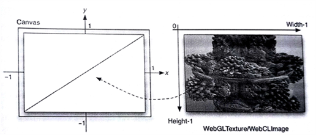

#12.5 應用實例

對於圖像處理應用，通常會將軌跡跟蹤輸出到屏幕上。對於這樣的應用，其表面都會使用多個三角形進行構成，然後通過WebGL進行渲染。計算內核代碼提供了更加自由的方式，方便我們對通用計算進行優化。片元渲染器相較計算渲染器要難優化許多。更重要的是，紋理內存是緩存在處理器中，這樣要比通過全局內存的方式訪問CPU內存高效的多。不過，有些設備不支持圖像內存，可以使用WebCLBuffer創建像素數組對象，從而更新WebGL的紋理。

本節中，我們使用Iñigo Quilez片元渲染器所渲染的影子玩具——曼德爾球[1]，將這個例子轉化成一個WebCL內核，如圖12.4所示。WebGL使用兩個紋理三角形對畫面進行填充。WebCL每幀都會生成新的紋理。因此，考慮到畫布的大小(width，height)，WebCL將會生成width x height個像素點。



圖12.4 WebGL中兩個三角形可以畫一幅WebCL生成的圖像。

當WebCL要使用WebGL內存進行計算時，WebGL上下文必須要進行初始化，並且在WebGL上下文上共享產生WebCL的上下文，然後就可以WebCL就能使用WebGL的相關內存對象進行計算。下面的代碼中展示了，如何創建WebGL的紋理，並且將其用於WebCL進行計算：

```JavaScript
// retrieva a <canvas> object with id glcanvas in HTML page
var canvas = documnet.getElementById("glcanvas");

// Try to grab the standard context. If it fails, fallback to experimental.
var gl = canvas.getContext("webcl") || canvas.getContext("experimental-webgl");

// Create OpenGL texture object
Texture = gl.createTexture();
gl.bindTexture(gl.TEXTURE_2D, Texture);
gl.texParameteri(gl.TEXTURE_2D, gl.TEXTURE_MAG_FILTER, gl.NEAREST);
gl.texParameteri(gl.TEXTURE_2D, gl.TEXTURE_MIN_FILTER, gl.NEAREST);

gl.texImage2D(gl.TEXTURE_2D, 0, gl.RGBA, TextureWidth, TextureHeight, 0, gl.RGBA, gl.UNSIGNED_BYTE, null);
gl.bindTexture(gl.TEXTURE_2D, null);

// Create OpenCL representation (a WebCLImage) of OpenGL texture
try{
  clTexture = context.createFormGLTexture2D(cl.MEM_WRITE_ONLY, gl.TEXTURE_2D, 0, Texture);
} catch(ex) {
  throw "Error: Failed to create WebCLImage." + ex;
}

// To use this texture, somewhere in your code, do as usual:
glBindTexture(gl.TEXTURE_2D, Texture);
```

將這個紋理作為參數傳入內核。

```JavaScript
kernel.setArg(0, clTexture);
kernel.setArg(1, new Uint32Array([TextureWidth]));
kernel.setArg(2, new Uint32Array([TextureHeight]));
```

最後，在內核代碼中對WebCLImage對象進行調用。

```c++
__kernel
void compute(__write_only image2d_t pix, uint width, uint height){
  const int x = get_global_id(0);
  const int y = get_global_id(1);
  
  // compute pixel color as a float4
  write_imagef(pix, (in2)(x, y), color);
}
```


--------

[1] Iñigo Quilez。 ShaderToy with Mandelbulb shader, http://www.iquilezles.org/apps/shadertoy/?p$=$mandelbulb