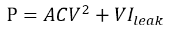
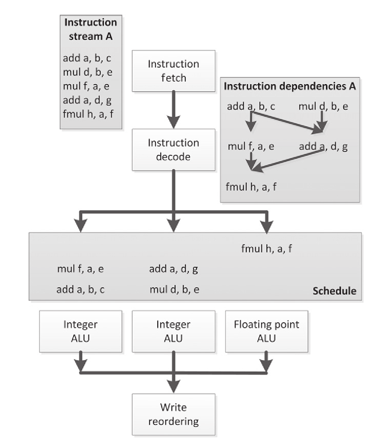
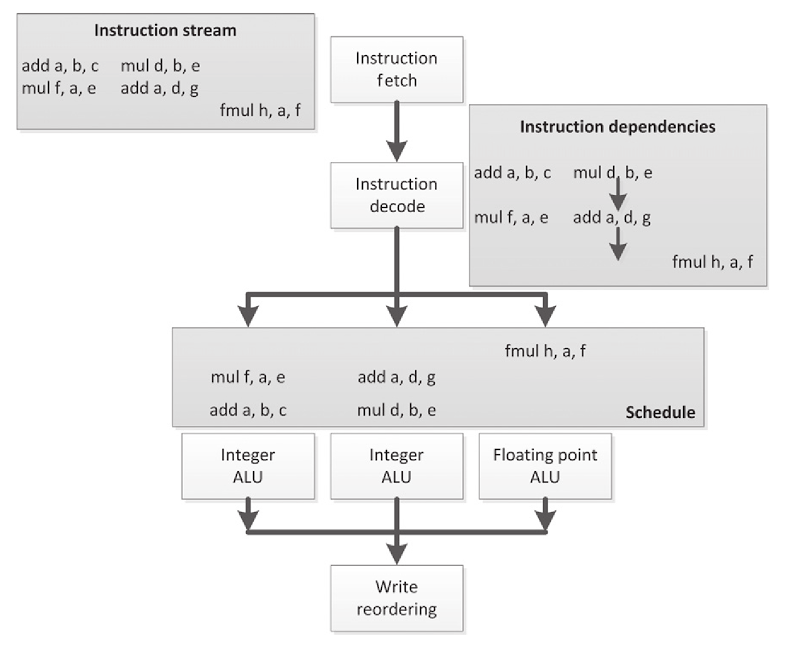
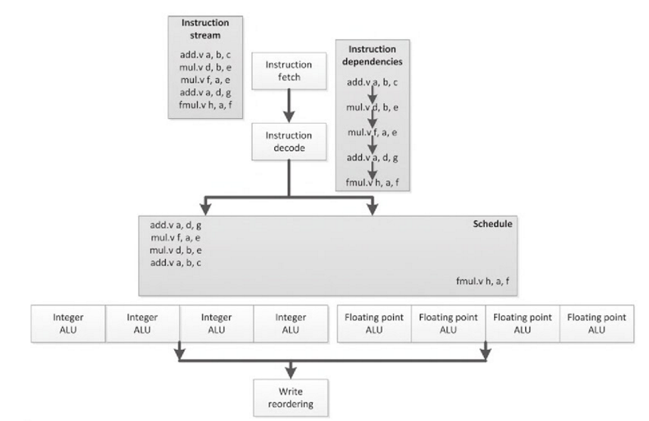
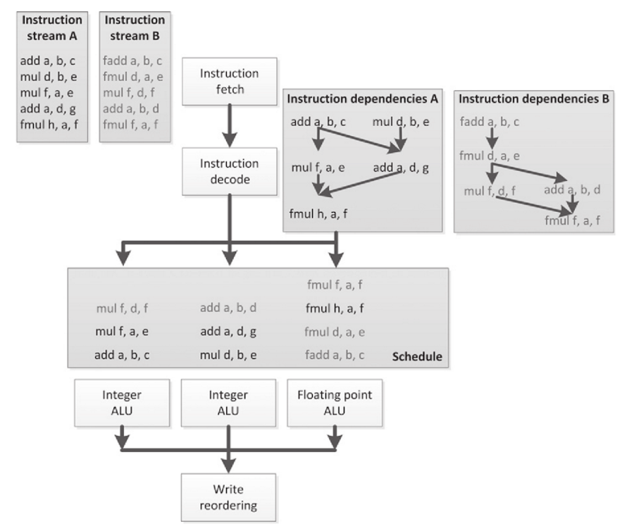
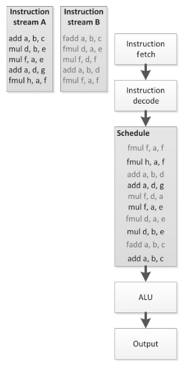
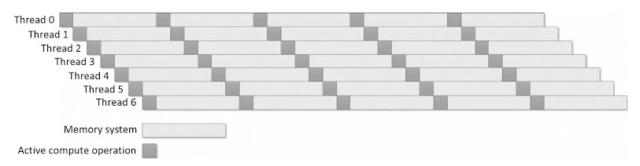
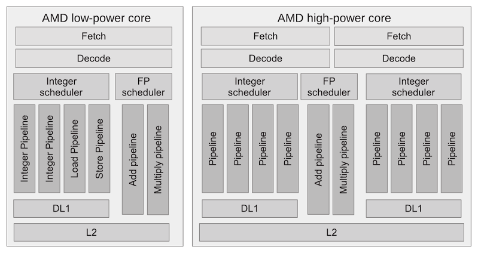
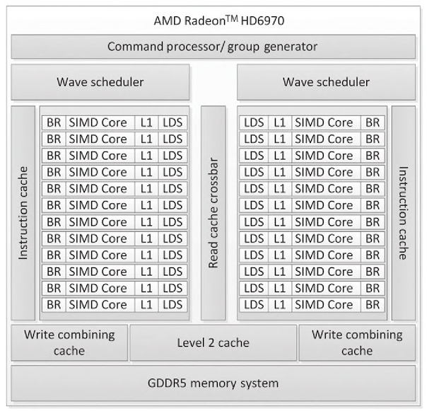

#2.2 硬件的權衡

如果有點使用圖形API和像素渲染器的經驗的話，就更容易明白為什麼OpenCL要以GPU作為目標，專門設計的一門語言。如今高性能計算市場上，OpenCL已經是一種很流行的編程方式。隨著支持OpenCL平臺數量的增長(特別是嵌入式領域)，OpenCL的影響力在逐漸增強。

如果對GPU不是很瞭解的話，也不用擔心，請安心的繼續閱讀。不過，當要為GPU寫一份通用的代碼，那麼就會有很多問題。比如：設備就是一個圖像處理器，還是更通用的設備麼？如果是圖像處理器，那麼該設備就一定具有圖像特定的邏輯特點，還是因為其整體架構？

更加深入下去還有很多問題會冒出來。那麼，問個簡單點的：一個GPU有多少個芯呢？要回答這個問題，需要看一下這個“芯”是如何定義的。還有，“多芯”設備和“多核”設備又有什麼不同？通常，因為不同架構上的功耗和晶體管數量是不同的，所以會選擇不同的方式進行加速。比起要權衡如何對電氣單元進行計算，硬件開發者們通常還要為如何在硬件上編程進行考慮。權衡這些因素後，硬件開發者會創建出一個具有“很大發散性”的設計。

多核處理器的設計，在保留了單個處理器的時鐘週期和硬件複雜度同時，增加更多處理核。這樣的設計不會讓處理器上晶體管數量增加，以減少功耗。謹慎的設計下，處理器的功耗被控制在可接受的範圍內。SIMD和VLIW(*very long instruction word*)架構能夠通過提升算術運算和邏輯控制的比值，做更多工作。這樣的情況下ALU會對於如此之少的工作量感到不滿。因此，多線程從另一個角度來解決這個問題。與增加算術計算和邏輯控制的比值不同，多線程增加了工作量。進行計算的同時，進行邏輯控制，比如內存搬運，這樣可以增加我們隊設備的利用率。權衡緩存和內存系統的同時(不同的架構下進行不同的訪存方式)，也要權衡在這期間處理器使用分配。

根據對核芯的定義，我們需要權衡是使用單個核芯，還是多個核芯的硬件。不過，對與整個設備的不同功能單元，需要進行不同程度的權衡。異構化硬件能夠同時對多種算法開啟硬件優化，這樣就能從硬件方面提高算法性能。當代的系統級別PC，大多數都是GPU+CPU的架構組合(系統中還分佈著其他低性能處理器)。最新一代的高性能處理器將GPU和CPU融合到一個設備上，AMD將這種架構成為加速處理單元(APU)[1]。

現實社會中，我們也能看到這些不同的設計結合了不同方面的因素，以不同的價格對應不同的市場。

本節我們會研究一些架構的特點，並討論各種常見架構如今的應用程度。

##2.2.1 頻率提升帶來的性能提升和侷限性

作為一個開發人員，試想我們正在編寫一款線性軟件：執行一個任務，完成這個任務，繼續執行下一個任務。對於寫慣線性程序的人來說，去編寫並行代碼很困難；也就是SIMD或向量並行與圖形設備上處理的方式差不多。多組像素將相對簡單的邏輯映射到編程層面。其他程序中，邏輯層面沒有有效的編程向量，提取SIMD操作將會更加困難。因此架構在轉為並行化、極端化多線程並行前，旨在為單一線程的架構提升性能。而現在的架構市場，則在向高性能專業機器轉變。

##2.2.2 超標量執行

超標量和亂序作為擴展解決方案，已經在CPU上存在了很久；奔騰時代開啟時，這兩個擴展就包含在x86的設計中。CPU主要依賴的信息為指令流中的指令，或是對未使用的功能單元進行調度(如果該信息可用的話)。圖2.1中就展示了一個這樣的例子。

圖2.1 指令流中簡單彙編指令的亂序執行。注意，在這種彙編語法中，目標寄存器列在最前面。例如：add a, b, c為a = b + c。

亂序邏輯的主要受益人就是軟件開發者們。硬件上自動將編程者代碼並行化，串行的代碼不需要做任何修改就能比原來執行的速度快很多。超標量讓CPU主頻設計領先了10多年，其讓CPU總體性能成超線性增長的趨勢，即使是在流行大規模生產設備的時代，這種設計都未過時。不過，這種超時代的設計，也是有缺陷的。

亂序調度邏輯需要是用到大量的晶體管，需要增加[譯者注1]CPU的芯片面積，以存儲隊列中未完成(in-flight)的指令和存儲指令間的依賴關係，以應對執行期間硬件上的動態調度。另外，要讓投機(speculative)指令迅速執行，就需要擴大並行的亂序指令窗口。投機指令的結果是一次性，並且會浪費更多的資源。結果就是，亂序執行讓CPU的回報逐漸減少；行業上已經採取其他方式通過減少晶體管的體積，來達到增加性能的目的，所以即使在這樣產生的高性能設備上，超標量邏輯依舊是可行的。嵌入式和其他特殊設備上，硬件不會並行化串行代碼，這些較為特殊的設備的設計方案都很小眾化，在芯片發展歷史上可能都不常見。

良好的超標量處理器數不勝數，控制數據公司的西摩·克雷在90年代設計的[CDC 600](https://en.wikipedia.org/wiki/CDC_6600)[譯者注2]就是一款很不錯的多RISC(*Reduced Instruction Set Computer，精簡指令集計算機*)設計。目前，高端CPU基本上都支持超標量處理。很多GPU同樣具有超標量的能力。

##2.2.3 超長指令字

為了增強處理器的指令並行性，VLIW的執行十分依賴於編譯模式。其比完全依賴於複雜的亂序控制邏輯、依賴硬件要方便的多，超標量和VLIW的執行都會依賴於編譯器的分析。為了替代現有的標量指令流，VLIW處理器上發出的每一條指令，都包含了多個併發的子指令，並且這些指令會直接映射到處理器的執行流水線上。

VLIW的執行流程如圖2.2所示，這幅圖和圖2.1是一樣的。不過2.2中預取去了三條，而不像2.1中那樣一條一條的取指令。我們現在看到的這些指令流的依賴結構都是線性的，並且硬件也將會是這樣處理這些指令，而不是提取和跟蹤出一個更加複雜的依賴圖。VLIW指令包都是已編碼的，並且指令流中的每個獨立的部分都會映射到處理器上特定的計算單元執行。很多VLIW設計中，計算單元都是異構的，因此這些指令只會安排給特定的VLIW指令流。其他很多架構都能作為異構硬件，比如：能在任意位置發出任意指令，並且只有依賴信息對這樣的架構有所限制。

圖2.2 依賴於圖2.1中的亂序圖表

圖2.2所示例子中，我們能看到指令的分配有間隙：前兩條VLIW包都缺少了第三條子指令，並且第三條VLIW包缺少了第一和第二條子指令。顯然，這個例子很簡單，包中幾乎沒有什麼指令，不過這對於VLIW架構來說是一種通病，因為編譯器沒有辦法將所有指令包都填滿，所以執行效率不會特別高。這可能是編譯器的限制，或是這種指令流的先天缺陷。後面例子的不會比亂序執行更復雜，通過對硬件調度的改良，降低複雜度反而能得到更好的性能。前面的例子中，都可以從執行效率的損失和從減少硬件控制開銷提高性能兩方面對硬件進行權衡。另外，VLIW指令在執行方面還有另外一部分開銷，那就是相應編譯器的開發的成本，而超標量的執行就沒有這部分開銷。

VLIW設計通常出現在數字信號處理芯片上。當前的高端設備包括Intel的安騰處理器(以顯式並行指令計算著稱)和AMD的HD6000系列GPU。

##2.2.4 SIMD和向量操作

SIMD旨在將向量並行通用化，這種方式與之前提及的方式有些不同。VLIW和硬件管理的超標量執行方式都是通過查詢地址，並行執行同指令流中不相關的指令，而SIMD與向量並行可以讓指令在數據上並行執行。

封裝單個的SIMD指令，需要同時對多個數據元素執行某種操作。相比標量操作，其他的方式都是要將指令並行化。向量操作將向量化操作通用化，並且向量操作通常會用來處理較長連續的數據序列，通常會使用流水線的形式進行向量操作，而非同時對多個數據進行操作，並且向量操作對連續、密集的內存讀寫給予了更多的支持。

圖2.3中的流水和之前圖中的不大一樣，圖2.3中是順序的，之前的都是亂序的。不過，現在這些指令以向量的形式在四個ALU上執行。整型指令會一個接一個的通過左邊四個整型向量ALU，而浮點指令則以相同的方式通過右邊四個浮點ALU。需要注意的是，這個例子中指令以線性的順序觸發，不過沒理由排除這些操作不是在超標量或VLIW的流水線上完成，這兩種架構我們在之前的章節中已經討論過。

圖2.3 SIMD順序執行單個指令，多個ALU同時對數據進行處理

SIMD的優勢與ALU的工作方式有關，大量的調度工作和邏輯解碼工作都可以省去。現在，我們能使用一條指令執行四個操作，單條指令只對調度有依賴，而不用去管其他指令是否與該指令有關。

當然，這裡也要給出硬件權衡的建議。因為很多代碼無法數據並行化，那麼就無法使用向量操作進行性能提升。另外，這個工作無法交給編譯器，因為編譯器很難對數據並行的代碼進行提取。例如，向量化循環就是一項從未停止的挑戰，即使很簡單的情況都很難成功。很多情況下，因為晶體管瓦數(功耗)的原因，也可能會將ALU用盡。

向量處理器源於超級計算機領域，不過SIMD設計在很多領域都有應用。CPU通常會包含SIMD流水線，用來顯式執行標量指令流中的SIMD指令。x86芯片上包含了多種指令集，比如：SIMD擴展(SSE)和高級向量擴展(AVX)；PowerPC上又AltiVec擴展指令集；ARM上有NEON擴展指令集。GPU架構在歷史上為了支持像素向量，其顯式包含了SIMD操作，很多現代GPU依舊能能顯式的對SIMD向量進行操作。當然，GPU上也是單通道標量指令流。因為很多邏輯使用向量的方式進行處理，讓這些支持向量操作的機器被稱為向量機。例如：AMD的Radeon R9 290X架構就能支持64路SIMD操作。這種寬度的向量指令通過多個時鐘週期，通過一個16通道的SIMD單元分發到流水線上。

##2.2.5 硬件多線程

並行的三種常見的形式：指令並行，數據並行和線程並行。換句話說，並行的方式就是執行多個獨立的指令流。這種方式需要並行機器(多核)的支持，不過對於單核CPU來說這種方式也很用。如之前所討論的那樣，依賴硬件和編譯器從指令流中抽取獨立指令的方式是非常困難的，甚至是不可能的事。從兩個獨立的線程中抽取可並行的指令是毫無意義的事，因為線程已經確認其執行的就是相互獨立的顯式同步指令塊。實現硬件多線程的挑戰在於管理額外的指令流，以及第二條指令流需要了解寄存器和高速緩存的狀態。

這裡有兩種方式實現硬件多線程：

1. 併發多線程(SMT)

2. 時域多線程

圖2.4中展示了SMT的方式。這種方式中，多線程的指令在執行資源上交替執行(通過超標量擴展的調度邏輯和線程資源)。

圖2.4 一種是圖2.1中的亂序調度形式，另一種是線程併發執行方式

圖2.4中不管是哪種方式，出發點都是為了更好的利用執行資源。以更高的執行資源使用比例來做更多有用的工作。這種方式的缺點就是需要對更多的狀態信息進行保存，並且會讓指令間得依賴關係和調度邏輯變得更加複雜。就像圖2.4中那樣，要對兩種不同依賴方式、執行資源，以及執行隊列進行管理。

圖2.5展示了一種更簡單的方式，使用時間片的方式在硬件上實現多線程。這種方式中，每個線程都能通過輪詢的方式連續執行。其目的很簡單，圖中兩個線程共享一個ALU。

這種方式有以下幾種優勢：

1. 調度邏輯簡單。

2. 流水線的延遲可以隱藏對多個線程的切換(調度)，減少轉發邏輯。

3. 當有線程緩存未命中，或等待另一個分支計算的結果等之類事件，都能通過改變線程指令順序進行掩蓋，並且執行更多的線程能更好的掩蓋流水線上的延遲。

圖2.5 兩個線程使用時間片的方式進行調度。

最後的這種方式，可以有效的降低實現複雜度。很多架構都能運行很多的線程(雖然有時候沒有必要這樣做)。當一個線程達到某些點時，就會從就緒隊列中刪除這個線程(就緒隊列只存儲已經調度了的可執行線程)。一旦這些點錯過了，對應的線程將會放在就緒隊列的最後。雖然，這種方式會讓單線程的執行速度沒有亂序的方式快，不過這種方式的吞吐量保持在較高的水平，充分利用計算資源，並且邏輯控制的複雜度過高。換個角度來看，這種重多線程的方式可以看做為吞吐量進行的計算：以延遲換取最大的吞吐量。原理圖為圖2.6。

圖2.6 通過時域多線程的方式，來你做吞吐量的計算：多個線程交替執行，以保證設備處於忙碌狀態，不過每個獨立線程的執行時間要多於其理論最小執行時間。

兩種硬件多線程實現方式是相同的。MTA設計源於Tera(一款經典的時間片多線程超級計算機)，這種設計難以投入實際生產；不過，Cray隨後的實現就不一樣了——MTA-2，其利用每個CPU上的128個寄存器迅速的切換線程(包括線程的狀態)，並且忽略已經停止的線程。標準AMD皓龍處理是基於Cray的設計，其對MTA的擴展設計——XMT，將會更加適應未來的多線程處理器。Sun的尼亞加拉系列芯片就實現了多芯多線程的設計(每個芯上8個線程)，為了讓數據中心的工作量，以到低耗能和高吞吐的方式完成。Intel奔騰4和之後的Nehalem和其他繼承者們上都實現了一種名為“超線程”的SMT設計。現代GPU每個芯上可以在同一時域中運行大量的線程，具體線程的數量收到一般計算資源的限制：目前的這代AMD GPU中，通常一個芯開啟8-16個線程，就能夠隱藏延遲和停頓。

##2.2.6 多芯架構

從概念上來說，增加時鐘週期內工作量最簡單的方式，就是將單一芯片做的事情，克隆到多個芯片上去做。這種最簡單模式下，每個芯上都是獨立運行，共享數據存儲在系統內存中，通常會遵循緩存一致性協議。這種設計就是對傳統多插槽服務器對稱多處理系統(multisocket server symmetric multiprocessing system)的縮減，並且在其基礎上對性能進行了大幅度的提升，在某些情況下會有十分極限的加速效果。

多芯系統會以不同的形式出現，並且有時候很難對“芯”進行定義。例如，主流高端CPU上通常都包含很多的功能模塊，這些功能模塊中除了邏輯接口、內存控制器之類的功能，其他功能都是相對於其他“芯”獨立的。然而，這個界限有時也會變得模糊。例如：AMD的推土機(Steamrooler，高功率核芯)設計，其設計就要比彪馬(Puma)的設計簡單許多(詳見圖2.7)，共享功能單元會在核芯之間形成一種可以拷貝的單元，這種單元被稱為模塊。傳統的設計中，因為硬件需要交替執行浮點指令，在具有共享浮點功能的流水線上，所以單線程將會在多個核芯上切換執行。這種設計旨在提升功能單元的佔用率，從而提高執行效率。

圖2.7 AMD彪馬(左)和推土機(右)高端設計(這裡並未展示任何共享模塊)。彪馬採用的是低功率設計，這種設計遵循傳統的方式，將功能單元映射到每個核芯上。推土機則讓兩個核芯共享一個模塊，圖中兩個核芯就共享了一個浮點單元。

同樣的，在GPU設計中對於“芯”的定義也不盡相同。當代GPU具有幾十個“芯”——目前高端設備上都由32個或64個芯，其複雜度依賴於特定的架構。很多GPU設計，例如AMD的GCN(Graphics Core Next)架構[2]，以及英偉達的費米和開普勒架構[3]，這些設計都會跟隨一個額外的類似中央處理器的芯片。不過，有些設計與這些設計有著本質的不同。例如，我們來看一下AMD Radeon HD6970高端顯卡的內置圖，我們就能看到與推土機類似的設計。雖然這個設備只有24個SIMD核芯，但是觀察其執行單元，我們可以使用一種最公平的方式與傳統CPU進行比較，這些SIMD核芯只能執行ALU操作——浮點和整型操作。指令調度、解碼和分發都通過“波”調度單元執行。因為調度單元是一個寬IMD線程上下文——稱為“波面陣”，所以其調度器就命名為“波”調度器。的確，在AMD Radeon HD 6970上又兩個“波”調度器(以避免提升設計的複雜度)，不過這款顯卡的低端版本中，只能使用一個“波”調度器和一排SIMD核芯。

圖2.8 AMD Radeon HD6970 GPU架構。這個設備由兩部分組成，每個部分的指令控制(調度和分發)通過“波”調度器進行。24個16通道的SIMD核芯，每個SIMD通道上執行4路VLIW指令，包含私有一級(L1)緩存，並且共享本地數據(通過便箋式存儲器)。

##2.2.7 集成:片上系統和APU

嵌入式領域中，異構方法和多芯設計是一樣的。為了達到低能耗，嵌入式開發者們構建出複雜的片上系統，這個系統將很多組件壓縮到一個芯片上，這是種性價比十分高的設計。使用這種方式將特定的組件合併，就能在某些特殊的功率要求情況下對設備進行優化，這點對於移動領域來說十分重要。

片上系統有如下優點：

- 將很多元素融合在一個設備上，這樣在生產的時候一次就能搞定，避免在製造階段耗費太多成本。

- 更少的功能將會降低設備上的面積佔用率，可以節省功耗和降低設備體積，這對於移動通訊領域很重要。

- 更短的距離意味著數據交互和信息傳遞完全可以在一個內存系統中進行，並且降低了交互的功耗。

- 低通訊延遲可以增加處理器對負載分發的次數。

手機領域就有該方式的成功案例，比如高通的金魚草(Snapdragon)和德州儀器的OMAP系列。這種設計與在ARM上的實現稱為指令集架構(ISA)——一個移動GPU、內存控制器和各種無線和媒體處理組件。高性能領域，索尼、松下和IBM開發了Cell寬帶引擎處理器(Cell/B.E.)，其結合了一些體積小、性能高、傳統的全功能核芯，目標就是為了讓每一瓦功耗能做更多的工作。AMD和Intel都開發出了結合CPU和GPU的片上系統，AMD的片上系統稱為APU，其將高性能顯卡和CPU打包在一起，以提高芯片工作的效率。

##2.2.8 高速緩存層次結構和存儲系統

早些年的超級計算機上，內存帶寬和延遲都能滿足CPU，通常什麼時候需要就去訪問對應內存，這種情況持續了好久。如今，CPU端發出一條內存請求不會有之前那種延遲，相應的數據可能會在成百上千個CPU始終週期後返回。單線程CPU上，亂序邏輯不可能複雜到能夠掩蓋很多的延遲。

幸運的是，大多數應用都不會完全獨立的對內存進行訪問。通常，內存訪問的模式會在局部，形式將會是下面任何一個：

- 空域：兩個以上(包括兩個)的讀或寫操作，對內存上(一定程度上)附近的地址。

- 時域：在相對小的時間窗內對同一地址進行兩個以上(包括兩個)的讀或寫操作。

通過這兩種局部方式可以得出結論，如果我們要存儲從某個內存地址，以及從其臨近地址讀取的值，讀取之後將會再次使用到這些值。利用這個結論，CPU的設計者們會在CPU到內存緩存中間添加很多緩衝層，以便對內存訪問進行優化。

高速緩存的設計也有很多，不過這些設計可以根據所依賴的負載分為兩類。CPU高速緩存傾向於減少延遲。為了達到這個目標，緩存通過複雜的層次結構，將要使用的數據放在離CPU較近的地方。亂序邏輯只能掩蓋有限的延遲，所以訪問到數據所耗費的時鐘週期越少越好。另外，讓數據接近執行單元也能最小化功耗：長距離的數據搬運很佔CPU的功耗。

吞吐處理器需要對延遲有更多的容忍，使用線程是為了隱藏指令申請和數據返回的延遲。這種設計的目的是，讓緩存來減少延遲，因此大型的多層級結構是不常見的，更多的是減少有限的內存上的總線流量。小型緩存允許鄰近訪問，但在很長一段是間不會被複用，所以這樣的緩存更多扮演的是空間過濾器。寬SIMD單元和編程模式的目標——有效的合併內存訪問，增加內存交換的規模。這樣的結果就是，計算單元在處理邏輯時，能對使用更多的晶體管。另外，高延遲、高帶寬的內存交互能讓這種設計工作更加高效。我們經常在GPU設計中看到一種更加偏向於空間局部性的擴展設計，就是將內存設計成可二維訪問的模式，從而讓緩存保存更多有效的數據。

包括GPU和Cell處理器的一些設計，包括軟件管理的暫存式存儲器空間或是代替緩存層次結構的設計。這些設計中，給定功耗下內存都有很高的性能和空間預期，不過這樣的設計對於編程來說是非常複雜的。

事實是任何給定的設計，都需要去權衡緩存層級和處理器基礎功能的負載。不幸的是，對於所有處理器設計，從負載組合角度無法給出一個完美的答案。

-------

[1] Advanced Micro Devices, Incorporated, AMD Fusion Family of APUs: Enableing a Superior, Immersive PC Experience, Advanced Micro Devices, Incorporated, Sunnyvale, CA, 2011

[2] Advanced Micro Devices, Incorporated, White parper: AMD Graphics Core Next(GNC) Architecture, Advanced Micro Devices, Incorporated, Sunnyvale, CA, 2012.

[3] NVIDIA Corporation, NVIDIA Kepler Compute Architecture, NVIDIA Corporation, Santa Clara, CA, 2014.

[譯者注1] 原文:*...hence CPU die area...*。通過對上下文的分析，譯者認為這裡的“hence”是誤寫的單詞，正確的單詞應該是“enhance”。文中使用“enhance”的譯意。

[譯者注2] 1964年，控制數據公司(Control Data Corporation)研製出了世界上首臺超級計算機“CDC6600”。該超級計算機也是超級計算數據中心的現代鼻祖，由西摩·克雷(Seymour Cray)為倫斯輻射實驗室而設計。