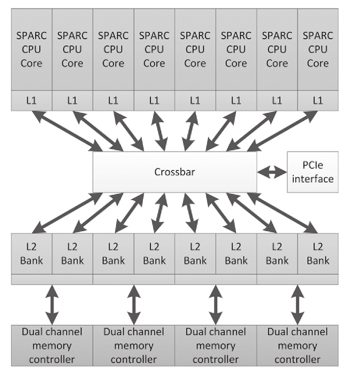
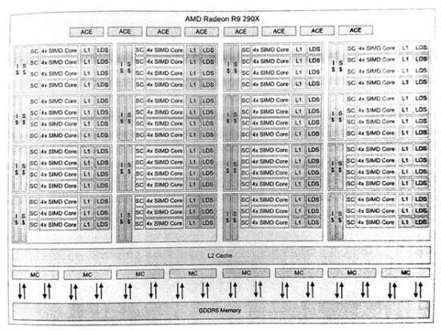
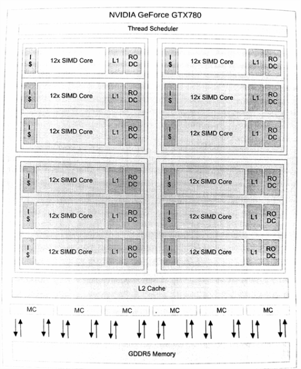
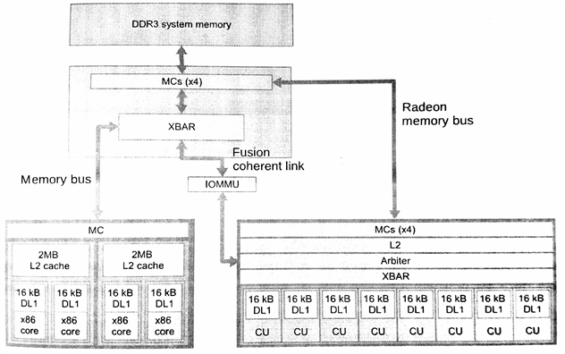
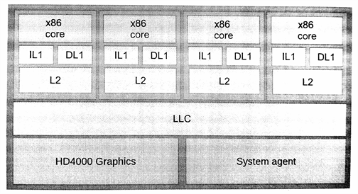

#2.3 架構設計空間

現實世界中，我們所見的架構遠比之前提到架構複雜。我們所使用的計算機架構在各個方面都會發生很大的變化，具有很大的設計空間。即便是當前公開的架構，不同廠商的實現都有不同。

當前一些人對於架構的觀點過於簡單。例如，在GPU領域，我們經常會遇到下面的幾種情況：

- CPU是串行的，GPU是並行的
- CPU只有幾個核，GPU有數百個核
- CPU只能運行一兩個線程，GPU可以運行成千上萬個線程

當然，現實中的設計要遠比上面描述複雜的多，比如，緩存內部的差異、流水線的數量、流水線的類型，等等。本章的主題就是要來聊一下CPU和GPU的異同。目前我們能夠看到的架構只進行了簡單的分類，只是對一些基本設計進行參數化的組合。程序員需要了解這其中的差異，只有專家才會去關心內存大小和硬件協作指令的比例關係。

本節中，我們將會討論一些實際存在的架構，還會聊一聊哪裡適用於哪種對應的架構，以及根據我們之前談論到的特性來權衡這些架構。希望本章的內容能更好的幫助你權衡和選擇架構，並幫助你識別哪些算法適合或不適合這種架構。(寬SIMD和狀態存儲GPU設計要沿著CPU的路走很長的一段時間(比如：高性能和易用性)，設計架構的選擇也是硬件是否能達到最佳性能的決定因素。)

##2.3.1 CPU設計

很多人都在“CPU”進行過開發。即使在CPU上，使用並行的方式也是大相徑庭。

**低功耗CPU**

在功耗要求非常非常低的時候，CPU核會設計的很簡單，如果有多個也是多個串行使用。這種情況下，功耗在設計中就是最關鍵的因素，性能則為次要因素。這樣的設計通常不支持浮點計算，且無需並行化。

目前常用低功耗CPU ISA總線使用的是ARM ISA架構(ARM對該架構擁有知識產權)。ARM架構起源於艾康RISC機，其實就是[艾康電腦](https://zh.wikipedia.org/wiki/%E8%89%BE%E5%BA%B7%E9%9B%BB%E8%85%A6)的桌面架構，不過目前這種簡單的架構是移動端和嵌入式領域的主要架構。DEC生產出了[StrongARM微處理](https://zh.wikipedia.org/wiki/StrongARM)後，在1996到1998年期間，艾康也確實進軍過桌面領域。ARM有各式各樣的設計方式，因為ISA協議允許製造商對自己的芯片進行自由設計。通常，ARM的核芯會和其他功能單元一起放在一個芯片上，比如：蜂窩調制解調器、嵌入式圖像處理器和視頻加速器，等等。

大多數ARM ISA的變種架構都會在其核芯上排布三到七階流水線。基於ARMv7 ISA架構的Cotex-A8，Cotex-A9和Cotex-A15核都支持超標量，且使用了高達4個對稱核芯。基於ARMv7的核芯可以選擇性的支持NEON SIMD指令，每個核上可以執行64位和128位SIMD操作。

ARMv8-A架構增加了64bit指令集，NEON擴展支持128bit寄存器，支持雙精度和密碼指令。基於ARMv8-A架構的高端處理器Cortex-A57，目標是中等性能，8路寬指令，低功耗，還有一條亂序流水線。Cortex-A53中保留了順序流水線，不過這條流水線只支持2路寬指令。

圖2.7中的彪馬微架構就是AMD當前低功耗CPU陣營中的一員，其功耗在2~25瓦之間。為了實現低功耗設計，彪馬核芯的時鐘要比高端產品慢很多，並且設計以儘可能低的峰值性能，減少數據路徑上的開銷。彪馬是一款64位設計，支持雙通道亂序執行，並且具有2個128位SIMD單元，將這兩個單元拼接起來，就能執行AVX指令操作。

Intel的[Atom設計](https://zh.wikipedia.org/wiki/%E8%8B%B1%E7%89%B9%E7%88%BEAtom)使用了與AMD彪馬不同的方式，所得到的性能也不一樣。在[Silvermont微架構](https://en.wikipedia.org/wiki/Silvermont)之前，Atom並不支持亂序執行，使用SMT來彌補單線程的性能不足。自從Silvermont問世，Intel和AMD對於功耗和性能的技術性幾乎達到同一水準。

通常，低功耗CPU只能進行順序或窄亂序執行(使用相關窄SIMD單元)。核芯數量的變化在多線程情況下可對各種“性能-功耗”平衡點進行縮放。總之，性能簡單和主頻較低(相較桌面級CPU)，都是減少功率消耗的一種方式。

**主流桌面CPU**

主流桌面級CPU的兩大主要品牌——AMD和Intel，在架構設計上兩家的CPU架構和彪馬的設計差不多。不同的情況下，他們會增加CPU中不同元素的複雜度。

[Haswell微架構](https://zh.wikipedia.org/wiki/Haswell%E5%BE%AE%E6%9E%B6%E6%A7%8B)是當前Intel核的主流架構。之前幾代，比如Sandy Bridge[4]和Ivy Bridge，支持128位SSE操作和256位AVX操作。Haswell[5]添加了對AVX2(AVX的升級版，支持更多的整型操作指令)的支持。Haswell流水線可以並行執行8個不同類型的操作，功能單元通過8個調度口進行連接，完成類型混合的操作。其亂序引擎可以在單位時間內處理192個操作。

Intel為Nehalem處理器(Sandy Bridge系處理器)增加了硬件多線程，並且在Sandy Bridge和Haswell架構上都保留了硬件多線程。這種情況下，就是真正的SMT：每個核上的執行單元可以處理來自不同線程的不同操作。這提升了功能單元的利用性，也增加了調度的複雜度。

AMD的[壓路機](https://zh.wikipedia.org/wiki/AMD_Steamroller)(Steamroller)(圖2.7)增加了線程執行的數量，其使用的方法介於增加核的數量和增加核芯上的線程數之間。推土機的這種方式讓整數核芯二次獨立，使其擁有私有ALU、狀態寄存器和調度器。不過，取指單元、浮點ALU和二級高速緩存還是在核芯間共享的。AMD參考了這種共享方式，將兩個核芯設計為一個“模塊”。設計模塊的目的只共享多個功能單元，從而減少在實際負載中對資源的嚴重競爭。之前的[推土機](https://zh.wikipedia.org/wiki/AMD_Bulldozer)(Bulldozer)和[打樁機](https://zh.wikipedia.org/wiki/AMD_Piledriver)(Piledriver)微架構中，解碼單元和兩個核芯組成一個模塊。不過，在壓路機架構下，解碼單元已經在多個核之間複用了。

通過4個ALU流水線，每個核都能支持亂序執行。共享的浮點ALU為一對128位SIMD單元的合併，可用來執行AVX指令。為了節省在移動設備上的功耗，壓路機微架構也引入了可以動態調整大小的二級高速緩存——其中部分功能可以根據工作負載進行關閉。

我們瞭解了主流CPU中的多寬指令執行，亂序硬件，高頻時鐘和大量緩存——所有性能都用來維持在合理的功耗下單線程的高性能。主流桌面級CPU中，核內多線程是很少見或不存在的，並且芯片內SIMD單元可以設置寬度，這樣就不會再不用的時候，浪費芯片的面積。

**服務器CPU**

Intel安騰架構和其子代架構是非常成功的(最新版本是安騰9500)，其基於VLIW[6]技術，是Intel對主流服務器處理器的一次有趣的嘗試。安騰架構中有很多的寄存器(128個整型寄存器和128個浮點寄存器)。該架構使用的是一種VLIW名為EPIC(Explicityly Parallel Instruction Code，並行指令代碼)的指令，這種該指令能一次存儲3個128bit的指令束。CPU每個時鐘週期會從L1緩存上取四個指令束，這樣就能在一個時鐘週期內執行12個指令。這種處理有效的將多核和多插口服務器結合起來。

EPIC將並行化的問題從運行時轉移到編譯時，這樣反饋信息就可以從編譯器的執行跟蹤進行獲取。這就要讓編譯器完成將指令打包成VLIW或EPIC指令包，這樣的結果編譯器的好與壞，直接影響到該架構的性能。為了協助編譯器，大量的執行掩碼，束間依賴信號，預取指令，推測式加載，以及將循環寄存器文件構建入架構。為了提升處理器的吞吐量，最新的安騰微架構包含了SMT，安騰9500支持前端流水線和後端流水線獨立執行。

[SPARC T系列](https://en.wikipedia.org/wiki/SPARC_T-Series)(如圖2.9所示)，其起源於[Sun](https://zh.wikipedia.org/wiki/%E6%98%87%E9%99%BD)，後在[Oracle](https://zh.wikipedia.org/wiki/%E7%94%B2%E9%AA%A8%E6%96%87%E5%85%AC%E5%8F%B8)進行開發，其使用多線程的方式為服務器的工作負載計算吞吐量[7]。

很多服務器上的負載都是多線程的，特別是事務和網頁負載，都會有大量的線程同時對服務器內存進行訪問。[UltraSPARC](https://zh.wikipedia.org/wiki/SPARC) Tx系列和之後的SPARC Tx系列CPU的設計，使用最低的性能開銷來負載對應數量的線程，使CPU整體吞吐量保持最大化，每一個核都設計的簡單高效，無亂序執行邏輯。這種設計一直保持到SPARC T4。之後，每個核中開始出現線程級並行，這種方式能夠在只有雙流水線的處理器上交替的執行8個線程上的操作。這種設計能很好的隱藏指令延遲，並且比起主流x86的邏輯設計要簡單許多。更加簡單的SPARC T5設計上，每個處理器有16個核芯。

圖2.9 Niagara 2 CPU來自Sun/Oracle。該設計是為了讓高端線程更加高效。需要注意的是，該設計和圖2.8中的GPU設計有些類似。設計能給予足夠多的線程，線程計算的時間能很好的對訪存的時間進行掩蓋，即使很複雜的硬件技術都沒必要使用指令級別的並行。

為了支持多個活動線程，SPARC架構需要多組寄存器，不過作為權衡因素，其推測性寄存存儲方式要少於超標量設計。另外，協處理器可以對密碼操作進行加速，並且片上以太網控制器可以提高網絡吞吐量。

如前所述，最新的SPARC T4和T5有點回退到早前的多線程設計。每個CPU核支持亂序執行，並且可以從單線程模式(單線程可以使用所有資源)切換到多線程模式。從這個意義上來說，SPARC架構與現代另一種SMT設計越來越接近，SMT設計的代表就是Intel和CPU。

通常，服務器芯片以一些單線程性能為代價，換取最大化的並行性。與桌面級芯片不同，服務器芯片上的面積會更多的用來支持不同線程間的上下文切換。隨著寬指令邏輯的出現(比如安騰處理器)，其能幫助編譯發現指令級別的並行。

##2.3.2 GPU架構

比起CPU架構，GPU架構有很寬泛的選擇。深入討論OpenCL編程(第8章)之前，我們來討論其中幾種架構。GPU傾向於使用複雜的硬件來進行多線程任務管理，因為顯卡需要處理的項目很多，包括處理複雜圖形、幾何圖形和圖像像素。都是可高度並行的任務，其中大量任務都可以使用(高延遲容忍)多線程來完成。需要了解的是，除了管理任務隊列的複雜機制，或在硬件管理系統後隱藏SIMD指令的執行外，其實GPU是很簡單的多線程處理器，對其進行參數指定之後，能高效的處理大量像素。

**移動端GPU**

移動端GPU也具有通用計算能力，包括ARM，[Imagination Technologies](https://zh.wikipedia.org/wiki/Imagination_Technologies)，[聯發科技](https://zh.wikipedia.org/wiki/%E8%81%AF%E7%99%BC%E7%A7%91%E6%8A%80)和[高通](https://zh.wikipedia.org/wiki/%E9%AB%98%E9%80%9A)提供的GPU都能夠兼容OpenCL。GPU由多個小的著色核組成，小尺寸SIMD單元上可以執行大量的獨立線程(不一定使用同一個SSE矢量流水線)。ARM的Mali-T760架構使用三種計算流水線，每個流水線上有16個著色核。核間任務管理支持負載管理：通常，GPU線程都由硬件控制器管理，而不會暴露給操作系統。例如Mali-T760這樣的嵌入式設計，GPU和CPU能夠共享全局內存，從而減少數據拷貝；在ARM的設計中，數據時完全緩存的。

**高端GPU：AMD Redeon R9 290X和NVIDIA GeForce GTX 780**

高端桌面GPU和其衍生出的高性能計算，和工作站相比高性能計算在最大功率下更高效。為的是獲取高內存帶寬，GPU在內存方面需要大量的芯片投入其中，並且內存條(比如，GDDR5)上每個高帶寬管腳都會使用(低延遲)內存協議。GPU使用混合特性來提升計算吞吐量，比如：對於給定數量的指令使用寬SIMD數組，來最大化算法吞吐量。

AMD Radeon R9 290X架構(圖2.10)硬件上有16個SIMD通道，向量流水線4個時鐘週期可以處理一個64元向量。英偉達GeForce GTX 780架構(圖2.11)同樣具有16個寬SIMD單元，並且能在兩個時鐘週期處理一個32元向量。兩個設備都支持多線程，並且每個核都可開大量的寬SIMD線程。AMD的架構中，每個核中由1個矢量核和由4個SIMD單元組成一個分組寄存器(每4個SIMD單元可以支持10個矢量線程，AMD稱此為“wavefronts”)構成，SIMD單元可以選擇的某個時鐘處理這10個矢量線程。那麼每個核中就有40個矢量線程，整個設備就有1760個矢量線程(或者說，112640(1760x64)個獨立的工作項！)。英偉達的架構也差不多，不過兩種架構在實際併發上都會受相應數量的線程狀態的限制，有可能在實際工作中線程數比理論值要低。

圖2.9 AMD Redeon R9 290X架構。該設備上有11個簇，共有44個核。每個核有一個標量處理單元(處理分支和整型操作)和4個16通道SIMD ALU。簇間會共享指令和矢量緩存。

圖2.10 英偉達GeForce GTX 780架構。該設備具有12個巨核，英偉達稱其為“多流處理器(streaming multiprocessors)”(SMX)。每個SMX具有12個SIMD單元(由特化的雙精度和專用函數單元組成)，1個L1緩存和1個只讀數據緩存。

AMD和英偉達的架構中，使用中間語言對設備進行編程，採用的是智能SIMD模型(其中指令流代表著一個單通道SIMD單元)，英偉達稱這種方式為“單指令多線程”(也被稱為“基於SIMD的單程多數據”)。AMD使用ISA的方式是顯式的添加了向量支持，這樣就能基於“wavefront”對程序計數器進行管理，通過計時寄存器對不同的分支進行管理。相關內容我們將在第8章進行詳細討論。

指令集並行化的方式很多。AMD Radeon R9 290X就能在每個時鐘週期發出多個指令，每條指令都發源於不同的程序計數器(每條矢量指令在週期內可能從不同的矢量單元發出）。英偉達GeForce GTX 780的四個執行流水上，兩個線程能同時協同工作。AMD之前的設計(比如，Radeon HD 6970)會使用VLIW指令。實際上，Radeon HD 6970和Radeon R9 290X在執行單元的設計上非常相似，其中的差異很大程度上取決於指令，前者單線程執行編譯結構化指令，後者運行時四線程執行。這兩種設計都在執行資源方面都是超標量的，訪問內存、執行算法，以及同一核上線程執行的其他操作，如果在同一線程中就不需要超標量的設計了。這種架構的吞吐量也隨著多線程的加入得到了提高，因為多線程可以對單線程的延遲進行掩蓋。

比如市場上的GPU，高端的AMD和英偉達模型包含多個核。每個核都可看做為一個CPU，Radeon R9 290X具有44個核(每個核都由4個矢量單元)，英偉達的設計有12個核(其核更大，每個核具有12個矢量單元)。每個核都有一塊便籤式存儲緩存(在OpenCL中，可作為local內存由工作組進行分配)。

需要清楚的是，高端GPU設計嚴重依賴於線程狀態，這就允許GPU可以快速的在多程序和高吞吐率間進行切換。與傳統設計相比，當代高端CPU和GPU不再依賴複雜的亂序或單線程多流水併發。GPU是面向吞吐量的設計，非常依賴於線程級別的併發，其利用大量的向量處理單元來提高吞吐量。

##2.3.3 APU和類APU設計

片上系統(SoC)的設計佔據了嵌入式市場很長一段時間。目前，SoC的方式佔領著移動市場，為移動端設備提供更好的性能。這樣將處理器融合的設計(融合了CUP和GPU)，除了在視頻編碼、隨機數生成器和加密電路方面不夠好之外，其在桌面的低端領域還是很流行的，其代表產品就是筆記本電腦和上網本。之後，隨著晶體管體積收縮達到上限，CPU核芯不能在為性能帶來多大的提高，這時的SoC已經遍佈了高端桌面領域。在高端桌面領域，集成GPU的方式在能耗上要遠遠小於離散GPU，不過在性能方面離散GPU通常還是好於集成GPU。目前，市場上該類產品的主要架構就是，基於AMD的悍馬和壓路機架構的產品，以及Intel的Haswell架構產品。

AMD的設計針對低耗能和低端主流市場，其Beema和Mullins產品功耗在4.515瓦左右，這兩款產品上融合了基於悍馬架構的低耗能CPU核，以及低端的Radeon R9 GPU。這些部件使用的是28nm技術。AMD的高性能APU——Kaveri——是基於壓路機內核的一款非常高性能的GPU。Kaveri A10-7850K的設計如2.12圖所示。

圖2.12 A10-7850K APU具有2個壓路機CPU和8個Radeon R9 GPU核(總共有32個16通道SIMD單元)。這款APU具有一個高速總線，用於鏈接GPU和DDR3內存，並且具有一個著色器通道，其可以選擇性的與CPU緩存保持一致。

Intel高端酷睿i7 CPU[譯者注3]設計如圖2.13所示。具有4個Haswell微處理架構的核，集成的是Intel HD系列GPU，其完全支持OpenCL和DirectX 11。

圖2.13 集成HD 4000的i7處理器。雖然Intel並不稱其為“APU”，不過從芯片的原理上和AMD的APU一樣。Intel結合了4個Haswell x86處理器和圖像處理器使用一個共享終級緩存(LLC，last-level cache)，通過環形總線進行通訊。

APU架構為CPU和GPU的數據共享提供了空間，以緩解GPU和CPU數據通訊所帶來的瓶頸。這就意味著使用集成顯卡的方式會縮短數據傳輸的距離，而不用再受到PCIe總線的傳輸速度限制。要想對PCIe的方式進行改進，就需要犧牲一部分CPU內存帶寬，作為兩個設備的共享帶寬，並通過共享帶寬和離散GPU進行數據交互。對算法進行實現的時候，就需要將數據交互的部分考慮進去。集成設計在CPU和GPU混合編程時，減少數據交互的耗時，可以打破數據交互耗時過長所帶來的瓶頸。

-------

[4] Snady Bridge Arch; http://www.intel.com/content/dam/doc/manual/64-ia-32-architectures-optimization-maanual.pdf

[5] Haswell arch; http://www.intel.com/content/dam/www/public/us/en/documnets/manuals/64-ia-32-architectures-optimization-maanual.pdf

[6] Intel Corporation, Intel Itanium 2 Processor: Hardware Developer's Manual, Intel Corporation, Santa Clara, CA, 2002

[7] G. Grohoski, Niagara-2: A heighly threaded server-on-a-chip, in: 18th Hot Chips Symposium, August, 2006

[譯者注3] 原文中為“Intel's high-end Core i7 APU”，這裡APU只是AMD提出的概念，Intel從未使用該概念，其集成顯卡一般都會以“板載顯卡”來稱呼，具體哪一款CPU具有集成顯卡，需要去官網進行確定。

