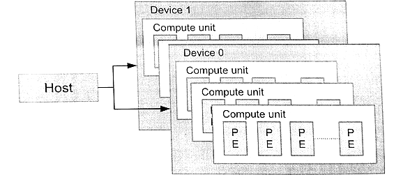

#3.2 OpenCL平臺模型

OpenCL平臺需要包含一個主處理器和一個或多個OpenCL設備。平臺模型定義了host和device的角色，並且為device提供了一種抽象的硬件模型。一個device可以被劃分成一個或多個計算單元，這些計算單元在之後能被分成一個或多個“處理單元”(*processing elements*)。具體的關係可見圖3.1。



圖3.1 OpenCL平臺具有多個計算設備。每個計算設備都具有一個或多個計算單元。一個計算單元又由一個或多個處理元素(PEs)構成。系統中可以同時具有多個平臺。例如，在一個系統中可以既有AMD的平臺和Intel的平臺。

平臺模型是應用開發的重點，其保證了OpenCL代碼的可移植性(在具有OpenCL能力的系統間)。即使只在一個系統中，這個系統也可以具有多個不同的OpenCL平臺，這些平臺可以被不同的應用所使用。平臺模型的API允許一個OpenCL應用能夠適應和選擇對應的平臺和計算設備，從而在相應平臺和設備上運行應用。

應用可以使用OpenCL運行時API，選擇對應提供商提供的對應平臺。不過，平臺上能指定和互動的設備，也只限於供應商提供的那些設備。例如，如果選擇了A公司的平臺，那麼就不能使用B公司的GPU。不過，平臺硬件並不需要由供應商獨家提供。例如，AMD和Intel的實現可以使用其他公司的x86 CPU作為設備。

編程者寫編寫OpenCL C代碼時，設備架構會被抽象成平臺模型。供應商只需要將抽象的架構映射到對應的物理硬件上即可。平臺模型定義了具有一組計算單元的設備，且每個計算單元的功能都是獨立的。計算單元也可以劃分成更多個處理單元。圖3.1展示的就是這樣的一種層級模型。舉個例子，AMD Radeon R9 290X圖形卡(device)包含44個向量處理器(計算單元)。每個計算單元都由4個16通道SIMD引擎，一共就有64個SIMD通道(處理單元)。Radeon R9 290X上每個SIMD通道都能處理一個標量指令。運行GPU設備能同時執行44x16x4=2816條指令。

##3.2.1 平臺和設備

`clGetPlatformIDs()`這個API就是查找制定系統上的可用OpenCL平臺的集合。在具體的OpenCL程序中，這個API一般會調用兩次，用來查詢和獲取到對應的平臺信息。第一次調用這個API需要傳入`num_platforms`作為數量參數，傳入NULL作為平臺參數。這樣就能獲取在該系統上有多少個平臺可供使用。編程者可以開闢對應大小的空間(指針命名為platforms)，來存放對應的平臺對象(類型為 cl_platform_id)。第二次調用該API是，就可將platforms傳入來獲取對應數量的平臺對象。平臺查找完成後，使用`clGetPlatformInfo()`API可以查詢對應供應商所提供的平臺，然後決定使用哪個平臺進行運行OpenCL程序。`clGetPlatformIDs()`這個API需要在其他API之前調用，3.6節中可以從矢量相加的源碼中進一步瞭解。

```c++
cl_int
clGetPlatformIDs(
  cl_uint num_entries,
  cl_platform_id *platforms,
  cl_uint *num_platforms)
```

當平臺確定好之後，下一步就是要查詢平臺上可用的設備了。`clGetDeviceIDs()`API就是用來做這件事的，並且在使用流程上和`clGetPlatformIDs()`很類似。`clGetDeviceIDs()`多了平臺對象和設備類型作為入參，不過也需要簡單的三步就能創建device：第一，查詢設備的數量；第二，分配對應數量的空間來存放設備對象；第三，選擇期望使用的設備(確定設備對象)。`device_type`參數可以將設備限定為GPU(CL_DEVICE_TYPE_GPU)，限定為CPU(CL_DEVICE_TYPE_CPU)，或所有設備(CL_DEVICE_TYPE_ALL)，當然還有其他選項。這些參數都必須傳遞給`clGetDeviceIDs()`。相較於平臺的查詢API，`clGetDeviceInfo()`API可用來查詢每個設備的名稱、類型和供應商。

```c++
cl_int
clGetDeviceIDs(
  cl_platform_id platform,
  cl_device_type device_type,
  cl_uint num_entries,
  cl_device_id *devices,
  cl_uint *num_devices)
```

AMD的並行加速處理軟件開發工具(APP SDK)中有一個clinfo的程序，其使用`clGetPlatformInfo()`和`clGetDeviceInfo()`來獲取對應系統中的平臺和設備信息。硬件信息，比如內存總量和總線帶寬也是可以用該程序獲取。在瞭解其他OpenCL特性之前，我們先休息一下，瞭解一下clinfo的輸入，如圖3.2。

譯者機器的clinfo顯示，譯者和原書使用的AMD APP SDK版本不大一樣。從觀察上來看，原書應該隱藏了一些硬件顯示。
```
Number of platforms:                             3
  Platform Profile:                              FULL_PROFILE
  Platform Version:                              OpenCL 1.2 CUDA 8.0.0
  Platform Name:                                 NVIDIA CUDA
  Platform Vendor:                               NVIDIA Corporation
  Platform Extensions:                           
   cl_khr_global_int32_base_atomics 
   cl_khr_global_int32_extended_atomics 
   cl_khr_local_int32_base_atomics 
   cl_khr_local_int32_extended_atomics 
   cl_khr_fp64 
   cl_khr_byte_addressable_store 
   cl_khr_icd cl_khr_gl_sharing 
   cl_nv_compiler_options 
   cl_nv_device_attribute_query 
   cl_nv_pragma_unroll 
   cl_nv_d3d10_sharing 
   cl_khr_d3d10_sharing 
   cl_nv_d3d11_sharing 
   cl_nv_copy_opts

  Platform Profile:                              FULL_PROFILE
  Platform Version:                              OpenCL 1.2
  Platform Name:                                 Intel(R) OpenCL
  Platform Vendor:                               Intel(R) Corporation
  Platform Extensions:                           
   cl_intel_dx9_media_sharing 
   cl_khr_3d_image_writes 
   cl_khr_byte_addressable_store 
   cl_khr_d3d11_sharing 
   cl_khr_depth_images 
   cl_khr_dx9_media_sharing 
   cl_khr_gl_sharing 
   cl_khr_global_int32_base_atomics
   cl_khr_global_int32_extended_atomics 
   cl_khr_icd cl_khr_local_int32_base_atomics 
   cl_khr_local_int32_extended_atomics 
   cl_khr_spir
  Platform Profile:                              FULL_PROFILE
  Platform Version:                              OpenCL 2.0 AMD-APP (1800.8)
  Platform Name:                                 AMD Accelerated Parallel Processing
  Platform Vendor:                               Advanced Micro Devices, Inc.
  Platform Extensions:                           
   cl_khr_icd 
   cl_khr_d3d10_sharing 
   cl_khr_d3d11_sharing 
   cl_khr_dx9_media_sharing 
   cl_amd_event_callback 
   cl_amd_offline_devices

  Platform Name:                                 NVIDIA CUDA
Number of devices:                               1
  Device Type:                                   CL_DEVICE_TYPE_GPU
  Vendor ID:                                     10deh
  Max compute units:                             4
  Max work items dimensions:                     3
    Max work items[0]:                           1024
    Max work items[1]:                           1024
    Max work items[2]:                           64
  Max work group size:                           1024
  Preferred vector width char:                   1
  Preferred vector width short:                  1
  Preferred vector width int:                    1
  Preferred vector width long:                   1
  Preferred vector width float:                  1
  Preferred vector width double:                 1
  Native vector width char:                      1
  Native vector width short:                     1
  Native vector width int:                       1
  Native vector width long:                      1
  Native vector width float:                     1
  Native vector width double:                    1
  Max clock frequency:                           862Mhz
  Address bits:                                  64
  Max memory allocation:                         536870912
  Image support:                                 Yes
  Max number of images read arguments:           256
  Max number of images write arguments:          16
  Max image 2D width:                            16384
  Max image 2D height:                           16384
  Max image 3D width:                            4096
  Max image 3D height:                           4096
  Max image 3D depth:                            4096
  Max samplers within kernel:                    32
  Max size of kernel argument:                   4352
  Alignment (bits) of base address:              4096
  Minimum alignment (bytes) for any datatype:    128
  Single precision floating point capability
    Denorms:                                     Yes
    Quiet NaNs:                                  Yes
    Round to nearest even:                       Yes
    Round to zero:                               Yes
    Round to +ve and infinity:                   Yes
    IEEE754-2008 fused multiply-add:             Yes
  Cache type:                                    Read/Write
  Cache line size:                               128
  Cache size:                                    65536
  Global memory size:                            2147483648
  Constant buffer size:                          65536
  Max number of constant args:                   9
  Local memory type:                             Scratchpad
  Local memory size:                             49152
  Kernel Preferred work group size multiple:     32
  Error correction support:                      0
  Unified memory for Host and Device:            0
  Profiling timer resolution:                    1000
  Device endianess:                              Little
  Available:                                     Yes
  Compiler available:                            Yes
  Execution capabilities:
    Execute OpenCL kernels:                      Yes
    Execute native function:                     No
  Queue on Host properties:
    Out-of-Order:                                Yes
    Profiling :                                  Yes
  Platform ID:                                   000002D3A374DC10
  Name:                                          GeForce GTX 765M
  Vendor:                                        NVIDIA Corporation
  Device OpenCL C version:                       OpenCL C 1.2
  Driver version:                                375.95
  Profile:                                       FULL_PROFILE
  Version:                                       OpenCL 1.2 CUDA
  Extensions:                                    
   cl_khr_global_int32_base_atomics 
   cl_khr_global_int32_extended_atomics 
   cl_khr_local_int32_base_atomics 
   cl_khr_local_int32_extended_atomics 
   cl_khr_fp64 
   cl_khr_byte_addressable_store 
   cl_khr_icd 
   cl_khr_gl_sharing 
   cl_nv_compiler_options 
   cl_nv_device_attribute_query 
   cl_nv_pragma_unroll 
   cl_nv_d3d10_sharing 
   cl_khr_d3d10_sharing 
   cl_nv_d3d11_sharing 
   cl_nv_copy_opts

  Platform Name:                                 Intel(R) OpenCL
Number of devices:                               2
  Device Type:                                   CL_DEVICE_TYPE_GPU
  Vendor ID:                                     8086h
  Max compute units:                             20
  Max work items dimensions:                     3
    Max work items[0]:                           512
    Max work items[1]:                           512
    Max work items[2]:                           512
  Max work group size:                           512
  Preferred vector width char:                   1
  Preferred vector width short:                  1
  Preferred vector width int:                    1
  Preferred vector width long:                   1
  Preferred vector width float:                  1
  Preferred vector width double:                 0
  Native vector width char:                      1
  Native vector width short:                     1
  Native vector width int:                       1
  Native vector width long:                      1
  Native vector width float:                     1
  Native vector width double:                    0
  Max clock frequency:                           1150Mhz
  Address bits:                                  64
  Max memory allocation:                         427189862
  Image support:                                 Yes
  Max number of images read arguments:           128
  Max number of images write arguments:          128
  Max image 2D width:                            16384
  Max image 2D height:                           16384
  Max image 3D width:                            2048
  Max image 3D height:                           2048
  Max image 3D depth:                            2048
  Max samplers within kernel:                    16
  Max size of kernel argument:                   1024
  Alignment (bits) of base address:              1024
  Minimum alignment (bytes) for any datatype:    128
  Single precision floating point capability
    Denorms:                                     No
    Quiet NaNs:                                  Yes
    Round to nearest even:                       Yes
    Round to zero:                               Yes
    Round to +ve and infinity:                   Yes
    IEEE754-2008 fused multiply-add:             No
  Cache type:                                    Read/Write
  Cache line size:                               64
  Cache size:                                    262144
  Global memory size:                            1708759450
  Constant buffer size:                          65536
  Max number of constant args:                   8
  Local memory type:                             Scratchpad
  Local memory size:                             65536
  Kernel Preferred work group size multiple:     32
  Error correction support:                      0
  Unified memory for Host and Device:            1
  Profiling timer resolution:                    80
  Device endianess:                              Little
  Available:                                     Yes
  Compiler available:                            Yes
  Execution capabilities:
    Execute OpenCL kernels:                      Yes
    Execute native function:                     No
  Queue on Host properties:
    Out-of-Order:                                No
    Profiling :                                  Yes
  Platform ID:                                   000002D3A374C760
  Name:                                          Intel(R) HD Graphics 4600
  Vendor:                                        Intel(R) Corporation
  Device OpenCL C version:                       OpenCL C 1.2
  Driver version:                                20.19.15.4531
  Profile:                                       FULL_PROFILE
  Version:                                       OpenCL 1.2
  Extensions:                                    
   cl_intel_accelerator 
   cl_intel_advanced_motion_estimation 
   cl_intel_ctz 
   cl_intel_d3d11_nv12_media_sharing 
   cl_intel_dx9_media_sharing 
   cl_intel_motion_estimation
   cl_intel_simultaneous_sharing
   cl_intel_subgroups 
   cl_khr_3d_image_writes 
   cl_khr_byte_addressable_store 
   cl_khr_d3d10_sharing 
   cl_khr_d3d11_sharing
   cl_khr_depth_images
   cl_khr_dx9_media_sharing 
   cl_khr_gl_depth_images
   cl_khr_gl_event 
   cl_khr_gl_msaa_sharing
   cl_khr_global_int32_base_atomics 
   cl_khr_global_int32_extended_atomics 
   cl_khr_gl_sharing 
   cl_khr_icd 
   cl_khr_image2d_from_buffer 
   cl_khr_local_int32_base_atomics 
   cl_khr_local_int32_extended_atomics 
   cl_khr_spir

  Device Type:                                   CL_DEVICE_TYPE_CPU
  Vendor ID:                                     8086h
  Max compute units:                             8
  Max work items dimensions:                     3
    Max work items[0]:                           8192
    Max work items[1]:                           8192
    Max work items[2]:                           8192
  Max work group size:                           8192
  Preferred vector width char:                   1
  Preferred vector width short:                  1
  Preferred vector width int:                    1
  Preferred vector width long:                   1
  Preferred vector width float:                  1
  Preferred vector width double:                 1
  Native vector width char:                      32
  Native vector width short:                     16
  Native vector width int:                       8
  Native vector width long:                      4
  Native vector width float:                     8
  Native vector width double:                    4
  Max clock frequency:                           2400Mhz
  Address bits:                                  64
  Max memory allocation:                         2126515200
  Image support:                                 Yes
  Max number of images read arguments:           480
  Max number of images write arguments:          480
  Max image 2D width:                            16384
  Max image 2D height:                           16384
  Max image 3D width:                            2048
  Max image 3D height:                           2048
  Max image 3D depth:                            2048
  Max samplers within kernel:                    480
  Max size of kernel argument:                   3840
  Alignment (bits) of base address:              1024
  Minimum alignment (bytes) for any datatype:    128
  Single precision floating point capability
    Denorms:                                     Yes
    Quiet NaNs:                                  Yes
    Round to nearest even:                       Yes
    Round to zero:                               No
    Round to +ve and infinity:                   No
    IEEE754-2008 fused multiply-add:             No
  Cache type:                                    Read/Write
  Cache line size:                               64
  Cache size:                                    262144
  Global memory size:                            8506060800
  Constant buffer size:                          131072
  Max number of constant args:                   480
  Local memory type:                             Global
  Local memory size:                             32768
  Kernel Preferred work group size multiple:     128
  Error correction support:                      0
  Unified memory for Host and Device:            1
  Profiling timer resolution:                    427
  Device endianess:                              Little
  Available:                                     Yes
  Compiler available:                            Yes
  Execution capabilities:
    Execute OpenCL kernels:                      Yes
    Execute native function:                     Yes
  Queue on Host properties:
    Out-of-Order:                                Yes
    Profiling :                                  Yes
  Platform ID:                                   000002D3A374C760
  Name:                                          Intel(R) Core(TM) i7-4700MQ CPU @ 2.40GHz
  Vendor:                                        Intel(R) Corporation
  Device OpenCL C version:                       OpenCL C 1.2
  Driver version:                                5.2.0.10094
  Profile:                                       FULL_PROFILE
  Version:                                       OpenCL 1.2 (Build 10094)
  Extensions:                                    
   cl_khr_icd 
   cl_khr_global_int32_base_atomics 
   cl_khr_global_int32_extended_atomics 
   cl_khr_local_int32_base_atomics 
   cl_khr_local_int32_extended_atomics 
   cl_khr_byte_addressable_store 
   cl_khr_depth_images 
   cl_khr_3d_image_writes 
   cl_intel_exec_by_local_thread 
   cl_khr_spir 
   cl_khr_dx9_media_sharing 
   cl_intel_dx9_media_sharing 
   cl_khr_d3d11_sharing 
   cl_khr_gl_sharing 
   cl_khr_fp64

  Platform Name:                                 AMD Accelerated Parallel Processing
Number of devices:                               1
  Device Type:                                   CL_DEVICE_TYPE_CPU
  Vendor ID:                                     1002h
  Board name:
  Max compute units:                             8
  Max work items dimensions:                     3
    Max work items[0]:                           1024
    Max work items[1]:                           1024
    Max work items[2]:                           1024
  Max work group size:                           1024
  Preferred vector width char:                   16
  Preferred vector width short:                  8
  Preferred vector width int:                    4
  Preferred vector width long:                   2
  Preferred vector width float:                  8
  Preferred vector width double:                 4
  Native vector width char:                      16
  Native vector width short:                     8
  Native vector width int:                       4
  Native vector width long:                      2
  Native vector width float:                     8
  Native vector width double:                    4
  Max clock frequency:                           2394Mhz
  Address bits:                                  64
  Max memory allocation:                         2147483648
  Image support:                                 Yes
  Max number of images read arguments:           128
  Max number of images write arguments:          64
  Max image 2D width:                            8192
  Max image 2D height:                           8192
  Max image 3D width:                            2048
  Max image 3D height:                           2048
  Max image 3D depth:                            2048
  Max samplers within kernel:                    16
  Max size of kernel argument:                   4096
  Alignment (bits) of base address:              1024
  Minimum alignment (bytes) for any datatype:    128
  Single precision floating point capability
    Denorms:                                     Yes
    Quiet NaNs:                                  Yes
    Round to nearest even:                       Yes
    Round to zero:                               Yes
    Round to +ve and infinity:                   Yes
    IEEE754-2008 fused multiply-add:             Yes
  Cache type:                                    Read/Write
  Cache line size:                               64
  Cache size:                                    32768
  Global memory size:                            8506060800
  Constant buffer size:                          65536
  Max number of constant args:                   8
  Local memory type:                             Global
  Local memory size:                             32768
  Max pipe arguments:                            16
  Max pipe active reservations:                  16
  Max pipe packet size:                          2147483648
  Max global variable size:                      1879048192
  Max global variable preferred total size:      1879048192
  Max read/write image args:                     64
  Max on device events:                          0
  Queue on device max size:                      0
  Max on device queues:                          0
  Queue on device preferred size:                0
  SVM capabilities:
    Coarse grain buffer:                         No
    Fine grain buffer:                           No
    Fine grain system:                           No
    Atomics:                                     No
  Preferred platform atomic alignment:           0
  Preferred global atomic alignment:             0
  Preferred local atomic alignment:              0
  Kernel Preferred work group size multiple:     1
  Error correction support:                      0
  Unified memory for Host and Device:            1
  Profiling timer resolution:                    427
  Device endianess:                              Little
  Available:                                     Yes
  Compiler available:                            Yes
  Execution capabilities:
    Execute OpenCL kernels:                      Yes
    Execute native function:                     Yes
  Queue on Host properties:
    Out-of-Order:                                No
    Profiling :                                  Yes
  Queue on Device properties:
    Out-of-Order:                                No
    Profiling :                                  No
  Platform ID:                                   00007FFB80F36D30
  Name:                                          Intel(R) Core(TM) i7-4700MQ CPU @ 2.40GHz
  Vendor:                                        GenuineIntel
  Device OpenCL C version:                       OpenCL C 1.2
  Driver version:                                1800.8 (sse2,avx)
  Profile:                                       FULL_PROFILE
  Version:                                       OpenCL 1.2 AMD-APP (1800.8)
  Extensions:                                    
   cl_khr_fp64 
   cl_amd_fp64 
   cl_khr_global_int32_base_atomics 
   cl_khr_global_int32_extended_atomics 
   cl_khr_local_int32_base_atomics 
   cl_khr_local_int32_extended_atomics 
   cl_khr_int64_base_atomics 
   cl_khr_int64_extended_atomics 
   cl_khr_3d_image_writes 
   cl_khr_byte_addressable_store 
   cl_khr_gl_sharing 
   cl_ext_device_fission 
   cl_amd_device_attribute_query 
   cl_amd_vec3 
   cl_amd_printf 
   cl_amd_media_ops 
   cl_amd_media_ops2 
   cl_amd_popcnt 
   cl_khr_d3d10_sharing 
   cl_khr_spir 
   cl_khr_gl_event
```

原書clinfo信息
```
Number of platforms:                             1
  Platform Profile:                              FULL_PROFILE
  Platform Version:                              OpenCL 2.0 AMD-APP (1642.5)
  Platform Name:                                 AMD Accelerated Parallel Processing
  Platform Vendor:                               Advanced Micro Devices, Inc.
  Platform Extensions:                           
   cl_khr_icd 
   cl_khr_d3d10_sharing 
   cl_khr_icd 
   cl_amd_event_callback 
   cl_amd_offline_devices
  Platform Name:                                 AMD Accelerated Parallel Processing
Number of devices:                               2
  Vendor ID:                                     1002h
  Device Type:                                   CL_DEVICE_TYPE_GPU
  Board name:                                    AMD Radeon R9 200 Series
  Device Topology:                               PCI[B#1, D#0, F#0]
  Max compute units:                             40
  Max work group size:                           256
  Native vector width int:                       1
  Max clock frequency:                           1000Mhz
  Max memory allocation:                         2505572352
  Image support:                                 Yes
  Max image 3D width:                            2048
  Cache line size:                               64
  Global memory size:                            3901751296
  Platform ID:                                   0x7f54fb22cfd0
  Name:                                          Hawaii
  Vendor:                                        Advanced Micro Devices, Inc.
  Device OpenCL C version:                       OpenCL C 2.0
  Driver version:                                1642.5(VM)
  Profile:                                       FULL_PROFILE
  Version:                                       OpenCL 2.0 AMD-APP (1642.5)
  Extensions:                                    
   cl_khr_fp64_cl_amd_fp64 
   cl_khr_global_int32_base_atomics 
   cl_khr_global_int32_extended_atomics 
   cl_khr_local_int32_base_atomics

  Device Type:                                   CL_DEVICE_TYPE_CPU
  Vendor ID:                                     1002h
  Board name:
  Max compute units:                             8
  Max work items dimensions:                     3
    Max work items[0]:                           1024
    Max work items[1]:                           1024
  Name:                                          AMD FX(tm)-8120 Eight-Core Processor
  Vendor:                                        AuthenticAMD
  Device OpenCL C version:                       OpenCL C 1.2
  Driver version:                                1642.5(sse2, avx, fma4)
  Profile:                                       FULL_PROFILE
  Version:                                       OpenCL 1.2 (Build 10094)
```

圖3.2 通過clinfo程序輸出一些OpenCL平臺和設備信息。我們能看到AMD平臺上有兩個設備(一個CPU和一個GPU)。這些信息都能通過平臺API查詢到。
