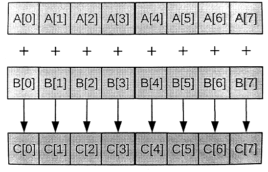
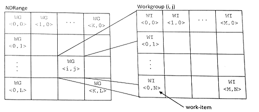
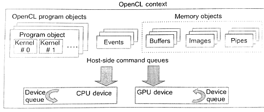

#3.4 內核和OpenCL編程模型

執行模型API能讓應用管理OpenCL命令的執行。OpenCL命令通過數據轉移和內核執行，對具體應用數據進行處理，從而執行一些有意義的任務。OpenCL內核也屬於OpenCL應用中的一部分，並且這一部分實實在在的執行在設備上。與CPU併發模型類似，OpenCL內核在語法上類似於標準的C函數，不同之初在於添加了一些關鍵字，OpenCL的併發模型由內核實現構成。使用系統多線程API或OpenMP，開發一款執行在CPU上的併發應用時，開發者會考慮物理設備上有多少線程可以使用(比如：CPU核數)，如果使用的線程數量超過了可用的線程數，那麼在物理線程不夠用的基礎上，多個線程會在不同時刻互相切換執行。OpenCL在的編程上，通常是以最細粒度的並行。OpenCL的一般性體現在，接口的通用性和底層內核直接映射物理資源。接下來展示三個不同版本的向量加法：①串行C實現，②多線程C實現，③OpenCL C實現。代碼3.1中使用串行的方式實現向量加法(C語言)，其使用一個循環對每個元素進行計算。每次循環將兩個輸入數組對應位置的數相加，然後存儲在輸出數組中。圖3.3展示了向量加法的算法。


// Perform an element-wise addition of A and B and store in C.
// There are N elements per array.

void vecadd(int *C, int *A, int *B, int N){
  for (int i = 0; i < N; ++i){
    C[i] = A[i] + B[i];
  }
}


代碼3.1 串行加法實現



圖3.3 向量加法的算法表示，其中每個元素可以單獨進行加的操作

對於一個多核設備，我們要不就使用底層粗粒度線程API(比如，Win32或POSIX線程)，要不就使用數據並行方式(比如，OpenMP)。粗粒度多線程需要對任務進行劃分(循環次數)。因為循環的迭代次數特別多，並且每次迭代的任務量很少，這時我們就需要增大循環迭代的粒度，這種技術叫做“條帶處理”[1]。多線程版的代碼如代碼3.2所示。


// Perform an element-wise addition of A and B and store in C.
// There are N elements per array and NP CPU cores.

void vecadd(int *C, int *A, int *B, int N, int NP, int tid){
  
  int ept = N / NP; // 每個線程所要處理的元素個數

  for (int i = tid * ept; i < (tid + 1) * ept; ++i){
    C[i] = A[i] + B[i];
  }
}


代碼3.2 分塊處理向量加法，使用粗粒度多線程(例如，使用POSIX CPU線程)。輸入向量上的不同元素被分配到不同的核上。

OpenCL C上的併發執行單元稱為工作項(*work-item*)。每一個工作項都會執行內核函數體。這裡就不用手動的去劃分任務，這裡將每一次循環操作映射到一個工作項中。OpenCL運行時可以創建很多工作項，其個數可以和輸入輸出數組的長度相對應，並且工作項在運行時，以一種默認合適的方式映射到底層硬件上(CPU或GPU核)。概念上，這種方式與並行機制中原有的功能性“映射”操作(可參考mapReduce)和OpenMP中對for循環進行數據並行類似。當OpenCL設備開始執行內核，OpenCL C中提供的內置函數可以讓工作項知道自己的編號。下面的代碼中，編程者調用`get_global_id(0)`來獲取當前工作項的位置，以及訪問到的數據位於數組中的位置。`get_global_id()`的參數用於獲取指定維度上的工作項編號，其中“0”這個參數，可獲取當前第一維上工作項的ID信息。


// Perform an element-wise addition of A and B and store in C.
// N work-items will be created to execute this kernel.
__kernel
void vecadd(__global int *C, __global int *A, __global int *B){
  int tid = get_global_id(0); // OpenCL intrinsic函數
  c[tid] = A[tid] + B[tid];
}


代碼3.3 OpenCL版向量相加內核

OpenCL上運行的都是細粒度工作項，如果硬件支持分配細粒度線程，就可以在當前架構下產生海量的工作項(細粒度線程的可擴展性更強)。OpenCL使用的層級併發模型能保證，即使能夠創建海量工作項的情況下，依舊可以正常的運行。當要執行一個內核時，編程者需要指定每個維度上工作項的數量(NDRange)。一個NDRange可以是一維、二維、三維的，其不同維度上的工作項ID映射的是相應的輸入或輸出數據。NDRange的每個維度的工作項數量由`size_t`類型指定。

向量相加的例子中，我們的數據是一維的，先假設有1024個元素，那麼需要創建一個數組，裡面記錄三個維度上的工作項數量。host代碼需要為1023個元素指定一個一維NDRange。下方的代碼，就是如何指定各維度上的工作項數量：

```c++
size_t indexSpace[3] = {1024, 1, 1};
```

為了增加NDRange的可擴展性，需要將工作項繼續的劃分成更細粒度的線程，那麼需要再被劃分的工作項就稱為工作組(*work-group*)(參考圖3.4)。與工作項類似，工作組也需要從三個維度上進行指定，每個維度上的工作項有多少個。在同一個工作組中的工作項具有一些特殊的關係：一個工作組中的工作項可以進行同步，並且他們可以訪問同一塊共享內存。工作組的大小在每次分配前就已經固定，所以對於更大規模的任務分配時，同一工作組中的工作項間交互不會增加性能開銷。實際上，工作項之間的交互開銷與分發的工作組的大小並沒有什麼關係，這樣就能保證在更大的任務分發時，OpenCL程序依舊能保證良好的擴展性。



圖3.4 層級模型用於產生在NDRange時所使用的工作項，以及工作項所在的工作組

向量相加的例子中，可以參考以下方式指定工作組的大小：

```c++
size_t workgroupSize[3] = {64, 1, 1};
```

如果每個數組的工作項總數為1024，那麼就會創建16個工作組(1024工作項/(64工作項每工作組)=16工作組)。為了保證硬件工作效率，工作組的大小通常都是固定的。之前的OpenCL標準中，每個維度上的工作項數目必須是工作組數目的倍數。這樣的話，在內核執行的時候，有時候會有一些用不到的工作項，這些工作項只能直接返回，不做任何輸出。不過，在OpenCL 2.0標準中，允許各維度上的工作項和工作組數量不成倍數關係，工作數量被分成兩部分：第一部分是編程者指定給工作組的工作項，另一部分是剩餘的工作組，這些工作可以沒有工作項。當工作項與工作組的關係不成倍數，那麼二維的NDRange尺寸就有4種可能，對於三維的NDRange尺寸就有8種可能。

向量相加程序中，每個工作項的行為都是獨立的(即使在同一個工作組)，OpenCL允許編程者不去分配工作組的尺寸，其會在實現中進行自動的劃分；這樣的話，開發者就可以傳遞NULL作為工作組數組的尺寸。

##3.4.1 處理編譯和參數

一個OpenCL程序對象彙集了對應的OpenCL C內核，內核調用的函數，以及常量數據。例如，一個代數解決應用中，同一個OpenCL程序對象可能包含一個向量相加內核，一個矩陣相乘的內核和一個矩陣轉置的內核。通過一系列運行時API的調用，可以讓OpenCL內核源碼得到編譯。運行時編譯能讓系統為指定的計算設備，對OpenCL內核進行優化。運行時編譯也能讓OpenCL內核代碼運行在之前不知是否支持OpenCL的設備上。運行時編譯就不需要為區分AMD，NVIDIA或Intel平臺而進行提前編譯，只要計算設備提供OpenCL編譯器，那麼不需要為這些平臺做任何改變。OpenCL的軟連接只會在同一運行時層進行，由各個硬件平臺提供的可安裝客戶端驅動(ICD)調用。ICD通常會以動態庫的方式提供，不同的ICD代表著不同的供應商提供的運行時實現，可以通過動態庫的接口激活對應的平臺。

使用源碼創建內核的步驟如下：

1. 將OpenCL C源碼存放在一個字符數組中。如果源碼以文件的形式存放在硬盤上，那麼需要將其讀入內存中，並且存儲到一個字符數組中。

2. 調用`clCreateProgramWithSource()`通過源碼可以創建一個`cl_program`類型對象。

3. 創建好的程序對象需要進行編譯，編譯之後的內核才能在一個或多個OpenCL設備上運行。調用`clBuildProgram()`完成對內核的編譯，如果編譯有問題，該API會將輸出錯誤信息。

4. 之後，需要創建`cl_kernel`類型的內核對象。調用`clCreateKernel()`，並指定對應的程序對象和內核函數名，從而創建內核對象。

第4步就是為了獲得一個`cl_kernel`對象，有點像從一個動態庫上輸出一個函數。程序對象在編譯時，會將內核函數進行接口輸出，其函數名為其真正的入口。將內核函數名和程序對象傳入`clCreateKernel()`，如果程序對象是合法的，並且這個函數名是存在的，那麼久會返回一個內核對象。OpenCL程序對象與內核對象的關係，如圖3.5所示，一個程序對象上可以提取多個內核對象。每個OpenCL上下文上可有多個OpenCL程序對象，這些程序對象可由OpenCL源碼創建。

```c++
cl_kerenl
clCreateKernel(
  cl_program program,
  const char *kernel_name,
  cl_int *errcode_ret)
```

一個內核對象的二進製表示是由供應商指定。AMD運行時上，有兩大主要的設備：x86 CPU和GPU。對於x86 CPU，`clBuildProgram()`生成x86內置代碼，這份代碼可以直接在設備上執行。對於GPU，`clBuildProgram()`將創建AMD GPU的中間碼，高端的中間碼將會在指定的GPU架構上即時編譯生成，其產生的通常是一份已知的指令集架構的代碼。NVIDIA使用同樣的方式，不過NVIDIA這種中間碼為並行線程執行(PTX，parallel thread execute)。這樣做的好處是，如果一個設備上的GPU指令集有所變化，其產生的代碼功能依舊不會受到影響。這種產生中間代碼的方式，能給編譯器的開發帶來更大的發展空間。



圖3.5 這個OpenCL運行時圖展示了一個OpenCL上下文對象內具有兩個計算設備(一個CPU設備和一個GPU設備)。每個計算設備具有自己的命令隊列。主機端和設備端的命令隊列在圖中都由所展示。設備端的隊列只能被在設備上執行的內核對象看到。內存對象通過內存模型定義。

OpenCL程序對象另一個特性是能在構建之後，產生二進制格式的文件，並寫入到硬盤。如同大多數對象一樣，OpenCL提供一個函數可以返回一些關於程序對象的信息——`clGetProgramInfo()`。這個函數中其中有一個參數可以傳`CL_PROGRAM_BINARIES`，這個參數可以返回供應商指定的二進製程序對象(通過`clBuildProgram()`編譯之後)。除了`clCreateProgramWithSource()`外，OpenCL也提供`clCreateProgramWithBinary()`，這個函數可以通過一系列編譯好的二進制文件直接創建程序對象，對應的二進制文件可以通過`clGetProgramInfo()`得到。使用二進製表示的OpenCL內核，因為不需要以源碼的方式存儲，以及安裝編譯器，這種方式更容易部署OpenCL程序。

與調用C函數不同，我們不能直接將參數賦予內核函數的參數列表中。執行一個內核需要通過一個入隊函數進行發佈。由於核內的語法為C，且內核參數具有持續性(如果我們只改變參數裡面的值，就沒有必要再重新進行賦值)。OpenCL中提供`clSetKernelArg()`對內核的參數進行設置。這個API需要傳入一個內核對象，指定參數的索引值，參數類型的大小，以及對應參數的指針。內核參數列表中的類型信息，需要一個個的傳入內核中。

```c++
cl_int
clSetKernelArg(
  cl_kernel kernel,
  cl_uint arg_index,
  size_t arg_size,
  const void *arg_value)
```

##3.4.2 執行內核

調用`clEnqueueNDRangeKernel()`會入隊一個命令道命令隊列中，其是內核執行的開始。命令隊列被目標設備指定。內核對象標識了哪些代碼需要執行。內核執行時，有四個地方與工作項創建有關。`work_dim`參數指定了創建工作項的維度(一維，二維，三維)。`global_work_size`參數指定NDRange在每個維度上有多少個工作項，`local_work_size`參數指定WorkGroup在每個維度上有多少個工作組。`global_work_offset`參數可以指定全局工作組中的ID是否從0開始計算。

```c++
cl_int
clEnqueueNDRangeKernel(
  cl_command_queue command_queue,
  cl_kernel kernel,
  cl_uint work_dim,
  const size_t *global_work_offset,
  const size_t *global_work_size,
  const size_t *local_work_size,
  cl_uint num_events_in_wait_list,
  const cl_event *event_wait_list,
  cl_event *event)
```

和所有`clEnqueue`API相同，需要提供一個event_wait_list，當這個參數不為NULL時，當前的內核要等到等待列表中的所有任務都完成才能執行。該API也是異步的：命令入隊之後，函數會立即返回(通常會在內核執行之前就返回)。OpenCL中`clWaitForEvents()`和`clFinish()`可以在host端阻塞等待，直到對應的內核對象執行完成。
