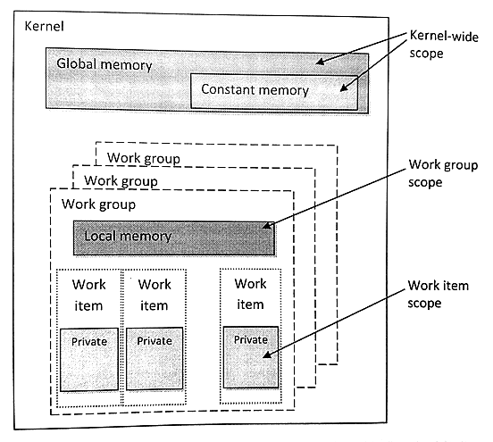
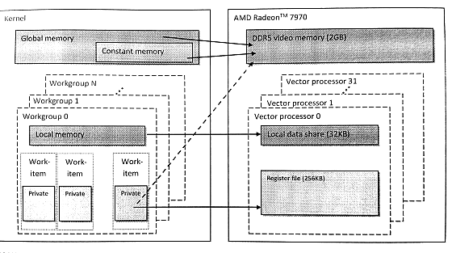

#3.5 OpenCL內存模型

內存與計算平臺之間有比較大的差異。為了可移植性，OpenCL定義一個抽象的內存模型，其目的是為了能讓編程者寫出的代碼對應到供應商所提供的實際硬件內存上。內存模型描述了，平臺為了OpenCL程序所外現的內存(系統)結構。內存模型需要定義，如何讓執行單元看到對應值的方式。內存模型是保證OpenCL程序正確性的關鍵。

內存模型可以實現編程者所期望的功能，對應內存操作能保證其發生的順序，以及內存中實際的數值(當讀取操作返回時)。OpenCL內存一致性模型基於ISO C11編程語言的內存模型。第6章和第7章會詳細討論內存模型的內存，包括一致性內存模型和共享虛擬內存。我們只需要瞭解一下OpenCL中定義的不同內存類型，其中內存區域是對抽象內存模型的補足。瞭解了這些之後，我們就可以開始第一個OpenCL程序了。

##3.5.1 內存對象

OpenCL內核通常需要對輸入和輸出數據進行分類(例如，數組或多維矩陣)。程序執行前，需要保證輸入數據能夠在設備端訪問到。為了將數據轉移到設備端，首先做的事就是封裝出一個內存對象。為了產生輸出數據，需要開闢相應大小的空間，以及將開闢的空間封裝成一個內存對象。OpenCL定義了三種內存類型：數組、圖像和管道。

**數組緩存**

*Buffer*類型類似於C語言中的數據(使用malloc函數開闢)，這種類型中數據在內存上是連續的。理論上，這種類型可以在設備端以指針的方式使用。OpenCL API `clCreateBuffer()`為這種類型分配內存，並返回一個內存對象。

```c++
cl_mem
clCreateBuffer(
  cl_context context,
  cl_mem_flags flags,
  size_t size,
  void *host_ptr,
  cl_int *errcode_ret)
```

該API類似於C中malloc()函數，或C++中的new操作。創建一個數組需要知道其長度和創建在哪一個上下文對象上；創建之後，與該上下文對象相關聯的設備就能看到這個內存對象。對於第二個標識參數，是用來指定設備端可對內存進行的操作，可以是“只讀”、“只寫”或“讀寫”。其他標識需要在數組創建的時候指定。比較簡單的選項是使用主機端的指針來初始化一段數組。我們能看到的是OpenCL數組是與上下文對象進行關聯，而非某個設備，所以數據轉移的是在運行時確定的。數組轉移到指定的設備上，或是從指定的設備轉移到其他地方，都由OpenCL運行時根據數據的依賴性進行管理。

**圖像對象**

圖像也是OpenCL內存對象，其抽象了物理數據的存儲，以便“設備指定”的訪存優化。與數組不同，圖像數組數據不能直接訪問。因為相鄰的數據並不保證在內存上連續存儲。使用圖像的目的就是為了發揮硬件空間局部性的優勢，並且可以利用設備硬件加速的能力。

```c++
cl_mem
clCreateImage(
  cl_context context,
  cl_mem_flags flags,
  const cl_image_format *image_format,
  const cl_image_desc *image_desc,
  void *host_ptr,
  cl_int *errcode_ret)
```

圖像沒有數據類型或維度，圖像對象的創建需要通過描述符，讓硬件瞭解這段內存數據的具體信息。圖像對象中的每個元素通過格式描述符來表示(cl_image_format)。格式描述符用於描述圖像元素在內存上是如何存儲，以及使用通道的信息。*通道序*(channel order)指的是由多少個通道元素組成一個圖像元素(例如，RGBA就是由四個通道值組成一個像素，其通道序為4)，並且*通道類型*(channel type)指定了每個元素的大小。大小可以設置為1到4字節中的任意值，這樣就能表現多種不同的格式(從整型到浮點)。其他數據元通過圖像描述符(cl_image_desc)提供，其包括了圖像的類型和維度。第4章我們會看到一個使用圖像的例子。第6章和第7章，我們將詳細的討論圖像的架構設計和評估。

為了支持圖像類型，在設備端OpenCL C專門提供了用於讀寫圖像數據的內置函數。硬件供應商可以通過這些函數，在底層單獨對圖像訪問進行優化，或者利用硬件加速功能提高圖像訪存的速度。與數組相比，圖像讀寫函數需要額外的參數，並且這些函數根據圖像的具體數據類型進行使用。例如，`read_imagef()`函數就適用於讀取浮點型的數值，`read_imageui()`函數就使用與讀取無符號整型的數值。這些函數在使用的數據類型上有些不同，但在讀取方面至少需要有一組訪問座標和一個採樣器對象。採樣器可以指定，設備訪問到圖像外部時，這些不存在的數據應該如何獲取，是否使用差值，以及是否對座標進行歸一化。寫入圖像需要手動將數據轉換成對應的存儲數據格式(例如，對應的通道和對應的數據大小)，目的座標也需要手動的進行轉換。

之前的OpenCL標準中，內核不允許對一個圖像對象同時進行寫入和讀取。不過，OpenCL 2.0放鬆了這一要求，其提供的一系列同步操作，能讓編程者安全的在同一內核中對同一圖像對象進行讀和寫。

**管道對象**

管道內存對象就是一個數據元素(被稱為*packets*)隊列，其和其他隊列一樣，遵循FIFO(先進先出)的方式。一個管道對象具有一個寫入末尾點，用於表示元素由這裡插入；並且，有一個讀取末尾點，用於表示元素由這裡移除。要創建一個管道對象時，需要調用OpenCL API `clCreatePipe()`，這裡需要提供包的大小和管道中可容納包的最大數量(例如，創建時固定了管道中可容納包的最大值)。函數`clGetPipeInfo()`可以返回管道中包的大小和整體大小(也就是可容納包的最大值)。屬性參數是一個保留參數，在OpenCL 2.0階段，這個值只能傳NULL。

```c++
cl_mem
clCreatePipe(
  cl_context context,
  cl_mem_flags flags,
  cl_uint pipe_packet_size,
  cl_uint pipe_max_packets,
  const cl_pipe_properties *properties,
  cl_int *errcode_ret)
```

任意時間點，只能有一個內核向管道中存入包，並且只有一個內核從管道中讀取包。為了支持“生產者-消費者”設計模式，一個內核與寫入末尾點連接(生產者)，同時另一個內核與讀取末尾點連接(消費者)。同一個內核不能同時對一個管道進行讀取和存入。

圖像和管道都是不透明的數據結構，其只能通過OpenCL C的內置函數進行訪問(比如，`read_pipe()`和`write_pipe()`)。OpenCL C也提供相應的函數，可以保留管道的讀取點和寫入點。內置函數允許管道在工作組級別上進行訪問，而不需要單獨訪問每個工作項，並且能在工作組級別上執行同步。第6章將會對管道進行更多的討論。

##3.5.2 數據轉移命令

內核執行之前，通常需要將主機端的數據拷貝到OpenCL內存對象的所分配的空間中。創建數組或圖像可以調用不同的創建API(`clCreate*()`)。將主機指針作為`clCreate*()`的參數用於初始化OpenCL內存對象。這種方式可以隱式的進行數據傳輸，並不需要編程者為之擔心。內存對象初始化之後，運行時就需要保證數據依據依賴關係，以正確的順序和時間轉移到設備端。

雖然，數據轉移交給運行時進行管理，但是我們通常出於對性能的考慮(將在第6章進行討論)，常常希望能夠手動進行數據傳輸。顯式的數據傳輸也需要檢索主機端的內存空間。因此，通常情況下使用顯式數據傳輸命令，在內存對象被內核調用之前，為其寫入相應的數據到設備端；以及，在內存對象最後一次使用之後，讀取其數據到主機端。假設我們的內存對象是一個數組，主機端和設備端的內存互傳需要使用到下面兩個API：`clEnqueueWriteBuffer()`和`clEnqueueReadBuffer()`。設備端使用的內存與主機內存通常是離散的，當命令執行時，數據可能就已經傳輸到設備端了(比如，使用PCIe總線)。讀取和寫入內存對象的API十分相似。`clEnqueueWriteBuffer()`的參數列表如下所示：

```c++
cl_int
clEnqueueWriteBuffer(
  cl_command_queue command_queue,
  cl_mem buffer,
  cl_bool blocking_write,
  size_t offset,
  size_t cb,
  const void *ptr,
  cl_uint num_events_in_wait_list,
  const cl_event *event_wait_list,
  cl_event *event)
```

除了命令隊列，該函數還需要數組型的內存對象，所要傳輸的數據大小，以及數組的偏移。偏移量和傳輸數據可以將原始數據的一個子集進行傳輸。如果需要數據傳輸完成再返回，blocking_write參數可以設置成CL_TRUE；如果設置成CL_FALSE，則以更加高效的異步方式進行傳輸，且函數會立即返回，無需等到數據完全傳輸完再返回。寫入和讀取數組的操作將在本章最後的例子中演示。

##3.5.3 內存區域

OpenCL將內存劃分成主機內存和設備內存。主機內存可在主機上使用，其並不在OpenCL的定義範圍內。使用對應的OpenCL API可以進行主機和設備的數據傳輸，或者通過共享虛擬內存接口進行內存共享。而設備內存，指定是能在執行內核中使用的內存空間。

OpenCL將設備內存分成了四種，這四種內存分別代表了不同的內存區域，如圖3.6所示。



圖3.6 內存區域和其在OpenCL內存模型中的界限

這些內存空間都與OpenCL內核有關。一個內核中，不同區域對應有不同的關鍵字，關鍵字用來指定變量使用哪種內存進行創建，或數據具體所存儲的位置。內存區域在邏輯上是不相交的，並且不同區域的數據要被其他區域使用，是否需要進行數據轉移是由內核開發者來控制。每個內存區域都有其各自的性能特性。由於性能特性的緣故，存儲到不同區域的數據在讀取時具有很大的性能差異。

下面簡單的來描述一下每個內存區域：

- 全局內存對於執行內核中的每個工作項都是可見的(類似於CPU上的內存)。當數據從主機端傳輸到設備端，數據就存儲在全局內存中。有數據需要從設備端傳回到主機端，那麼對應的數據需要存儲在全局內存中。其關鍵字為`global`或`__global`，關鍵字加在指針類型描述符的前面，用來表示該指針指向的數據存儲在全局內存中。例如，本章最後的的例子中，OpenCL C代碼中`global int *A`代表A指針指向的數據為與全局內存中(雖然我們會看到的A實際位於私有內存中)。

- 常量內存並非為只讀數據設計，但其能讓所有工作項同時對該數據進行訪問。這裡存儲的值通常不會變化(比如，某個數據變量存儲著π的值)。OpenCL的內存模型中，常量內存為全局內存的子集，所以內存對象傳輸到全局內存的數據可以指定為“常量”。使用關鍵字`constant`或`__constant`將相應的數據映射到常量內存。

- 局部內存中的數據，只有在同一工作組內的工作項可以共享。通常情況下，局部內存會映射到片上的物理內存，例如：軟件管理的暫存式存儲器。比起全局內存，局部內存具有更短的訪問延遲，以及更高的傳輸帶寬。調用`clSetKernelArg()`設置局部內存時，只需要傳遞大小，而無需傳遞對應的指針，相應的局部內存會由運行時進行開闢。OpenCL內核中，使用`local`或`__local`關鍵字來描述指針，從而來定義局部內存(例如，`local int *sharedData`)。不過，數據也可以通過關鍵字`local`，靜態申明成局部內存變量(例如，`local int[64]`)。

- 私有內存只能由工作項自己進行訪問。局部變量和非指針內核參數通常都在私有內存上開闢。實踐中，私有變量通常都與寄存器對應。不過，當寄存器不夠私有數組使用是，這些溢出的數據通常會存儲到非片上內存(高延遲的內存空間)上。



圖3.7 AMD Radeon HD 7970 GPU具體硬件存儲器與OpenCL內存模型的對應關係

##3.5.4 通用地址空間

之前的OpenCL標準中，如果使用不同內存區域內存，需要在創建的時候使用對應的關鍵字對指針進行申明。為了不讓編程者的精力在這些方便分散，“通用地址空間”概念添加入OpenCL 2.0標準。“通用地址空間”的建模，更加貼近已經使用很久的嵌入式C標準(IOS/IEC 9899:1999)。通用地址空間支持指向私有、局部和全局地址指針的互相轉換，這樣編程者只需要寫一個簡單的函數即可，其指針參數可以接受這指向這三種內存區域的指針。關於通用地址空間將在第7章詳細討論。
