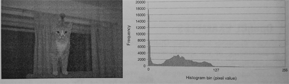

#4.2 直方圖

直方圖是用來計數或可視化離散數據的頻度(比如，出現次數)，直方圖多用於圖像處理。例如本節的例子，我們將創建一個直方圖，其統計像素值不超過256-bit的圖像。圖4.1中，左邊的圖為輸入，右邊的圖為產生好的直方圖。例子中我們將使用局部內存，以及在OpenCL內核中使用局部和全局原子操作。



圖4.1 從一副256-bit圖產生的直方圖。直方圖中顯示了相關像素的頻度。

理論上，直方圖算法本身很簡單。例子中，每個值都由自己對應的位置，直方圖的實現如下：


int histogtam[HIST_BINS]

main(){
  for (each input value){
    histogtam[value]++;
  }
}


與第3章的向量相加不同，直方圖不那麼容易並行，在多線程的狀態下期中的自加操作將會導致競爭。不過，雖然效率有些低，但也可以使用原子加操作來完成直方圖中的數據的自加操作。下面的偽代碼，就完全能用多線程完成直方圖的計算。


int histogtam[HIST_BINS]

createHistogram(){
  for (each of my value){
    atomic_add(histogtam[value], 1);
  }
}

main(){
  for (number of threads){
    spawn_thread(createHistogram);
  }
}


這個實現並不高效，因為其對每個像素都進行了原子操作。更高效的一種方式是使用局部直方圖，其只統計該區域內的像素。當一個線程計算完成自己的局部直方圖後，就會自動的加到全局直方圖中。


int histogram[HIST_BINS]

createHistogram(){

  int localHistorgram[HIST_BINS];

  for (each of my value){
    localHistorgram[value]++;
  }
  
  for (each bin){
    atomic_add(histogram[bin], localHistorgram[bin]);
  }
}

main(){
  for (number of threads){
    spawn_thread(createHistogram);
  }
}


很多情況下，OpenCL的多線程和CPU多線程在原理上是一樣的——不過二者的線程粒度有些不同。如將第一種多線程的方式換成OpenCL中的工作項來做，因為每個工作項都要對共享的全局內存使用原子操作，其執行效率也很低。第8章中，我們將瞭解到，全局變量的訪問延遲要遠高於寄存器和局部內存。如多線程的實現，如果有太多的線程訪問同一個位置，那麼這個程序的效率將會大大降低。

不過，我們也不想在每個工作項中備份直方圖。GPU工作項將私有數據存儲到寄存器，當寄存器被佔滿，多於的私有變量會存儲在全局內存中，這對於性能來說有弊無益。

最好的辦法就是在每個工作組中創建一份局部積分圖。局部內存中的數據，每個工作組中的所有工作項都可以共享訪問。局部內存一般會分佈在GPU的片上內存中，其訪問速度要比訪問全局內存快的多。如同第二種CPU多線程算法，當工作組完成局部積分圖時，其會傳遞給全局內存，並使用原子加操作將對應位置上的數據原子加到全局內存中。不過，這種實現方式也有問題：對局部內存的訪問上存在條件競爭。這裡需要你對目標設備的架構有所瞭解。對於很多GPU來說，原子操作訪問局部內存的效率很高。在AMD Radeon GPU上，原子單元位於片上暫存式存儲器中。因此，局部內存上的原子操作的效率要比全局原子操作的效率高很多。下面的例子中，我們將使用到局部原子操作來生成局部直方圖。

OpenCL內核的參考代碼如下：

#define HIST_BINS 256

__kernel
void histogram(__global int *data,
			            int  numData,
			   __global int *histogram){
			   
  __local int localHistorgram[HIST_BINS];
  
  int lid = get_local_id(0);
  int gid = get_glaobal_id(0);
  
  /* Initialize local histogram to zero */
  for (int i = lid; i < HIST_BINS; i += get_local_size(0)){
    localHistorgram[i] = 0;
  }
  
  /* Wait nutil all work-items within
   * the work-group have completed their stores */
  barrier(CLK_LOCAL_MEM_FENCE);
  
  /* Compute local histogram */
  for (int i = gid; i < numData; i += get_glaobal_size(0)){
    atomic_add(&localHistorgram[data[i]], 1);
  }
  
  /* Wait nutil all work-items within
   * the work-group have completed their stores */
  barrier(CLK_LOCAL_MEM_FENCE);
  
  /* Write the local histogram out to
   * the global histogram */
  for (int i = lid; i < HIST_BINS; i += get_glaobal_size(0)){
    atomic_add(&histogram[i], localHistorgram[i]);
  }
}


代碼清單4.1 計算直方圖的OpenCL內核代碼

代碼清單4.1的實現中包含如下5步：

1. 初始化局部直方圖內的值為0 (第14行)

2. 同步工作項，確保相應的數據全部更新完畢 (第23行)

3. 計算局部直方圖 (第26行)

4. 再次同步工作項，確保相應的數據全部更新完畢 (第35行)

5. 將局部直方圖寫入到全局內存中 (第39行)

1,3,5展示瞭如何在OpenCL中對內存共享區域(全局或局部內存)進行讀寫。當我們需要工作項需要訪問不同的內存位置時，我們可以以工作項的唯一標識ID為基準，然後加上所有工作項的數量作為跨度(例如，工作組內以工作組中工作項的數量，計算對應工作項所要訪問的局部內存位置。或以NDRange中的尺寸，訪問全局內存)。第1步中，我們以工作組的尺寸為跨距，用來將局部直方圖初始化為0。這就允許我們更加靈活的對工作組尺寸進行設置及配置，並且能保證現有模塊功能的正確性。第3步中使用同樣的方式讀取全局內存中的數據，以及第5步中也以相同的方式將局部內存中的數據寫出。

第2和第4步使用柵欄對兩步間的操作進行同步，其指定的內存柵欄，將同步工作組中的所有工作項。柵欄和內存柵欄將在第7章詳細討論。現在就能確保工作組中的所有工作項都要到達該柵欄處，只要有線程沒有達到，已達到的線程就不能執行下面的操作。局部內存柵欄就是用來保證所有工作項都到達柵欄處，以代表局部直方圖更新完畢。

為了讓全局直方圖得到正確的結果，我們也需要對全局積分圖進行初始化。可以在數組創建之後，直接使用主機端API `clEnqueueFillBuffer()`對數據進行初始化。`clEnqueueFillBuffer()`的參數列表如下:

```c++
cl_int
clEnqueueFillBuffer(
  cl_command_queue command_queue,
  cl_mem buffer,
  const void *pattern,
  size_t offset,
  size_t size,
  cl_uint num_events_in_wait_list,
  const cl_event *event_wait_list,
  cl_event *event)
```

該API類似於C中的`memset()`函數。buffer參數就是要初始化的數組對象，具體的值由pattern指定。與`memset()`不同，pattern可以指定為任意的OpenCL支持類型，比如：標量、整型向量或浮點類型。pattern_size用來指定pattern所佔空間。size參數用來指定數組內初始化的字節數，其值必須是pattern_size的整數倍。offset參數用來指定數組起始初始化的位置或偏移。

除了初始化直方圖數組部分，主機端代碼與第3章向量相加的代碼很類似。代碼清單4.2提供了直方圖統計主機端的完整代碼。內核代碼在代碼清單4.1中，將其存成名為histogram.cl以供4.2中的代碼使用。代碼中有些工具函數在4.6節中會詳細介紹。這些函數用於讀寫BMP文件，這裡提供其源碼的在線地址(http://booksite.elsevier.com/9780128014141)


/* System includes */
#include <stdio.h>
#include <stdlib.h>
#include <sting.h>

/* OpenCL includes */
#include <CL/cl.h>

/* Utility functions */
#include "utils.h"
#include "bmp_utils.h"

static const int HIST_BINS = 256;

int main(int argc, char *argv[]){

  /* Host data */
  int *hInputImage = NULL;
  int *hOutputHistogram = NULL;
  
  /* Allocate space for the input image and read the
   * data from disk */
  int imageRows;
  int imageCols;
  hInputImage = readBmp("../../Images/cat.bmp", &imageRows, &imageCols);
  const int imageElements = imageRows * imageCols;
  const size_t imageSize = imageElements * sizeof(int);
  
  /* Allocate space for the histogram on the host */
  const int histogramSize = HIST_BINS * sizeof(int);
  hOutputHistogram = (int *)malloc(histogramSize);
  if (!hOutputHistogram){ exit(-1); }
  
  /* Use this check the output of each API call */
  cl_int status;
  
  /* Get the first platform */
  cl_platform_id platform;
  status = clGetPlatformIDs(1, &platform, NULL);
  check(status);
  
  /* Get the first device */
  cl_device_id device;
  status = clGetDeviceIDs(platform, CL_DEVICE_TYPE_GPU, 1, &device, NULL);
  check(status);
  
  /* Create a command-queue and associate it with the device */
  cl_command_queue cmdQueue;
  context = clCreateContext(NULL, 1, &device, NULL, NULL, &status);
  check(status);
  
  /* Create a buffer object for the output histogram */
  cl_mem bufOutputHistogram;
  bufOutputHistogram = clCreateBuffer(context, CL_MEM_WRITE_ONLY, histogramSize, NULL, &status);
  check(status);
  
  /* Write the input image to the device */
  status = clEnqueueWriteBuffer(cmdQueue, bufInputImage, CL_TRUE, 0, imageSize, hInputImage, 0, NULL, NULL);
  check(status);
  
  /* Initialize the output histogram with zero */
  int zero = 0;
  status = clEnqueueFillBuffer(cmdQueue, bufOutputHistogram, &zero, sizeof(int), 0, histogramSize, 0, NULL, NULL);
  check(status);
  
  /* Create a program with source code */
  char *programSource = readFile("histogram.cl");
  size_t prograSourceLen = strlen(programSource);
  cl_program program = clCreateProgramWithSouce(context, 1, (const char **)&programSource, &prograSourceLen, &status);
  check(status);
  
  /* Build (compile) the program for the device */
  status = clBuildProgram(program, 1, &device, NULL, NULL, NULL);
  if (status != CL_SUCCESS){
    printCompilerError(program, device);
	exit(-1);
  }
  
  /* Create the kernel */
  cl_kernel kernel;
  kernel = clCreateKernel(program, "histogram", &status);
  check(status);
  
  /* Set the kernel arguments */
  status = clSetKernelArg(kernel, 0, sizeof(cl_mem), &bufInputImage);
  status |= clSetKernelArg(kernel, 1, sizeof(int), &imageElements);
  status |= clSetKernelArg(kernel, 2, sizeof(cl_mem), &bufOutputHistogram);
  
  /* Define the index space and work-group size */
  size_t globalWorkSize[1];
  globalWorkSize[0] = 1024;
  
  size_t localWorkSize[1];
  localWorkSize[0] = 64;
  
  /* Enqueue the kernel for execution */
  status = clEnqueueNDRangeKernel(cmdQueue, kernel, 1, NULL, globalWorkSize, localWorkSize, 0, NULL, NULL);
  check(status);
  
  /* Read the output histogram buffer to the host */
  status = clEnqueuReadBuffer(cmdQueue, bufOutputHistogram, CL_TRUE, 0, histogramSize, hOutputHistogram, 0, NULL, NULL);
  check(status);
  
  /* Free OpenCL resources */
  clReleaseKernel(kernel);
  clReleaseProgram(program);
  clReleaseCommandQueue(cmdQueue);
  clReleaseMemObject(bufInputImage);
  clReleaseMemObject(bufOutputHistogram);
  clReleaseContext(context);
  
  /* Free host resource */
  free(hInputImage);
  free(hOutputHistogram);
  free(programSource);
  
  return 0;
}


代碼清單4.2 直方圖統計的主機端代碼。注意，check(cl_int status)是用來檢查之前執行命令的狀態是否為CL_SUCCESS。