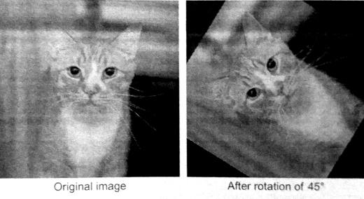

#4.3 圖像旋轉

旋轉在常規的圖像處理中都會用到，比如在圖形匹配、圖像對齊，以及其他基於圖像的算法。本節旋轉例子的輸入是一張圖，輸出是一張旋轉了Θ度的圖。旋轉完成後，就如同圖4.2中所示。



圖4.2 旋轉了45°的圖像。超出圖像範圍的部分會返回黑色像素。

假設其中一個像素點的座標為(x, y)，中心旋轉點的座標為(x0, y0)，當原始座標旋轉Θ度時，該點的新座標為(x', y')。這些數據的計算公式如下所示：

```
x' = cosΘ(x - x0) + sinΘ(y - y0)
y' = -sinΘ(x - x0) + cosΘ(y - y0)
```

根據以上的等式，可以清楚的瞭解每個像素點座標的計算都是獨立的。注意，每個輸入和輸出的座標值不一定是整數。因此，我們就要利用OpenCL內置函數支持浮點座標計算，並且內部支持的線性差值方式也能生成高質量的輸出圖像。

如果將工作項映射到輸出圖像的位置上，那麼工作項的全局ID就對應著輸出的(x', y')，並使用上面的等式進行計算。該例子中我們以圖像的中間點，作為旋轉中心點。根據之前的等式，我們能推算出原始的座標位置，以便每個工作項完成其計算：

```
x = x'cosΘ - y'sinΘ + x0
y = x'sinΘ + y'cosΘ + y0
```

相關的OpenCL C偽代碼如下：
```c++
gidx = get_global_id(0);
gidy = get_global_id(1);
x0 = width / 2;
y0 = height / 2;
x = gidx * cos(theta) - gidy * sin(theta) + x0
y = gidx * sin(theta) + gidy * cos(theta) + y0
```

代碼清單4.3中展示瞭如何使用OpenCL內核處理圖像旋轉。第3章，我們提到過圖像，其對象對編程者是不透明，必須使用相關類型的內置函數。這個內核代碼中，我們使用了`read_imagef()`(第38行)用來處理浮點數據。如同所有用來訪問圖像的函數一樣，`read_imagef()`會返回一個具有4個元素的矢量類型。當我們對單通道數據進行處理(會在之後進行描述)，我們只需要在讀取函數之後訪問.x即可(第38行)。當我們調用寫入圖像的函數時，會將一個具有4個元素的矢量直接寫入圖像中，而不管數據實際的類型，這裡就需要硬件進行適當的處理。因此，在調用`write_imagef()`時，我們必須將結果轉換為一個float4矢量類型(第41行)。


__constant sampler_t sampler = 
  CLK_NORMALIZED_COORDS_FALSE |
  CLK_FILTER_LINEAR           |
  CLK_ADDRESS_CLAMP;
  
__kernel
void rotation(
  __read_only image2d_t inputImage,
  __write_only image2d_t ouputImage,
  int imageWidth,
  int imageHeigt,
  float theta)
{
  /* Get global ID for ouput coordinates */
  int x = get_global_id(0);
  int y = get_global_id(1);
  
  /* Compute image center */
  float x0 = imageWidth / 2.0f;
  float y0 = imageHeight / 2.0f;
  
  /* Compute the work-item's location relative
   * to the image center */
  int xprime = x - x0;
  int yprime = y - y0;
  
  /* Compute sine and cosine */
  float sinTheta = sin(theta);
  float cosTheta = cos(theta);
  
  /* Compute the input location */
  float2 readCoord;
  readCoord.x = xprime * cosTheta - yprime * sinTheta + x0;
  readCoord.y = xprime * sinTheta + yprime * cosTheta + y0;
  
  /* Read the input image */
  float value;
  value = read_imagef(inputImage, sampler, readCoord).x;
  
  /* Write the output image */
  write_imagef(outputImage, (int2)(x, y), (float4)(value, 0.f, 0.f, 0.f));
}


代碼清單4.3 圖像旋轉內核

內核4.3代碼中使用圖像採樣器(sampler_t sampler)，用來描述如何訪問圖像。採樣器指定如何處理訪問到的圖像位置，比如，當訪問到圖像之外的區域，或是當訪問到多個座標時，不進行差值操作。

訪問到的座標不是就被標準化(比如，取值範圍在0到1之間)，就是使用基於像素值地址。使用CLK_NORMALIZED_COORDS_FALSE標識指定基於像素地址的尋址。OpenCL支持很多用於處理跨邊界訪問尋址方式。本節例程中，我們將是用CL_ADDRESS_CLAMP用來指定，當訪問到圖像之外的區域，會將RGB三個通道的值設置成0，並且將A通道設置成1或0(由圖像格式決定)。所以，超出範圍的像素將會返回黑色。最後，採樣器允許我們指定一種過濾模式。過濾模式將決定將如何返回圖像所取到的值。選項CLK_FILTER_NEAREST只是簡單的返回離所提供左邊最近的圖像元素。或者使用CLK_FILTER_LINEAR將座標附近的像素進行線性差值。本節圖像旋轉的例子中，我們將使用線性差值的方式提供質量更加上乘的旋轉圖像。

之前版本的OpenCL中，全局工作項的數量是由NDRange進行配置，每個維度上工作項的數量必須是工作組數量的整數倍。通常，這就會導致NDRange設置的大小要遠大於已經映射的數據。當訪問到圖像外區域時，編程者不得不傳入元數據到內核當中去，用於判斷每個工作項所訪問到的位置是否合法——本節例子中，就需要將圖像的寬和高傳入內核當中。訪問到非法位置的工作項將不參與計算，有時這樣的做法將使內核代碼變得奇怪或低效。OpenCL 2.0標準中，設備所需的NDRange中，工作組尺寸在圖像邊界處可變。這就用到*剩餘工作組*(remainder work-groups)的概念，第5章還會繼續討論。將OpenCL的性能特性使用到代碼清單4.3中，將會使代碼簡單高效。

之前的例子中，創建程序對象的過程與向量相加中創建程序對象的過程很類似。不過本節的例子中我們在內核中使用的是圖像。從一副圖中讀取圖像後，我們將其元素轉換為單精度浮點類型，並將其作為OpenCL圖像對象的數據來源。

分配圖像對象的工作由clCreateImage() API完成。創建圖像時，需要指定其維度(1,2,3維)，並且設置其圖像空間大小，這些都由圖像描述器(類型為cl_image_desc)對象來完成。像素類型和通道佈局都有圖像格式(類型為cl_image_format)來指定。圖像中所存儲的每個元素都為四通道，分別為R,G,B和A通道。因此，一個圖像將使用CL_RGBA來表示，其每個元素向量中通道的順序。或者，一副圖像中的每個像素只用一個值來表示(比如：灰度縮放圖或數據矩陣)，數據需要使用CL_R來指定圖像為單通道。當在數據格式中指定數據類型，並通過簽名和尺寸組合標識的方式來指定整數類型。例如，CL_SIGNED_INT32代表32位有符號整型數據，CL_UNSIGNED_INT8與C語言中無符號字符類型一樣。單精度浮點數據，可以使用CL_FLOAT指定，並且這個標識用在了本節的例子中。

代碼清單4.4展示了在主機端創建輸入和輸出圖像的例子。圖像對象創建完成之後，我們使用`clEnqueueWriteImage()`將主機端的輸入數據傳輸到圖像對象當中。


/* The image descriptor describes how the data will be stored
 * in memory. This descriptor initializes a 2D image with no pitch */
cl_image_desc desc;
desc.image_type = CL_MEM_OBJECT_IMAGE2D;
desc.image_width = width;
desc.image_height = height;
desc.image_depth = 0;
desc.image_array_size = 0;
desc.image_row_pitch = 0;
desc.image_slice_pitch = 0;
desc.num_mip_levels = 0;
desc.num_samples = 0;
desc.buffer = NULL;

/* The image format descibes the properties of each pixel */
cl_image_format format;
format.image_channel_order = CL_R; // single channel
format.image_channel_data_type = CL_FLOAT;

/* Create the input image and initialize it using a
 * pointer to the image data on the host */
cl_mem inputImage = clCreateImage(context, CL_MEM_READ_ONLY, &format, &desc, NULL, NULL);

/* Create the output image */
cl_mem ouputImage = clCreateImage(context, CL_MEM_WRITE_ONLY, &formatm, &desc, NULL, NULL);

/* Copy the host image data to the device */
size_t origin[3] = {0,0,0}; // Offset within the image to copy form
size_t region[3] = {width, height, 1}; // Elements to per dimension
clEnqueueWriteImage(queue, inputImage, CL_TRUE,
  origin, region, 0 /* row-pitch */, 0 /* slice-pitch */,
  hostInputImage, 0, NULL, NULL);


代碼清單4.4 為旋轉例程創建圖像對象

旋轉例程的完整代碼在代碼清單4.5中展示。

/* System includes */
#include <stdio.h>
#include <stdlib.h>
#include <string.h>

/* OpenCL includes */
#include <CL/cl.h>

/* Utility functions */
#include "utils.h"
#include "bmp-utils.h"

int main(int argc, char **argv)
{
  /* Host data */
  float *hInputImage = NULL;
  float *hOutputImage = NULL;
  
  /* Angle for rotation (degrees) */
  const float theta = 45.f;
  
  /* Allocate space for the input image and read the
   * data from disk */
  int imageRows;
  int imageCols;
  hInputImage = readBmpFloat("cat.bmp", &imageRow, &imageCols);
  const int imageElements = imageRows * imageCols;
  const size_t imageSize = imageElements * sizeof(float);
  
  /* Allocate space for the ouput image */
  hOutputImage = (float *)malloc(imageSize);
  if (!hOutputImage){ exit(-1); }
  
  /* Use this to check the output of each API call */
  cl_int status;
  
  /* Get the first platform */
  cl_platform_id platform;
  status = clGetPlatformIDs(1, &platform, NULL);
  check(status);
  
  /* Get the first device */
  cl_device_id device;
  status = clGetDeviceIDs(platform, CL_DEVICE_TYPE_GPU, 1, &device, NULL);
  check(status);
  
  /* Create a context and associate it with the device */
  cl_context context;
  context = clCreateContext(NULL, 1, &device, NULL, NULL, &status);
  check(status);
  
  /* Create a command-queue and associate it with the device */
  cl_command_queue cmdQueue;
  cmdQueue = clCreateCommandQueue(context, device, 0, &status);
  check(status);
  
  /* The image descriptor describes how the data will be stored
   * in memory. This descriptor initializes a 2D image with no pitch */
  cl_image_desc desc;
  desc.image_type = CL_MEM_OBJECT_IMAGE2D;
  desc.image_width = width;
  desc.image_height = height;
  desc.image_depth = 0;
  desc.image_array_size = 0;
  desc.image_row_pitch = 0;
  desc.image_slice_pitch = 0;
  desc.num_mip_levels = 0;
  desc.num_samples = 0;
  desc.buffer = NULL;
  
  /* The image format describes the properties of each pixel */
  cl_image_format format;
  format.image_channel_order = CL_R; // single channel
  format.image_channel_data_type = CL_FLOAT;
  
  /* Create the input image and initialize it using a
   * pointer to the image data on the host */
  cl_mem inputImage = clCreateImage(context, CL_MEM_READ_ONLY, &format, &desc, NULL, NULL);
  
  /* Create the ouput image */
  cl_mem outputImage = clCreateImage(context, CL_MEM_WRITE_ONLY, &format, &desc, NULL, NULL);
  
  /* Copy the host image data to the device */
  size_t origin[3] = {0,0,0}; // Offset within the image to copy from
  size_t region[3] = {imageCols, imageRows, 1}; // Elements to per dimension
  clEnqueueWriteImage(cmdQueue, inputImage, CL_TRUE,
    origin, region, 0 /* row-pitch */, 0 /* slice-pitch */, hInputImage, 0, NULL, NULL);
    
  /* Create a program with source code */
  char *programSource = readFile("image-rotation.cl");
  size_t programSourceLen = strlen(programSource);
  cl_program program = clCreateProgramWithSource(context, 1, (const char **)&programSource, &programSourceLen, &status);
  check(status);
  
  /* Build (compile) the program for the device */
  status = clBuildProgram(program, 1, &device, NULL, NULL, NULL);
  if (status != CL_SUCCESS){
    printCompilerError(program, device);
    exit(-1);
  }
  
  /* Create the kernel */
  cl_kernel kernel;
  kernel = clCreateKernel(program, "rotation", &status);
  check(status);
  
  /* Set the kernel arguments */
  status = clSetkernelArg(kernel, 0, sizeof(cl_mem), &inputImage);
  status |= clSetKernelArg(kernel, 1, sizeof(cl_mem), &outputImage);
  status |= clSetKernelArg(kernel, 2, sizeof(int), &imageCols);
  status |= clSetKernelArg(kernel, 3, sizeof(int), &imageRows);
  status |= clSetKernelArg(kernel, 4, sizeof(float), &theta);
  check(status);
  
  /* Define the index space and work-group size */
  size_t globalWorkSize[2];
  globalWorkSize[0] = imageCols;
  globalWorkSize[1] = imageRows;
  
  size_t localWorkSize[2];
  localWorkSize[0] = 8;
  localWorkSize[1] = 8;
  
  /* Enqueue the kernel for execution */
  status = clEnqueueReadImage(cmdQueue, outputImage, CL_TRUE, origin, region, 0 /* row-pitch */, 0 /* slice-pitch */, hOutputImage, 0, NULL, NULL);
  check(status);
  
  /* Write the output image to file */
  writeBmpFloat(hOutputImage, "rotated-cat.bmp", imageRows, imageCols, "cat.bmp");
  
  /* Free OpenCL resources */
  clReleaseKernel(kernel);
  clReleaseProgram(program);
  clReleaseCommandQueue(cmdQueue);
  clReleaseMemObject(inputImage);
  clReleaseMemObject(outputImage);
  clReleaseContext(context);
  
  /* Free host resources */
  free(hInputImage);
  free(hOutputImage);
  free(programSource);
  
  return 0;
}


代碼清單4.5 圖像旋轉主機端的完整代碼