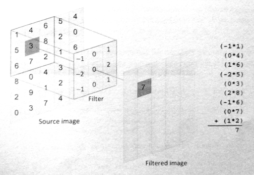
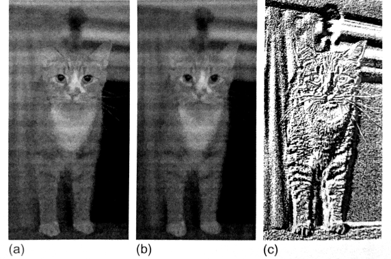

#4.4 圖像卷積

卷積在圖像處理中經常用到，其會根據每個像素周圍的像素點修改當前像素點的值。卷積核就是用來描述每個像素點如何被附近的像素點所影響。例如，模糊濾波中，使用平均的權重方式來進行計算，這樣差異比較大的像素點會減少差異。對於相同的圖像，如果想要做不同的操作，我們只需要變化濾波器即可，這樣就能做銳化、模糊、邊緣增強和圖像壓花。

卷積算法會遍歷原始圖像中的每一個像素點。對於每個原始像素點，濾波器中心點會為於像素點的上方，然後將中心點以及周圍點的像素點與濾波器中對應的權重值相乘。然後將乘積的結果值相加後，產生出新的值作為輸出。圖4.3中就展示了該算法的具體過程。



圖4.3 卷積濾波如何對原圖像進行處理。

圖4.4a是原始圖，圖4.4b中展示了原圖經過模糊濾波後的結果，圖4.4c展示了經過一個壓花濾波器處理後的結果。



圖4.4 不同卷積核對同一張圖像進行處理：a)為原圖；b)為模糊處理；c)為壓花處理。

程序清單4.6中使用`C/C++`實現了一個串行的卷積操作。兩層外部循環以遍歷原始圖像中所有的像素點。每一次濾波操作，每個原始點和其附近的點都要參與計算。需要注意的是，濾波器有可能訪問到原始圖像之外的區域。為瞭解決這個問題，我們在最內層循環中添加了四個顯式的檢查，當濾波器對應的座標點位於原始圖像之外，我們將使用與其最近的原始圖像的邊界值。


/* Iterate over the rows of the source image */
for (int i = 0; i < rows; i++)
{
  /* Iterate over the columns of the source image */
  for (int j = 0; j < cols; j++)
  {
    /* Reset sum for new source pixel */
    int sum = 0;
    
    /* Apply the filter to the neighborhood */
    for (int k = -halfFilterWidth; k <= halfFilterWidth; k++)
    {
      for (int l = -halfFilterWidth; l <= halfFilterWidth; l++)
      {
        /* Indices used to access the image */
        int r = i+k;
        int c = j+l;
        
        /* Handle out-of-bounds locations by clamping to  
         * the border pixel*/
        r = (r < 0)? 0 : r;
        c = (c < 0)? 0 : c;
        r = (r >= rows)? rows - 1: r;
        c = (c >= cols)? cols - 1: c;
        
        sum += Image[r][c] *
               Filter[k+halfFilterWidth][l+halfFilterWidth];
      }
    }
    
    /* Write the new pixel value */
    outputImage[i][j] = sum;
  }
}


程序清單4.6 圖像卷積的串行版本

OpenCL中，使用圖像內存對象處理卷積操作要比使用數組內存對象更有優勢。圖像採樣方式會自動對訪問到圖像之外的區域進行處理(類似於上節圖像轉換中所提到的)，並且訪問緩存中二維數據在硬件上也會有所優化(將會在第7章討論)。

OpenCL上實現卷積操作幾乎沒有什麼難度，並且寫法類似於卷積操作的C版本。OpenCL版本中，我們為每一個輸出的像素點創建了一個工作項，使用並行的方式將最外層兩個循環去掉。那麼每個工作項的任務就是完成最裡面的兩個循環，這兩個循環完成的就是濾波操作。前面的例子中，讀取源圖像數據，需要配置一個OpenCL結構體，來指定數據的類型。本節的例子中，將繼續使用`read_imagef()`。完整的內核代碼將在代碼清單4.7中展示。


__kerenl
void convolution(
  __read_only image2d_t inputImage,
  __write_only image2d_t outputImage,
  int rows,
  int cols,
  __consetant float *filter,
  int filterWidth,
  sampler_t sampler)
{
  /* Store each work-item's unique row and column */
  int column = get_global_id(0);
  int row = get_global_id(1);
  
  /* Half the width of the filter is needed for indexing
   * memory later */
  int halfWidth = (int)(filterWidth / 2);
  
  /* All accesses to images return data as four-element vectors
   * (i.e., float4), although only the x component will contain
   * meaningful data in this code */
  float4 sum = {0.0f,0.0f,0.0f,0.0f};
  
  /* Iterator for the filter */
  int filterIdx = 0;
  
  /* Each work-item iterates around its local area on the basis of the
   * size of the filter*/
  int2 coords; // Coordinates for accessing the image
  
  /* Iterate the filter rows*/
  for (int i = -halfWidth; i <= halfWidth; i++)
  {
    coords.y = row + i;
    /* Iterate over the filter columns */
    for (int j = -halfWidth; j <= halfWidth; j++)
    {
      coords.x - column + 1;
      
      /*Read a pixel from the image. A single-channel image
       * stores the pixel in the x coordinate of the reatured
       * vector. */
      pixel = read_imagef(inputImage, sampler, coords);
      sum.x += pixel.x * filter[filterIdx++];
    
    }
  }
  
  /* Copy the data to the output image */
  coords.x = column;
  coords.y = row;
  write_imagef(outputImage, coords, sum);
}


程序清單4.7 使用OpenCL C實現的圖像卷積

訪問圖像總會返回具有四個值的向量(每個通道一個值)。前節例子中，我們加了`.x`來表示只需要返回值的第一個元素。本節例子中，我們會申明pixel(圖像訪問之後返回的值)和sum(存儲結果數據，以拷貝到輸出圖像)，其類型都為float4。當然，我們僅對x元素進行累加濾波像素值的計算(第45行)。

卷積核很適合放置到常量內存上，因為所有工作項所要用到的卷積核都是相同的。簡單的添加關鍵字"__costant"在函數參數列表中(第7行)，用於表示卷積核存放在常量內存中。

之前的例子中，我們是直接在內核內部創建了一個採樣器。本節例子中，我們將使用主機端API創建一個採樣器，並將其作為內核的一個參數傳入。同樣，本節例子中我們將使用C++ API(C++採樣器構造函數需要相同的參數)。

主機端創建採樣器的API如下所示：

```c++
cl_sampler clCreateSampler(
  cl_context context,
  cl_bool normalized_coords,
  cl_addressing_mode addressing_mode,
  cl_filter_mode filter_mode,
  cl_int *errcode_ret)
```

其C++ API如下所示：
```c++
cl::Sampler::Sampler(
  const Context &context,
  cl_bool normalized_coords,
  cl_addressing_mode addressing_mode,
  cl_filter_mode filter_mode,
  cl_int *err = NULL)
```

使用C++創建採樣器的方式如下所示：

```c++
cl::Sampler sampler = new cl::Sampler(context, CL_FALSE, CL_ADDRESS_CLAMP_TO_EDGE, CL_FILTER_NEAREST);
```

圖像旋轉例子中，採樣器使用非標準化座標。這裡我們將展示不同於內部使用時的另外兩個採樣器參數：濾波模式將使用最近的像素點的值，而非進行差值後的值(CL_FILTER_NEAREST)，並且尋址模式將在訪問到圖像區域之外時，將其值置為最接近的圖像邊界值(CL_ADDRESS_CLAMP_TO_EDGE)。(注：這裡要注意一下CL和CLK的區別。CL開頭的是使用在主機端API上，CLK則直接使用在OpenCL內核代碼中。)

使用C++ API，創建二維圖像使用image2D類進行創建，創建這個類需要一個ImageFormat對象作為參數。C API則不需要圖像描述器的傳入。

Image2D和ImageFormat的構造函數如下：

```c++
cl::Image2D::Image2D(
  Context& context,
  cl_mem_flags flags,
  ImageFormat format,
  ::size_t width,
  ::size_t height,
  ::size_t row_pitch = 0,
  void *host_ptr = NULL,
  cl_int *err = NULL)
  
cl::ImageFormat::ImageFormat(
  cl_channel_order order,
  cl_channel_type type)
```

這樣我們就能創建卷積所需要的輸入和輸出圖像，其調用方式如下所示：

```c++
cl::ImageFormat imageFormat = cl::ImageFormat(CL_R, CL_FLOAT);
cl::Image2D inputImage = cl::Image2D(context, CL_MEM_READ_ONLY, imageFormat, imageCols, imageRows);
cl::Image2D outputImage = cl::Image2D(context, CL_MEM_WRITE_ONLY, imageFormat, imageCols, imageRows);
```

使用C++ API實現圖像卷積的主機端代碼在代碼清單4.8中展示。主程序中，使用了一個5x5的高斯模糊濾波核用於卷積處理。


#define __CL_ENABLE_EXCEPTIONS

#include <CL/cl.hpp>
#include <fstream>
#include <iostream>
#include <vector>

#include "utils.h"
#include "bmp_utils.h"

static const char *inputImagePath = "../../Images/cat.bmp";

static float gaussianBlurFilter[25] = {
  1.0f / 273.0f, 4.0f / 273.0f, 7.0f / 273.0f, 4.0f / 273.0f, 1.0f / 273.0f,
  4.0f / 273.0f, 16.0f / 273.0f, 26.0f / 273.0f, 16.0f / 273.0f, 4.0f / 273.0f,
  7.0f / 273.0f, 26.0f / 273.0f, 41.0f / 273.0f, 26.0f / 273.0f, 7.0f / 273.0f,
  4.0f / 273.0f, 16.0f / 273.0f, 26.0f / 273.0f, 16.0f / 273.0f, 4.0f / 273.0f,
  1.0f / 273.0f, 4.0f / 273.0f, 7.0f / 273.0f, 4.0f / 273.0f, 1.0f / 273.0f
};
static const int gaussianBlurFilterWidth = 5;

int main()
{
  float *hInputImage;
  float *hOutpueImage;
  
  int imageRows;
  int imageCols;
  
  /* Set the filter here */
  int filterWidth = gaussianBlurFilterWidth;
  float *filter = gaussianBlurFilter;
  
  /* Read in the BMP image */
  hInputImage = readBmpFloat(inputImagePath, &imageRows, &imageCols);
  
  /* Allocate space for the output image */
  hOutputImage = new float[imageRows * imageCols];
  
  try
  {
    /* Query for platforms */
    std::vector<cl::Platform> platforms;
    cl::Platform::get(&platdorms);
    
    /* Get a list of devices on this platform */
    std::vector<cl::Device> device;
    platforms[0].getDevices(CL_DEVICE_TYPE_GPU, &devices);
    
    /* Create a context for the devices */
    cl::Context context(devices);
    
    /* Create a command-queue for the first device */
    cl::CommandQueueu queue = cl::CommandQueue(context, devices[0]);
    
    /* Create the images */
    cl::ImageFormat imageFormat = cl::ImageFormat(CL_R, CL_FLOAT);
    cl::Image2D inputImage = cl::Image2D(context, CL_MEM_READ_ONLY, 
        imageFormat, imageCols, imageRows);
    cl::Image2D outputImage = cl::Image2D(context, 
        CL_MEM_WRITE_ONLY,
        imageFormat, imageCols, imageRows);
        
    /* Create a buffer for the filter */
    cl::Buffer filterBuffer = cl::Buffer(context, CL_MEM_READ_ONLY,
    filterWidth * filterWidth * sizeof(float));
    
    /* Copy the input data to the input image */
    cl::size<3> origin;
    origin[0] = 0;
    origin[1] = 0;
    origin[2] = 0;
    cl::size<3> region;
    region[0] = 0;
    region[1] = 0;
    region[2] = 0;
    queue.enqueueWriteImage(inputImage, CL_TRUE, origin, region,
    0, 0,
    hInputImage);
    
    /* Copy the filter to the buffer*/
    queue.enqueueWriteBuffer(filterBuffer, CL_TRUE, 0,
    filterWidth * filterWidth * sizeof(float), filter);
    
    /* Create the sampler */
    cl::Sampler sampler = cl::Sampler(context, CL_FALSE,
    CL_ADDRESS_CLAMP_TO_EDGE, CL_FILTER_NEAREST);
    
    /* Read the program source */
    std::ifstream sourceFile("image-convolution.cl");
    std::string sourceCode(std::istreambuf_iterator<char>(sourceFile),
    (std::istreambuf_iterator<char>()));
    
    cl::Program::Source source(1,
      std::make_pair(sourceCode.c_str(),
      sourceCode.length() + 1));
      
    /* Make program form the source code */
    cl::Program program = cl::Program(context, source);
    
    /* Create the kernel */
    cl::Kernel kernel(program, "convolution");
    
    /* Set the kernel arguments */
    kernel.setArg(0, inputImage);
    kernel.setArg(1, ouputImage);
    kernel.setArg(2, filterBuffer);
    kernel.setArg(3, filterWIdth);
    kernel.setArg(4, sampler);
    
    /* Execute the kernel */
    cl::NDRange global(imageCols, imageRows);
    cl::NDRange local(8, 8);
    queue.enqueueNDRangeKernel(kernel, cl::NullRange, global,
    local);
    /* Copy the output data back to the host */
    queue.enqueueReadImage(outputImage, CL_TRUE, origin, region,
    0, 0,
    hOutputImage);
    
    /* Save the output BMP image */
    writeBmpFloat(hOutputImage, "cat-filtered.bmp", imageRows, imageCols, inputImagePath);
  }
  catch(cl::Error error){
    std::cout << error.what() << "(" << error.err() << ")" << std::endl;
  }
  
  free(hInputImage);
  delete hOutputImage;
  return 0;
}


程序清單4.8 圖像卷積主機端完整代碼

