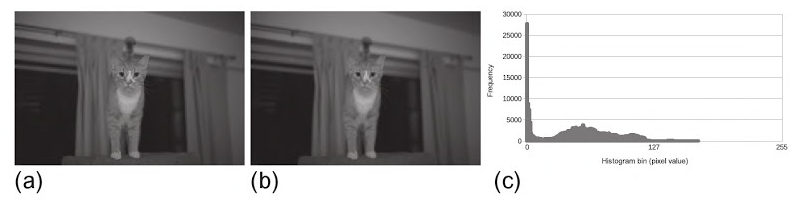

#4.4 生產者-消費者

很多OpenCL應用中，前一個內核的輸出可能就會作為下一個內核的輸入。換句話說，第一個內核是**生產者**，第二個內核是**消費者**。很多應用中生產者和消費者是併發工作的，生產者只將產生的數據交給消費者。OpenCL 2.0中提供管道內存對象，用來幫助生產者-消費者這樣的應用。管道所提供的潛在功能性幫助，無論生產者-消費者內核是串行執行或併發執行。

本節中，我們將使用管道創建一個生產者-消費者應用，其中生產者和消費者分別用內核構成，這兩個內核使用的是本章前兩個例子：卷積和直方圖。卷積內核將會對圖像進行處理，然後使用管道將輸出圖像傳入直方圖內核中(如圖4.5所示)。為了描述額外的功能，展示管道如何使用處理單元提高應用效率。本節的例子我們將使用多設備完成。卷積內核將執行在GPU設備上，直方圖內核將執行在CPU設備上。多個設備上執行內核可以保證兩個內核能夠併發執行，其中管道就用來傳輸生產者需要的數據(且為消費者需要的數據)。對於管道對象的詳細描述將在第6章展開。那麼現在，讓我們來了解一下本節例子的一些基本需求。

管道內存中的數據(稱為packets)組織為先入先出(FIFO)結構。管道對象的內存在全局內存上開闢，所以可以被多個內核同時訪問。這裡需要注意的是，管道上存儲的數據，主機端無法訪問。

內核中管道屬性可能是隻讀(__read_only)或只寫(__write_only)，不過不能是讀寫。如果管道對象沒有指定是隻讀或只寫，那麼編譯器將默認其為只讀。管道在內核的參數列表中，通過使用關鍵字`pipe`進行聲明，後跟數據訪問類型，和數據包的數據類型。例如，`pipe __read_only float *input`將會創建一個只讀管道，該管道中包含的數據為單精度浮點類型。



圖4.5 生產者內核將濾波後生成的像素點，通過管道傳遞給消費者內核，讓消費者內核產生直方圖：(a)為原始圖像;(b)為濾波後圖像;(c)為生成的直方圖。

為了訪問管道，OpenCL C提供內置函數`read_pipe()`和`write_pipe()`：

```c++
int read_pipe(pipe gentype p, gentype *ptr);
int write_pipe(pipe gentype p, const gentype *ptr);
```

當一個工作項調用`read_pipe()`(程序清單4.10，第16行)，一個包將從管道p中讀取到ptr中。如果包讀取正常，該函數返回0；如果管道為空，則該函數返回一個負值。`write_pipe()`(程序清單4.9，第50行)與讀取類似，會將ptr上的包寫入到管道p中。如果包寫入正常，該函數返回0；如果管道已滿，則該函數返回一個負值

程序清單4.9和4.10展示了我們應用中內核的實現。當我們指定目標消費者內核運行在CPU時，那麼只有一個工作項去創建直方圖。同樣，當我們顯式的指定一個CPU，我們需要之間將直方圖的結果存放在全局內存中(第8章將對這樣的權衡做更細化的討論)。


__constant sampler_t sampler = 
  CLK_NORMALIZED_COORDS_FALSE |
  CLK_FILTER_NEAREST          |
  CLK_ADDRESS_CLAMP_TO_EDGE;
  
__kernel
void producerKernel(
  image2d_t __read_only inputImage,
  pipe __write_only float *outputPipe,
  __constant float *filter,
  int filterWidth)
{
  /* Store each work-item's unique row and column */
  int column = get_global_id(0);
  int row = get_global_id(1);
  
  /* Half the width of the filter is needed for indexing
   * memory later*/
  int halfWidth = (int)(filterWidth / 2);
  
  /* Used to hold the value of the output pixel */
  float sum = 0.0f;
  
  /* Iterator for the filter */
  int filterIdx = 0;
  
  /* Each work-item iterates around its local area on the basis of the
   * size of the filter */
  int2 coords; // Coordinates for accessing the image
  
  /* Iterate the filter rows */
  for (int i = -halfWidth; i <= halfWidth; i++)
  {
    coords.y = row + i;
    /* Iterate over the filter columns */
    for (int j = -halfWidth; j <= halfWidth; j++)
    {
      coords.x = column + j;
      
      /* Read a pixel from the image. A single channel image
       * stores the pixel in the x coordinate of the returned
       * vector. */
      float4 pixel;
      pixel = read_imagef(inputImage, sampler, coords);
      sum += pixel.x * filter[filterIdx++];
    }
  }
  
  /* Write the output pixel to the pipe */
  write_pipe(outputPipe, &sum);
}


程序清單4.9 卷積內核(生產者)


__kernel
void consumerKernel(
  pipe __read_only float *inputPipe,
  int totalPixels,
  __global int *histogram)
{
  int pixelCnt;
  float pixel;
  
  /* Loop to process all pixels from the producer kernel */
  for (pixelCnt = 0; pixelCnt < totalPixels; pixelCnt++)
  {
    /* Keep trying to read a pixel from the pipe
     * until one becomes available */
    while(read_pipe(inputPipe, &pixel));
    
    /* Add the pixel value to the histogram */
    histogram[(int)pixel]++;
  }
}


程序清單4.10 卷積內核(消費者)

雖然，存儲在管道中的數據不能被主機訪問，不過在主機端還是需要使用對應的API創建對應的管道對象。其創建API如下所示：

```c++
cl_pipe clCreatePipe(
  cl_context context,
  cl_mem_flags flags,
  cl_uint pipe_packet_size,
  cl_uint pipe_max_packets,
  const cl_pipe_properties *properties,
  cl_int *errcode_ret)
```

我們需要考慮兩個內核不是併發的情況；因此，我們就需要創建足夠大的管道對象能存放下圖像元素數量個包：

```c++
cl_mem pipe = clCreatepipe(context, 0, sizeof(float), imageRows * imageCols, NULL, &status);
```

利用多個設備的話，就需要在主機端多加幾步。當創建上下文對象時，需要提供兩個設備(一個CPU設備，一個GPU設備)，並且每個設備都需要有自己的命令隊列。另外，程序對象需要產生兩個內核。加載內核是，需要分別入隊其各自的命令隊列：生產者(卷積)內核需要入隊GPU命令隊列，消費者(直方圖)內核需要入隊CPU命令隊列。完整的代碼在程序清單4.11中。


/* System includes */
#include <stdio.h>
#include <stdlib.h>
#include <string.h>

/* OpenCL includes */
#include <CL/cl.h>

/* Utility functions */
#include "utils.h"
#include "bmp-utils.h"

/* Filter for the convolution */
static float gaussianBlurFilter[25] = {
  1.0f / 273.0f, 4.0f / 273.0f, 7.0f / 273.0f, 4.0f / 273.0f, 1.0f / 273.0f,
  4.0f / 273.0f, 16.0f / 273.0f, 26.0f / 273.0f, 16.0f / 273.0f, 4.0f / 273.0f,
  7.0f / 273.0f, 26.0f / 273.0f, 41.0f / 273.0f, 26.0f / 273.0f, 7.0f / 273.0f,
  4.0f / 273.0f, 16.0f / 273.0f, 26.0f / 273.0f, 16.0f / 273.0f, 4.0f / 273.0f,
  1.0f / 273.0f, 4.0f / 273.0f, 7.0f / 273.0f, 4.0f / 273.0f, 1.0f / 273.0f
};
static const int filterWidth = 5;
static const int filterSize = 25 * sizeof(float);

/* Number of histogram bins */
static const int HIST_BINS = 256;

int main(int argc, char *argv[])
{
  /* Host data */
  float *hInputImage = NULL;
  int *hOutputHistogram = NULL;
  
  /* Allocate space for the input image and read the
   * data from dist */
  int imageRows;
  int imageCols;
  hInputImage = readBmpFloat("../../Images/cat.bmp", &imageRows, &imageCols);
  const int imageElements = imageRows * imageCols;
  const size_t imageSize = imageElements * sizeof(float);
  
  /* Allocate space for the histogram on the host */
  const int histogramSize = HIST_BINS * sizeof(int);
  hOutputHistogram = (int *)malloc(histogramSize);
  if (!hOutputHistogram){ exit(-1); }
  
  /* Use this to check the output of each API call */
  cl_int status;
  
  /* Get the first platform */
  cl_platform_id platform;
  status = clGetPlatformIDs(1, &platform, NULL);
  check(status);
  
  /* Get the devices */
  cl_device_id devices[2];
  cl_device_id gpuDevice;
  cl_device_id cpuDevice;
  status = clGetDeviceIDs(platform, CL_DEVICE_TYPE_CPU, 1, &gpuDevice, NULL);
  status = clGetDeviceIDs(platform, CL_DEVICE_TYPE_GPU, 1, &cpuDevice, NULL);
  check(status);
  devices[0] = gpuDevice;
  devices[1] = cpuDevice;
  
  /* Create a context and associate it with the devices */
  cl_context context;
  context = clCreateContext(NULL, 2, devices, NULL, NULL, &status);
  check(status);
  
  /* Create the command-queues */
  cl_command_queue gpuQueue;
  cl_command_queue cpuQueue;
  gpuQueue = clCreateCommandQueue(context, gpuDevice, 0, &status);
  check(status);
  cpuQueue = clCreateCommandQueue(context, cpuDevice, 0, &status);
  check(status);
  
  /* The image desriptor describes how the data will be stored
   * in memory. This descriptor initializes a 2D image with no pitch*/
  cl_image_desc desc;
  desc.image_type = CL_MEM_OBJECT_IMAGE2D;
  desc.image_width = imageCols;
  desc.image_height = imageRows;
  desc.image_depth = 0;
  desc.image_array_size = 0;
  desc.image_row_pitch = 0;
  desc.image_slice_pitch = 0;
  desc.num_mip_levels = 0;
  desc.num_samples = 0;
  desc.buffer = NULL;
  
  /* The image format descibes the properties of each pixel */
  cl_image_format format;
  format.image_channel_order = CL_R; // single channel
  format.image_channel_data_type = CL_FLOAT;
  
  /* Create the input image and initialize it using a
   * pointer to the image data on the host. */
  cl_mem inputImage;
  inputImage = clCreateImage(context, CL_MEM_READ_ONLY, &format, &desc, NULL, NULL);
  
  /* Create a buffer object for the ouput histogram */
  cl_mem ouputHistogram;
  outputHisrogram = clCreateBuffer(context, CL_MEM_WRITE_ONLY, &format, &desc, NULL, NULL);
  
  /* Create a buffer for the filter */
  cl_mem filter;
  filter = clCreateBuffer(context, cl_MEM_READ_ONLY, filterSize, NULL, &status);
  check(status);
  
  cl_mem pipe;
  pipe = clCreatePipe(context, 0, sizeof(float), imageRows * imageCols, NULL, &status);
  
  /* Copy the host image data to the GPU */
  size_t origin[3] = {0,0,0}; // Offset within the image to copy from
  size_t region[3] = {imageCols, imageRows, 1}; // Elements to per dimension
  status = clEnqueueWriteImage(gpuQueue, inputImage, CL_TRUE, origin, region, 0, 0, hInputImage, 0, NULL, NULL);
  check(status);
  
  /* Write the filter to the GPU */
  status = clEnqueueWriteBuffer(gpuQueue, filter, CL_TRUE, 0, filterSize, gaussianBlurFilter, 0, NULL, NULL);
  check(status);
  
  /* Initialize the output istogram with zeros */
  int zero = 0;
  status = clEnqueueFillBuffer(cpuQueue, outputHistogram, &zero, sizeof(int), 0, histogramSize, 0, NULL, NULL);
  check(status);
  
  /* Create a program with source code */
  char *programSource = readFile("producer-consumer.cl");
  size_t programSourceSize = strlen(programSource);
  cl_program program = clCreateProgramWithSource(context, 1, (const char**)&programSource, &programSourceLen, &status);
  check(status);
  
  /* Build (compile) the program for the devices */
  status = clBuildProgram(program, 2, devices, NULL, NULL, NULL);
  if (status != CL_SUCCESS)
  {
    printCompilerError(program, gpuDevice);
    exit(-1);
  }
  
  /* Create the kernel */
  cl_kernel producerKernel;
  cl_kernel consumerKernel;
  producerKernel = clCreateKernel(program, "producerKernel", &status);
  check(status);
  consumerKernel = clCreateKernel(program, "consumerKernel", &status);
  check(status);
  
  /* Set the kernel arguments */
  status = clSetKernelArg(producerKernel, 0, sizeof(cl_mem), &inputImage);
  status |= clSetKernelArg(producerKernel, 1, sizeof(cl_mem), &pipe);
  status |= clSetKernelArg(producerKernel, 2, sizeof(int), &filterWidth);
  check(status);
  
  status |= clSetKernelArg(consumerKernel, 0, sizeof(cl_mem), &pipe);
  status |= clSetKernelArg(consumerKernel, 1, sizeof(int), &imageElements);
  status |= clSetKernelArg(consumerKernel, 2, sizeof(cl_mem), &outputHistogram);
  check(status);
  
  /* Define the index space and work-group size */
  size_t producerGlobalSize[2];
  producerGlobalSize[0] = imageCols;
  producerGlobalSize[1] = imageRows;
  
  size_t producerLocalSize[2];
  producerLocalSize[0] = 8;
  producerLocalSize[1] = 8;
  
  size_t consumerGlobalSize[1];
  consumerGlobalSize[0] = 1;
  
  size_t consumerLocalSize[1];
  consumerLocalSize[0] = 1;
  
  /* Enqueue the kernels for execution */
  status  = clEnqueueNDRangeKernel(gpuQueue, producerKernel, 2, NULL, producerGlobalSize, producerLocalSize, 0, NULL, NULL);
  
  status = clEnqueueNDRangeKernel(cpuQueue, consumerKernel, 2, NULL, consumerGlobalSize, consumerLocalSize, 0, NULL, NULL);
  
  /* Read the output histogram buffer to the host */
  status = clEnqueueReadBuffer(cpuQueue, outputHistogram, CL_TRUE, 0, histogramSize, hOutputHistogram, 0, NULL, NULL);
  check(status);
  
  /* Free OpenCL resources */
  clReleaseKernel(producerKernel);
  clReleaseKernel(consumerKernel);
  clReleaseProgram(program);
  clReleaseCommandQueue(gpuQueue);
  clReleaseCommandQueue(cpuQueue);
  clReleaseMemObject(inputImage);
  clReleaseMemObject(outputHistogram);
  clReleaseMemObject(filter);
  clReleaseMemObject(pipe);
  clReleaseContext(context);
  
  /* Free host resources */
  free(hInputImage);
  free(hOutputHistogram);
  free(programSource);
  
  return 0;
}


程序清單4.11 生產者-消費者主機端完整代碼