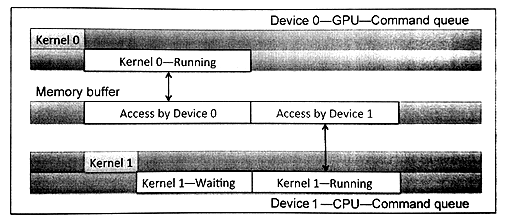
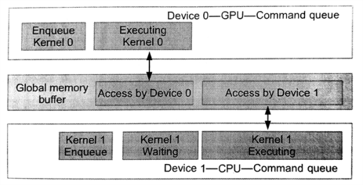
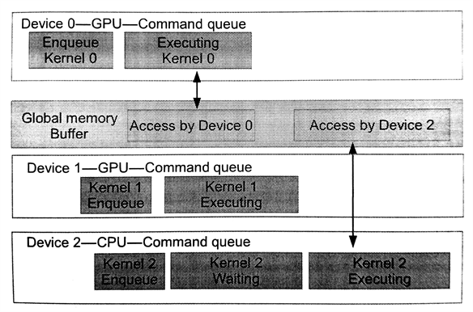

#5.2 多命令隊列

如果系統裡面有多個設備(比如，CPU和GPU，或多個GPU)，每一個設備都需要擁有自己的命令隊列。不過，OpenCL允許將多個命令隊列，通過同一個上下文對象映射到同一個設備上。這對重疊執行獨立或重疊命令，以及主機和設備通訊十分有用，並且這種方式是替代亂序隊列的一種策略。瞭解同步的能力，以及主機端和設備端的內存模型(第6章和第7章將詳細討論)對於管理多個命令隊列來說是非常必要。

圖5.1展示了一個OpenCL上下文中具有兩個設備的情況。為不同的設備創建不同的命令隊列。程序清單5.2中展示了創建兩個命令隊列的相關代碼。這裡尤其要注意的是，使用OpenCL事件對象進行同步時，只能針對同一上下文對象中的命令。如果是不同的上下文中的設備，那麼事件對象的同步功能將會失效，並且要在這種情況下共享數據，就需要在兩個設備之間進行顯式的拷貝。

圖5.1 同一上下文中創建多個不同設備的命令隊列。展示兩個不同的設備的執行情況，每個設備都具有自己的命令隊列。


// Obtain devices of both CPU and GPU types
cl_device_id devices[2];
err_code = clGetDeviceIDs(NULL, CL_DEVICE_TYPE_CPU, 1, &devices[0], NULL);
err_code = clGetDeviceIDs(NULL, CL_DEVICE_TYPE_GPU, 1, &devices[1], NULL);

// Create a context include two devices
cl_context ctx;
ctx = clCreateContext(0, 2, devices, NULL, NULL);

// Create queues to each device
cl_command_queue queue_cpu, queue_gpu;
queue_cpu = clCreateCommandQueueWithProperties(context, devices[0], 0, NULL);
queue_gpu = clCreateCommandQueueWithProperties(context, devices[1], 0, NULL);


程序清單5.2 使用同一個上下文為兩個不同設備創建命令隊列

OpenCL下的多設備編程，可以總結為以下的兩種情況(使用異構設備進行並行編程)：

- 流水執行：兩個或多個設備以流水方式工作，這樣就需要設備間互相等待結果，如圖5.2所示
- 單獨執行：這種方式就是每個設備各自做各自的任務，每個設備間的任務並無相關性，如圖5.3所示

代碼清單5.3中，等待列表執行的順序為：CPU需要等待GPU上的內核全部執行完成，才能執行自己的內核(圖5.2所示)。



cl_event event_cpu, event_gpu;

// Starts as soon as enqueued
err = clEnqueueNDRangeKernel(queue_gpu, kernel_gpu, 2, NULL, global, local, 0, NULL, &event_gpu);

// Starts after event_gpu is on CL_COMPLETE
err = clEnqueueNDRangeKernel(queue_cpu, kernel_cpu, 2, NULL, global, local, 0, NULL, &event_cpu);


程序清單5.3 使用流水方式進行多設備合作。CPU端的入隊命令要等到GPU上的內核完成後才能執行。

圖5.2 多個設備已流水方式工作，操作同一塊內存。CPU的隊列在等待GPU內核執行完成。

圖5.3 多個設備已並行的方式工作。這種情況下，GPU端的兩個命令隊列不會對同一塊內存進行操作，並單獨執行。這裡CPU隊列需要等待GPU上的任務全部完成，才能繼續進行。

代碼清單5.4展示了並行執行在不同設備上的內核。圖5.4展示了兩個GPU設備獨立執行自己的內核。CPU端的入隊命令要等到GPU上的內核完成後才能執行。



cl_event events_gpu[2];

// Both of the GPU devices can execute concurrently as soon as they have
// their respective data since they have no events in their wait-lists
err = clEnqueueNDRangeKernel(queue_gpu_0, kernel_gpu, 2, NULL, global, local, 0, NULL, &event_gpu[0]);
err = clEnqueueNDRangeKernel(queue_gpu_1, kerenl_gpu, 2, NULL, global, local, 0, NULL, &event_gpu[1]);

// The CPU will wait until both GPUs have finished executing their kernels.
// This requires two events in the CPU's wait-list
err = clEnqueueNDRangeKernel(queue_cpu, kernel_cpu, 2, NULL, global, local, 2, events_gpu, NULL);


程序清單5.4 多設備並行。CPU端的入隊命令要等到GPU上的內核完成後才能執行。