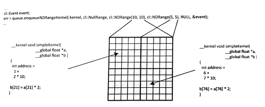
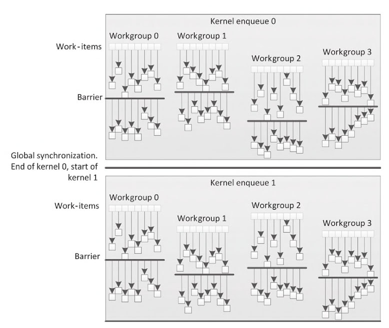

#5.3 內核執行域:工作項、工作組和NDRange

OpenCL的執行以內核為中心。內核代碼用來表示一個內核線程所要做的所有事情，其代碼由OpenCL C語言完成。內核代碼第一眼看去和C函數很類似：OpenCL C語言中，內核可以看成一個C函數。OpenCL內核具有一組參數列表，還有局部變量(類似Pthread中線程的局部變量)，以及標準的控制流。OpenCL內核的並行性，使其區別於C函數。我們在第3章僅用OpenCL工作項，並行化處理了一維空間中的大量數據。本節，我們將繼續延伸討論OpenCL執行模型中，工作項、工作組，以及NDRange的層級結構。

內核的執行需要運行時提供對應的啟動/調度接口，該函數就是`clEnqueueNDRangeKernel()`。內核在調度中會產生大量工作項，共同執行內核“函數體”。使用啟動接口之後，就會產生一個NDRange，其包括了內核執行的維度，以及每個維度上的工作項的數量。一個NDRange可以定義為1，2和3維，用於規劃處工作項的“格子圖”，工作項簡單和直接的結構非常適合並行執行。將OpenCL模型映射到硬件端，每個工作項都運行在一個硬件單元上，這個單元稱為“執行元素”(Processing element, PE)。OpenCL內核執行時，可能有多個工作項依次工作在同一個PE上。

內核內部調度中，每一個工作項都是獨立的。OpenCL中會有意限制工作項間的同步。鬆散的執行模型就允許OpenCL程序去擴展設備，可用於具有超級多核心的規模化設備。可擴展的設備通常都會抽象成一種層級結構——特別是內存系統——OpenCL也為其設備的執行空間提供了一種層級結構。

為了更加靈活的支持具有大量核心的設備，OpenCL將各維度上執行的工作項等分成多個工作組。每個工作組內，工作項可以進行某種程度上的交互。OpenCL標準定義了一個完整的工作項，可以併發執行在同一計算單元上。這種執行方式對於同步很重要。併發執行中的工作組內允許局部同步，不過也會對交互有所限制，以提高可擴展性。當應用中設計到需要在全局執行空間內，任務需要互相交互，那麼這種OpenCL並行應用無非是低效的。使用工作組會有更高率的交互，因為一個計算單元通常映射到一個核芯上，因此工作組內交互通常都是在一塊共享緩存或暫存存儲器上。

通過定義更多的工作組，OpenCL內核將擴展的越來越大，並且有越來越多的線程同時在設備上執行(有更多的工作項和工作組都會在同時執行在同一設備上)。OpenCL工作項可以看做win32或POSIX線程。OpenCL層級執行模式只需要一步，因為工作項都位於工作組內，這樣只需要將工作組(數量要少於工作項)映射到硬件線程的上下文中即可。這樣做和單指令多數據的執行很相似，就如向量執行N操作，只使用了N個時鐘週期。不過，OpenCL中子向量(工作項)可以擁有自己的程序計數器，直到同步點。用GPU來舉個例子，64個工作項(英偉達為32個)可以同時被一個硬件線程處理(在SIMD單元上)，這種方式在AMD的架構中就是大家熟知的波陣面(wavefront)；在英偉達架構中，則稱為線程束(warp)。即使每次執行的工作項數量被鎖定，不過不同的工作項可以執行內核內不同的指令序列。這種情況會發生在內核中有分支語句時，因為If-else語句具有不同分支，所以不同的工作項會對條件狀態進行評估後執行。不過工作項也有可能在同一波或束中，走進不同的分支中，這時硬件有責任將不該執行的分支結果捨棄。這種情況就是眾所周知的*分歧*(divergence)，這會極大影響內核執行的效率，因為工作項執行了冗餘的操作，並且這些操作的結果最後都要捨棄。

這樣的執行模型，就需要所有的工作項具有自己的程序計數器，這種方式要比顯式使用SIMD多媒體擴展流指令在x86的處理上簡單許多。因為SIMD的執行方式，需要注意給定的設備，瞭解對應設備支持的SSE版本，OpenCL的工作組尺寸通常是SIMD最大向量寬度的倍數。工作組尺寸查詢API為`clGetKernelWorkGroupInfo()`，需要CL_KERNEL_PREFERRED_WORK_GROUP_SIZE_MULTIPLE作為實參傳入**param_name**中。

OpenCL定義了一些內置函數，可以在內核內部獲取工作項在執行區域內的具體位置。這些函數通常都有一個維度參數，這裡定義為uint dimension。其值可以為0、1和2，可以通過維度的設置獲取NDRange參數在入隊時的設置：

- uint get_work_dime():返回入隊時所設定的工作維度數量
- size_t get_global_size(uint dimension):返回對應維度上的全局工作項數量
- size_t get_global_id(uint dimension):返回對應維度上對應全局工作項索引
- size_t get_local_size(uint dimension):返回對應維度上工作組的數量。如果內核所分配的工作項在工作組內數量不均勻，那麼剩餘工作組(之後章節中討論)將返回與均勻工作項不同的值
- size_t get_enqueued_local_size(uint dimension):返回對應維度上均勻區域內工作項數量
- size_t get_num_groups(uint dimension):返回當前工作項索引，以該工作項所屬組的起始位置為偏移
- size_t get_group_id(uint dimension):返回當前工作組的索引。也可通過獲取該工作組的第一個元素的全局索引，然後除以工作組的大小得到當前工作組索引

這裡展示一個簡單的OpenCL內核實例(程序清單5.5)，其輸入輸出均為二維數組。圖5.4展示了這段代碼的執行過程。對應每個像素的工作項，調用`get_global_id()`都會返回不同的數值。在這個簡單例子中，我們使用線性位置直接對二維數據結構進行映射。實際使用時，可能會有更加複雜的映射關係，根據輸入和輸出的結構，再加上算法實現，可以對數據進行處理。


__kernel void simpleKernel(
  __global float *a,
  __global float *b){
  
  int address = get_global_id(0) + get_global_id(1) * get_global_size(0);
  b[address] = a[address] * 2;
}


程序清單5.5 一個簡單的內核，將輸入的二維數組中的數據乘以2後，放入輸出數組中



圖5.4 執行程序清單5.5中的簡單內核。展示NDRange中不同區域工作項的具體工作。

之前版本的OpenCL中，會要求NDRange上所有維度上的工作項數量是工作組的整數倍。例如，一個NDRange的大小為800x600，其工作組的大小就不能為16x16，因為600無法整除16。實際編程時，為了程序執行的效率，通常會在執行時將不足的區域補足，這樣的話NDRange的區域要比實際處理的數據的空間大一些。當我們要使用16x16的工作組大小，我們需要將NDRange的設置擴大到800x608。由於有些工作項並未映射到數據集上，這就需要對這些工作項進行處理(比如：檢查工作項的索引，當發現該工作項沒有對應到數據集上時，立即返回)。不過，當工作組在執行的時候進行柵欄同步時，就需要組內所有工作項都到達柵欄處，這樣這種擴充的方式就無法正常工作了。為了緩解這一問題，OpenCL 2.0刪除了“各維度上的工作項數量需要是工作組的倍數”這一限制。另外，OpenCL 2.0為NDRange定義了“剩餘工作項”(*remainder work-groups*)，並且最後剩餘的工作組與開發者定義的工作組大小是完全不同的。比如，800x600的NDRange和16x16的工作組大小，那剩餘的工作組大小為16x8。`get_local_size()`返回工作組實際的大小，`get_enqueue_local_size()`返回剩餘的工作組大小。

OpenCL 2.0也提供了計算線性索引的內置函數，開發者不需要像使用之前版本那樣自己去計算線性索引值了。線性索引對於每個工作項來說是定義明確，且唯一的標識(這個線性索引與NDRange設置的維度數量或工作組大小無關)。`get_global_linear_id()`返回全局上的索引值，`get_local_linear_id()`返回局部上的索引值：

- size_t get_global_linear_id():返回工作項的全局線性索引
- size_t get_local_linear_id():返回工作項的組內線性索引

##5.3.1 同步

使用多個執行單元的時候，使用同步機制可以約束執行的順序。通常，OpenCL會有意的限制在不同執行單元間進行同步。這種方式會影響OpenCL的擴展性，不過OpenCL的目標是支持各種各樣的異構設備。例如，執行OpenCL程序的設備會自行管理線程，比如GPU；另外也有使用操作系統管理線程的設備，比如主流的x86 CPU。不使用同步，會讓程序的性能提升，不過會影響程序的正確性。對於一個x86線程來說，其會嘗試訪問信號量，如果該信號量不可用，則該線程阻塞；操作系統會在該線程執行之後，以及當程序資源不足需要釋放該線程的空間時，刪除該線程。對於GPU線程資源有限，GPU也會對有問題的線程使用同樣的策略。例如，執行階段移除一組線程束，而不釋放其使用的資源，這就會讓下一個線程束進行等待，這就如同x86線程中的信號量一樣，之前的線程不釋放該信號量，下一個線程則無法繼續進行，從而造成程序死鎖。

為了避免不必要的事情發生，OpenCL定義了阻塞式同步(例如：柵欄)，且只限於工作組內的工作項。第7章中，我們將看到OpenCL 2.0也可提供"上鎖-釋放"內存，用來約束使用原子操作和柵欄操作的順序。不過，其最終目的是為了能在更加廣泛的算法中，使用內存的順序約束來保證運行順序，而不是使用同步操作來約束執行順序。下一節中，將討論一些在工作組中的同步方式：柵欄和命令式同步。

##5.3.2 工作組柵欄

將柵欄設置到工作組內部時，需要所有工作項都到達該柵欄才能繼續下面的工作，否則任何線程都無法越過該柵欄，這是一種程序計數器級別的限制。不過，對於處於不同分支的工作項來說，其行為是未定義的：很多設備上，這將導致程序死鎖，因為工作組內的有線程並未到達柵欄處，所以其他線程只能進行等待。

圖5.5中展示了一個簡單OpenCL同步的例子。圖中，我們能看到每個工作組內都由8個工作項。OpenCL標準寬鬆的解釋下(並未限定硬件的具體實現)，工作項在工作組內的執行並非同時。當調用`work_group_barrier()`函數時，會讓提前到達的線程等待未到達對應位置的線程，直到所有線程到達該位置，則繼續進行下面的操作。不同的工作組中完成等待的時間都是相互獨立的。

內置函數`work_group_barrier()`的參數列表如下所示：

- void work_group_barrier(cl_mem_fence_flag flags)
- void work_group_barrier(cl_mem_fence_flag flags, memory_scope scope)



圖5.5 單內核執行時，使用柵欄方式進行組內工作項同步。全局同步在內核結束時完成，並且其保證所有工作項都完成了自己的工作，並且內存內容和期望的一致。

第7章中，我們將討論關於scope參數的更多細節(也會對flags參數做更多的討論)。不過，當柵欄操作完成時，flags參數就已足以決定對應的內存操作是否對組內其他工作項可見。

flags可以設置成的實參：

- CLK_LOCAL_MEM_FENCE：需要對於局部內存的所有訪問組內可見
- CLK_GLOBAL_MEM_FENCE：需要對全局內存的所有訪問組內可見
- CLK_IMAGE_MEM_FENCE：需要對圖像的所有訪問組內可見

接下來的例程中，我們可以看到工作項將數據搬運到局部內存中，每個工作項從數組中搬運一個數，其需要工作項的操作對其他所有工作項可見。為了達到這個目的，我們會調用`work_group_barrier()`，並傳入CLK_LOCAL_MEM_FENCE作為flags的實參。

內核間的調度，所有工作都可以保證操作完全完成，以及內存保證一致。下一個內核，以同樣的語義加載。假設我們入隊兩個內核0和1(如圖5.5)，這兩個內核為同一個內核對象，內核代碼和API調用在代碼清單5.6中展示，代碼行為和圖5.5一致。

這個例子中，我們可以看到，工作項只是簡單的將局部內存中相鄰的兩個數，進行簡單的操作。不過，在操作兩個相鄰數之前，需要保證這些用來運算的數據時可讀的。


//------------------------------
//  Relevant host program
//------------------------------

cl_mem input = clCreateBuffer(context, CL_MEM_READ_ONLY, 32 * sizeof(float), 0, 0);

cl_mem intermediate = clCreateBuffer(context, CL_MEM_READ_WRITE, 32 * sizeof(float), 0, 0);

cl_mem output = clCreateBuffer(context, CL_MEM_WRITE_ONLY, 32 * sizeof(float), 0, 0);

clEnqueueWriteBuffer(queue, input, CL_TRUE, 0, 32 * sizeof(float), (void *)hostInput, 0, NULL, NULL);

clSetKernelArg(kernel, 0, sizeof(cl_mem), (void *)&input);
clSetKernelArg(kernel, 1, sizeof(cl_mem), (void *)&intermediate);
clSetKernelArg(kernel, 2, 8 * sizeof(float), NULL);

size_t localws[1] = {8};
size_t globalws[1] = {32};

clEnqueueNDRangeKernel(queue, kernel, 1, NULL, globalws, localws, 0, NULL, NULL);

clSetKernelArg(kernel, 0, sizeof(cl_mem), (void *)&input);
clSetKernelArg(kernel, 1, sizeof(cl_mem), (void *)&intermediate);
clSetKernelArg(kernel, 2, 8 * sizeof(float), NULL);

clEnqueueNDRangeKernel(queue, kernel, 1, NULL, globalws, localws, 0, NULL, NULL);

clEnqueueReadBuffer(queue, output, CL_TRUE, 0, 32 * sizeof(float), (void *)&hostOutput, 0, NULL, NULL);

//------------------------------
//  Kernel
//------------------------------

__kernel void simpleKernel(
  __global float *a,
  __global float *b,
  __local float *localbuf){
  
  // Cache data to local memory
  localbuf[get_local_id(0)] = a[get_global_id(0)];
  
  // Wait until all work-items have read the data and
  // it becomes visible
  work_group_barrier(CLK_LOCAL_MEM_FENCE);
  
  // Perform the operation and output the data
  unsigned int otherAddress = (get_local_id(0) + 1) % get_local_size(0);
  b[get_global_id(0)] = localbuf[get_local_id(0)] + localbuf[otherAddress];
}


程序清單5.6 同一個命令隊列中入隊兩個內核

##5.3.3 內置工作組函數

OpenCL C編程語言在實現的時候，有很多內置函數是基於工作組的。例如柵欄操作，該內置函數需要工作組內所有的工作項，都到達指定位置後才能繼續運行。因此，當工作組中有條件塊時，就需要同一組中的所有工作項都執行相同的分支。

工作組評估函數也支持各種OpenCL C內置的數據類型，例如：half, int, uint, long , ulong, flaot和double。我們可以看到，在OpenCL標準中這些屬於都被gentype所替代，gentype用來表示在OpenCL C中所使用的通用數據。我們依據不同函數的功能將這些函數分成三類評估函數：

1. 謂詞評估函數
2. 廣播函數
3. 並行原語函數

##5.3.4 謂詞評估函數

謂詞評估函數評估工作組中的所有工作項，如果滿足相關的條件則返回一個非零值。函數聲明如下：

- int work_group_any(int predicate)
- int work_group_all(int predicate)

評估的工作組中有一個工作項滿足條件，則函數work_group_any()返回一個非零值。當評估的工作組中所有工作項滿足條件，則函數work_group_all()返回一個非零值。程序清單5.7中，展示了一個work_group_all()函數的使用示例：


__kernel void compare_elements(int *input, int *output){
  int tid = get_global_id(0);
  int result = work_group_all((input[tid] > input[tid +1 ]));
  output[tid] = result;
}


程序清單5.7 謂詞評估函數在OpenCL內核中的使用。

##5.3.5 廣播函數

廣播函數是將一個工作項的數據傳輸給工作組內其他的工作項。函數參數在維度上進行了重載：

- 一維：gentype work_group_broadcast(gentype x, size_t local_id)
- 二維：gentype work_group_broadcast(gentype x, size_t local_id_x, size_t local_id_y)
- 三維：gentype work_group_broadcast(gentype x, size_t local_id_x, size_t local_id_y, size_t local_id_z)

可以看出，函數用座標來標定對應的工作項，然後共享該工作項的數據x。該函數將廣播返回值到每個工作項上。

##5.3.6 並行原語函數

OpenCL支持兩類內置並行原語函數：歸約和掃描。這個函數會用在很多並行應用上，這兩個函數的實現都由設備供應商使用高性能代碼提供，這樣對於開發者來說會省去自己去優化的風險和工作量。函數聲明如下：

- `gentype work_group_reduce_<op>(gentype x)`
- `gentype work_group_scan_inclusive_<op>(gentype x)`
- `gentype work_group_scan_exclusive_<op>(gentype x)`

函數中的`<op>`可以替換為add，min或max。這樣就可以使用該函數找到局部數組的最大值，就如下面的代碼所示：

```c++
// float max:
max = work_group_reduce_max(local_data[get_local_id(0)]);
```

很多並行編程者對於前綴求和非常熟悉，前綴求和可以使用work_group_scan_inclusive_add()或work_group_scan_exclusive_add()實現。閉掃描和開掃描的不同在於，當前位置上的元素是否參與累加。閉掃描版本生成的數組會包含當前位置的元素。開掃描版本則不會包含當前位置的元素。每個工作項都可用該函數，且會在工作組內返回相關線性索引的值。

並行原語函數無法保證浮點數操作的順序，所以該函數未與浮點數相關聯。