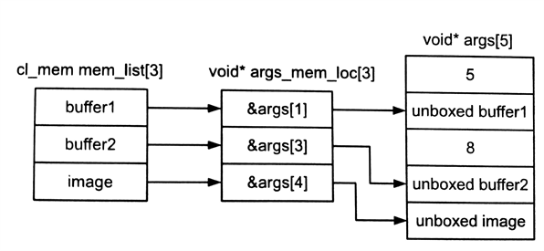

#5.4 原生和內置內核

OpenCL定義了兩種不需要cl_kernel對象的入隊執行機制，就是原生內核和內置內核。原生內核和內置內核是相互獨立的兩個概念。原生內核提供一種機制，將標準C函數(異構設備上)入隊執行。內置內核需要指定的設備，並且提供對應機制允許應用開發者啟動"特殊"的硬件加速模塊(有可能就是指定的設備)。

##5.4.1 原生內核

原生內核是一種回調的機制，其能更簡潔的集成進OpenCL的執行模型中。原生內核允許使用傳統編譯器去編譯C標準函數(與OpenCL不同)，並將編譯好的C函數在放入OpenCL的任務執行圖中，由事件來觸發下一個事件。原生內核可以在一個設備上入隊執行，並且與OpenCL內核共享內存對象。

原生內核與OpenCL內核的區別在於設置參數方面。原生內核使用對應的API進行入隊(clEnqueueNativeKernel())，將標準C函數通過指針的方式進行傳入。參數列表需要連同其大小，打包傳入設備。

```c++
cl_int
clEnqueueNativeKernel(
  cl_command_queue command_queue,
  void (CL_CALLBACK *user_func)(void *),
  void *args,
  size_t cb_args,
  cl_uint num_mem_objects,
  const cl_mem *mem_list,
  const void **args_mem_loc,
  cl_uint num_events_in_wait_list,
  const cl_event *event_wait_list,
  cl_event *event)
```

常規OpenCL內核可以將數組和圖像作為參數傳入，原生內核同樣可以使用對應的數組和圖像作為輸入。OpenCL中向原生內核傳遞參數完成後，會通過一種方式進行解包。可以通過設置mem_list的實參，向原生內核傳入一個內存對象鏈表；args_mem_loc參數存儲一個指針鏈表，用於存儲解包之後的內存對象。

為了更加形象的表達，代碼清單5.8中，我們使用了一個原生函數foo()，其參數鏈表中包含5個值，其中第0個參數存儲是5，第2個存儲是8；1,3參數是兩個數組對象；4參數是一個圖像對象(如圖5.6所示)。



// Native function that will be enqueued to device
void foo(void *args){

  ...
}

cl_command_queueu queue = clCreateCommandQueue(...);
cl_mem buffer1 = clCreateBuffer(...);
cl_mem buffer2 = clCreateBuffer(...);
cl_mem image = clCreateImage2D(...);

void *args[5] = {(void *)5, NULL, (void *)8, NULL, NULL, NULL};

num_mem_objects = 3;
cl_mem mem_list[3] = {buffer1, buffer2, image};
void *args_mem_loc[3] = {&args[1], &args[3], &args[4]};

clEnqueueNativeKernel(queue, foo, args, sizeof(args), num_mem_objects, mem_list, args_mem_loc, 0, NULL, NULL);


程序清單5.8 將原生foo()入隊



圖5.6 程序清單5.8中，使用clEnqueueNativeKernel()實例，展示內存對象和參數的對應關係

##5.4.2 內置內核

內置內核與設備是捆綁關係，其也不會在運行時由源碼進行構建。通常的內置內核會展示硬件對固定函數的加速能力，這個硬件可能是一種支持OpenCL的特殊嵌入式設備，或是自定義設備。內置內核屬於OpenCL定義之外的內容，因此內置內核實現的最總解釋權還在硬件供應商那裡。

作為OpenCL的擴展，Intel實現了運動估計的內置內核。該擴展利用了OpenCL擴展架構，對指定領域的功能進行加速，Intel所有支持OpenCL的設備都支持該功能(進行運動估計)。