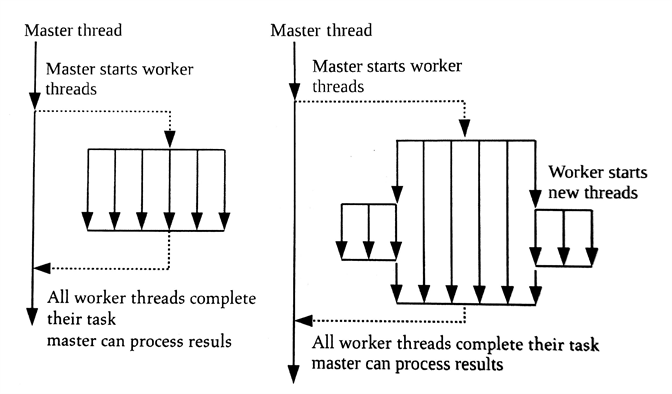

#5.5 設備端排隊

OpenCL 2.x版本之前的標準，只允許命令從主機端入隊。OpenCL 2.0去除了這個限制，並定義了設備端的命令隊列，其允許父內核直接將子內核入隊。

設備端任務隊列的好處是啟用了*嵌套並行機制*(nested parallelism)——一個並行程序中的某個線程，再去開啟多個線程[1]。嵌套並行機制常用於不確定內部某個算法要使用多少個線程的應用中。與單獨使用*分叉-連接*(fork-join)機制相比，嵌套並行機制中產生的線程會在其任務完成後銷燬。這兩種機制的區別如圖5.7所示：



圖5.7 單獨的"分叉-鏈接"的結果與嵌套並行機制的線程分佈對比

單獨調用的方式，執行完任務後，線程的生命週期就結束了。嵌套並行將會在任務執行中間產生更多的線程，並在某個子任務完成後結束線程。

嵌套循環適用於不規則或數據驅動的循環結構。數據驅動型算法有很多，這裡用一個比較常見的算法作為例子：廣度優先搜索算法(BFS)。廣度優先搜索算法從圖中的根節點開始訪問其相鄰的節點。之後，訪問到的節點，繼續訪問其附近的節點，直到所有節點都訪問到。當BFS算法並行時，被訪問的新頂點不知道應用何時開啟。設備端入隊允許開發者使用OpenCL內核實現嵌套並行，這樣的方式要比在主機端入隊合適的多。

總結一下設備端入隊的好處：

- 內核可以在設備端直接入隊。這樣就不需要同步，或與主機的交互，並且會隱式的減少數據傳輸
- 更加自然的表達算法。當算法包括遞歸，不規則循環結構，或其他單層並行是固定不均勻的，現在都可以在OpenCL中完美的實現
- 更細粒度的並行調度，以及動態負載平衡。設備能更好的相應數據驅動決策，以及適應動態負載

為了讓子內核入隊，內核對象需要調用一個OpenCL C內置函數`enqueue_kernel()`。這裡需要注意的是，每個調用該內置函數的工作項都會入隊一個子內核。該內置函數的聲明如下：

```c++
int
enqueue_kernel(
  queue_t queue,
  kernel_enqueue_flags_t flags,
  const ndrange_t ndrange,
  void (^block)(void))
```

和主機端的API一樣，其也需要傳遞一個命令隊列。flags參數用來執行子內核何時開始執行。該參數有三個語義可以選擇：

- CLK_ENQUEUE_FLAGS_NO_WAIT:子內核立刻執行
- CLK_ENQUEUE_FLAGS_WAIT_KERNEL:子內核需要等到父內核到到ENDED點時執行。這就意味著子內核在設備上運行時，父內核已經執行完成
- CLK_ENQUEUE_FLAGS_WAIT_WORK_GROUP:子內核必須要等到入隊的工作組執行完成後，才能執行。

需要注意的是，父內核可能不會等到子內核執行結束。一個父內核的執行狀態為"完成"時，意味著其本身和其子內核都完成。如果父子內核正確無誤的執行完成，那麼父內核會置為CL_COMPLETE。如果有子內核的程序計數器錯誤，或非正常終止，父內核的狀態會置為一個錯誤值(一個給定的負值)。

與clEnqueueNDRangeKernel()類似，`enqueue_kernel()`也需要使用NDRange來指定維度信息(傳遞給ndrange參數)。與主機端調用一樣，全局偏移和工作組數量是可選的。這時需要在內核上創建ndrange_t類型的對象來執行執行單元的配置，這裡使用到了一組內置函數：

```c++
ndrange_t ndrange_<N>D(const size_t global_work_size[<N>])

ndrange_t ndrange_<N>D(const size_t global_work_size[<N>], const size_t global_work_size[<N>])

ndrange_t ndrange_<N>D(const size_t global_work_size[<N>], const size_t global_work_size[<N>], const size_t local_work_size_[<N>])
```

其中`<N>`可為1,2和3。例如，創建一個二維的800x600的NDRange可以使用如下方式：

```c++
size_t globalSize[2] = {800, 600};
ndrange_t myNdrange = ndrange_2D(globalSize);
```

最終，enqueue_kernel()的最後一個參數block，其為指定入隊的內核。這裡指定內核的方式稱為“Clang塊”。下面兩節中將會更加詳細的對“如何利用設備入隊”進行討論，以及如何使用塊語法指定一個嵌套內核。

如主機端API一樣，enqueue_kernel()會返回一個整數，代表其執行是否成功。返回CLK_SUCCESS為成功，返回CLK_ENQUEUE_FAILURE則為失敗。編程者想要了解失敗入隊的更多原因的話，需要在clBuildProgram()傳入"-g"參數，或是clCompileProgram()調用會啟用細粒度錯誤報告，會有更加具體的錯誤碼返回，例如：CLK_INVALID_NDRANGE或CLK_DEVICE_QUEUE_FULL。

##5.5.1 創建一個設備端隊列

設備端隊列也需要使用clCreateCommandQueueWithProperties()在主機端進行創建。為了表明是為了設備端創建的命令隊列，properties中需要傳入CL_QUEUE_ON_DEVICE。另外，當一個設備端隊列創建之後，標準要求CL_QUEUE_OUT_OF_ORDER_EXEC_MODE_ENABEL也要傳入(使用亂序方式)，OpenCL 2.0中設備端隊列被定義為亂序隊列。這時命令隊列可以通過內核的參數傳入內核內，其對應的就是內核中的queue_t類型。代碼清單5.9中，展示了一個帶有隊列參數的內核。


// -----------------------------
// Relevant host program
// -----------------------------

// Specify the queue properties
cl_command_queue_properties properties = 
  CL_QUEUE_ON_DEVICE |
  CL_QUEUE_OUT_OF_ORDER_EXEC_MODE_ENABLE;
  
// Create the device-side command-queue
cl_command_queue device_queue;
device_queue = clCreateCommandQueueWithProperties(
  context,
  device,
  &proerties,
  NULL);
  
...

clSetKernelArg(kernel, 0, sizeof(cl_command)，&device_queue);

...

// -----------------------------
// Kernel
// -----------------------------

__kernel
void foo(queue_t myQueue, ...){
  ...
}


程序清單5.9 將設備端隊列作為參數設置到內核中

有另外一個可選的配置，CL_QUEUE_ON_DEVICE_DEFAULT可傳入clCreateCommandQueueWithProperties中，這樣產生的隊列默認為設備端可用隊列。對於編程者來說，這樣簡化了許多工作，因為默認隊列就可以在相關的內核使用內置函數，所以就不需要再將命令隊列作為參數傳入內核中了(可以通過內置函數get_default_queue()獲取隊列對象)。

##5.5.2 入隊設備端內核

當使用主機端API(clEnqueueNDRangeKernel())入隊內核執行命令之前，需要對內核進行參數的設置。設備端使用enqueue_kernel()將內核命令入隊前，是沒有設置參數的過程。不過，內核的參數還是要設置，那該如何是好呢？為了正確的執行內核，OpenCL選擇使用Clang塊語法進行參數設置。

Clang塊在OpenCL標準中，作為一種方式對內核進行封裝，並且Clang塊可以進行參數設置，能讓子內核順利入隊。Clang塊是一種傳遞代碼和作用域的方法。其語法與閉包函數和匿名函數類似。塊類型使用到一個結果類型和一系列參數類型(類似lambda表達式)。這種語法讓“塊”看起來更像是一個函數類型聲明。“^”操作用來聲明一個塊變量(block variable)(該塊用來引用內核)，或是用來表明作用域的開始(使用內核代碼直接進行聲明)。

代碼清單5.10中的簡單例子，用來表明塊語法的使用方式。


__kerenl
void child0_kernel(){
  printf("Child0: Hello, world!\n");
}

void child1_kernel(){
  printf("Child1: Hello, world!\n");
}

__kernel
void parent_kernel(){
  kernel_enqueue_flags_t child_flags = CLK_ENQUEUE_FLAGS_NO_WAIT;
  ndrange_t child_ndrange = ndrange_1D(1);
  
  // Enqueue the child kernel by creating a block variable
  enqueue_kernel(get_default_queue(), child_flags, child_ndrange, ^{child0_kernel();});
  
  // Create block variable
  void (^child1_kernel_block)(void) = ^{child1_kernel()};
  
  // Enqueue kernel from block variable
  enqueue_kernel(get_default_queue(), child_flags. child_ndrange, child1_kernel_block);
  
  // Enqueue kernel from a block literal
  // The block literal is bound by "^{" and "}"
  enqueue_kernel(get_default_queue(), child_flags, child_ndrange, ^{printf("Child2: Hello, world!\n");});
}


代碼清單5.10 一個用來展示Clang塊語法是如何使用的例子

代碼清單5.10中展示了三種設備端入隊的方式。不過，這裡的內核都沒有參數。塊語法是支持傳遞參數的。這裡將第3章的向量相加的內核借用過來：

```c++
__kernel
void vecadd(
  __global int *A,
  __global int *B,
  __global int *C){
  
  int idx = get_global_id(0);
  
  C[idx] = A[idx] + B[idx];
}
```

可以用這個內核來進行參數傳遞，我們可以將這個內核作為一個子內核進行入隊。程序清單5.11中展示瞭如何使用塊變量進行參數傳遞，程序清單5.12中使用了塊函數進行參數傳遞。注意程序清單5.11中的參數傳遞有些類似於標準函數的調用。不過，當我們使用塊函數的方式時，不需要顯式的傳遞參數。編譯器會為作用域創建一個新的函數域。全局變量可以使用綁定的方式，私有和局部數據就必須進行拷貝了。注意指向私有或局部地址的指針是非法的，因為當程序運行到工作組或工作項之外時，這些指針就會失效。不過，OpenCL也支持為子內核開闢局部內存，我們將會在後面討論這種機制。因為內核函數總是返回void，聲明塊時不需要顯式的定義。


__kernel
void child_vecadd(
  __global int *A,
  __global int *B,
  __global int *C){
  
  int idx = get_gloabl_id(0);
  
  C[idx] = A[idx] + B[idx];
}

__kernel
void parent_vecadd(
  __global int *A,
  __global int *B,
  __global int *C){
  
  kernel_enqueue_flags_t child_flags = CLK_ENQUEUE_FLAGS_NO_WAIT;
  ndrange_t child_ndrange = ndrange_1D(get_global_size(0));
  
  // Only enqueue one child kernel
  if (get_global_id(0) == 0){
  
    enqueue_kerenl(
      get_default_queueu(),
      child_flags,
      child_ndrange,
      ^{child_vecadd(A, B, C);}); // Pass arguments to child
  }
}


代碼清單5.11 使用塊語法傳遞參數


__kernel
void parent_vecadd(
  __global int *A,
  __global int *B,
  __global int *C){
  
  kernel_enqueue_flags_t child_flags = CLK_ENQUEUE_FLAGS_NO_WAIT;
  ndrange_t child_ndrange = ndrange_1D(get_global_size(0));
  
  // Only enqueue one child kernel
  if (get_global_id(0) == 0){
    
    // Enqueue kernel from block literal
    enqueue_kerenl(
      get_default_queueu(),
      child_flags,
      child_ndrange,
      ^{int idx = get_global_id(0);
        C[idx] = A[idx] + B[idx];});
  }
}


代碼清單5.12 使用作用域的方式

**動態局部內存**

使用主機端API設置內核參數，需要動態分配局部內存時，只需要使用clSetKernelArg()向內核該參數傳遞為NULL就好。設備端沒有類似的設置參數的機制，enqueue_kernel()有重載的函數：

```c++
int
enqueue_kerenl(
  queue_t queue,
  kernel_enqueue_flags_t flags,
  const ndrange_t ndrange,
  void (^block)(local void *, ...),
  uint size0, ...)
```

該函數可用來創建局部內存指針，標準中塊可以是一個可變長參數的表達式(一個可以接受可變長參數的函數)。其中每個參數的類型必須是`local void *`。注意，聲明中，函數列表可以被void類型替代。enqueue_kernel()函數同樣也是可變長的，末尾提供的數值是用來表示每個局部素組的大小。代碼清單5.13對向量相加的例子進行修改，用來展示如何使用塊語法，進行動態局部內存的分配。


// When a kernel has been defined like this, then it can be
// enqueued from the host as well as from the device
__kernel
void child_vecadd(
  __global int *A,
  __global int *B,
  __global int *C,
  __local int *localA,
  __local int *localB,
  __local int *localC){
  
  int idex = get_global_id(0);
  int local_idx = get_local_id(0);
  
  local_A[local_idx] = A[idx];
  local_B[local_idx] = B[idx];
  local_C[local_idx] = local_A[local_idx] + local_B[local_idx];
  C[idx] = local_C[local_idx];
}

__kernel
void parent_vecadd(
  __global int *A,
  __global int *B,
  __global int *C){
  
  kernel_enqueue_flags_t child_flags = CLK_ENQUEUE_FLAGS_NO_WAIT;
  ndrange_t child_ndrange = ndrange_1D(get_global_size(0));
  
  int local_A_mem_size = sizeof(int) * 1;
  int local_B_mem_size = sizeof(int) * 1;
  int local_C_mem_size = sizeof(int) * 1;
  
  // Define a block with local memeory for each
  // local memory argument of the kernel
  void (^child_vecadd_blk)(
    local int *,
    local int *,
    local int *) = 
    ^(local int *local_A,
      local int *local_B,
      local int *local_C){
      
      child_vecadd(A, B, C, local_A, local_B, local_C);
    };
  
  // Only enqueue one child kernel
  if (get_global_id(0) == 0){
    // Variadic enqueue_kernel function takes in local
    // memory size of each argument in block
    enqueue_kernel(
      get_default_queue(),
      child_flags,
      child_ndrange,
      child_vecadd_blk,
      local_A_mem_size,
      local_B_mem_size,
      lcoal_C_mem_size);
  }
}


代碼清單5.13 如何動態的為子內核動態分配局部內存

**使用事件強制依賴**

介紹設備端命令隊列時就曾說過，設備端命令隊列可以亂序的執行命令。這就暗示著設備端需要提供嚴格的依賴順序。在主機端將內核直接入隊，事件對象可以很好的指定依賴順序。這裡再次提供一個enqueue_kernel()的另一個重載版本。

```c++
int
enqueue_kenrel(
  queue_t queue,
  kernel_enqueue_flags_t flags,
  const ndrange_t ndrange,
  uint num_events_in_wait_list,
  const clk_event_t *event_wait_list,
  clk_event_t *event_ret,
  void (^block)(void))
```

讀者需要注意的是增加的三個參數：num_events_in_wait_list，event_wait_list和event_ret。與主機端API中事件相關的參數用法一樣。

事件版本當然也有局部內存的重載版本：

```c++
int
enqueue_kenrel(
  queue_t queue,
  kernel_enqueue_flags_t flags,
  const ndrange_t ndrange,
  uint num_events_in_wait_list,
  const clk_event_t *event_wait_list,
  clk_event_t *event_ret,
  void (^block)(local void *, ...),
  uint size0, ...)
```


__kernel
void child0_kernel(){
  printf("Child0: I will run first.\n");
}

__kernel
void child1_kernel(){
  printf("Child1: I will run second.\n");
}

__kernel
void parent_kernel(){
  kernel_enqueue_flags_t child_flags = CLK_ENQUEUE_FLAGS_NO_WAIT;
  ndrange_t child_ndrange = ndrange_1D(1);
  
  clk_event event;
  
  // Enqueue a kernel and initialize an event
  enqueue_kernel(
    get_default_queue(),
    child_flags,
    child_ndrange,
    0,
    NULL,
    &event,
    ^{child0_kernel();});
    
  // Pass the event as a dependency between the kernels
  enqueue_kernel(
    get_default_queue(),
    child_flags,
    child_ndrange,
    1,
    &event,
    NULL,
    ^{child1_kernel();});
    
  // Release the event. In this case, the event will be released
  // after the dependency is satisfied
  // (second kernel is ready to execute)
  release_event(event);
}


代碼清單5.14 設備端入隊時使用事件指定依賴關係

------

[1] J.Reinders. Intel Threading Building Blocks: Outfiting C++ for Multi-Core Processor Parallelism. O'Reilly Media, Inc., Sebastopol. 2007.