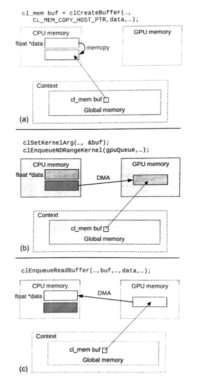
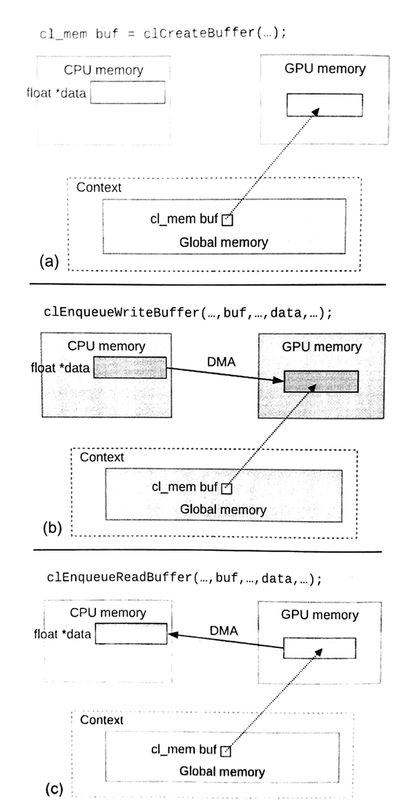
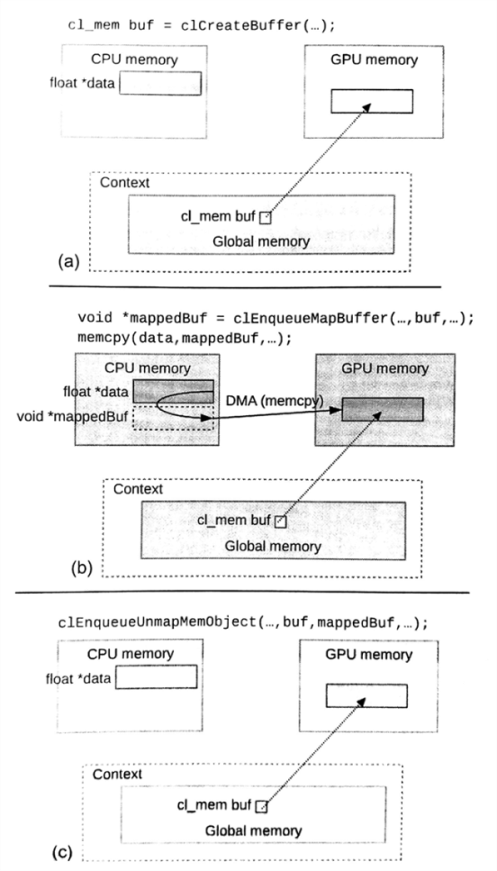

#6.2 內存管理

使用OpenCL主機端API創建內存對象，這些內存對象都在全局空間內分配，可以被上下文上中所有的設備使用。雖然，OpenCL中只設置了一塊全局內存，不過實際使用的很多異構系統中具有很多設備，這些設備對共享地址空間有嚴格的要求，並且可能不同設備的內存在物理設備上是分開的——比如CPU的內存和離散GPU的內存。這樣的話，在內核運行前，運行時可能就要將數據在各種設備的內存間進行拷貝。即使在共享內存系統中，數據不需要重複拷貝，不過內核所需要的數據還是要拷貝到設備的層級緩存中。當存在數據拷貝，那麼拷貝階段某一設備上的內存可能是不一致的，這種狀態的內存數據對於上下文中的其他設備是可見的。存在有潛在的拷貝和不一致狀態，那麼如何保證最後一次複製的數據就是我們期望的數據呢？

後面的章節中，我們將討論使用細粒度*共享虛擬內存*(SVM)的內存序和可見性。現在我們假設我們使用的內存對象是默認內存對象，即*非共享虛擬內存*(non-SVM)。當使用默認內存對象時，OpenCL鬆散的一致性模型不會讓多個內核對在同一時間，對同一個內存對象進行操作。沒有其他內核進行數據的修改，就保證了直到該內核執行完成，其他內核才能可見已經修改的內存。如果沒有這種機制，那麼運行時為一個內存對象創建了多個副本，兩個內核對裡面的內容進行修改，也就等同於對同一內存進行修改，那麼最後得到結果必然是其中一個內核的結果覆蓋另一個的結果；如果我們在讓另外一個內核再去修改這塊內存，那麼這種修改就是會導致未定義的行為。除了需要編程者對自己的程序負責，運行時也要保證正確的數據在正確的時間，出現在正確的位置。將鬆散的內存模型和運行時對內存管理的責任結合在一起，就能讓執行更加可移植，並且對編程者的影響降到最低。

另外，OpenCL標準的設計者也知道在，數據傳輸的低效，並且數據搬運會降低應用的性能。因此，OpenCL提供了一些命令，允許編程者設置“如何”，以及“在哪裡”開闢這段內存；以及“在哪裡”和“在何時”進行數據搬運。根據運行OpenCL系統的差別，不同方式分配方式和搬運方式對於應用的性能有很大的影響。下面兩節中，就來聊聊怎麼分配內存對象，以及轉移內存對象上的數據——基於數組對象(雖然我們使用數組對象來做例子，不過也可以對圖像對象進行相同的操作)。管道對象和數組與圖像對象不同，其數據不能在主機端進行直接訪問，所以就不存在搬運的問題。

##6.2.1 管理普通內存對象

回到內存對象的穿件，我們使用`clCreateBuffer()`，並傳入一系列flags，以及host_ptr。這裡在展示一些`clCreateBuffer()`的聲明：

```c++
cl_mem
clCreateBuffer(
  cl_context context,
  cl_mem_flags flags,
  size_t size,
  void *host_ptr,
  cl_int *errcode_ret)
```

通過flags傳入一些選項，就能告訴運行時應該“怎麼”和“在哪裡”分配該數組空間，並且host_ptr用來初始化數組對象，或將主機端的數據拷貝到內存對象中。本節將瞭解當沒有與分配相關的選項傳入flags時，內存對象時如何工作的。下節中將瞭解，編程者在設置這些分配選項時，內存如何在硬件上進行分配。

通常，OpenCL不會指定在某個物理存儲空間內分配內存對象——其將默認內存都看做"全局內存"。例如，運行時會決定是在CPU主存上分配內存，或是在離散GPU的內存上分配內存。這很像為數據創建多個空間，並且根據需要進行轉移最後的數據副本。

當創建一個對象時，可以讓主機端提供一個合法指針host_ptr用來初始化創建的內存對象，並且將CL_MEM_COPY_HOST_PTR作為實參傳入flags，這就指定了內存對象中的數據是從主機端進行拷貝得到。創建內存對象的過程不會產生對應的事件對象，我們可以假設內存對象是在拷貝完host_ptr上的數據後才返回的。圖6.1中展示運行時如何在數組對象創建和初始化、傳遞內核參數，以及從內存對象中讀回數據中，數據轉移的過程。



圖6.1 注意，運行時也直接在創建和初始化了設備端的內存對象(a)使用主機內存創建和初始化一個數組對象。(b)內核之前，隱式的將主機端的數據搬運到設備端。(c)顯式的將設備內存中的數據搬回主機端。

一般來說，從一個設備到另一個設備的轉移數據的效率很低——第8章中，我們將討論基於現代CPU和GPU，比較不同數據互傳方式的內存帶寬。為了讓編程者更高效的轉移數據，OpenCL提供了一些API(使用不同方式)專門用來進行數據搬移。其中最佳的選擇要依賴於所實現的算法，以及目標系統的特點。

第一組命令就是顯式的從主機端或設備端，將數據拷貝到設備端或主機端，其運行方式如圖6.2所示。這兩個命令為`clEnqueueWriteBuffer()`和`clEnqueueReadBuffer()`。`clEnqueueWriteBuffer()`的聲明如下：

```c++
cl_int
clEnqueueWriteBuffer(
  cl_command_queue command_queue,
  cl_mem buffer,
  cl_bool blocking_write,
  size_t offset,
  size_t size,
  const void *ptr,
  cl_uint num_events_in_wait_list,
  const cl_event *event_wait_list,
  cl_event *event)
```



圖6.2 數據搬運：顯式讀寫命令。(a)創建一個為初始化的內存對象。(b)內核執行之前，將主機端數據傳入設備端。(c)內核執行之後，將設備端數據傳回主機端。

`clEnqueueWriteBuffer()`和`clEnqueueReadBuffer()`的聲明很類似，除了使用blocking_write和blocking_read。聲明中可以看出，數據是在buffer和ptr之間進行傳輸。其中寫命令就將主機端的數據在設備端進行拷貝(在全局內存中進行備份)，並且讀命令就將設備端的數據在主機端進行拷貝。注意這裡需要有命令隊列參與。這樣就需要指定設備，對其內存副本進行初始化。當然，對於大多數應用的編程者，他們是知道數據要拷貝到哪個設備上去的，並且指定對應的命令讓運行時知道應該向哪個設備進行數據拷貝，從而就能避免多餘的拷貝過程。這種設計也讓運行時能更快的將相應的數據傳遞到對應的設備，以便在內核執行時供內核使用。

編程者可以通過設置offset和size，來決定從哪裡拷貝多少byte個數據。注意ptr是作為主機端讀或寫的起始地址，offset用來決定數組對象的起始地址，而ptr的初始地址則由編程者決定。

這種數據傳輸是可以是異步的。當使用異步方式調用`clEnqueueReadBuffer()`時，函數返回時我們無法知曉拷貝過程是否完成，直到我們通過同步機制——通過事件機制，或調用`clFinish()`。如果我們想在函數返回時就完成拷貝，則需要將CL_TRUE作為實參傳入blocking_write或blocking_read中。這樣，下面的代碼中A和B打印出來的將是兩個不同的結果(即使outputBuffer最終應該是這個結果)。對於C的打印是能確定從outputBuffer拷貝出來的結果。


int returnedArray[16];
cl_mem outputBuffer;
cl_event readEvent;

// Some code that fills the returned array with 0s and invokes kernels
// that generates a result in outputBuffer
printf("A: %d\n", returnedArray[3]);

clEnqueueReadBuffer(
  commandQueue,
  outputBuffer, /* buffer */
  CL_FALSE, /* nonblocking read*/
  0,
  sizeof(int) * 16,
  returnedArray, /* host ptr */
  0,
  0,
  &readEvent);
  
printf("B: %d\n", returnedArray[3]);
clWaitForEvents(1, &readEvnet);
printf("C: %d\n", returnedArray[3]);


同步對於OpenCL內存模型尤為重要。修改中的內存不保證可見，且不保證內存狀態的一致性，直到用一個事件來表明該命令結束(我們將在後面章節中討論SVM內存的不同)。主機指針和設備內存間的數據互傳，我們不能在拷貝的同時，對內存數據進行其他的操作，直到我們確定互傳完成。仔細閱讀過OpenCL標準文檔的同學可能會發現，與設備內存相關的是上下文對象，而非設備對象。通過`clEnqueueWriteBuffer()`入隊一個命令，直到其完成，過程中不能確定數據是否已經完全搬運到設備上，而能確定的是，主機端的數據已經開始進行轉移。

與其他API不同，數據互傳命令也可以指定為是同步的。我們只需要簡單的將之前的調用進行修改即可：

```c++
clEnqueueReadBuffer(
  commandQueue,
  outputBuffer,
  CL_TRUE, // blocking read
  0,
  sizeof(int) * 16，
  returnedArray,
  0,
  0,
  &readEvent);
```

這樣的調用，API需要保證設備端的數據完全傳回主機端後才進行返回，並且在返回之後，主機端才能對讀回的數據進行操作。

OpenCL提供了另一種命令進行主機和設備間的數據轉換——`clEnqueueMigrateMemObjects()`，用來從當前地址(無論主機還是設備)轉移到指定設備上。例如，如果一個數組創建和初始化使用的是CL_MEM_COPY_HOST_PTR時，可以調用`clEnqueueMigrateMemObjects()`顯式的將數據轉移到對應設備上。如果一個系統中有多個異構設備，那麼該API也能用來進行不同設備間的數據數據交互。注意設備間數據交互不是使用`clEnqueueReadBuffer()`和`clEnqueueWriteBuffer()`，只有設備和主機端的數據進行交互時，才會使用這兩個API。`clEnqueueMigrateMemObjects()`的聲明如下：

```c++
cl_int
clEnqueueMigrateMemObjects(
  cl_command_queue command_queue,
  cl_uint num_mem_objects,
  const cl_mem *mem_objects,
  cl_mem_migrationg_flags flags,
  cl_uint num_events_in_wait_list,
  const cl_event *event_wiat_list,
  cl_event *event)
```

與之前的數據傳輸命令不同，`clEnqueueMigrateMemObjects()`需要使用內存對象數組作為實參傳入，其可以通過一條命令轉移多個內存對象。如同所有`clEnqueue*`開頭的函數一樣，該函數也能產生事件對象，指定依賴關係。當事件對象的狀態設置為CL_COMPLETE時，代表著相對應的設備端內存，已經傳遞到參數中的command_queue命令隊列上了。

除了顯式告訴運行時進行數據轉移，該命令也可以進行更高效的隱式轉移。當編程者入隊該命令後，恰好設備端在執行的任務與該數據轉移命令沒有任何關係(例如，內核執行時不包括該數據轉移的內存)，數據轉移會在任務執行時進行，從而隱藏了傳輸的延遲。這種隱式傳遞的方式`clEnqueueReadBuffer()`和`clEnqueueWriteBuffer()`也適用。

對於轉移的內存對象，標準提供了一個標識：CL_MIGRATE_MEM_OBJECT_HOST。這個標識以為這告訴運行時，數據需要傳輸到主機端。如果設置該標識，那麼傳入的命令隊列對象，將被API忽略。

##6.2.2 管理帶有分配選項的內存對象

之前的章節中，我們討論的都是主機和設備端的數據互相進行拷貝，或轉移設備端的內存。那麼本章，我們將來討論一下，如何在主機端和設備端直接訪問物理上分離的內存區域。

OpenCL為程序員提供兩種直接訪問物理上分離的內存地址的方式，這兩種方式會在主機端產生映射，可供主機端直接使用。創建設備端內存時，將CL_MEM_ALLOCL_HOST_PTR作為實參傳入，運行時就會為主機端分配一個映射指針，供主機端代碼進行操作。而CL_MEM_USE_HOST_PTR則告訴運行時，直接使用host_ptr作為設備對象的空間。兩個選項代表著兩種不同的分配方式，而這兩個選項則是互斥的，不可用於同一個內存對象。注意這裡的CL_MEM_ALLOCL_HOST_PTR分配“可供主機端訪問的映射內存”，這個概念其實是模糊的，其可能是通過主存鏈接主處理器，也有可能是真的能將設備上的一段內存映射到主機端。

在分配內存對象時，CL_MEM_COPY_HOST_PTR可以和CL_MEM_ALLOC_HOST_PTR一起使用，這樣能創建映射到主機端的內存的同時，也能用主機端內存對內存對象進行初始化。不過，CL_MEM_COPY_HOST_PTR和CL_MEM_USE_HOST_PTR是不能同時使用的，因為在傳入host_ptr時，host_ptr是已經分配好的一段內存，CL_MEM_USE_HOST_PTR代表使用host_ptr作為設備端內存空間，其無法對自己進行初始化。

那麼有沒有一種選項組合，能完成內存數據在CPU端分配，並且設備可以直接對主機端數據進行訪問。答案是肯定的，“確實有”。實際上這種方式的訪存存在於一些系統中。一個系統中具有一個CPU和一個離散GPU，這種情況下GPU就需要通過PCIe總線對主存數據進行訪問。當設備能用這種方式直接訪問主機端內存，那麼這種數據通常被稱為*零拷貝*(zero-copy)數據。

雖然使用CL_MEM_USE_HOST_PTR或CL_MEM_ALLOC_HOST_PTR將在主機端創建零拷貝數據(但這並不是OpenCL標準顯式要求的)。當然，將CPU端的數據拷貝到設備端，供內核執行使用是最保險的。不過，這裡GPU訪問主機端內存，就像其訪問自己所屬的內存一樣。實際上，如果使用CL_MEM_ALLOC_HOST_PTR，在主機端上分配出的指針，僅為設備端內存的映射。OpenCL中對於CL_MEM_ALLOC_HOST_PTR的描述，是能創建可供主機端訪問的內存，並不是在主機端又分配了一段內存出來。

共享內存的系統或是單CPU環境中，使用CL_USE_HOST_PTR可能就沒有那些無謂的初始化拷貝，從而為應用用帶來更好的性能。例如，設想將CPU作為設備，在CPU上執行內核：如果不指定CL_MEM_USE_HOST_PTR，應用將會另外開闢一段空間用來存放數據的副本。同樣的情況也會出現在共享內存處理器上，比如加速處理單元(APU)。如果CPU和GPU共享同一塊內存，那麼在APU上是不是也要使用CL_MEM_USE_HOST_PTR呢？這個問題很難回答，因為這設計到相關內容的優化，這裡只能說具體問題具體分析了。

APU的例子中，OpenCL運行時或設備端驅動，使用指定的分配標誌，可能會對實際設備進行訪存優化(例如：緩存與非緩存)；或是有另外的性能考量，例如*非一致內存訪問*(UNMA, nonuniform memory access)。APU上使用OpenCL時，CL_MEM_USE_HOST_PTR可能會將內存分配在高速緩存上，並且完全連續。這將導致GPU訪存效率降低，因為GPU先要確定CPU緩存訪問的優先級。APU上進行編程時，編程者需要了解不同的選項所創建出來的內存有何不同。

CL_MEM_USE_HOST_PTR和CL_MEM_ALLOC_HOST_PTR都能創建出主機端能夠訪問的數據，OpenCL也提供了一種映射機制，能夠直接操作主機端或設備端數據，而無需顯式使用API進行讀取和寫入。與`clEnqueueReadBuffer()`拷貝數據的方式不同，這裡的映射實現並非意味著進行了拷貝。有了這種機制，零拷貝內存才算完美實現。設備端在修改零拷貝內存的過程對主機不可見，直到其完成修改才再對主機可見。

調用`clEnqueueMapBuffer()`即可對一個內存對象進行設備端的映射：

```c++
void *
clEnqueueMapBuffer(
  cl_command_queue command_queue,
  cl_mem buffer,
  cl_bool blocking_map,
  cl_map_flags map_flags,
  size_t offset,
  size_t size,
  cl_uint num_events_in_wait_list,
  const cl_event *event_wait_list,
  cl_event *event,
  cl_int *errcode_ret)
```

調用`clEnqueueMapBuffer()`時，其會返回一個可供主機端訪問內存的指針。當`clEnqueueMapBuffer()`產生的事件對象的狀態為CL_COMPLETE時，意味著主機端可以安全使用返回指針，進行數據訪問。與`clEnqueueWriteBuffer()`和`clEnqueueReadBuffer()`相同，`clEnqueueMapBuffer()`也可以設置同步方式，將CL_TRUE作為實參傳入blocking_map時，函數將在主機端可以安全使用訪存指針時，將產生的指針返回。

`clEnqueueMapBuffer()`還有一個map_flags，這個標識可以設置的實參有：CL_MAP_READ，CL_MAP_WRITE和CL_MAP_WRITE_INVALIDATE_REGION。CL_MAP_READ，主機只能對這塊映射內存進行讀取；CL_MAP_WRITE和CL_MAP_WRITE_INVALIDATE_REGION都表示主機端只能對該指針內容進行修改。CL_MAP_WRITE_INVALIDATE_REGION是帶有優化的選項，其會指定整個區域將會被修改或者忽略，並且運行時在其修改完之前不會對中間值進行映射。這種方式就無法保證數據的一致性狀態，而運行時對於內存區域的潛在訪問要快於CL_MAP_WRITE。

當主機端對映射數據修改完畢，其需要進行反映射API的調用。反映射時需要將制定內存對象和映射出的指針傳入該API。`clEnqueueUnmapMemObject()`的聲明如下：

```c++
cl_int
clEnqueueUnmapMemObject(
  cl_command_queue command_queue,
  cl_mem memobj,
  void *mapped_ptr,
  cl_uint num_events_in_wait_list,
  const cl_event *event_wait_list,
  cl_event *event)
```

反映射時需要將內存對象本身和映射指針傳入該API中。如其他數據管理命令一樣，當API產生的事件對象的狀態為CL_COMPLETE時，則代表數據更新完成。與其他API不同`clEnqueueUnmapMemObject()`沒有阻塞參數。圖6.3展示了一個內存對象從映射到反映射的過程。如果內存對象在設備端修改的時候進行映射，讓主機端讀取上面的數據，這種情況會引發一些未定義行為；反之亦然。



圖6.3 內存對象的映射和反映射。(a)創建一個未初始化的設備端內存對象。(b)將該內存對象映射到主機端。(c)將該映射的內存對象反映射。

本節我們一直在討論內存的標誌，對應標誌的實際行為，很大程度上還是依賴於指定硬件上的相關實現。為了給編程者在分配內存上的一些建議，我們將簡要的描述一下AMD旗下的設備是如何處理這些標誌的。默認的內存對象(並未提供任何標誌)將直接在設備端分配。當提供CL_MEM_COPY_HOST_PTR或CL_MEM_USE_HOST_PTR標誌時，如果設備端支持虛擬內存，那麼這塊內存將創建為主機端的頁鎖定內存(不可分頁)，並且也能被設備作為零拷貝內存直接訪問。如果設備不支持虛擬內存，那麼就會像默認內存對象一樣，在設備端創建內存。當編程者希望將數據分配在設備端，且能讓主機端直接訪問該內存的話，AMD提供了一種供應商指定擴展的標誌——CL_MEM_USE_PERSISTENT_MEM_AMD。當在AMD設備上使用了該標誌，則可以在設備端分配內存，且主機端可以直接訪問。


