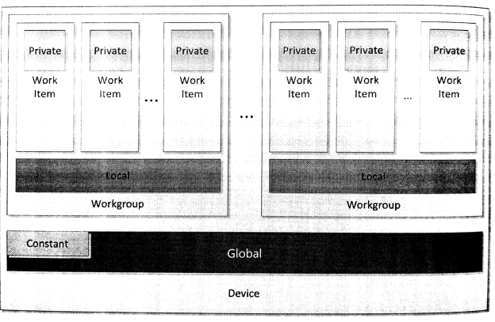

#第7章 OpenCL設備端內存模型

設備端內存模型定義了OpenCL應用中工作項的內存空間，這部分空間供內核執行使用。內存模型也定了一致性內存，可供工作項使用。本章會對每種內存空間進行詳細的討論，聊一下各個內存對象所對應的內存空間，也順便介紹一下同步和內存序。

OpenCL設備上，內存空間被分成四種類型：

1. 全局內存
2. 局部內存
3. 常量內存
4. 私有內存

OpenCL內存空間分佈如圖7.1所示。第2章我們討論過，OpenCL是為了更加廣闊的結構進行設計。對內存模型的分級，使得OpenCL程序對架構的利用率更高。每種內存內存空間在實際硬件上的映射，非常影響程序執行效率。不管在硬件上是如何進行映射，對於編程者來說，內存空間都是分開的。此外，如圖7.1所示，本地內存和私有內存用來區分工作項和工作組。當使用這種方式對“可編程的鬆散內存一致模型”進行分層時，使用便籤式內存可使得程序更加高效。如我們看到的大多GPU設備一樣，都有和x86架構一樣的內存一致性系統。

圖7.1 OpenCL設備端的內存空間分佈

內核函數中的函數參數和局部變量默認都在私有內存中存儲。指針參數放置的位置就沒有那麼固定了，其取決於數據從哪來，或哪裡是用到這些數據。指針本身的地址則毫無疑問的存儲在私有內存中。如果通過指針指定數據，那麼內存地址將嚴格分離。將一個地址空間的數據強制轉換成另一地址的數據，這樣做是非法的，因為這樣做的話必然會在全局可訪問的地址上創建一個內存副本，或是使用編譯器在某塊地址空間內創建一份數據副本，這在實際中是無法完成的。不過，本章我們將介紹OpenCL 2.0新添加的統一地址空間，其能在某些條件下推斷出可訪問的地址空間。圖像也可以使用統一地址空間，所以我們也會在討論統一地址空間時討論圖像。

詳細討論這些內存之前，後續幾節將大致描述一下工作項同步和通訊的能力。瞭解了這些能力，對於我們討論各個內存空間的特性很有幫助。

