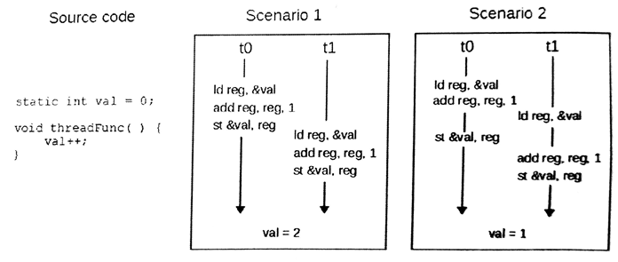

#7.1 同步和交互

介紹主機端內存模型時，我們提到過，當內核在對內存進行修改時，不能保證主機端可見的數據的狀態。同樣，當一個工作項對地址中的數據進行修改時，其他工作項可見的數據狀態是不確定的。不過，OpenCL C(結合內存模型)提供一些同步操作以保證內存的一致性，例如：執行柵欄、內存柵欄和原子操作。層級的一致性描述如下：

- 工作項內部，內存操作的順序可預測：對於同一地址的兩次讀寫將會被硬件或編譯器重新排序。特別是對於圖像對象的訪問，即使被同一工作項操作，同步時也需要遵循“讀後寫”的順序。
- 原子操作、內存柵欄或執行柵欄操作能保證同一工作組中的兩個工作項，看到的數據一致。
- 原子操作、內存柵欄或執行柵欄操作能保證工作組的數據一致。不同工作組的工作項無法使用柵欄進行同步。

##7.1.1 柵欄

工作組中，編程者需要使用柵欄對工作組中的所有工作項進行同步，要使用的內置函數為work_group_barrier()。其有兩個重載版本：

```c++
void
work_group_barrier(
  cl_mem_fence_flags flags)
  
void
work_group_barrier(
  cl_mme_fence_flags flags,
  memory_scope scope)
```

柵欄要求工作組中的所有工作項都要達到指定位置，才能繼續下面的工作。這樣的操作能保證工作組內的數據保持一致(比如：將全局內存上的一個子集數據傳輸到局部內存中)。其中flags用來指定需要使用柵欄來同步的內存類型。其有三個選項：CLK_LOCAL_MEM_FENCE、CLK_GLOBAL_MEM_FENCE和CLK_IMAGE_MEM_FENCE，這三個選項分別對應能被整個工作組訪問到的三種不同內存類型：局部內存、全局內存和圖像內存。

第二版work_group_barrier()也可以指定內存範圍。其結合flags可以進行更加細粒度的數據管理。scope有兩個有效參數：memory_scope_work_group和memory_scope_device。當將memory_scope_work_group和CLK_GLOBAL_MEM_FENCE一起使用時，柵欄則能保證所有工作組中每個工作項在到達同步點時，可以看到其他所有工作項完成的數據。當將memory_scope_device和CLK_GLOBAL_MEM_FENCE一起使用時，柵欄則能保證內存可被整個設備進行訪問。CLK_LOCAL_MEM_FENCE只能和memory_scope_work_group一起使用，其只能保證工作組內的數據一致，無法對該工作組之外的工作項做任何保證。

##7.1.2 原子操作

基於C/C++11標準，OpenCL 2.0也更新了原子操作。並且新加入的操作，不僅可以進行原子操作，還可以用來做同步。原子性能保證一系列內存操作(比如：讀改寫)，且不需要其他工作項和主機的參與，就能直接修改某個內存的數據。當原子操作用來做同步，那麼就需要對特定的變量進行訪問(稱為同步變量)，這個變量就屬於內存一致性模型的執行部分。原子操作也有多種方式，包括原子“讀改寫”，原子加載和原子存儲。

我們之前提到過，原子操作可以保證內存的某些不一致狀態不對其他線程可見——不過，這給共享內存和併發編程就是帶來了一些問題。試想，當有兩個線程嘗試對同一個變量進行加法操作。線程0需要讀取內存中的數據，然後對數值進行加法操作，最後寫回原始內存中。線程1執行加法計算的過程也是一樣的。圖7.2就展示了同樣是兩個線程對同一變量進行加法操作，最後會得到不同的結果。這中問題就稱為*數據競爭*(data race)。即使在單核機器上，也會有數據競爭的存在，比如線程0打斷或搶佔了正在執行操作的時間片。



圖7.2 對同一變量的進行加法操作，所導致的數據競爭。最終數據的結果依賴於不同線程執行的順序。

因此，就需要原子加載和原子存儲操作來為數據競爭做一決斷。C/C++11標準與OpenCL標準很像，不會保證任何加載和存儲操作是絕對原子的。試想這樣一種情形，將存儲64位的操作分成兩個指令執行。當第一個指令完成時，第二個指令還沒有執行，在某些情況下是沒有問題的。如果這時出現了另外一個線程，該線程執行一個加載操作，如果第二個存儲指令還未完成，那麼該線程所讀取到高或第32位就不是最新的值。這樣的讀取方式顯然是荒謬的，並且會得到與期望不符的結果。實際上，大多數結構中都會提供不同粒度的原子操作，來保證加載和存儲數據的一致性(通常需要內存對齊在同一緩存行上)。不過，對於可移植代碼來說，共享內存上的任何操作都不能認為是原子的。

原子操作在OpenCL 2.0標準做了相當多的修改。OpenCL C語言定義了與基本類型相關的原子類型，其支持整型和單精度浮點類型：

```
atomic_int
atomic_uint
atomic_float [1]
```

如果設備支持64bit原子擴展，那麼就需要添加一些原子類型：

```
atomic_long
atomic_ulong
atomic_double
atomic_size_t
atomic_intptr_t
atomic_uintptr_t
atomic_ptrdiff_t
```

64位原子指針類型只針對能夠使用64位地址空間的計算設備。

OpenCL C語言定義了很多的原子操作。浮點操作只支持“比較後交換”類型的原子操作(比如，atomic_exchange())。算法中的一些操作，以及一些位運算中，需要調用“同步後修改”原子函數。其聲明類型如下所示：

```c++
C atomic_fetch_<key>(volatile A *object, M operand)
```

其中key可以替換成add, sub, or, xor, and, min和max。object傳入的是原子類型的指針，operand傳入的是要進行操作的數值。返回值C是非原子版的A，其值是在對M操作之前A內存中的具體數值。這裡來舉個原子操作的例子，當要在一個共享項中比較最小值時，我們先定義一個最小值atomic_int curMin，和一個新的值int myMin。那麼就可以寫成如下形式：

```c++
int oldMin = atomic_fetch_min(&curMin, myMin);
```

執行完成後，新的最小值將存在curMin中。是否接收返回值是可選的，不接收返回值會有潛在的性能提升。一些GPU架構中，例如：原子操作執行在內存系統中的硬件單元上。因此，在這種分層內存上原子操作很快就能執行完成。不過，如果需要使用返回值的話，通常需要將原始值從內存中讀取出來，這就需要增加成千上萬個時鐘延遲。

內存模型的章節中對原子操作進行討論，是因為其能進行內存同步，保證內存的一致性。不管原子操作什麼時候執行，編程者都有能力指定該原子操作是否附帶有同步功能，作為獲取操作或釋放操作。使用這種方式允許工作項能夠控制可見數據訪問，這樣就能做到工作項間的通訊，而2.0之前的OpenCL標準是無法完成這項操作的。

-------

[1] atomic_float 類型只支“比較後交換”類型的原子操作，不支持“同步後修改”類型操作(詳見7.7.1節)