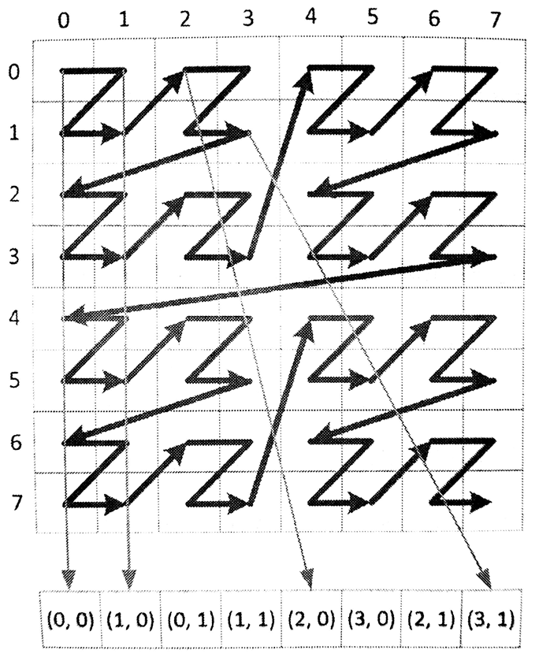

#7.2 全局內存

OpenCL C中使用類型修飾符__global(或global)描述的指針就是全局內存。全局內存的數據可以被執行內核中的所有工作項(比如：設備中的計算單元)所訪問到。不同類型的內存對象的作用域是不同的。下面的小節中，將詳細討論每種全局內存對象。

##7.2.1 數組

__global可以用來描述一個全局數組。數組中可以存放任意類型的數據：標量、矢量或自定義類型。無論數組中存放著什麼類型的數據，其是通過指針順序的方式進行訪問，並且執行內核可以對數組進行讀寫，也可以設置成針對內核只讀或只寫的數組。

數組數據和C語言的數組幾乎沒有任何區別，C語言怎麼使用的，就可以在OpenCL內核代碼中怎麼使用：

```c++
float a[10], b[10];
for (int i = 0; i < 10; ++i){
  *(a + 1) = b[i];
}
```

上面的例子中，通過數組a和b的指針對其內容進行訪問。其中尤其重要的是，其中內存以連續的方式順序開闢，a數組中第i個元素可以表示為a[i]，其指針地址為a+i。我們可以使用sizeof()操作來計算數組中元素的大小，然後計算對應指針的偏移，以便將指針從一種類型轉換成另一種類型。底層代碼中，指針轉換是相當有用的方式，對於OpenCL這種以C語言驅動的標準來說，也自然會支持這種方式。

下面的例子展示瞭如何在OpenCL內核代碼中，使用數組對象支持自定義類型：

```c++
typedef struct AStructure{
  float a;
  float b;
}AStructure;

__kernel void aFunction(
  __global AStructure *inputOutputBuffer){

  __global AStructure *inputLocation =
    inputOutputBuffer + get_global_id(0);
  __global AStructure *outputLoacation =
    inputOutputBuffer + get_global_size(0) + get_global_id(0);

  outputLoacation->a = inputLocation->a * -1;
  outputLoacation->b = (*inputLocation).b + 3.f;
}
```


##7.2.2 圖像

圖像對象也會在全局內存上開闢，其與數組不同，其不能映射成一個指針。圖像對象維度有一維、二維和三維，其分別對應圖像類型image1d_t、image2d_t和image3d_t。OpenCL 2.0之前的標準，只允許圖像對象只讀或只寫，無法在內核中同時進行圖像的讀和寫的操作。這樣的設計是因為GPU硬件支持高速緩存和高速濾波器。從2.0標準開始，支持對對同一圖像對象的讀和寫。

圖像對象是不透明的內存對象。雖然我們可以根據座標對數據進行訪問，但是我們無法知道其在內存上的相對位置。實際內存上，看上去在圖像上相鄰的兩個點，可能在物理地址上距離很遠。這樣的特性，使得圖像對象更適合進行參數化的讀取，而非直接通過指針獲取對應位置的數據，因此OpenCL中提供了一些內置函數，用來獲取圖像數據。對於讀取圖像的內置函數有：read_imagef()、read_imagei()和read_imageui()，分別可讀取單浮點、整型和無符號整型數據。每個圖像讀取函數都具有三個參數：圖像對象、圖像採樣器和座標位置。

可以傳入整型和浮點型座標值。返回值通常是具有四個元素的矢量。例如，下面讀取二維浮點數據的函數聲明：

```c++
float4
read_imagef(
  image2d_t image,
  sampler_t samper,
  int2 coord)

float4
read_imagef(
  image2d_t image,
  sampler_t samper,
  float2 coord)
```

注意這裡傳入的座標使用的是int2和float2類型。因為指定的二維圖像類型，image2d_t。對於一維圖像類型，傳入int和float類型的座標即可。對於三維圖像類型，需要傳入int4和float4類型的數據，其中最後一個分量不會是用到(譯者注：在OpenCL中type3類型其實均是由type4類型表示)。

如果圖像數據不足四個通道，那麼大多數圖像類型將返回0，用來表示未使用的顏色通道，返回1代表著alpha(透明度)通道。例如，讀取單通道圖像(CL_R)，那麼返回的float4類型中就會是這樣(r, 0.0, 0.0, 1.0)。

讀取函數的第二個參數是採樣器。其表示硬件或運行時系統如何看待圖像對象。創建採樣器對象可以在內核端創建sampler_t類型對象，也可以在主機端使用`clCreateSampler()`API進行創建。下面就是使用常量聲明的採樣器：

```c++
__constant sampler_t sampler =
  CLK_NORMALIZED_COORDS_FALSE |
  CLK_FILTER_NEAREST          |
  CLK_ADDRESS_CLAMP;

__kernel void samplerUser(
  __read_only image2d_t sourceImage,
  __global float *outputBufffer){

  float4 a = read_imagef(
    sourceImage,
    sampler,
    (float2)(
      (float)(get_global_id(0)),
      (float)(get_global_id(1))));

  outputBuffer[get_global_id(1) * get_global_size(0) + get_global_id(0)] = a.x + a.y + a.z + a.w;
}
```

採樣器對象決定了如何對圖像對象進行尋址，以及相應的濾波模式，並且決定了傳入的座標是否進行歸一化。

指定歸一化座標(CLK_NORMALIZED_COORDS_TRUE)就是告訴採樣器在對應維度的[0,1]之間對圖像進行尋址。使用非歸一化(CLK_NORMALIZED_COORDS_FALSE)則直接使用傳入的座標在對應維度上進行尋址。

尋址模式用來解決當採樣器採樣到圖像之外的範圍時，應該返回何值。這對於一些不想進行邊緣判斷編程者來說，使用標誌指定如何處理這種“越界訪問”會很方便(比如:在進行卷積操作時，就會訪問到圖像之外的區域)。CLK_ADDRESS_CLAMP[1]會將超出部分截斷，將返回一個邊界值；CLK_ADDRESS_REPEAT[2]超出部分會返回一個在有效範圍內的值。

濾波模式有兩個選項：返回離給定座標最近的圖像元素值(CLK_FILTER_NEAREST)，或使用座標周圍圖像點進行線性差值(CLK_FILTER_LINEAR)。如果對於二維圖像就要使用周圍2x2個點進行差值了。如果是三維圖那麼就要周圍2x2x2個點進行差值了。

為了讓使用圖像對象更加簡單，OpenCL C語言也支持採樣器的讀取方式：

```c++
float4
read_imagef(
  image2d_t image,
  int2 coord)
```

這種簡單的方式會預定義一個採樣器，這個默認採樣器的座標是非標準化的，且不會進行任何方式的濾波，還有就是訪問到圖像之外的區域所產生的行為是未定義的。使用這種簡單的方式對圖像進行訪問，有點類似於在C中使用一維或者二維數組。不過，這種不透明的訪存方式底層，會使用硬件對訪存進行加速。

與讀不同，寫入函數就不需要傳遞採樣器對象。取代採樣器的是要寫入圖像的具體數值：(在寫入圖像時，所提供的座標必須是非歸一化的。)

```c++
void
write_imagef(
  image2d_t image,
  int2 coord,
  float4 color)
```

之前有談及，圖像實現成非透明的類型是因為其能使用硬件或運行時系統對其進行加速，而對於數組對象則沒有這樣的優待。舉一個優化方面的例子。任意給定一個多維數據結構，都必須映射到一維空間上，然後通過指針進行訪問。很多編程語言中，對待多維數組都是這樣做的，有些語言使用的是行優先，有些是列優先而已。如果數據以行優先的方式存儲，(x, y)的內存為就在(x + 1, y)之前，以此類推。行優先的存儲方式使得(x, y)和(x, y + 1)就離的很遠了。因為y的地址在內存中不是連續的，所以跨列訪問在行優先存儲方式中的訪存延遲是十分高的，從而訪問效率是比較低的。因為(x, y)和(x + 1, y)的訪問效率很高，所以後面會提出內存合併訪問的概念。

Z序或莫爾頓序中，使用一種映射的方式來保存空間中的數據。圖7.3中數據保存的順序為(0, 0),(0, 1),(1, 1)和(2, 0)，以此類推。當使用Z序排布內存時，列上的數據都在同一緩存行上，優化了訪問列上元素的時間開銷。如果我們正在使用二維圖像進行計算，那麼這種內存存放方式無疑會對我們有很大的幫助。這種排布優化可能是透明的(因此不同的優化方式可以執行在不同的架構下)，需要編程者做的只是需要保證內存的相對位置正確即可。



圖7.3 應用Z序對二維圖像進行映射

這個話題我們可以在討論的深一些。當我們所執行的架構中沒有向量寄存器時，就無法執行向量讀取操作。這時我們就希望編譯器將`float4 a = read_imagef(sourceImage, imageSampler, location)`翻譯成4個標量，從而替代原始的單個向量讀取。這種情況下，更加高效的方式是將原始圖像根據位移拆成4個數組，同時對這4個數組進行訪存操作。而不是通過4次讀取一個數組的方式，獲取到4個對應的值。

##7.2.3 管道

之前提到過管道對象，其存儲結構為順序結構存儲，數據出入遵循先入先出原則。管道對象與數組和圖像對象有些不同。不需要對管道對象進行任何尋址空間描述：當管道對象在兩個內核對象之間通訊時，其會隱式的將數據保存在全局內存中。作為內核參數時，與圖像對象一樣，將對應參數指定成pipe類型就可以了。與圖像不同的是，管道必須要指定所數據包所存儲的數據類型。數據類型可以是任何OpenCL C所支持的類型(標量或矢量，浮點或整型)，其也支持用戶自定義類型的數據。在編程者將管道傳入內核時，需要指定一下管道對象在設備端的可讀寫性(__read_only或read_only, __write_only或write_only)。默認的方式是可讀。管道對象在同一內核中不支持同時讀寫，所以這裡傳遞讀寫描述符(__read_write或read_write)在編譯時編譯器會報錯。

一個內核聲明中包含輸入和輸出管道的例子：

```c++
kernel
void foo(
  read_only pipe int pipe0,
  write_only pipe float4 pipe1)
```

與圖像相同，管道對象也是不透明的。這是為了提供先入先出功能，並且不能進行隨機訪問。OpenCL C提供了內置函數用於從管道讀取，或者向管道寫入數據包的函數。和管道對象互動的最基本的兩個函數如下：

```c++
int
read_pipe(
  pipe gentype p,
  gentype *ptr)

int
write_pipe(
  pipe gentype p,
  const gentype *ptr)
```

這些函數需要傳入一個管道對象，還需要傳入一個需要寫入和讀出的位置指針。當讀或寫的函數執行成功的話，函數就會返回0。在有些情況下這些函數調用不會成功。當管道為空時，read_pipe()將會返回一個負值；當管道滿了時，write_pipe()會返回一個負值。

編程者需要保證管道有足夠的空間進行寫入或者讀出。reserve_read_pipe()和reserve_write_pipe()就會返回一個*佔位標識符*(reservation identifier)，其類型為reserve_id_t。

```c++
reserve_id_t
reserve_read_pipe(
  pipe gentype p,
  nint num_packets)

reserve_id_t
reserve_write_pipe(
  pipe gentype p,
  uint unm_packets)
```

read_pipe()和write_pipe()有可以傳入reserve_id_t的版本：

```c++
int
read_pipe(
  pipe gentype p,
  reserve_id_t reserve_id,
  uint index,
  gentype *ptr)
```

當使用佔位標識符時，OpenCL C提供了相應的阻塞函數，用來保證讀出或寫入過程完成：commit_read_pipe()和commit_write_pipe()。這些函數需要傳入一個佔位標識符和一個管道對象，並且沒有返回值。當這些函數返回時，就能保證所有讀或寫操作完全提交。

```c++
void
commit_read_pipe(
  read_only pipe gentype p,
  reserve_id_t reserve_id)

void
commit_write_pipe(
  write_only pipe gentype p,
  reserve_id_t reserve_id)
```

不同內核中的工作項對管道進行讀取或寫入，這就讓有些內核成為生產者或消費者(在工作組的粒度方面)。為了能正確的將管道對象上的數據刪除，需要對工作項進行屏蔽，OpenCL C提供了相應的函數可以讓每個工作組能夠項管道對象進行預留和提交操作。這些函數為：work_group_reserve_write_pipe()和work_group_reserve_read_pipe()。同樣，為了保證訪問管道對象正常完成，提供了work_group_commit_read_pipe()和work_group_commit_write_pipe()。對於每個工作組函數來說，這些函數在工作項內是成對出現的。注意，所以工作項都會調用基於工作組的函數，除非出現一些未定義的行為。實踐中，訪問管道對象還是會使用read_pipe()和write_pipe()。第4章中，我們對管道對象進行過討論，並使用過於管道對象相關的API。

-----

[1] CLK_ADDRESS_CLAMP - out-of-range image coordinates will return a border color. This is similar to the GL_ADDRESS_CLAMP_TO_BORDER addressing mode.

[2] CLK_ADDRESS_REPEAT - out-of-range image coordinates are wrapped to the valid range. This address mode can only be used with normalized coordinates. If normalized coordinates are not used, this addressing mode may generate image coordinates that are undefined.
