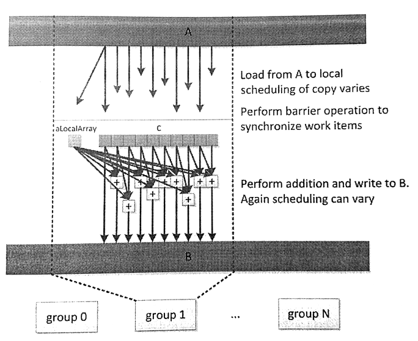

#7.4 局部內存

OpenCL也支持一些架構的子集，包括多GPU和Cell帶寬引擎，用於處理小暫存式緩存數組在主DRAM和基礎緩存上的分佈。局部內存與全局內存沒有交集，訪問兩種內存所使用的是不同的操作。基於這種架構，不同內存之間就需要進行數據傳輸(使用async_work_group_copy()進行拷貝會更高效)，或者直接內存間的拷貝。局部內存也同樣支持CPU實現，不過在CPU端局部內存就存放在標準可緩存內存中。所以在CPU端局部內存依舊具有較低的訪存延遲。

局部內存非常有用，因為其能提供工作組中的工作項有更高的交互方式。任何分配出來的局部內存都能讓整個工作組的工作項訪問，因此如果對局部內存進行修改，對組內其他工作也是可見的。局部內存使用__local標識符修飾，其可以在內核內部進行分配，也可以通過內核參數傳入。兩種方式的代碼如下所示：

```c++
__kernel
void localAccess(
  __global float *A,
  __global float *B,
  __local float *C){

  __local float aLocalArray[1];
  if (get_local_id(0) == 0){
    aLocalArray[0] = A[0];
  }
  
  C[get_local_id(0)] = A[get_global_id(0)];
  
  work_group_barrier(CLK_LOCAL_MEM_FENCE);
  
  float neighborSum = C[get_local_id(0)] + aLocalArray[0];
  
  if (get_local_id(0) > 0){
    neighborSum = neighborSum + C[get_local_id[0] - 1];
  }
  
  B[get_global_id(0)] = neighborSum
}
```

圖7.4展示了上述代碼的數據流。



圖7.4 localAccess內核在執行時的數據流

注意，這裡將數據從全局內存中讀出，然後(以不可預知的時序)寫入兩個局部內存數組C和aLocalArray中。不過，在實際硬件上是可以進行預測的，因為可以將對應的模型映射到實際的硬件上。例如，AMD GPU上經常會處理SIMD向量數據，對整個向量的讀寫操作實際上都會由一個工作項進行。不過，這種特性並非適用各種情況。通常，我們都會插入一個柵欄操作：只有所有工作項到達柵欄時，才能保證所有的數據都從全局內存搬運過來，或是搬運到全局內存上，之後組內所有工作項看到的局部數據就是一致的。越過柵欄之後，如圖下半部分所示，數據就能被組內所有工作項使用。

內核代碼從詞法角度看，aLocalArray只能被當前函數使用，而非整個工作組。這是因為aLocalArray內存空間是在局部內存上開闢，局部內存上的內存就屬於整個工作組可見，所以整個工作組所訪問到的aLocalArray實際上是同一地址中的數據。因為在到達柵欄之前，只要工作項0對aLocalArray進行了寫入，在越過柵欄之後，所有工作項就能直接使用aLocalArray了。

代碼中C數組就是通過主機端創建的局部內存。這種方式需要調用運行時API。為了分配內存使用clSetKernelArg()傳遞局部內存的大小到內核中。通常clSetKernelArg都是傳遞一個全局內存到內核端，現在這個內存參數需要置為NULL。這種方式意味著不需要全局變量的返回，所以其就為局部內存了。式例如下：

```c++
ciErrNum = clSetKernelArg(
  kernel object,
  parameter index,
  size in bytes,
  NULL)
```

