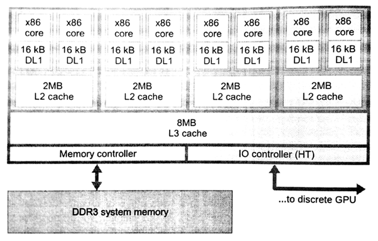
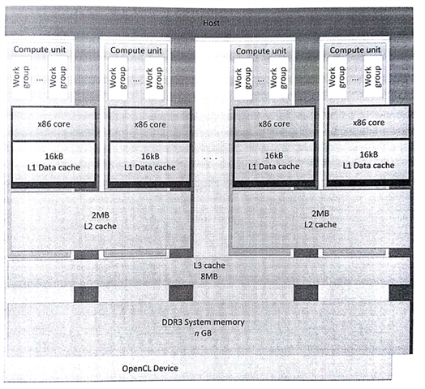
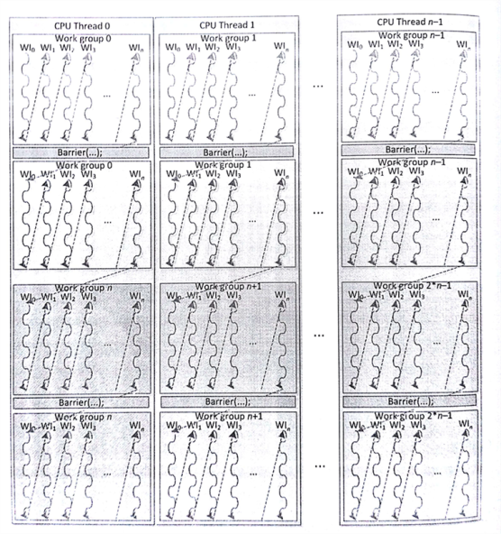
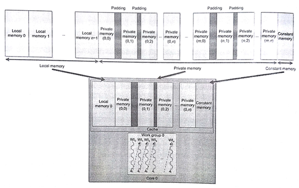

#8.1 AMD FX-8350 CPU

AMD的OpenCL實現可以運行在AMD顯卡上和所有x86架構的CPU上。所有主機端代碼在x86架構的CPU上執行。不過，AMD的OpenCL實現也可以將x86架構的處理器作為設備，讓x86設備運行OpenCL C代碼。圖8.1展示了FX-8350 CPU的內部架構，該圖用來描述x86架構與OpenCL實現之間的映射關係。

要在OpenCL運行時將FX-8350 CPU作為設備，需要使用clGetDeviceIDs()獲取該設備句柄。然後將設備句柄作為設備對象傳入clCreateContext()，clCreateCommandQueue()和clBuildProgram()。當要使用CPU作為OpenCL C的執行設備時，需要向clGetDeviceIDs()傳入CL_DEVICE_TYPE_CPU標識(或CL_DEVICE_TYPE_ALL)。



圖8.1 基於AMD打樁機架構的高配CPU——FX-8350

CPU中OpenCL可以使用的核數有8個。如果將整個CPU作為一個獨立設備，那麼最好是每個核都有獨立的命令隊列，用來分散並行負載量，這種負載均衡的方式在系統中效率最高。當然在OpenCL中也可以使用設備劃分的擴展方式，將CPU劃分成多個設備。

##8.1.1 運行時實現

OpenCL使用CPU時，運行時在每個核上創建了一個線程(例如，線程池)，以便OpenCL內核的執行。另一個主管理線程會根據隊列上的任務，將不同的任務分配給不同的線程，同時將正在執行的任務從隊列上移除。任意給定的OpenCL內核可能包含成千上萬個工作組(其參數以及相應內存都需要提前準備好)。

OpenCL使用柵欄的方式提供細粒度的同步。在基於CPU的傳統系統中，操作系統會對線程間通訊進行管理，操作系統會進行一定粒度的同步，使得並行實現更加高效。另外，如果將一個工作組分配到多個CPU核上回造成共享緩存的問題。為了緩解這個問題，OpenCL CPU運行時實現將一個工作組部署在一個CPU核(線程)上。OpenCL工作組中的工作項會按順序執行(串行)。當前工作組中所有工作項執行完成後，將執行下一個工作組中的工作項。這樣來看的話，雖然有很多工作組可以同時執行，但是工作組中的線程並不是並行的關係。圖8.2中描繪了OpenCL在FX-8350 CPU上的映射關係。



圖8.2 OpenCL在FX-8350 CPU上的映射關係。該芯片將CPU和GPU集成在了一起。

OpenCL中工作項在工作組內是併發，可使用柵欄進行同步。所有線程必須到達柵欄處，才能繼續下面的操作。CPU作為設備時，柵欄操作等於是一個工作項終止後，另一個工作項啟動；不過，這對於操作系統不現實，因為操作系統會對不同優先級的線程進行處理(例如，中斷某個線程，讓另一個線程進行)。因此，當整個工作組屬於一個線程時，就不會出現線程優先級的問題。AMD的OpenCL CPU運行時實現中，柵欄操作會使用到setjmp和longjmp指令。setjmp將會保存系統狀態(保護現場)，longjmp將會讀取保存了的系統狀態，繼續之前的執行狀態[1]。不過，運行時會為了配合硬件的分支預測器和保證程序棧對齊，針對這兩個函數提供兩個自定義版本。圖8.3展示了CPU線程在工作組中的工作流。



圖8.3 x86架構下工作組運行情況

因為工作項的執行方式是串行的，所以當在內核中使用柵欄操作時，原本可以並行的工作組也需要將執行方式轉變為串行。

使用setjmp指令時，工作項的數據將從工作項的棧中彈出到寄存器中。為了減少緩存爭奪和未命中的情況，並提高層級緩存的利用率，棧數據存放在緩存的何處需要仔細考慮。另外，工作項棧數據是交錯存儲在內存上，以減少訪存衝突，並且數據保存在一個較大的內存頁中，以保證物理地址映射的連續性，減少CPU使用轉換內存的壓力。

##8.1.2 工作項內的向量化操作

AMD打樁機微架構具有128位向量寄存器，可以用來處理各種版本SSE和AVX指令。OpenCL C包括一系列向量類型：float2, float4, int4等等。對於數學操作來說，有OpenCL C提供了對應的向量版本，式例如下：

```c++
float4 a = intput_data[location];
float4 b = a + (float4)(0.f, 1.f, 2.f, 3.f);
output_data[location] = b;
```

AMD打樁機微架構中，這些向量都會保存在寄存器中，並且在編譯過程中會將這些操作翻譯成SSE和AVX指令。這裡提供了很重要的性能優化。向量的加載和存儲操作，會使用底層代碼進行，以提高內存操作的效率。目前，單個工作項可以使用SIMD向量：8.2節將會看到在GPU端的操作與CPU端的區別。

##8.1.3 局部內存

AMD打樁機設計中並未對暫存式內存提供專用的硬件。CPU通常會為了減少訪存延遲，會有很多層緩存。局部數據通常為了更加高效的訪問數據，會將其映射到CPU緩存上，開發者還是享受到了來自硬件的訪存加速。為了提高緩存的命中率，局部內存在每個CPU線程上都會開闢一段，並且局部內存可以被工作組中的工作項重複使用。對於串行的工作組來說(因為柵欄、數據競爭或內存衝突)，就不需要局部內存，從而會造成之後的緩存未命中。局部內存另外的好處是，減少了內存頻繁開闢的開銷。圖8.4展示了局部內存與AMD CPU緩存的映射關係。



圖8.4 工作組(0)的內存地址空間對應的是打樁機CPU的緩存。

雖然，在CPU上使用局部內存也會有潛在的性能收益，不過局部內存會給一些應用帶來性能上的負面影響。如果內核中數據具有很好的局部性(比如，矩陣相乘的一部分)，之後使用局部內存用來存放需要多次使用到的數據，從而免去對數據的多次拷貝，並且數據存儲在L1緩存上，訪存效率極高。在這種情況下，如果可用的緩存過小，則會導致性能退化，過小的緩存會造成數據爭奪緩存位置，從而增加未命中率和數據拷貝的開銷。

-------

[1] J. Gummaraju, L.Morichetti, M. Houstion, B. Snder, B.R. Gaster, B. Zheng, Twin peaks: a software platform for heterogeneous computing on general-purpose and graphics processors. in: PACT 2010: Proceedings of the Nineteenth International Conference on Parallel Architectures and Complilation Techniques. Septerber 11-15, 2010, Vienna, Austria.  Association for Computing Machinery, 2010.
